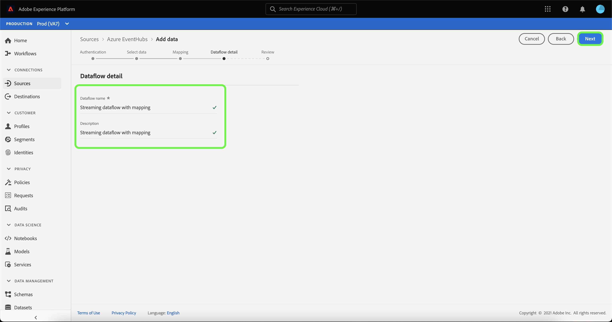

# Cree un flujo de datos de flujo continuo para una fuente de almacenamiento en la nube en la IU

Un flujo de datos es una tarea programada que recupera e ingiere datos de un origen a un conjunto de datos de Adobe Experience Platform. Este tutorial proporciona pasos para crear un flujo de datos de flujo continuo para una fuente de almacenamiento en la nube en la interfaz de usuario.

Antes de intentar realizar este tutorial, primero debe establecer una conexión válida y autenticada entre su cuenta de almacenamiento en la nube y Platform. Si aún no tiene una conexión autenticada, consulte uno de los siguientes tutoriales para obtener información sobre la autenticación de las cuentas de almacenamiento de nube de streaming:

- [[!DNL Amazon Kinesis]](../../../ui/create/cloud-storage/kinesis.md)
- [[!DNL Azure Event Hubs]](../../../ui/create/cloud-storage/eventhub.md)
- [[!DNL Google PubSub]](../../../ui/create/cloud-storage/google-pubsub.md)

## Introducción

Este tutorial requiere una comprensión práctica de los siguientes componentes de Adobe Experience Platform:

- [Flujos de datos](../../../../../dataflows/home.md): los flujos de datos son una representación de los trabajos de datos que mueven datos a través de Platform. Los flujos de datos se configuran en diferentes servicios, desde las fuentes hasta [!DNL Identity Service], hasta [!DNL Profile] y hasta [!DNL Destinations].
- [Preparación de datos](../../../../../data-prep/home.md): La preparación de datos permite a los ingenieros de datos asignar, transformar y validar datos desde y hacia el modelo de datos de experiencia (XDM). La preparación de datos aparece como un paso de &quot;mapa&quot; en los procesos de ingesta de datos, incluido el flujo de trabajo de ingesta de CSV.
- [[!DNL Experience Data Model (XDM)] Sistema](../../../../../xdm/home.md): El marco de trabajo estandarizado mediante el cual [!DNL Experience Platform] organiza los datos de la experiencia del cliente.
   - [Aspectos básicos de la composición de esquemas](../../../../../xdm/schema/composition.md): obtenga información sobre los componentes básicos de los esquemas XDM, incluidos los principios clave y las prácticas recomendadas en la composición de esquemas.
   - [Tutorial del editor de esquemas](../../../../../xdm/tutorials/create-schema-ui.md): Aprenda a crear esquemas personalizados mediante la interfaz de usuario del editor de esquemas.
- [[!DNL Real-Time Customer Profile]](../../../../../profile/home.md): proporciona un perfil de consumidor unificado y en tiempo real basado en los datos agregados de varias fuentes.

## Adición de datos

>[!NOTE]
>
>Solo puede crear un flujo de datos de origen por grupo de consumidores para un centro de eventos determinado.

Después de crear la autenticación de su cuenta de almacenamiento de nube de streaming, aparece el paso **[!UICONTROL Seleccionar datos]**, que proporciona una interfaz para que seleccione el flujo de datos que llevará a Platform.

- La parte izquierda de la interfaz es un explorador que le permite ver los flujos de datos disponibles en su cuenta;
- La parte derecha de la interfaz de le permite previsualizar hasta 100 filas de datos de un archivo JSON.

Seleccione el flujo de datos que desee usar y, a continuación, seleccione **[!UICONTROL Elegir archivo]** para cargar un esquema de ejemplo.

>[!TIP]
>
>Si los datos son compatibles con XDM, puede omitir cargar un esquema de ejemplo y seleccionar **[!UICONTROL Siguiente]** para continuar.

Una vez cargado el esquema, la interfaz de vista previa se actualiza para mostrar una vista previa del esquema cargado. La interfaz de vista previa permite inspeccionar el contenido y la estructura de un archivo. También puede usar la utilidad [!UICONTROL Campo de búsqueda] para acceder a elementos específicos desde el esquema.

Cuando termine, seleccione **[!UICONTROL Siguiente]**.

## Asignación

Aparecerá el paso **[!UICONTROL Mapping]**, que proporciona una interfaz para asignar los datos de origen a un conjunto de datos de Platform.

Elija un conjunto de datos para los datos de entrada que se van a introducir en. Puede utilizar un conjunto de datos existente o crear uno nuevo.

### Nuevo conjunto de datos

Para introducir datos en un nuevo conjunto de datos, seleccione **[!UICONTROL Nuevo conjunto de datos]** e introduzca un nombre y una descripción para el conjunto de datos en los campos proporcionados. Para agregar un esquema, puede escribir un nombre de esquema existente en el cuadro de diálogo **[!UICONTROL Seleccionar esquema]**. También puede seleccionar **[!UICONTROL Búsqueda avanzada de esquemas]** para buscar un esquema apropiado.

Aparecerá la ventana [!UICONTROL Seleccionar esquema], que le proporcionará una lista de esquemas disponibles para elegir. Seleccione un esquema de la lista para actualizar el carril derecho y mostrar detalles específicos del esquema seleccionado, incluida la información sobre si el esquema está habilitado para [!DNL Profile].

Una vez que haya identificado y seleccionado el esquema que desea utilizar, seleccione **[!UICONTROL Listo]**.

La página [!UICONTROL Conjunto de datos de destino] se actualiza con el esquema seleccionado mostrado como parte del conjunto de datos. Durante este paso, puede habilitar el conjunto de datos para [!DNL Profile] y crear una vista integral de los atributos y comportamientos de una entidad. Los datos de todos los conjuntos de datos habilitados se incluirán en [!DNL Profile] y los cambios se aplicarán al guardar el flujo de datos.

Cambie el botón **[!UICONTROL Conjunto de datos del perfil]** para habilitar su conjunto de datos de destino para [!DNL Profile].

### Conjunto de datos existente

Para introducir datos en un conjunto de datos existente, seleccione **[!UICONTROL Conjunto de datos existente]** y, a continuación, seleccione el icono del conjunto de datos.

Aparecerá el cuadro de diálogo **[!UICONTROL Seleccionar conjunto de datos]**, que le proporcionará una lista de conjuntos de datos disponibles entre los que elegir. Seleccione un conjunto de datos de la lista para actualizar el carril derecho y mostrar detalles específicos del conjunto de datos que seleccionó, incluida la información sobre si el conjunto de datos se puede habilitar para [!DNL Profile].

Una vez que haya identificado y seleccionado el conjunto de datos que desea utilizar, seleccione **[!UICONTROL Listo]**.

Una vez que seleccione el conjunto de datos, seleccione la opción [!DNL Profile] para habilitar el conjunto de datos para [!DNL Profile].

### Asignar campos estándar

Con el conjunto de datos y el esquema establecidos, aparece la interfaz **[!UICONTROL Asignar campos estándar]**, lo que le permite configurar manualmente los campos de asignación para los datos.

>[!TIP]
>
>Platform proporciona recomendaciones inteligentes para campos asignados automáticamente en función del esquema o el conjunto de datos de destino seleccionado. Puede ajustar manualmente las reglas de asignación para adaptarlas a sus casos de uso.

En función de sus necesidades, puede elegir asignar campos directamente o utilizar funciones de preparación de datos para transformar los datos de origen y derivar valores calculados o calculados. Para ver los pasos detallados sobre el uso de la interfaz de asignador y los campos calculados, consulte la [guía de la interfaz de usuario de la preparación de datos](../../../../../data-prep/ui/mapping.md).

Una vez asignados los datos de origen, seleccione **[!UICONTROL Siguiente]**.

## Detalles del flujo de datos

Aparece el paso **[!UICONTROL Detalle del flujo de datos]**, que le permite asignar un nombre al nuevo flujo de datos y proporcionar una breve descripción sobre él.

Proporcione valores para el flujo de datos y seleccione **[!UICONTROL Siguiente]**.

### Revisar

Aparece el paso **[!UICONTROL Revisar]**, que le permite revisar el nuevo flujo de datos antes de crearlo. Los detalles se agrupan en las siguientes categorías:

- **[!UICONTROL Conexión]**: muestra el nombre de cuenta, el tipo de origen y otra información específica de la fuente de almacenamiento de nube de streaming que está usando.
- **[!UICONTROL Asignar campos de conjunto de datos y asignación]**: Muestra el conjunto de datos y esquema de destino que está utilizando para el flujo de datos.

Una vez que haya revisado el flujo de datos, seleccione **[!UICONTROL Finalizar]** y espere un poco para que se cree el flujo de datos.

## Monitorización y eliminación de un flujo de datos

Una vez creado el flujo de datos del almacenamiento en la nube de streaming, puede monitorizar los datos que se están ingiriendo a través de él. Para obtener más información sobre cómo supervisar y eliminar flujos de datos de flujo continuo, consulte el tutorial sobre [supervisar flujos de datos de flujo continuo](../../monitor-streaming.md).

## Pasos siguientes

Al seguir este tutorial, ha creado correctamente un flujo de datos para transmitir datos desde una fuente de almacenamiento en la nube. Ahora, los servicios de la plataforma descendente como [!DNL Real-Time Customer Profile] y [!DNL Data Science Workspace] pueden usar los datos entrantes. Consulte los siguientes documentos para obtener más información:

- [Información general de [!DNL Real-Time Customer Profile]](../../../../../profile/home.md)
- [Información general de [!DNL Data Science Workspace]](../../../../../data-science-workspace/home.md)