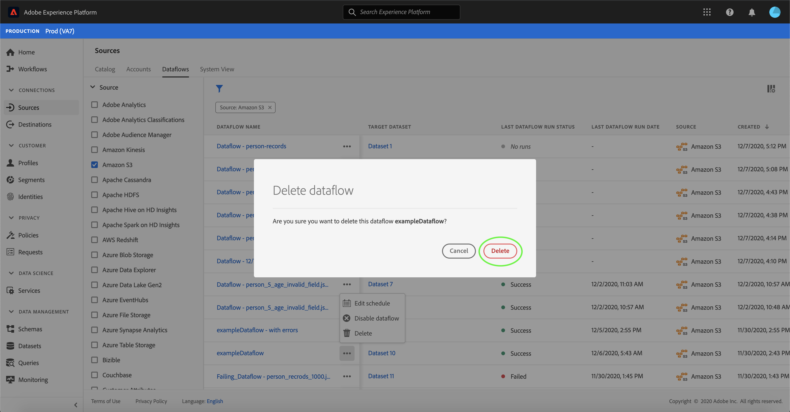

# Eliminar flujos de datos en la interfaz de usuario

El espacio de trabajo [!UICONTROL Sources] le permite eliminar flujos de datos de flujo y lote existentes que contienen errores o se han vuelto obsoletos.

Este tutorial proporciona pasos para eliminar flujos de datos mediante el espacio de trabajo [!UICONTROL Fuentes].

## Primeros pasos

Este tutorial requiere un conocimiento práctico de los siguientes componentes de Adobe Experience Platform:

- [Fuentes](../../home.md):  [!DNL Experience Platform] permite la ingesta de datos desde varias fuentes, al tiempo que le permite estructurar, etiquetar y mejorar los datos entrantes mediante  [!DNL Platform] servicios.
- [Simuladores](../../../sandboxes/home.md):  [!DNL Experience Platform] proporciona entornos limitados virtuales que dividen una sola  [!DNL Platform] instancia en entornos virtuales independientes para ayudar a desarrollar y desarrollar aplicaciones de experiencia digital.

## Eliminar flujos de datos

En la [IU de Experience Platform](https://platform.adobe.com), seleccione **[!UICONTROL Fuentes]** en el panel de navegación izquierdo para acceder al espacio de trabajo [!UICONTROL Fuentes] y, a continuación, seleccione **[!UICONTROL Flujos de datos]** en el encabezado superior.

Aparece la página **[!UICONTROL Flujos de datos]**. En esta página hay una lista de flujos de datos visualizables, incluida información sobre su conjunto de datos de destinatario, fuente, nombre de cuenta y fecha de creación.

Seleccione el icono de filtro () en la parte superior izquierda para iniciar el panel de ordenación.

El panel Ordenar proporciona una lista de todas las fuentes. Puede seleccionar más de un origen de la lista para acceder a una selección filtrada de flujos de datos asociados a los orígenes concretos que ha seleccionado.

Seleccione el origen con el que desea trabajar para ver una lista de sus flujos de datos existentes. Una vez identificado el flujo de datos que desea eliminar, seleccione las elipses (`...`) junto al nombre del flujo de datos.

Aparece un menú desplegable con opciones para editar la programación del flujo de datos, deshabilitar el flujo de datos o eliminarlo por completo.

Seleccione **[!UICONTROL Eliminar]** para eliminar el flujo de datos.

Aparecerá un cuadro de diálogo de confirmación final. Seleccione **[!UICONTROL Eliminar]** para completar el proceso.

Al cabo de unos minutos, aparece un cuadro de confirmación en la parte inferior de la pantalla para confirmar que la eliminación se ha realizado correctamente.

## Pasos siguientes

Siguiendo este tutorial, ha utilizado correctamente el espacio de trabajo [!UICONTROL Fuentes] para eliminar un flujo de datos existente.

Consulte el tutorial sobre [eliminación de flujos de datos mediante la API de servicio de flujo](../../tutorials/api/delete-dataflows.md) para ver los pasos para realizar estas operaciones mediante programación mediante llamadas de API.