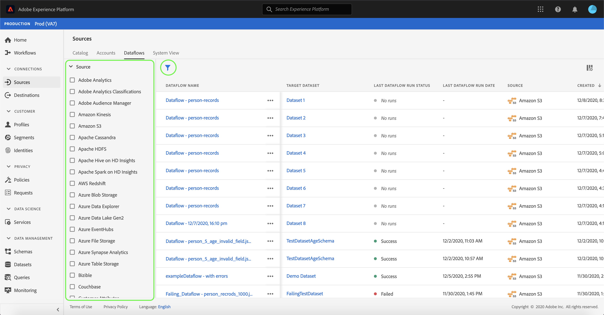

# Eliminar flujos de datos en la interfaz de usuario

La variable [!UICONTROL Fuentes] workspace le permite eliminar flujos de datos de flujo continuo y por lotes existentes que contengan errores o se hayan vuelto obsoletos.

Este tutorial proporciona los pasos para eliminar flujos de datos mediante la variable [!UICONTROL Fuentes] espacio de trabajo.

## Primeros pasos

Este tutorial requiere una comprensión práctica de los siguientes componentes de Adobe Experience Platform:

- [Fuentes](../../home.md): [!DNL Experience Platform] permite la ingesta de datos de varias fuentes, al mismo tiempo que permite estructurar, etiquetar y mejorar los datos entrantes mediante [!DNL Platform] servicios.
- [Sandboxes](../../../sandboxes/home.md): [!DNL Experience Platform] proporciona entornos limitados virtuales que dividen un solo [!DNL Platform] en entornos virtuales independientes para ayudar a desarrollar y desarrollar aplicaciones de experiencia digital.

## Eliminar flujos de datos

En el [IU de Experience Platform](https://platform.adobe.com), seleccione **[!UICONTROL Fuentes]** desde el panel de navegación izquierdo para acceder a la [!UICONTROL Fuentes] espacio de trabajo y, a continuación, seleccione **[!UICONTROL Flujos de datos]** en el encabezado superior.

La variable **[!UICONTROL Flujos de datos]** se abre. En esta página hay una lista de flujos de datos visibles, que incluye información sobre su conjunto de datos de destino, fuente, nombre de cuenta y fecha de creación.

Seleccione el icono de filtro () en la parte superior izquierda para iniciar el panel de ordenación.

El panel de ordenación proporciona una lista de todas las fuentes. Puede seleccionar más de una fuente de la lista para acceder a una selección filtrada de flujos de datos asociados a las fuentes particulares seleccionadas.

Seleccione el origen con el que desea trabajar para ver una lista de sus flujos de datos existentes. Una vez identificado el flujo de datos que desea eliminar, seleccione los puntos suspensivos (`...`) junto al nombre del flujo de datos.

Aparece un menú desplegable que le ofrece las opciones para editar la programación del flujo de datos, desactivarlo o eliminarlo por completo.

Select **[!UICONTROL Eliminar]** para eliminar el flujo de datos.

Aparece un cuadro de diálogo de confirmación final. Select **[!UICONTROL Eliminar]** para completar el proceso.

Después de unos momentos, aparece un cuadro de confirmación en la parte inferior de la pantalla para confirmar que la eliminación se ha realizado correctamente.

## Pasos siguientes

Al seguir este tutorial, ha utilizado correctamente la variable [!UICONTROL Fuentes] espacio de trabajo para eliminar un flujo de datos existente.

Consulte el tutorial en [eliminación de flujos de datos mediante la API de servicio de flujo](../../tutorials/api/delete-dataflows.md) para ver los pasos sobre cómo realizar estas operaciones mediante programación mediante llamadas API.
