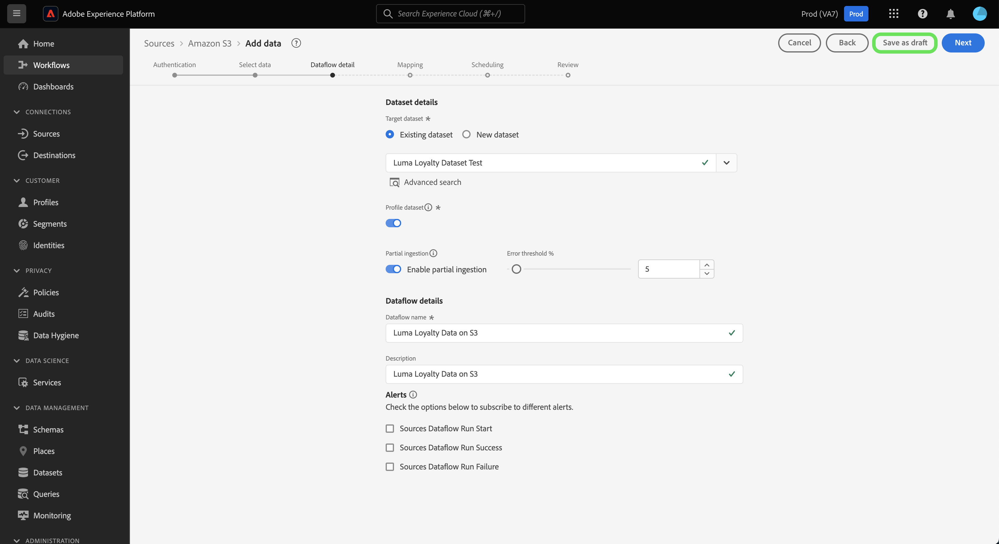
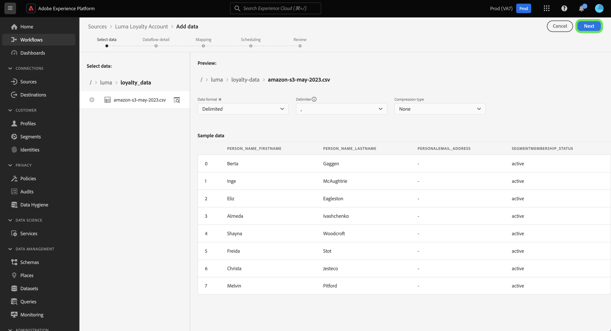

# Borradores de flujos de datos en la IU

Guarde el progreso del flujo de trabajo de ingesta de datos sin finalizar estableciendo el flujo de datos en un estado de borrador. Puede reanudar y completar los flujos de datos esbozados más adelante.

Este documento proporciona pasos sobre cómo guardar los flujos de datos al utilizar el área de trabajo de fuentes en la interfaz de usuario de Adobe Experience Platform.

## Primeros pasos

Este documento requiere un entendimiento práctico de los siguientes componentes de Adobe Experience Platform:

* [Fuentes](../../home.md): Experience Platform permite la ingesta de datos desde varias fuentes y, al mismo tiempo, le ofrece la capacidad de estructurar, etiquetar y mejorar los datos entrantes mediante los servicios de Platform.

## Guardar un flujo de datos como borrador

Puede pausar el progreso de creación del flujo de datos en cualquier momento después de seleccionar los datos que va a introducir en Platform.

Por ejemplo, si desea guardar el progreso durante el paso de detalles del flujo de datos, seleccione **[!UICONTROL Guardar como borrador]**.

Una vez guardado el borrador, se le redirigirá a la página de su cuenta, donde podrá ver una lista de los flujos de datos existentes, incluidos los borradores.

>[!TIP]
>
>Los flujos de datos borrador no se activarán y su estado se establecerá en `draft`.

Para continuar con el borrador, seleccione los puntos suspensivos (`...`) junto al nombre del flujo de datos y, a continuación, seleccione **[!UICONTROL Actualizar flujo de datos]**.

>[!NOTE]
>
>Si el borrador incluye información de programación, la ventana desplegable también le dará la opción de **[!UICONTROL Editar programación]**.

### Acceder a los borradores desde el catálogo de origen

También puede acceder a sus flujos de datos de borrador a través del catálogo de flujos de datos. Seleccionar **[!UICONTROL Flujos de datos]** desde el encabezado superior para acceder al catálogo de flujos de datos. Aquí, busque el borrador en la lista de flujos de datos existentes en su organización y seleccione los puntos suspensivos (`...`) junto a su nombre y seleccione **[!UICONTROL Actualizar flujo de datos]**.

## Publicación del flujo de datos de borrador

Se le devolverá a la [!UICONTROL Añadir datos] paso del flujo de trabajo de fuentes, donde puede volver a confirmar el formato de los datos y continuar progresando en el flujo de datos.

Una vez confirmado el formato, el delimitador y el tipo de compresión de los datos, seleccione **[!UICONTROL Siguiente]** para continuar.

A continuación, confirme los detalles del flujo de datos. Utilice la interfaz de detalles del flujo de datos para actualizar las configuraciones relacionadas con el nombre, la descripción, la ingesta parcial, la configuración de diagnóstico de errores y las preferencias de alerta del flujo de datos.

Una vez que haya finalizado las configuraciones, seleccione **[!UICONTROL Siguiente]** para continuar.

El [!UICONTROL Asignación] aparece el paso. Durante este paso, puede volver a configurar las configuraciones de asignación del flujo de datos. Para obtener una guía completa sobre las funciones de preparación de datos utilizadas para la asignación, visite la [guía de IU de preparación de datos](../../../data-prep/ui/mapping.md).

Una vez completada la reconfiguración de la asignación, seleccione **[!UICONTROL Siguiente]** para continuar.

Utilice el [!UICONTROL Programación] paso para establecer una programación de ingesta para el flujo de datos. Puede establecer la frecuencia de ingesta en `once`, `minute`, `hour`, `day`, o `week`. Cuando termine, seleccione **[!UICONTROL Siguiente]** para continuar.

Finalmente, revise los detalles del flujo de datos y, a continuación, seleccione **[!UICONTROL Finalizar]** para publicar el borrador.

Después de guardar y publicar un borrador, el flujo de datos se habilitará y ya no podrá restablecerlo como borrador.

## Pasos siguientes

Al seguir este tutorial, ha aprendido a guardar el progreso y establecer un flujo de datos como borrador. Para obtener más información sobre las fuentes, visite la [información general de orígenes](../../home.md).