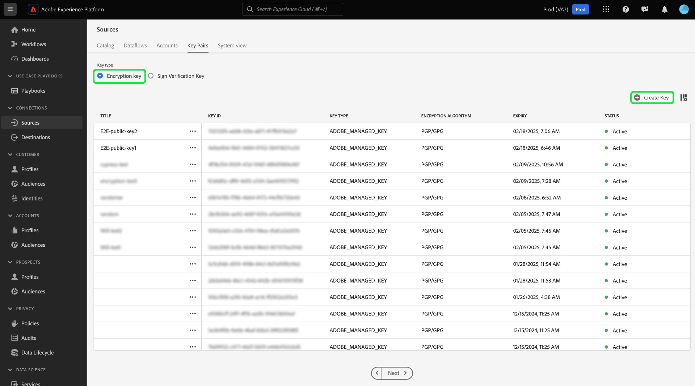

# Ingerir datos cifrados en las fuentes IU

Puede ingerir archivos y carpetas de datos cifrados para Adobe Experience Platform utilizando nube orígenes almacenamiento por lotes. Con la ingesta de datos cifrados, puede impulsar mecanismos de cifrado asimétricos para transferir de forma segura los datos por lotes a Experience Platform. Los mecanismos de cifrado asimétrico admitidos son PGP y GPG.

Lea esta guía para obtener información sobre cómo ingerir datos cifrados con fuentes por lotes de almacenamiento en la nube mediante la interfaz de usuario.

## Introducción

Antes de continuar con este tutorial, lea los siguientes documentos para comprender mejor las siguientes funciones y conceptos de Experience Platform.

* [Fuentes](../../home.md): Use fuentes en Experience Platform para ingerir datos de una aplicación de Adobe o de una fuente de datos de terceros.
* [Flujos de datos](../../../dataflows/home.md): Los flujos de datos son representaciones de trabajos de datos que mueven datos a través de Experience Platform. Puede utilizar el espacio de trabajo de fuentes para crear flujos de datos que introduzcan datos de una fuente determinada en Experience Platform.
* [Zonas protegidas](../../../sandboxes/home.md): Use zonas protegidas en Experience Platform para crear particiones virtuales entre las instancias de Experience Platform y crear entornos dedicados al desarrollo o la producción.

### Esquema de alto nivel

* Cree un par de claves de cifrado con el espacio de trabajo de fuentes en la interfaz de usuario de Experience Platform.
   * Opcionalmente, también puede crear su propio par de claves de verificación de firma para proporcionar una capa adicional de seguridad a los datos cifrados.
* Utilice la clave pública del par de claves de cifrado para cifrar los datos.
* Coloque sus datos cifrados en su almacenamiento nube. Durante este paso, también debe asegurarse de tener un archivo de muestra de sus datos en su almacenamiento de nube que pueda usarse como referencia para asignar sus datos de origen a un esquema de Modelo de datos de experiencia (XDM).
* Utilice su nube almacenamiento origen por lotes y comience el proceso de ingesta de datos en los orígenes espacio de trabajo en el IU de Experience Platform.
* Durante el proceso de creación de la conexión de origen, proporcione el ID de clave que corresponda a la clave pública que utilizó para cifrar los datos.
   * Si también ha utilizado el mecanismo de par de claves de verificación de firma, también debe proporcionar el ID de clave de verificación de firma que corresponda a los datos cifrados.
* Continúe con los pasos de creación del flujo de datos.

## Crear un par de claves de cifrado {#create-an-encryption-key-pair}

>[!CONTEXTUALHELP]
>id="platform_sources_encrypted_encryptionKeyId"
>title="ID de clave de cifrado"
>abstract="Proporcione el ID de la clave de cifrado que corresponde a la clave de cifrado que se utilizó para cifrar los datos de origen."

>[!BEGINSHADEBOX]

**¿Qué es un par de claves de cifrado?**

Un par de claves de cifrado es un mecanismo de criptografía asimétrica que consta de una clave pública y una clave privada. La clave pública se utiliza para cifrar datos y la clave privada se utiliza para descifrar dichos datos.

Puede crear el par de claves de cifrado a través de la interfaz de usuario de Experience Platform. Cuando se genere, recibirá una clave pública y un ID de clave correspondiente. Utilice la clave pública para cifrar los datos y, a continuación, utilice el ID de clave para confirmar la identidad cuando esté ingiriendo los datos cifrados. La clave privada se envía automáticamente a Experience Platform, donde se almacena en un almacén seguro, y solo se utilizará una vez que los datos estén listos para descifrarse.

>[!ENDSHADEBOX]

En la interfaz de usuario de Experience Platform, navegue hasta el área de trabajo de orígenes y, a continuación, seleccione [!UICONTROL Key Pairs] en el encabezado superior.

Se le dirigirá a una página que muestra una lista de pares de claves de cifrado existentes en su organización. Esta página proporciona información sobre el título, el ID, el tipo, el algoritmo de cifrado, la caducidad y el estado de una clave determinada. Para crear un nuevo par de claves, seleccione **[!UICONTROL Create Key]**.

A continuación, elija el tipo de clave que desea crear. Para crear una clave de cifrado, seleccione **[!UICONTROL Encryption Key]** y después **[!UICONTROL Continue]**.

Proporcione un título y una frase de contraseña para la clave de cifrado. La frase de contraseña es una capa adicional de protección para las claves de cifrado. Una vez creada, Experience Platform almacena la frase de contraseña en una bóveda segura diferente de la clave pública. Debe proporcionar una cadena no vacía como frase de contraseña. Cuando termine, seleccione **[!UICONTROL Create]**.

Si se ejecuta correctamente, aparecerá una nueva ventana que muestra la nueva clave de cifrado, incluido el título, la clave pública y el ID de clave. Utilice el valor de clave pública para cifrar los datos. Utilizará el ID de clave en un paso posterior para probar su identidad al ingerir los datos cifrados durante el proceso de creación del flujo de datos.

Para ver información sobre una clave de cifrado existente, seleccione los puntos suspensivos (`...`) junto al título de la clave. Seleccione **[!UICONTROL Key details]** esta opción para vista la clave pública y el ID de clave. Como alternativa, si desea eliminar la clave de cifrado, seleccione **[!UICONTROL Delete]**.

### Crear una clave de verificación de firma {#create-a-sign-verification-key}

>[!CONTEXTUALHELP]
>id="platform_sources_encrypted_signVerificationKeyId"
>title="ID de clave de verificación de firma"
>abstract="Proporcione el ID de la clave de verificación de firma que corresponda a los datos de origen cifrados y firmados."

>[!BEGINSHADEBOX]

**¿Qué es una clave de verificación de firma?**

Una clave de verificación de firma es otro mecanismo de cifrado que implica una clave privada y una clave pública. En este caso, puede crear el par de claves de verificación de firma y utilizar la clave privada para firmar y proporcionar una capa adicional de cifrado a los datos. A continuación, compartirá la clave pública correspondiente con Experience Platform. Durante la ingesta, Experience Platform utilizará la clave pública para comprobar la firma asociada a la clave privada.

>[!ENDSHADEBOX]

Para crear una clave de verificación de firma, seleccione **[!UICONTROL Sign Verification Key]** en la ventana de selección de tipo de clave y luego seleccione **[!UICONTROL Continue]**.

Siguiente, proporcione un título y una [!DNL Base64]clave PGP codificada como clave pública y, a continuación, seleccione .**[!UICONTROL Create]**

Si se ejecuta correctamente, aparecerá una nueva ventana en la que se mostrará la nueva clave de verificación de firma, incluidos el título y el identificador de clave.

## Introducir datos cifrados {#ingest-encrypted-data}

>[!CONTEXTUALHELP]
>id="platform_sources_encrypted_isFileEncrypted"
>title="¿Está cifrado el archivo?"
>abstract="Seleccione este conmutador si está introduciendo un archivo que ya está cifrado."

>[!CONTEXTUALHELP]
>id="platform_sources_encrypted_sampleFile"
>title="Seleccionar archivo de muestra"
>abstract="Debe introducir un archivo de muestra al ingerir datos cifrados para crear una asignación."

Puede ingerir datos cifrados mediante las siguientes nube almacenamiento orígenes de lotes:

* [[!DNL Amazon S3]](../ui/create/cloud-storage/s3.md)
* [[!DNL Azure Blob]](../ui/create/cloud-storage/blob.md)
* [[!DNL Azure Data Lake Storage Gen2]](../ui/create/cloud-storage/adls-gen2.md)
* [[!DNL Azure File Storage]](../ui/create/cloud-storage/azure-file-storage.md)
* [[!DNL Data Landing Zone]](../ui/create/cloud-storage/data-landing-zone.md)
* [[!DNL FTP]](../ui/create/cloud-storage/ftp.md)
* [[!DNL Google Cloud Storage]](../ui/create/cloud-storage/google-cloud-storage.md)
* [[!DNL HDFS]](../ui/create/cloud-storage/hdfs.md)
* [[!DNL Oracle Object Storage]](../ui/create/cloud-storage/oracle-object-storage.md)
* [[!DNL SFTP]](../ui/create/cloud-storage/sftp.md)

Autentique con la fuente de almacenamiento en la nube que elija. Durante el paso de selección de datos del flujo de trabajo, seleccione el archivo o la carpeta cifrados que desee introducir y, a continuación, active la opción **[!UICONTROL Is the file encrypted]**.

A continuación, seleccione un archivo de muestra de los datos de origen. Dado que los datos están cifrados, Experience Platform necesitará un archivo de muestra para crear un esquema XDM que se pueda asignar a los datos de origen.

.

Una vez seleccionado el archivo de muestra, configure las opciones de los datos, como el formato de datos, el delimitador y el tipo de compresión correspondientes. Espere un poco para que la interfaz de vista previa se represente completamente y, a continuación, seleccione **[!UICONTROL Save]**.

Desde aquí, utilice el menú desplegable para seleccionar el título de clave pública del ID de clave pública que corresponde a la clave pública que utilizó para cifrar los datos.

Si también utilizó el par de claves de verificación de firma para proporcionar una capa de cifrado adicional, habilite la opción de clave de verificación de firma y, a continuación, utilice la lista desplegable para seleccionar el ID de clave de verificación de firma que corresponda a la clave que utilizó para cifrar los datos.

Cuando haya terminado, seleccione **[!UICONTROL Next]**.

Complete los pasos restantes del flujo de trabajo de orígenes para terminar de crear el flujo de datos.

* [Proporcionar detalles del flujo y el conjunto de datos](../ui/dataflow/batch/cloud-storage.md#provide-dataflow-details)
* [Asignación de los datos de origen a un esquema XDM](../ui/dataflow/batch/cloud-storage.md#map-data-fields-to-an-xdm-schema)
* [Configurar una programación de ingesta para el flujo de datos](../ui/dataflow/batch/cloud-storage.md#schedule-ingestion-runs)
* [Revisión del flujo de datos](../ui/dataflow/batch/cloud-storage.md#review-your-dataflow)

Puede seguir realizando actualizaciones en el flujo[ de ](../ui/update-dataflows.md)datos una vez que se haya creado correctamente.

## Próximos pasos

Al leer este documento, ahora puede ingerir datos cifrados de su origen de lotes de nube almacenamiento a Experience Platform. Para obtener información sobre cómo ingerir datos cifrados mediante las API, lea la guía sobre [la ingesta de datos cifrados mediante la [!DNL Flow Service] API](../api/encrypt-data.md). Para obtener información general sobre las fuentes de Experience Platform, lea la descripción general[ de las ](../../home.md)fuentes.
