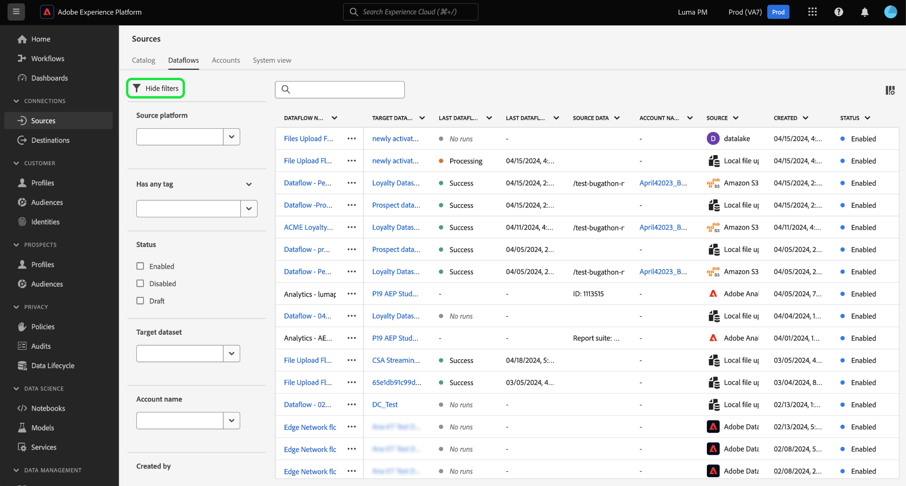
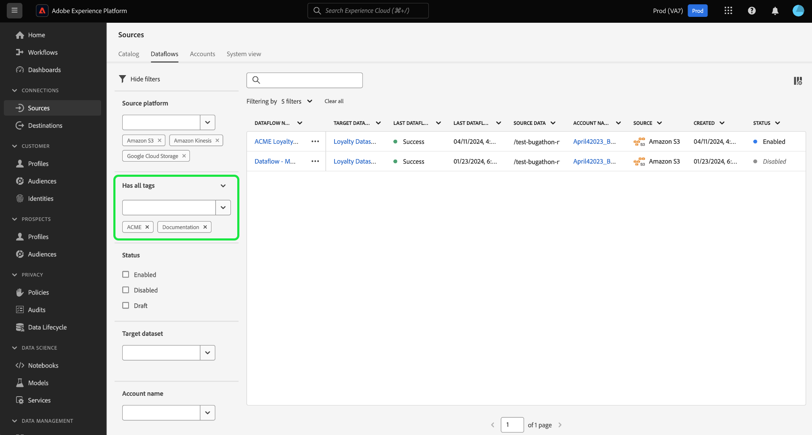

# Filtrado de objetos de origen en la IU

Utilice las herramientas de filtrado, búsqueda y acciones en línea de la interfaz de usuario de Adobe Experience Platform para optimizar el flujo de trabajo en el espacio de trabajo [!UICONTROL Sources]

* Utilice las capacidades de filtrado y búsqueda para navegar por las cuentas de origen y los flujos de datos de su organización.
* Utilice acciones en línea para modificar los ajustes de configuración aplicados a los flujos de datos y mejorar los flujos de trabajo de la organización. Puede utilizar acciones en línea para aplicar etiquetas, configurar alertas o crear trabajos de ingesta bajo demanda.

## Introducción

Antes de trabajar con las herramientas de navegación de objetos en el espacio de trabajo de orígenes, resulta útil conocer las siguientes funciones y conceptos de Experience Platform:

* [Fuentes](../../home.md): Use fuentes en Experience Platform para ingerir datos de una aplicación de Adobe o de una fuente de datos de terceros.
* [Etiquetas administrativas](../../../administrative-tags/overview.md): Use etiquetas administrativas para aplicar palabras clave de metadatos a los objetos y permitir la búsqueda para encontrar ese objeto dentro del ecosistema de Experience Platform.
* [Alertas](../../../observability/home.md): Use alertas para recibir notificaciones que proporcionen una actualización del estado de objetos como los flujos de datos de origen.
* [Flujos de datos](../../../dataflows/home.md): Los flujos de datos son representaciones de trabajos de datos que mueven datos a través de Experience Platform. Puede utilizar el espacio de trabajo de fuentes para crear flujos de datos que introduzcan datos de una fuente determinada en Experience Platform.
* [Conjuntos de datos](../../../catalog/datasets/user-guide.md): un conjunto de datos es una construcción de almacenamiento y administración para una colección de datos, normalmente una tabla, que contiene un esquema (columnas) y campos (filas).
* [Zonas protegidas](../../../sandboxes/home.md): Use zonas protegidas en Experience Platform para crear particiones virtuales entre las instancias de Experience Platform y crear entornos dedicados al desarrollo o la producción.

## Filtrar orígenes y flujos de datos {#filter-sources-dataflows}

En la interfaz de usuario de Experience Platform, seleccione **[!UICONTROL Sources]** en el panel de navegación izquierdo y, a continuación, seleccione **[!UICONTROL Dataflows]** en el encabezado superior.

De forma predeterminada, el menú de filtro se muestra a la izquierda de la interfaz. Para ocultar el menú, seleccione **[!UICONTROL Hide filters]**.

Puede filtrar los flujos de datos de origen mediante los siguientes parámetros:

| Filtro | Descripción |
| --- | --- |
| [Plataforma Source](#filter-dataflows-by-source-platform) | Filtre los flujos de datos en función de la fuente con la que se crearon. |
| [Etiquetas](#filter-dataflows-by-tags) | Filtre los flujos de datos en función de las etiquetas aplicadas a ellos. |
| [Estado](#filter-dataflows-by-status) | Filtre los flujos de datos según su estado actual. |
| [Conjunto de datos de destino](#filter-dataflows-by-target-dataset) | Filtre los flujos de datos en función del conjunto de datos de destinatario con el que se crearon. |
| [Nombre de cuenta](#filter-dataflows-by-account-name) | Filtre los flujos de datos en función del nombre de la cuenta con la que se corresponden. |
| [Creado por](#filter-dataflows-by-user) | Filtre los flujos de datos en función de quién los creó. |
| [Fecha de creación](#filter-dataflows-by-creation-date) | Filtre los flujos de datos en función de la fecha de creación. |
| [Fecha de modificación](#filter-dataflows-by-modification-date) | Filtre los flujos de datos en función de la fecha en la que se actualizaron por última vez. |

### Filtrado de flujos de datos por plataforma de origen {#filter-dataflows-by-source-platform}

Utilice el panel [!UICONTROL Source platform] para filtrar los flujos de datos por tipo de origen. Puede escribir un origen determinado o utilizar el menú desplegable para ver una lista de orígenes en el catálogo. También puede filtrar por varios orígenes diferentes para una consulta determinada. Por ejemplo, puede seleccionar [!DNL Amazon S3], [!DNL Azure Data Lake Storage Gen2] y [!DNL Google Cloud Storage] para actualizar el catálogo y mostrar solo los flujos de datos creados con los orígenes seleccionados.

### Filtrado de flujos de datos por etiquetas {#filter-dataflows-by-tags}

Utilice el panel Etiquetas para filtrar los flujos de datos por sus respectivas etiquetas.

Seleccione **[!UICONTROL Has any tag]** y luego seleccione las etiquetas que desee filtrar mediante el menú desplegable. Utilice esta configuración para filtrar flujos de datos que tengan cualquiera de las etiquetas seleccionadas.

Seleccione **[!UICONTROL Has all tags]** y luego seleccione las etiquetas que desee filtrar mediante el menú desplegable. Utilice esta configuración para filtrar flujos de datos que tengan todas las etiquetas seleccionadas.

### Filtrado de flujos de datos por estado {#filter-dataflows-by-status}

Puede filtrar por estado utilizando el panel [!UICONTROL Status].

| Estado | Descripción |
| --- | --- |
| Habilitado | Seleccione **[!UICONTROL Enabled]** para filtrar la vista y mostrar solo los flujos de datos activos. |
| Desactivado | Seleccione **[!UICONTROL Disabled]** para filtrar la vista y mostrar solo los flujos de datos desactivados. |
| Borrador | Seleccione **[!UICONTROL Draft]** para filtrar la vista y mostrar solo los flujos de datos que están en modo de borrador. |

### Filtrado de flujos de datos por conjunto de datos de destino {#filter-dataflows-by-target-dataset}

Seleccione **[!UICONTROL Target dataset]** para acceder al menú desplegable de todos los conjuntos de datos de destino. A continuación, seleccione un conjunto de datos de destino para filtrar la vista y mostrar solo los flujos de datos creados con los conjuntos de datos de destino especificados.

### Filtrar flujos de datos por nombre de cuenta {#filter-dataflows-by-account-name}

Seleccione **[!UICONTROL Account name]** para acceder al menú desplegable de todas las cuentas. A continuación, seleccione una cuenta para filtrar la vista y mostrar los flujos de datos creados por la cuenta seleccionada.

### Filtrado de flujos de datos por usuario {#filter-dataflows-by-user}

Utilice el panel [!UICONTROL Created by] para filtrar los flujos de datos por el usuario que los creó o actualizó por última vez. Seleccione el menú desplegable y, a continuación, el nombre de usuario por el que filtrar los flujos de datos.

### Filtrado de flujos de datos por fecha de creación {#filter-dataflows-by-creation-date}

Puede filtrar los flujos de datos por sus fechas de creación. En el panel [!UICONTROL Created date], configure una fecha de inicio y una fecha de finalización para crear una ventana de marco de tiempo y filtre la vista para mostrar solo los flujos de datos creados dentro de esa ventana.

Puede configurar el lapso de tiempo introduciendo la fecha de inicio y la de finalización. También puede seleccionar el icono de calendario y utilizar el calendario para configurar las fechas.

También puede seguir los mismos pasos, pero filtrar los flujos de datos por su fecha de última modificación, a diferencia de su fecha de creación.

### Filtrado de flujos de datos por fecha de modificación {#filter-dataflows-by-modification-date}

Del mismo modo, puede aplicar los mismos principios y filtrar el flujo de datos por sus fechas de modificación. Use **[!UICONTROL Modified date]** para configurar un intervalo de tiempo determinado y filtrar la vista para mostrar solo los flujos de datos que se han modificado durante ese período.

### Combinación de filtros {#combine-filters}

Puede combinar distintos filtros para ampliar o reducir la búsqueda. En el ejemplo siguiente, se aplica un filtro para buscar:

* Flujos de datos creados con el origen [!DNL Amazon S3].
* Flujos de datos que contienen la etiqueta **[!DNL ACME]**.
* Flujos de datos habilitados actualmente.
* Flujos de datos creados con el conjunto de datos [!DNL Loyalty Dataset B2C].
* Flujos de datos creados entre el 1/4/2024 y el 19/4/2024.

Para quitar todos los filtros, seleccione **[!UICONTROL Clear all]**.

## Filtrar cuentas de origen {#filter-sources-accounts}

En la interfaz de usuario de Experience Platform, seleccione [!UICONTROL Sources] en el panel de navegación izquierdo y, a continuación, seleccione **[!UICONTROL Accounts]** en el encabezado superior. Puede filtrar las cuentas de origen en función del origen con el que se crearon o del usuario que las creó.

## Buscar cuentas y flujos de datos {#search-for-accounts-and-dataflows}

Puede acelerar la eficacia utilizando la barra de búsqueda para navegar inmediatamente a una cuenta o flujo de datos determinado.

>[!BEGINTABS]

>[!TAB Buscar flujos de datos]

Utilice la barra de búsqueda de la página [!UICONTROL Dataflows] para buscar un flujo de datos específico. Puede buscar un flujo de datos utilizando su nombre o descripción.

>[!TAB Buscar cuentas]

Utilice la barra de búsqueda de la página [!UICONTROL Accounts] para encontrar una cuenta específica. Puede buscar una cuenta utilizando su nombre o descripción.

>[!ENDTABS]

## Acciones en línea para flujos de datos de origen {#inline-actions-for-sources-dataflows}

Seleccione los puntos suspensivos (`...`) junto al nombre de un flujo de datos para obtener una lista de acciones en línea que puede utilizar para realizar modificaciones en el flujo de datos.

| Acciones en línea | Descripción |
| --- | --- |
| [!UICONTROL Edit schedule] | Seleccione **[!UICONTROL Edit schedule]** para actualizar la programación de ingesta de su flujo de datos. Un flujo de datos que se ha establecido en ingesta única no se puede editar. |
| [!UICONTROL Disable dataflow] | Seleccione **[!UICONTROL Disable dataflow]** para desactivar la ejecución de un flujo de datos. Esta opción no elimina el flujo de datos. |
| [!UICONTROL View in monitoring] | Seleccione **[!UICONTROL View in monitoring]** para ver las métricas y el estado del flujo de datos en el panel de monitorización. Para obtener más información, lea la guía sobre [fuentes de supervisión y flujos de datos](../../../dataflows/ui/monitor-sources.md). |
| [!UICONTROL Delete] | Seleccione **[!UICONTROL Delete]** para eliminar su flujo de datos. |
| [!UICONTROL Run on-demand] | Seleccione **[!UICONTROL Run on-demand]** para almacenar en déclencheur una sola iteración de una ejecución de flujo de datos. Para obtener más información, lea la guía sobre [creación de una ejecución de flujo de datos bajo demanda](../ui/on-demand-ingestion.md). |
| [!UICONTROL Subscribe to alerts] | Seleccione **[!UICONTROL Subscribe to alerts]** para ver una ventana emergente de alertas a las que puede suscribirse: <ul><li>Inicio de la ejecución del flujo de datos de origen: seleccione esta alerta para recibir una notificación cuando comience la ejecución del flujo de datos bajo demanda.</li><li>Ejecución correcta del flujo de datos de origen: seleccione esta alerta para recibir una notificación cuando la ejecución del flujo de datos bajo demanda finalice correctamente.</li><li>Error al ejecutar el flujo de datos de origen: seleccione esta alerta cuando la ejecución del flujo de datos bajo demanda falle debido a errores.</li></ul> Para obtener más información, lea la guía sobre [suscripción a alertas para flujos de datos de origen](../ui/alerts.md). |
| [!UICONTROL Add to package] | Seleccione **[!UICONTROL Add to package]** para agregar el flujo de datos a un paquete y exportarlo para utilizarlo en una zona protegida diferente. Durante este paso, puede crear un nuevo paquete o agregar el flujo de datos a un paquete existente. Para obtener más información, lea la guía sobre [herramientas de espacio aislado](../../../sandboxes/ui/sandbox-tooling.md). |
| [!UICONTROL Manage tags] | Seleccione **[!UICONTROL Manage tags]** para agregar o quitar etiquetas de su flujo de datos. Utilice etiquetas para administrar taxonomías de metadatos y clasificar objetos empresariales para facilitar la detección y la categorización. Para obtener más información, lea la guía sobre [administración de etiquetas](../../../administrative-tags/ui/managing-tags.md). |

## Próximos pasos

Al leer este documento, ha aprendido a navegar por las páginas de cuentas de origen y flujos de datos. Para obtener más información sobre las fuentes, lea la [información general sobre fuentes](../../home.md).
