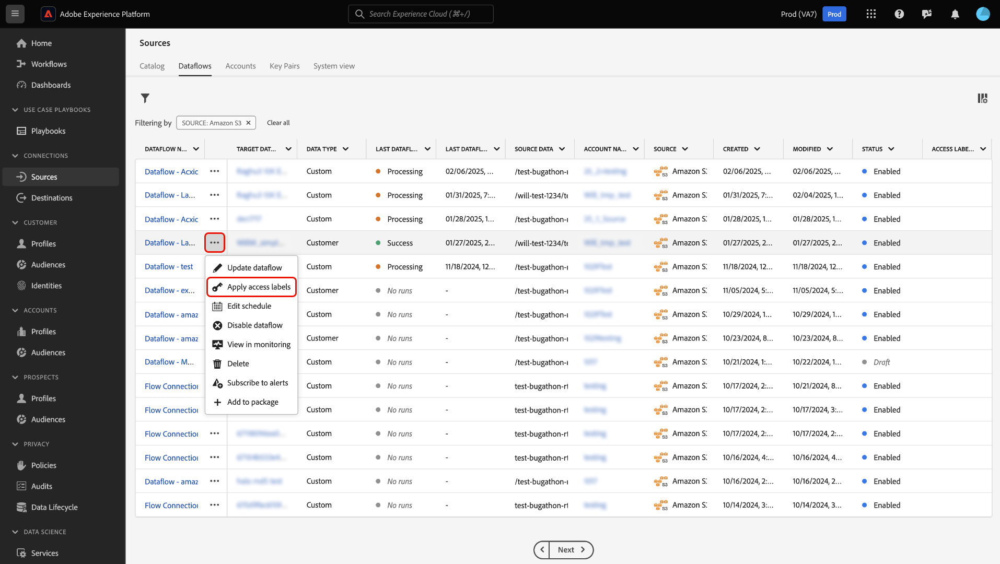

# Aplicar etiquetas de acceso para administrar el acceso de los usuarios a los flujos de datos de origen en la IU

Puede utilizar las funcionalidades proporcionadas por [control de acceso basado en atributos](../../../access-control/abac/overview.md) en Real-Time CDP para aplicar etiquetas a los flujos de datos de origen. Con esta función, puede asegurarse de que solo un subconjunto de usuarios de su organización obtenga acceso a fuentes y flujos de datos específicos.

Cuando se agrega una etiqueta de acceso a un flujo de datos concreto, solo los usuarios que tienen acceso a una función a la que se les asigna esa etiqueta pueden ver y editar ese flujo de datos. Si un flujo de datos de origen no está marcado con ninguna etiqueta, es visible para todos los usuarios que pertenecen a su organización. Por ejemplo, si aplica la etiqueta C12 a un flujo de datos, los usuarios asignados a una función que no tiene la etiqueta C12 no podrán ver y editar el flujo de datos con la etiqueta C12.

Lea esta guía para obtener información sobre cómo aplicar etiquetas de acceso a los flujos de datos de origen mediante la interfaz de usuario de Adobe Experience Platform.

## Introducción 

Antes de trabajar con etiquetas de control de acceso, asegúrese de familiarizarse primero con las capacidades del control de acceso basado en atributos. Para obtener más información, lea la siguiente documentación:

* [Información general de control de acceso basado en atributos](../../../access-control/abac/overview.md)
* [Guía completa de control de acceso basado en atributos](../../../access-control/abac/end-to-end-guide.md)
* [Administración de etiquetas mediante la IU de permisos](../../../access-control/abac/ui/labels.md)
* [Glosario de etiquetas de uso de datos](../../../data-governance/labels/reference.md)

## Aplicar etiquetas de acceso a flujos de datos de origen

>[!NOTE]
>
>* No puede aplicar etiquetas a una ejecución de flujo. Sin embargo, las ejecuciones de flujo heredan cualquier etiqueta que aplique al flujo de datos principal.
>
>* Si no tiene acceso de visualización a un flujo de datos, tampoco podrá ver sus ejecuciones de flujo correspondientes.

Para aplicar etiquetas de acceso a los flujos de datos de origen, vaya a **[!UICONTROL Orígenes]** > **[!UICONTROL Flujos de datos]** y, a continuación, busque el flujo de datos al que desea actualizar y limitar el acceso de los usuarios.

A continuación, seleccione los puntos suspensivos (`...`) en la columna [!UICONTROL Nombre] y, a continuación, seleccione **[!UICONTROL Aplicar etiquetas de acceso]** para agregar y administrar etiquetas para el flujo de datos seleccionado.

Aparece la ventana [!UICONTROL Aplicar etiquetas de acceso y control de datos]. Utilice esta ventana para seleccionar las etiquetas que desea aplicar al flujo de datos. También puede filtrar las etiquetas por su tipo. Cuando termine, seleccione **[!UICONTROL Guardar]**.

Una vez que haya configurado correctamente las etiquetas de acceso al flujo de datos, cualquier usuario que no tenga acceso a esa etiqueta ya no podrá recuperar el flujo de datos. También puede usar la columna [!UICONTROL Etiquetas de acceso] para ver las etiquetas que se aplican a un flujo de datos determinado.

## Pasos siguientes

Ahora sabe cómo aplicar etiquetas de acceso a los flujos de datos de origen. Ahora puede asegurarse de que solo un grupo específico de usuarios de su organización pueda acceder a determinadas fuentes y flujos de datos. Lea la siguiente documentación para obtener más información:

* [Aplicar etiquetas de acceso a flujos de datos de origen en la API](../api/labels.md)
* [Información general sobre el control de acceso](../../../access-control/home.md)