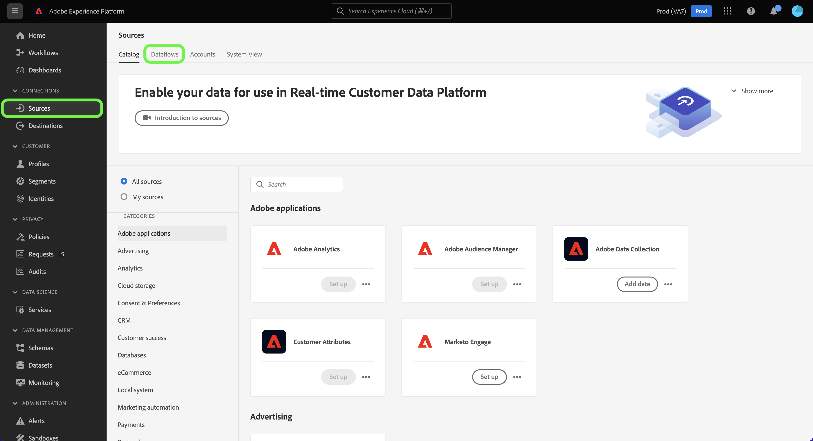

# Monitorización de flujos de datos para fuentes de flujo en la IU

Este tutorial cubre los pasos para monitorizar los flujos de datos de las fuentes de flujo continuo mediante el espacio de trabajo [!UICONTROL Sources].

## Introducción

Este tutorial requiere una comprensión práctica de los siguientes componentes de Adobe Experience Platform:

* [Flujos de datos](../../../dataflows/home.md): los flujos de datos son una representación de los trabajos de datos que mueven datos a través de Platform. Los flujos de datos se configuran en diferentes servicios, lo que ayuda a mover datos de los conectores de origen a los conjuntos de datos de destino, a [!DNL Identity] y [!DNL Profile], y a [!DNL Destinations].
   * [Ejecuciones de flujo de datos](../../notifications.md): Las ejecuciones de flujo de datos son los trabajos programados recurrentes en función de la configuración de frecuencia de los flujos de datos seleccionados.
* [Fuentes](../../home.md): El Experience Platform permite la ingesta de datos de varias fuentes, al tiempo que le ofrece la capacidad de estructurar, etiquetar y mejorar los datos entrantes mediante los servicios de Platform.
* [Zonas protegidas](../../../sandboxes/home.md): El Experience Platform proporciona zonas protegidas virtuales que dividen una sola instancia de Platform en entornos virtuales independientes para ayudar a desarrollar y evolucionar aplicaciones de experiencia digital.

## Monitorización de flujos de datos para fuentes de streaming

En la interfaz de usuario de Platform, seleccione **[!UICONTROL Sources]** en la barra de navegación izquierda para acceder al área de trabajo [!UICONTROL Sources]. La pantalla [!UICONTROL Catálogo] muestra una variedad de orígenes con los que puede crear una cuenta.

Para ver los flujos de datos existentes para las fuentes de flujo continuo, seleccione **[!UICONTROL Flujos de datos]** en el encabezado superior.

La página [!UICONTROL Flujos de datos] contiene una lista de todos los flujos de datos existentes en su organización, incluida la información sobre sus datos de origen, el nombre de cuenta y el estado de ejecución del flujo de datos.

Seleccione el nombre del flujo de datos que desea ver.

La siguiente tabla contiene más información sobre los estados de ejecución del flujo de datos:

| Estado | Descripción |
| ------ | ----------- |
| Completado | El estado `Completed` indica que todos los registros de la ejecución del flujo de datos correspondiente se procesaron dentro del período de una hora. Un estado `Completed` aún puede contener errores en las ejecuciones del flujo de datos. |
| Correcto | El estado `Success` indica que todos los registros de la ejecución del flujo de datos correspondiente se procesaron dentro del período de una hora y que no se encontraron errores durante la ejecución del flujo de datos. |
| Procesamiento | El estado `Processing` indica que un flujo de datos aún no está activo. Este estado suele encontrarse inmediatamente después de crear un nuevo flujo de datos. |
| Error | El estado `Error` indica que el proceso de activación de un flujo de datos se ha interrumpido. |
| Sin ejecuciones | El estado `No runs` indica que se creó el flujo de datos, pero que no se iniciaron ejecuciones de flujo de datos. |

La página [!UICONTROL Actividad de flujo de datos] muestra información específica sobre el flujo de datos de streaming. El titular superior contiene el número acumulado de registros ingeridos y registros fallidos para todas las ejecuciones de flujo de datos de flujo continuo en el intervalo de fechas seleccionado.

De forma predeterminada, los datos mostrados contienen tasas de ingesta de los últimos siete días. Seleccione **[!UICONTROL Últimos 7 días]** para ajustar el lapso de tiempo de los registros mostrados.

Aparece una ventana emergente de calendario, que proporciona opciones para marcos de tiempo de ingesta alternativos. Puede configurar el lapso de tiempo de ejecución del flujo de datos para ver las ejecuciones de flujo de los siete días anteriores o de los últimos 30 días. Como alternativa, puede configurar el calendario interactivo para establecer un lapso de tiempo personalizado de su elección. Cuando termine, seleccione **[!UICONTROL Aplicar]**.

La mitad inferior de la página muestra información sobre el número de registros recibidos, ingeridos y fallidos, por ejecución de flujo. Cada ejecución de flujo se registra dentro de un período de tiempo por hora.

### Métricas de ejecución de flujo de datos {#dataflow-run-metrics}

>[!CONTEXTUALHELP]
>id="platform_sources_dataflow_records_received"
>title="Registros recibidos"
>abstract="La métrica Registros recibidos indica el recuento total de registros recibidos en el flujo de datos."
>text="Learn more in documentation"

>[!CONTEXTUALHELP]
>id="platform_sources_dataflow_records_ingested"
>title="Registros ingeridos"
>abstract="La métrica Registros ingeridos indica el recuento total de registros ingeridos en el lago de datos."
>text="Learn more in documentation"

>[!CONTEXTUALHELP]
>id="platform_sources_dataflow_records_failed"
>title="Error de registros"
>abstract="La métrica Error de registros indica el recuento total de registros que no se ingirieron en el lago de datos debido a errores en los datos."
>text="Learn more in documentation"

>[!CONTEXTUALHELP]
>id="platform_sources_dataflow_records_warnings"
>title="Registros con advertencias"
>abstract="Los registros con advertencias indican el recuento total de registros ingeridos con advertencias de transformación del asignador. Todos los errores de transformación del asignador se notifican como advertencias y las filas parcialmente ingeridas se consideran correctas con una advertencia"
>text="Learn more in documentation"

Cada ejecución de flujo de datos individual muestra los siguientes detalles:

* **[!UICONTROL Inicio de ejecución del flujo de datos]**: La hora a la que comenzó la ejecución del flujo de datos.
* **[!UICONTROL Tiempo de procesamiento]**: Cantidad de tiempo que tardó el flujo de datos en procesarse.
* **[!UICONTROL Registros recibidos]**: El número total de registros recibidos en el flujo de datos desde un conector de origen.
* **[!UICONTROL Registros ingeridos]**: El recuento total de registros ingeridos en [!DNL Data Lake].
* **[!UICONTROL Registros con advertencias]**: El recuento total de registros con advertencias que se ingirieron. Todos los errores de transformación del asignador se registran como advertencias y las filas que se ingieren parcialmente se etiquetan como `success` con una advertencia. **Nota**: La compatibilidad con la ingesta de registros con advertencias solo está disponible para las fuentes de flujo continuo.
* **[!UICONTROL Registros con errores]**: El número de registros que no se ingerieron en [!DNL Data Lake] debido a errores en los datos.
* **[!UICONTROL Tasa de ingesta]**: La tasa de éxito de los registros ingeridos en [!DNL Data Lake]. Esta métrica es aplicable cuando [!UICONTROL Ingesta parcial] está habilitada.
* **[!UICONTROL Estado]**: Representa el estado en el que se encuentra el flujo de datos: [!UICONTROL Completado] o [!UICONTROL Procesando]. [!UICONTROL Completado] significa que todos los registros de la ejecución del flujo de datos correspondiente se procesaron dentro del período de una hora. [!UICONTROL Procesando] significa que la ejecución del flujo de datos aún no ha finalizado.

La página [!UICONTROL Información general sobre la ejecución del flujo de datos] contiene información adicional sobre el flujo de datos, como el ID de ejecución del flujo de datos correspondiente, el conjunto de datos de destino y el ID de organización.

Una ejecución de flujo con errores también contiene el panel [!UICONTROL Errores de ejecución de flujo de datos], que muestra el error concreto que provocó el error de la ejecución, así como el recuento total de registros que fallaron.

### Visualización de registros con advertencias {#warnings}

[!UICONTROL Registros con advertencias] muestra una lista de las advertencias de transformación del asignador que se produjeron durante la ejecución del flujo. Las filas que se incorporan parcialmente se consideran correctas y se anexan con advertencias si se encuentran errores de transformación del asignador.

De forma predeterminada, todos los errores de transformación del asignador se consideran advertencias, excepto si son alguno de los siguientes:

* Errores de sintaxis
* Referencias a atributos que no existen
* No coinciden los tipos de datos XDM

Para ver los diagnósticos de error, seleccione **[!UICONTROL Previsualizar diagnósticos de error]**.

La ventana de [!UICONTROL Previsualización de diagnósticos de error] le permite obtener una vista previa de hasta 100 errores o advertencias con respecto a la ejecución del flujo de datos. Desde aquí, también puede descargar el manifiesto de error de ingesta para obtener más información, mediante la API [!DNL Data Access].

## Pasos siguientes

Al seguir este tutorial, ha utilizado correctamente el espacio de trabajo [!UICONTROL Sources] para supervisar los flujos de datos de flujo continuo e identificar los errores que provocaban errores en los flujos de datos. Consulte los siguientes documentos para obtener más información:

* [Información general de fuentes](../../home.md)
* [Resumen de flujos de datos](../../../dataflows/home.md)
