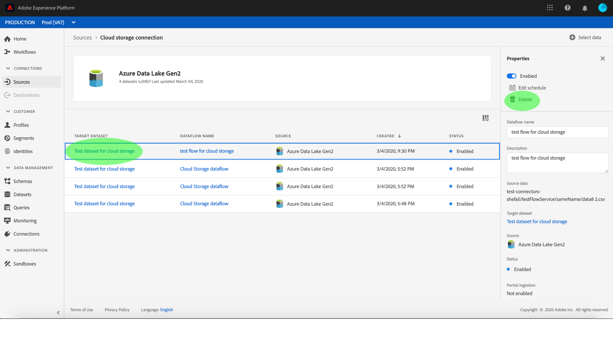

# Monitorear y eliminar flujos de datos

Los conectores de origen en Adobe Experience Platform permiten la ingesta de datos externos de forma programada. Este tutorial proporciona pasos para ver las cuentas y flujos de datos existentes desde el espacio de trabajo *[!UICONTROL Fuentes]* . Este tutorial también proporciona pasos para eliminar flujos de datos del espacio de trabajo *[!UICONTROL Fuentes]* .

## Primeros pasos

Este tutorial requiere un conocimiento práctico de los siguientes componentes del Adobe Experience Platform:

- [Sistema](../../../xdm/home.md)de modelo de datos de experiencia (XDM): El marco normalizado por el cual [!DNL Experience Platform] organiza los datos de experiencia del cliente.
   - [Conceptos básicos de la composición](../../../xdm/schema/composition.md)de esquemas: Obtenga información sobre los componentes básicos de los esquemas XDM, incluidos los principios clave y las prácticas recomendadas en la composición de esquemas.
   - [Tutorial](../../../xdm/tutorials/create-schema-ui.md)del Editor de Esquemas: Obtenga información sobre cómo crear esquemas personalizados mediante la interfaz de usuario del Editor de Esquemas.
- [Perfil](../../../profile/home.md)del cliente en tiempo real: Proporciona un perfil de consumo unificado y en tiempo real basado en datos agregados de varias fuentes.

## Supervisión de cuentas

Inicie sesión en [Adobe Experience Platform](https://platform.adobe.com) y, a continuación, seleccione **[!UICONTROL Fuentes]** en la barra de navegación izquierda para acceder al espacio de trabajo *[!UICONTROL Fuentes]* . La pantalla *[!UICONTROL Catálogo]* muestra una serie de orígenes para los que puede crear cuentas y flujos de datos. Cada origen muestra el número de cuentas existentes y flujos de datos asociados a ellas.

Seleccione *[!UICONTROL Cuentas]* del encabezado superior para vista de cuentas existentes.

Se abre la página *[!UICONTROL Cuentas]* . En esta página hay una lista de cuentas visualizables, que incluye información sobre su origen, nombre de usuario, número de flujos de datos y fecha de creación.

Seleccione el icono del canal en la parte superior izquierda para iniciar la ventana de ordenación.

El panel de ordenación permite acceder a las cuentas desde un origen específico. Seleccione el origen con el que desea trabajar y seleccione la cuenta en la lista de la derecha.

Desde la página *[!UICONTROL Cuentas]* , puede realizar la vista de una lista de flujos de datos existentes asociados a la cuenta a la que accedió. Seleccione el flujo de datos que desea vista.

Aparece la pantalla *[!UICONTROL actividad]* de Dataflow. Esta página muestra la velocidad de los mensajes que se consumen en forma de gráfico.

## Monitoreo de flujos de datos

Se puede acceder a los flujos de datos directamente desde la página *[!UICONTROL Catálogo]* sin ver *[!UICONTROL las cuentas]*. Seleccione *[!UICONTROL Flujos]* de datos en el encabezado superior para vista de una lista de flujos de datos existentes.

Aparece una lista de flujos de datos existentes. En esta página hay una lista de flujos de datos visualizables, incluida información sobre su origen, nombre de usuario, número de flujos de datos y estado. Seleccione el icono del canal en la parte superior izquierda para ordenar.

Aparece el panel de ordenación. Seleccione el origen al que desea acceder desde el menú de desplazamiento y seleccione el flujo de datos desde la lista de la derecha.

Aparece la pantalla *[!UICONTROL actividad]* de Dataflow. Esta página muestra la velocidad de los mensajes que se consumen en forma de gráfico.

Para obtener más información sobre la supervisión de flujos de datos y la ingestión, consulte el tutorial sobre la [supervisión de flujos de datos](../../../ingestion/quality/monitor-data-flows.md)de flujo continuo.

## Eliminar un flujo de datos

Puede eliminar flujos de datos que se crearon incorrectamente o que ya no son necesarios accediendo a la pantalla flujos de datos. Localice el flujo de datos que desea eliminar mediante el icono del canal de clasificación y seleccione el flujo de datos para abrir el panel **[!UICONTROL Propiedades]** .

Para eliminar un flujo de datos, seleccione **[!UICONTROL Eliminar]** en las propiedades de la parte superior derecha.

Aparece un mensaje de confirmación final. Seleccione **[!UICONTROL Eliminar]** para confirmar.

Después de unos momentos, aparece un cuadro de confirmación verde en la parte inferior de la pantalla para confirmar que la eliminación se ha realizado correctamente.

También puede eliminar un flujo de datos de la pantalla *[!UICONTROL Cuentas]* . Localice la cuenta a la que desee acceder mediante el icono del canal de clasificación y seleccione la cuenta en la lista.

Aparece la página *[!UICONTROL Cuentas]* . Seleccione el flujo de datos que desea eliminar y, a continuación, seleccione **[!UICONTROL Eliminar]** en el panel de propiedades para completar el proceso.

Siga los pasos de confirmación descritos anteriormente para completar el proceso.

## Pasos siguientes

Siguiendo este tutorial, se ha accedido correctamente a las cuentas y flujos de datos existentes desde el espacio de trabajo *[!UICONTROL Fuentes]* . Los datos entrantes ahora pueden ser utilizados por servicios [!DNL Platform] descendentes como [!DNL Real-time Customer Profile] y [!DNL Data Science Workspace]. Consulte los siguientes documentos para obtener más información:

- [Información general sobre el Perfil del cliente en tiempo real](../../../profile/home.md)
- [Información general sobre el área de trabajo de ciencias de datos](../../../data-science-workspace/home.md)