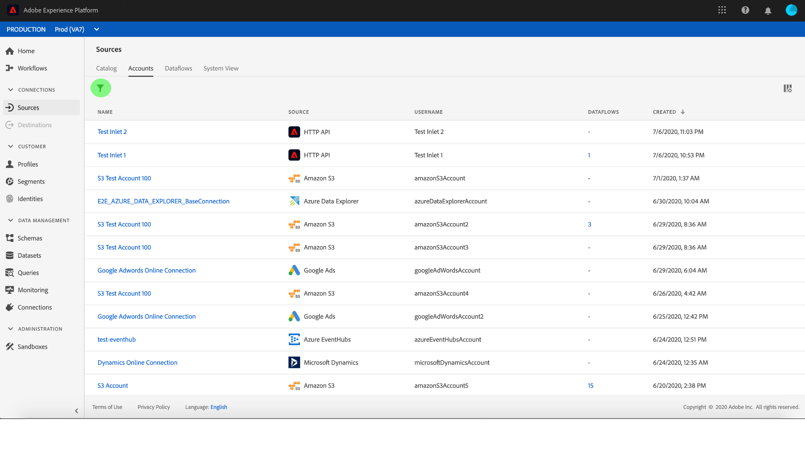

# Supervisión de cuentas y flujos de datos en la interfaz de usuario

Los conectores de origen de Adobe Experience Platform permiten la ingesta de datos externos de forma programada. Este tutorial proporciona pasos para ver las cuentas y flujos de datos existentes desde el espacio de trabajo [!UICONTROL Fuentes] .

## Primeros pasos

Este tutorial requiere un conocimiento práctico de los siguientes componentes de Adobe Experience Platform:

- [[!DNL Experience Data Model] (XDM) Sistema](../../../xdm/home.md): El marco normalizado por el cual [!DNL Experience Platform] organiza los datos de experiencia del cliente.
   - [Conceptos básicos de la composición](../../../xdm/schema/composition.md)de esquemas: Obtenga información sobre los componentes básicos de los esquemas XDM, incluidos los principios clave y las prácticas recomendadas en la composición de esquemas.
   - [Tutorial](../../../xdm/tutorials/create-schema-ui.md)del Editor de esquemas: Obtenga información sobre cómo crear esquemas personalizados mediante la interfaz de usuario del Editor de Esquemas.
- [[!Perfil del cliente en tiempo real de DNL]](../../../profile/home.md): Proporciona un perfil de consumo unificado y en tiempo real basado en datos agregados de varias fuentes.

## Supervisión de cuentas

Inicie sesión en [Adobe Experience Platform](https://platform.adobe.com) y seleccione **[!UICONTROL Fuentes]** en la barra de navegación izquierda para acceder al espacio de trabajo **[!UICONTROL Fuentes]** . La pantalla **[!UICONTROL Catálogo]** muestra una serie de orígenes para los que puede crear cuentas y flujos de datos. Cada origen muestra el número de cuentas existentes y flujos de datos asociados a ellas.

Seleccione **[!UICONTROL Cuentas]** del encabezado superior para vista de cuentas existentes.

Se abre la página **[!UICONTROL Cuentas]** . En esta página hay una lista de cuentas visualizables, que incluye información sobre su origen, nombre de usuario, número de flujos de datos y fecha de creación.

Seleccione el icono del canal en la parte superior izquierda para iniciar la ventana de ordenación.

El panel de ordenación permite acceder a las cuentas desde un origen específico. Seleccione el origen con el que desea trabajar y seleccione la cuenta en la lista de la derecha.

>[!TIP]
>
> Utilice el botón de control  espectro en la columna **[!UICONTROL Nombre]** para crear un nuevo flujo de datos de origen para la cuenta seleccionada.

Desde la página **[!UICONTROL Cuentas]** , puede realizar la vista de una lista de flujos de datos existentes o conjuntos de datos de destinatario asociados a la cuenta a la que accedió. Seleccione el botón de elipses (`...`) para que aparezcan más opciones disponibles para el flujo de datos seleccionado. Estas opciones se describen a continuación:

| Control | Descripción |
| ------- | ----------- |
| [!UICONTROL Editar programación] | Permite editar el programa de ingestión del flujo de datos. |
| [!UICONTROL Deshabilitar flujo de datos] | Permite desactivar la ingestión de datos para el flujo de datos seleccionado. |
| [!UICONTROL Eliminar] | Permite eliminar el flujo de datos seleccionado. |

## Monitoreo de flujos de datos

Se puede acceder a los flujos de datos directamente desde la página **[!UICONTROL Catálogo]** sin ver **[!UICONTROL las cuentas]**. Seleccione **[!UICONTROL Flujos]** de datos en el encabezado superior para vista de una lista de flujos de datos.

Aparece una lista de flujos de datos existentes. En esta página hay una lista de flujos de datos visualizables, incluida información sobre su origen, nombre de usuario, número de flujos de datos y estado. Seleccione el icono del canal en la parte superior izquierda para ordenar.

Aparece el panel de ordenación. Seleccione el origen al que desea acceder desde el menú de desplazamiento y seleccione el flujo de datos desde la lista de la derecha. También puede seleccionar el botón de elipses (`...`) para que aparezcan más opciones disponibles para el flujo de datos seleccionado.

La página **[!UICONTROL actividad]** de flujo de datos contiene detalles sobre el número de registros ingestados y de registros fallidos, así como información sobre el estado de flujo de datos y el tiempo de procesamiento. Seleccione el icono de calendario que hay encima del flujo de datos para ajustar el intervalo de tiempo de los registros de ingestión.

El calendario permite la vista de los distintos intervalos de tiempo para los registros ingestados. Puede seleccionar una de las dos opciones predefinidas **[!UICONTROL Últimos 7 días]** o **[!UICONTROL Últimos 30 días]**. También puede establecer un intervalo de tiempo personalizado mediante el calendario. Seleccione el intervalo de tiempo que desee y seleccione **[!UICONTROL Aplicar]** para continuar.

De forma predeterminada, la actividad **** Flujo de datos muestra el panel **[!UICONTROL Propiedades]** asociado al flujo de datos. Seleccione el flujo ejecutado desde la lista para ver sus metadatos asociados, incluida la información sobre su ID de ejecución única.

Seleccione **[!UICONTROL inicio]** de ejecución de flujo de datos para acceder a la información general **[!UICONTROL de ejecución de flujo de]** datos.

La **[!UICONTROL información general]** de ejecución de flujo de datos muestra información sobre el flujo de datos, incluidos sus metadatos, el estado de ingestión **** parcial y el umbral **[!UICONTROL de]** error asignado. El encabezado superior también incluye un resumen **[!UICONTROL de errores]**. El resumen **[!UICONTROL de]** errores contiene el error específico de nivel superior que muestra en qué paso el proceso de ingestión encontró un error.

Consulte la siguiente tabla para ver los errores que se pueden ver en el resumen **[!UICONTROL de]** errores.

| Error | Descripción |
| ---------- | ----------- |
| `CONNECTOR-1001-500` | Error al copiar datos de un origen. |
| `CONNECTOR-2001-500` | Error al procesar los datos copiados en [!DNL Platform]. Este error puede deberse a analizar, validar o transformar. |

La mitad inferior de la pantalla contiene información sobre los errores **[!UICONTROL de ejecución de]** Dataflow. Desde aquí, también puede realizar vistas de los archivos ingestados, realizar previsualizaciones y descargar diagnósticos de error o descargar el manifiesto de archivo.

La sección Errores **[!UICONTROL de ejecución]** de flujo de datos muestra el código **[!UICONTROL de]** error, el número de registros en los que se ha producido un error y la información que describe el error.

Seleccione los diagnósticos **[!UICONTROL de error de]** Previsualización para ver más información sobre el error de inserción.

Aparece el panel previsualización **[!UICONTROL de diagnóstico de]** errores. Esta pantalla muestra información específica sobre el error de inserción, incluido el nombre **[!UICONTROL del]** archivo, el código **[!UICONTROL de]** error, el nombre de la columna en la que se produjo el error y una descripción del error.

Esta sección también incluye una previsualización de la columna que contiene el error.

>[!IMPORTANT]
>
>Para habilitar la previsualización **[!UICONTROL de diagnósticos de]** error, debe activar los diagnósticos de ingestión **** parcial y **[!UICONTROL error al configurar un flujo de datos]** . Al hacerlo, el sistema podrá analizar todos los registros ingestados durante la ejecución del flujo.

Después de obtener una vista previa de los errores, puede seleccionar **[!UICONTROL Descargar]** desde el panel de información general **** de las ejecuciones de flujo de datos para acceder a los diagnósticos de error completos y descargar el manifiesto del archivo. Consulte los documentos sobre diagnóstico [de](../../../ingestion/batch-ingestion/partial.md#retrieve-errors) errores y [descarga de metadatos](../../../ingestion/batch-ingestion/partial.md#download-metadata) para obtener más información.

Para obtener más información sobre la supervisión de flujos de datos y la ingestión, consulte el tutorial sobre la [supervisión de flujos de datos](../../../ingestion/quality/monitor-data-flows.md)de flujo continuo.

## Pasos siguientes

Siguiendo este tutorial, se ha accedido correctamente a las cuentas y flujos de datos existentes desde el espacio de trabajo **[!UICONTROL Fuentes]** . Los datos entrantes ahora pueden ser utilizados por servicios [!DNL Platform] descendentes como [!DNL Real-time Customer Profile] y [!DNL Data Science Workspace]. Consulte los siguientes documentos para obtener más información:

- [Información general sobre el Perfil del cliente en tiempo real](../../../profile/home.md)
- [Información general sobre el área de trabajo de ciencias de datos](../../../data-science-workspace/home.md)
