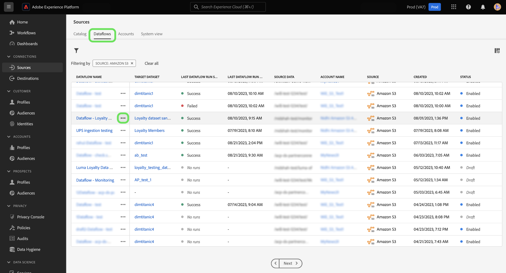
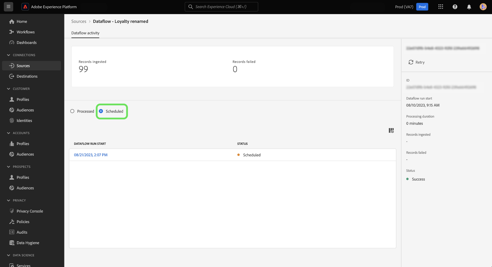

# Ingesta bajo demanda de flujos de datos de origen en la interfaz de usuario

Puede utilizar la ingesta bajo demanda para almacenar en déclencheur una iteración de ejecución de flujo de un flujo de datos existente mediante el espacio de trabajo de fuentes en la interfaz de usuario de Adobe Experience Platform.

Este documento proporciona pasos sobre cómo crear flujos de datos bajo demanda para orígenes, así como cómo reintentar ejecuciones de flujo que se han procesado o que han fallado.

>[!BEGINSHADEBOX]

**¿Qué es una ejecución de flujo?**

Las ejecuciones de flujo representan una instancia de ejecución de flujo de datos. Por ejemplo, si un flujo de datos está programado para ejecutarse por hora a las 9:00, 10:00 y 11:00 a.m., tendría tres instancias de ejecución de flujo. Las ejecuciones de flujo son específicas de su organización particular.

>[!ENDSHADEBOX]

## Introducción

Este documento requiere un entendimiento práctico de los siguientes componentes de Experience Platform:

* [Fuentes](../../home.md): Experience Platform permite la ingesta de datos desde varias fuentes y, al mismo tiempo, le ofrece la capacidad de estructurar, etiquetar y mejorar los datos entrantes mediante los servicios de Platform.
* [Flujos de datos](../../../dataflows/home.md): un flujo de datos es una representación de los trabajos de datos que mueven datos a través de Platform. Los flujos de datos se configuran en diferentes servicios, lo que ayuda a mover datos de los conectores de origen a los conjuntos de datos de destino, al servicio de identidad y al perfil del cliente en tiempo real, y a los destinos.
* [Zonas protegidas](../../../sandboxes/home.md): Experience Platform proporciona zonas protegidas virtuales que dividen una sola instancia de Platform en entornos virtuales independientes para ayudar a desarrollar y evolucionar aplicaciones de experiencia digital.

## Creación de un flujo de datos bajo demanda {#create-a-dataflow-on-demand}

Vaya a *[!UICONTROL Flujos de datos]* de source workspace. Aquí, busque el flujo de datos que desea ejecutar bajo demanda y, a continuación, seleccione los puntos suspensivos (**`...`**) junto al nombre del flujo de datos.

A continuación, seleccione **[!UICONTROL Ejecutar bajo demanda]** en el menú desplegable que aparece.

Configure la programación de la ingesta bajo demanda. Seleccione el **[!UICONTROL Hora de inicio de ingesta]**, el **[!UICONTROL Hora de inicio del intervalo de fecha]**, y el **[!UICONTROL Hora de finalización del intervalo de fecha]**.

| Configuración de programación | Descripción |
| --- | --- |
| [!UICONTROL Hora de inicio de ingesta] | La hora de inicio programada en UTC de cuándo comenzará el flujo de datos bajo demanda. |
| [!UICONTROL Hora de inicio del intervalo de fecha] | La fecha y hora de inicio a partir de la cual se extraerán los datos. |
| [!UICONTROL Hora de finalización del intervalo de fecha] | La fecha y hora de finalización desde la que se extraerán los datos hasta. |

Seleccionar **[!UICONTROL Programación]** y espere unos momentos para que el flujo de datos bajo demanda se almacene en déclencheur.

Seleccione el nombre del flujo de datos para ver su actividad. Aquí verá una lista de las ejecuciones del flujo de datos que se han procesado. Seleccione una ejecución de flujo de datos y, a continuación, seleccione **[!UICONTROL Reintentar]** en el carril derecho para reintentar la ingesta para un flujo de datos seleccionado, ejecute la iteración.

Seleccionar **[!UICONTROL Programado]** para ver una lista de las ejecuciones de flujo de datos programadas para una ingesta futura.

## Pasos siguientes

Al leer este documento, ha aprendido a crear ejecuciones de flujo bajo demanda para flujos de datos de fuentes existentes. Para obtener más información sobre las fuentes, lea la [información general de orígenes](../../home.md)