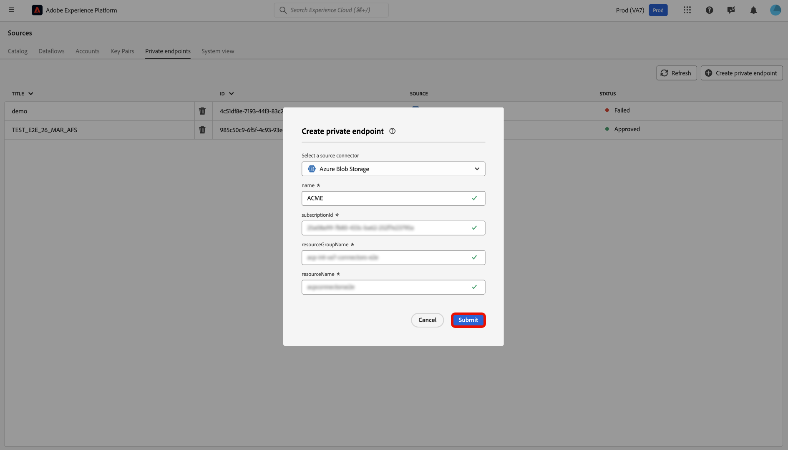

# Compatibilidad con vínculos privados para orígenes en la interfaz de usuario

>[!AVAILABILITY]
>
>Las siguientes fuentes admiten esta función:
>
>* [[!DNL Azure Blob Storage]](../../connectors/cloud-storage/blob.md)
>* [[!DNL ADLS Gen2]](../../connectors/cloud-storage/adls-gen2.md)
>* [[!DNL Azure File Storage]](../../connectors/cloud-storage/azure-file-storage.md)
>
>Actualmente, la compatibilidad con enlaces privados solo está disponible para las organizaciones que han adquirido Adobe Healthcare Shield o Adobe Privacy &amp; Security Shield.

Puede utilizar la función Vínculos privados para crear extremos privados a los que se conectarán los orígenes de Adobe Experience Platform. Conecte sus fuentes de forma segura a una red virtual mediante direcciones IP privadas, lo que elimina la necesidad de direcciones IP públicas y reduce la superficie de ataque. Simplifique la configuración de la red eliminando la necesidad de configuraciones complejas de firewall o traducción de direcciones de red, a la vez que garantiza que el tráfico de datos solo llegue a los servicios aprobados.

Lea esta guía para aprender a utilizar el espacio de trabajo de fuentes en la interfaz de usuario de Experience Platform para crear y utilizar un extremo privado.

>[!BEGINSHADEBOX]

## Derecho de uso de licencias para compatibilidad con vínculos privados

Las métricas de asignación de derechos de uso de licencias para la compatibilidad con vínculos privados en fuentes de son las siguientes:

* Los clientes tienen derecho a hasta 2 TB por año de transferencia de datos a través de fuentes compatibles ([!DNL Azure Blob Storage], [!DNL ADLS Gen2] y [!DNL Azure File Storage]), en todas las zonas protegidas y organizaciones.
* Cada organización puede tener un máximo de 10 extremos para todas las zonas protegidas de producción.
* Cada organización puede tener un máximo de 1 extremo para todas las zonas protegidas de desarrollo.

>[!ENDSHADEBOX]

## Crear un extremo privado

Para empezar a usar los vínculos privados, vaya al catálogo *[!UICONTROL Sources]* de la interfaz de usuario de Experience Platform y seleccione **[!UICONTROL Puntos finales privados]** en el menú de pestañas del área de trabajo de orígenes.

Utilice la interfaz para ver información sobre los extremos privados existentes, como su ID, el origen asociado y el estado actual. Para crear un nuevo extremo privado, seleccione **[!UICONTROL Crear extremo privado]**.

A continuación, elija el origen deseado y, a continuación, introduzca los valores de las siguientes propiedades:

| Propiedad | Descripción |
| --- | --- |
| `name` | Nombre de su extremo privado. |
| `subscriptionId` | El identificador asociado con su suscripción a [!DNL Azure]. Para obtener más información, lea la guía de [!DNL Azure] sobre [recuperación de los ID de suscripción e inquilino de [!DNL Azure Portal]](https://learn.microsoft.com/en-us/azure/azure-portal/get-subscription-tenant-id). |
| `resourceGroupName` | Nombre de su grupo de recursos en [!DNL Azure]. Un grupo de recursos contiene recursos relacionados para una solución [!DNL Azure]. Para obtener más información, lea la guía [!DNL Azure] sobre [administración de grupos de recursos](https://learn.microsoft.com/en-us/azure/azure-resource-manager/management/manage-resource-groups-portal). |
| `resourceGroup` | El nombre del recurso. En [!DNL Azure], un recurso hace referencia a instancias como máquinas virtuales, aplicaciones web y bases de datos. Para obtener más información, lea la guía de [!DNL Azure] sobre [cómo entender al [!DNL Azure] administrador de recursos](https://learn.microsoft.com/en-us/azure/azure-resource-manager/management/overview). |

{style="table-layout:auto"}

Cuando termine, seleccione **[!UICONTROL Enviar]**.

### Aprobar un extremo privado

Un extremo recién creado permanece en estado pendiente hasta que un administrador lo apruebe.

Para aprobar una solicitud de extremo privado para los orígenes [!DNL Azure Blob] y [!DNL Azure Data Lake Gen2], inicie sesión en [!DNL Azure Portal]. En el panel de navegación izquierdo, seleccione **[!DNL Data storage]**, luego vaya a la ficha **[!DNL Security + networking]** y elija **[!DNL Networking]**. A continuación, seleccione **[!DNL Private endpoints]** para ver una lista de los extremos privados asociados a su cuenta y sus estados de conexión actuales. Para aprobar una solicitud pendiente, seleccione el extremo deseado y haga clic en **[!DNL Approve]**.

## Crear una cuenta con un extremo privado

Vaya al catálogo de fuentes y seleccione un origen que admita extremos privados. A continuación, cree una nueva cuenta con el origen y, durante la autenticación de la cuenta, seleccione la opción **[!UICONTROL Extremo privado]**. Proporcione las credenciales de autenticación de su origen y seleccione **[!UICONTROL Conectarse al origen]** Espere unos minutos para que se establezca la conexión.

>[!NOTE]
>
>Si la opción [!UICONTROL Extremo privado] está habilitada, Experience Platform comprueba si existe un extremo privado aprobado para el origen seleccionado. Si no se encuentra ningún extremo aprobado, no podrá establecer una conexión.

A continuación, vaya a la interfaz de [!UICONTROL cuenta existente] de su origen. Utilice esta interfaz para ver una lista de las cuentas existentes y sus estados correspondientes. Puede seleccionar el icono de filtro  para mostrar solamente las cuentas que se han habilitado para conectarse con un extremo privado.

Seleccione la cuenta que desee usar y después habilite **[!UICONTROL Creación interactiva]**. Esta opción activa [!UICONTROL Interactive Authoring], una característica de [!DNL Azure] que le permite probar conexiones, examinar listas de carpetas y obtener una vista previa de los datos. Se requiere la activación de [!UICONTROL creación interactiva] para las conexiones de extremo privado. Tenga en cuenta que no puede desactivar manualmente esta opción; se desactiva automáticamente pasados 60 minutos.

[!UICONTROL La creación interactiva] tarda unos minutos en habilitarse. Una vez habilitada la configuración, seleccione **[!UICONTROL Siguiente]** para continuar con el siguiente paso y seleccione los datos que desee introducir.

## Próximos pasos

Ahora que ha creado correctamente un extremo privado, puede crear conexiones de origen y flujos de datos e introducir datos mediante extremos privados. Lea las siguientes guías para obtener información sobre cómo crear flujos de datos en la interfaz de usuario:

* [Crear un flujo de datos para una fuente de almacenamiento en la nube](../ui/dataflow/batch/cloud-storage.md)
* [Crear un flujo de datos para un origen de base de datos](../ui/dataflow/databases.md)
