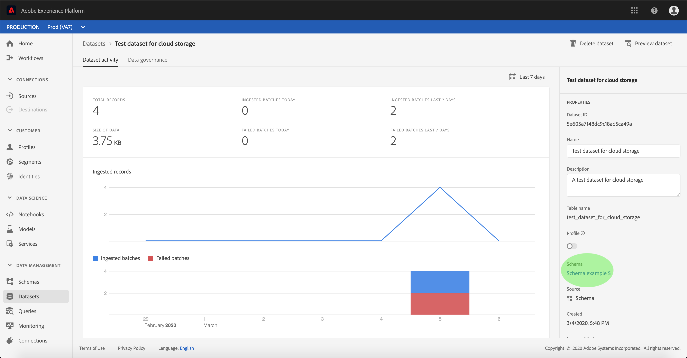

# Activar datos de origen de entrada para rellenar perfiles de cliente

Los datos entrantes del conector de origen se pueden utilizar para enriquecer y rellenar [!DNL Real-time Customer Profile] los datos.

## Primeros pasos

Este tutorial requiere un conocimiento práctico de los siguientes componentes de Adobe Experience Platform:

- [[!DNL Experience Data Model] (XDM) Sistema](../../../xdm/home.md): El marco normalizado por el cual [!DNL Experience Platform] organiza los datos de experiencia del cliente.
   - [Conceptos básicos de la composición](../../../xdm/schema/composition.md)de esquemas: Obtenga información sobre los componentes básicos de los esquemas XDM, incluidos los principios clave y las prácticas recomendadas en la composición de esquemas.
   - [Tutorial](../../../xdm/tutorials/create-schema-ui.md)del Editor de esquemas: Obtenga información sobre cómo crear esquemas personalizados mediante la interfaz de usuario del Editor de Esquemas.
- [[!Perfil del cliente en tiempo real de DNL]](../../../profile/home.md): Proporciona un perfil de consumo unificado y en tiempo real basado en datos agregados de varias fuentes.

Además, este tutorial requiere que ya haya creado y configurado un conector de origen.  Puede encontrar una lista de tutoriales para crear diferentes conectores en la interfaz de usuario en la descripción general [de los conectores](../../home.md)de origen.

## Rellene sus [!DNL Real-time Customer Profile] datos

Para enriquecer los perfiles de los clientes, el esquema de origen del conjunto de datos de destinatario debe ser compatible para su uso en [!DNL Real-time Customer Profile]. Un esquema compatible cumple los siguientes requisitos:

- El esquema tiene al menos un atributo especificado como propiedad de identidad.
- El esquema tiene una propiedad de identidad definida como la identidad principal.
- Existe una asignación dentro del flujo de datos donde la identidad principal es un atributo de destinatario.

En el espacio de trabajo Fuentes, haga clic en la ficha **[!UICONTROL Examinar]** para realizar la lista de las conexiones base. En la lista mostrada, busque la conexión que contiene el flujo de datos con el que desea rellenar los perfiles. Haga clic en el nombre de la conexión para acceder a sus detalles.

Se abre la pantalla actividad **[!UICONTROL de]** origen de la conexión, que muestra los conjuntos de datos en los que la conexión está invirtiendo datos de origen. Haga clic en el nombre del conjunto de datos para el que desee habilitar [!DNL Profile].

Aparece la pantalla **[!UICONTROL actividad]** del conjunto de datos. La columna **[!UICONTROL Propiedades]** del lado derecho de la pantalla muestra los detalles del conjunto de datos e incluye un conmutador de **[!UICONTROL Perfil]** y un vínculo al esquema al que se adhiere el conjunto de datos. Haga clic en el nombre del esquema para vista de su composición.

Aparece el Editor **[!UICONTROL de]** Esquemas, que muestra la estructura del esquema en el lienzo central. Dentro del lienzo, seleccione el campo que se va a establecer como identidad principal. En la ficha Propiedades **[!UICONTROL del]** campo que aparece, seleccione la casilla **[!UICONTROL Identidad]** y, a continuación, la identidad **** principal. Finalmente, seleccione una Área de nombres **** de identidad adecuada y haga clic en **[!UICONTROL Aplicar]**.

Haga clic en el objeto de nivel superior de la estructura del esquema y aparecerá la columna de propiedades **[!UICONTROL del]** Esquema. Active el esquema para [!DNL Profile] alternar el conmutador de **[!UICONTROL Perfil]** . Haga clic en **[!UICONTROL Guardar]** para finalizar los cambios.

Ahora que el esquema está habilitado para [!DNL Profile], vuelva a la pantalla de actividad **[!UICONTROL del]** conjunto de datos y habilite el conjunto de datos para [!DNL Profile] hacerlo haciendo clic en el botón de alternancia del **[!UICONTROL Perfil]** en la columna **[!UICONTROL Propiedades]** .

Con el esquema y el conjunto de datos habilitados para [!DNL Profile], los datos ingestados en ese conjunto de datos ahora también rellenarán los perfiles de los clientes.

>[!NOTE]
>
>Los datos existentes dentro de un conjunto de datos recientemente habilitado no son consumidos por [!DNL Profile].

## Pasos siguientes

Siguiendo este tutorial, ha activado correctamente los datos de entrada para [!DNL Profile] la población. For more information, see the [[!DNL Real-time Customer Profile] overview](../../../profile/home.md).