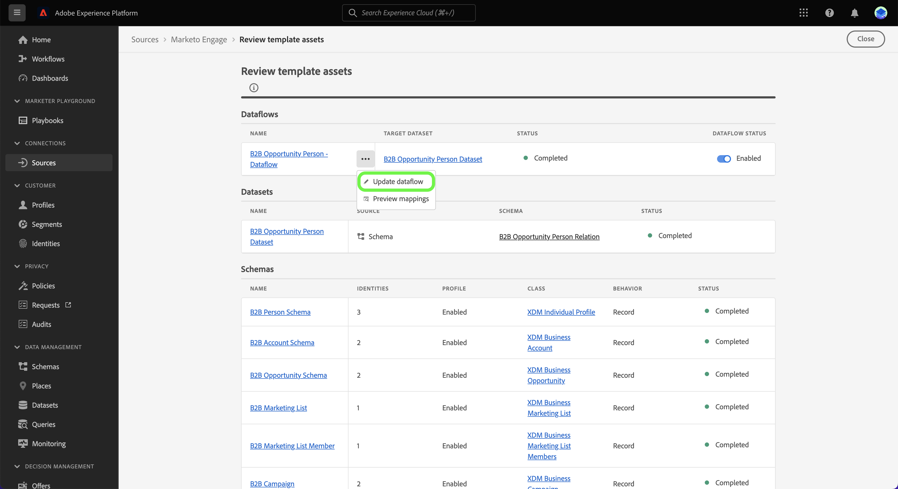
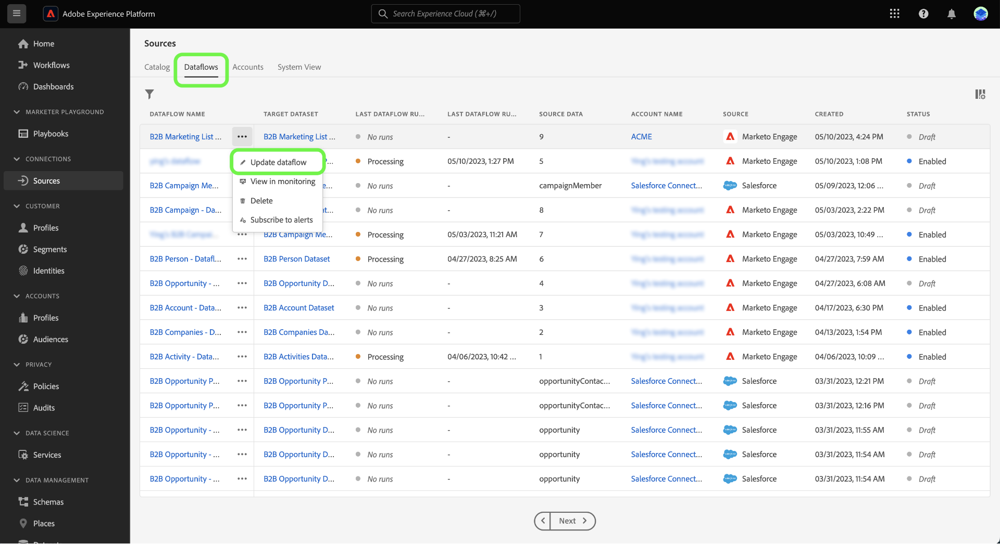
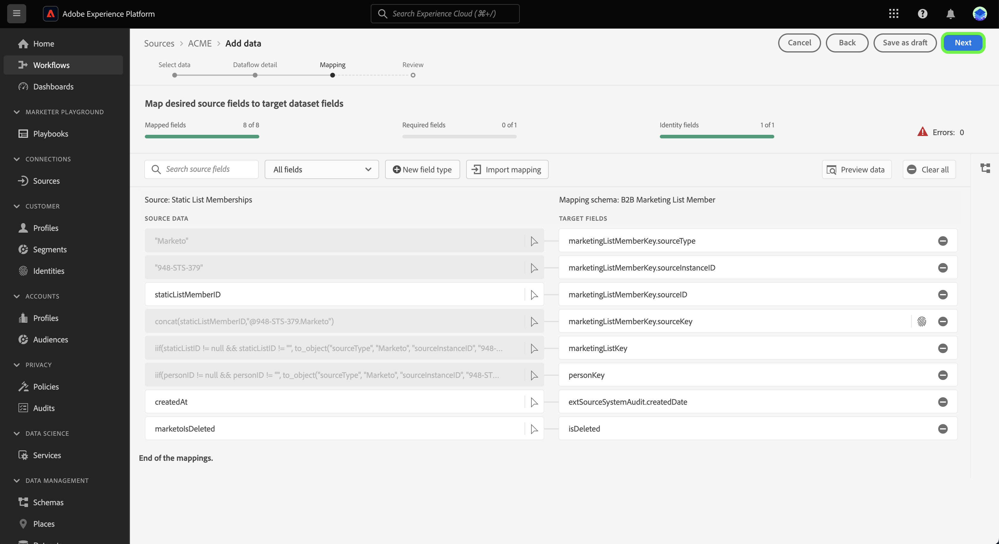

# Creación de un flujo de datos de origen mediante plantillas en la IU {#create-a-sources-dataflow-using-templates-in-the-ui}

>[!CONTEXTUALHELP]
>id="platform_sources_marketo_mapping"
>title="Plantillas para fuentes en la IU de Platform"
>abstract="Las plantillas incluyen archivos generados automáticamente, como esquemas, conjuntos de datos, identidades, reglas de asignación, áreas de nombres de identidad y flujos de datos que puede utilizar al traer datos de un origen a una Experience Platform. Puede actualizar los archivos generados automáticamente para personalizarlos según sus casos de uso."

>[!IMPORTANT]
>
>Las plantillas están en versión beta y son compatibles con las siguientes fuentes:
>
>* [[!DNL Marketo Engage]](../../connectors/adobe-applications/marketo/marketo.md)
>* [[!DNL Microsoft Dynamics]](../../connectors/crm/ms-dynamics.md)
>* [[!DNL Salesforce]](../../connectors/crm/salesforce.md)
>
>La documentación y las funcionalidades están sujetas a cambios.

Adobe Experience Platform proporciona plantillas preconfiguradas que puede utilizar para acelerar el proceso de ingesta de datos. Las plantillas incluyen recursos generados automáticamente, como esquemas, conjuntos de datos, identidades, reglas de asignación, áreas de nombres de identidad y flujos de datos que puede utilizar al traer datos de un origen a un Experience Platform.

Con las plantillas, puede:

* Reduzca el tiempo de respuesta de la ingesta mediante la aceleración de la creación de recursos con plantillas.
* Minimice los errores que pueden producirse durante el proceso de ingesta manual de datos.
* Actualice los recursos generados automáticamente en cualquier momento para adaptarlos a sus casos de uso.

El siguiente tutorial proporciona pasos sobre cómo utilizar las plantillas en la interfaz de usuario de Platform.

## Primeros pasos

Este tutorial requiere una comprensión práctica de los siguientes componentes de Experience Platform:

* [Fuentes](../../home.md): El Experience Platform permite la ingesta de datos de varias fuentes, al tiempo que le ofrece la capacidad de estructurar, etiquetar y mejorar los datos entrantes mediante los servicios de Platform.
* [[!DNL Experience Data Model (XDM)] Sistema](../../../xdm/home.md): El marco estandarizado mediante el cual el Experience Platform organiza los datos de experiencia del cliente.
* [Zonas protegidas](../../../sandboxes/home.md): El Experience Platform proporciona zonas protegidas virtuales que dividen una sola instancia de Platform en entornos virtuales independientes para ayudar a desarrollar y evolucionar aplicaciones de experiencia digital.

## Uso de plantillas en la IU de Platform {#use-templates-in-the-platform-ui}

>[!CONTEXTUALHELP]
>id="platform_sources_templates_accounttype"
>title="Seleccionar tipo de negocio"
>abstract="Seleccione el tipo de negocio adecuado para su caso de uso. El acceso puede variar en función de la cuenta de suscripción a Real-time Customer Data Platform."
>additional-url="https://experienceleague.adobe.com/docs/experience-platform/rtcdp/intro/rtcdp-intro/overview.html?lang=es" text="Información general sobre Real-Time CDP"

En la interfaz de usuario de Platform, seleccione **[!UICONTROL Sources]** en el panel de navegación izquierdo para acceder al área de trabajo [!UICONTROL Sources] y ver un catálogo de orígenes disponibles en el Experience Platform.

Utilice el menú *[!UICONTROL Categorías]* para filtrar orígenes por categoría. También puede introducir un nombre de origen en la barra de búsqueda para buscar un origen específico del catálogo.

Vaya a la categoría [!UICONTROL aplicaciones de Adobe] para ver la tarjeta de origen de [!DNL Marketo Engage] y, a continuación, seleccione [!UICONTROL Agregar datos] para empezar.

Aparece una ventana emergente que presenta la opción de examinar las plantillas o utilizar esquemas y conjuntos de datos existentes.

* **Examinar plantillas**: Las plantillas de fuentes crean esquemas, identidades, conjuntos de datos y flujos de datos con reglas de asignación automáticamente. Puede personalizar estos recursos según sea necesario.
* **Usar mis recursos existentes**: ingrese los datos usando los conjuntos de datos y esquemas existentes que creó. También puede crear nuevos conjuntos de datos y esquemas si es necesario.

Para usar recursos generados automáticamente, selecciona **[!UICONTROL Examinar plantillas]** y luego selecciona **[!UICONTROL Seleccionar]**.

### Autenticación

Aparece el paso de autenticación, que le solicita que cree una nueva cuenta o que utilice una cuenta existente.

>[!BEGINTABS]

>[!TAB Usar una cuenta existente]

Para usar una cuenta existente, seleccione [!UICONTROL Cuenta existente] y luego seleccione la cuenta que desee usar en la lista que aparece.

>[!TAB Crear una nueva cuenta]

Para crear una cuenta nueva, seleccione **[!UICONTROL Nueva cuenta]** y, a continuación, proporcione los detalles de conexión de origen y las credenciales de autenticación de la cuenta. Cuando termine, seleccione **[!UICONTROL Conectarse al origen]** y deje pasar un tiempo para que se establezca la nueva conexión.

>[!ENDTABS]

### Seleccionar plantillas

Con la cuenta autenticada, ahora puede seleccionar la plantilla que desee utilizar para el flujo de datos.

+++[!DNL Marketo Engage] plantillas
En la tabla siguiente se describen las plantillas disponibles para el origen [!DNL Marketo Engage].

| [!DNL Marketo Engage] plantillas | Descripción |
| --- | --- |
| Actividades | La plantilla Actividades captura instantáneas basadas en eventos de actividades como interacciones por correo electrónico, interacciones con sitios web y llamadas de ventas. |
| Compañías | La plantilla Compañías captura los detalles de la cuenta empresarial, como la información de firmografía de la compañía, la ubicación y la información de facturación. |
| Cuentas con nombre | La plantilla Cuentas con nombre captura los detalles de las cuentas que se han determinado como cuentas de destino que se deben seguir. |
| Oportunidades | La plantilla Oportunidades captura los detalles de la oportunidad comercial, como el tipo, la fase de ventas y las cuentas relacionadas. |
| Roles de contacto de oportunidad | La plantilla Funciones de contacto de oportunidad captura detalles sobre las funciones de los posibles clientes asociados a una oportunidad concreta. |
| Personas | La plantilla Personas captura atributos de personas individuales, como detalles demográficos, información de contacto y preferencias de consentimiento. |
| Pertenencias al programa | La plantilla Miembros del programa captura los detalles de los contactos asociados con una campaña empresarial, incluidas las cadencias de nutrición y las respuestas de contacto. |
| Programas | La plantilla Programas captura los detalles de la campaña empresarial como el estado, los canales, los plazos y los costes. |
| Pertenencias a lista estática | La plantilla Pertenencias a listas estáticas captura las relaciones entre las personas y su pertenencia a listas estáticas. |
| Listas estáticas | La plantilla Lista estática captura listas instanciadas de personas para casos de uso específicos. |

{style="table-layout:auto"}

+++

+++[!DNL Salesforce] plantillas B2B
En la tabla siguiente se describen las plantillas B2B disponibles para el origen [!DNL Salesforce].

| [!DNL Salesforce] plantillas B2B | Descripción |
| --- | --- |
| Relación de contacto de cuenta | La plantilla Relación de contacto de cuenta captura la relación entre un contacto y una o más cuentas. |
| Cuentas | La plantilla Cuenta captura los detalles de la cuenta empresarial, como la información de firmografía de la empresa, la ubicación y la información de facturación. |
| Miembros de campaña | La plantilla Miembros de campaña captura la relación entre un posible cliente o contacto individual y una campaña [!DNL Salesforce] específica. |
| Campañas | La plantilla Campañas captura los detalles de la cuenta empresarial, como la información de firmografía de la empresa, la ubicación y la información de facturación. |
| Contactos | La plantilla Contacto captura atributos para contactos como detalles demográficos, información de contacto y entidades comerciales relacionadas. |
| Posibles clientes | La plantilla de posibles clientes captura los atributos de los posibles clientes, como los detalles demográficos, la información de contacto y las entidades comerciales relacionadas. |
| Oportunidades | La plantilla Oportunidades captura los detalles de la oportunidad comercial, como el tipo, la fase de ventas y la cuenta relacionada. |
| Roles de contacto de oportunidad | La plantilla Funciones de contacto de oportunidad captura detalles sobre las funciones de los posibles clientes asociados a una oportunidad concreta. |

{style="table-layout:auto"}

+++

+++[!DNL Salesforce] plantillas B2C
En la tabla siguiente se describen las plantillas B2C disponibles para el origen [!DNL Salesforce].

| [!DNL Salesforce] plantillas B2C | Descripción |
| --- | --- |
| Contacto | La plantilla Contacto captura atributos para contactos como detalles demográficos, información de contacto y entidades comerciales relacionadas. |
| Posible cliente | La plantilla de posible cliente captura los atributos de los posibles clientes, como los detalles demográficos, la información de contacto y las entidades comerciales relacionadas. |

{style="table-layout:auto"}

+++

+++[!DNL Microsoft Dynamics] plantillas B2B
En la tabla siguiente se describen las plantillas B2B disponibles para el origen [!DNL Microsoft Dynamics].

| [!DNL Microsoft Dynamics] plantillas B2B | Descripción |
| --- | --- |
| Cuentas | La plantilla Cuenta captura los detalles de la cuenta empresarial, como la información de firmografía de la empresa, la ubicación y la información de facturación. |
| Campañas | La plantilla Campañas captura los detalles de la cuenta empresarial, como la información de firmografía de la empresa, la ubicación y la información de facturación. |
| Contactos | La plantilla Contacto captura atributos para contactos como detalles demográficos, información de contacto y entidades comerciales relacionadas. |
| Posibles clientes | La plantilla de posibles clientes captura los atributos de los posibles clientes, como los detalles demográficos, la información de contacto y las entidades comerciales relacionadas. |
| Lista de marketing | La plantilla Lista de marketing captura un grupo de clientes existentes o potenciales creados para una campaña de marketing u otros fines de ventas. |
| Miembros de lista de marketing | Los miembros de la lista de marketing capturan los detalles de cualquier tipo de registro de cliente, como posibles clientes, cuentas o contactos, en una lista de marketing. |
| Oportunidades | La plantilla Oportunidades captura los detalles de la oportunidad comercial, como el tipo, la fase de ventas y la cuenta relacionada. |
| Roles de contacto de oportunidad | La plantilla Funciones de contacto de oportunidad captura detalles sobre las funciones de los posibles clientes asociados a una oportunidad concreta. |

{style="table-layout:auto"}

+++

+++[!DNL Microsoft Dynamics] plantillas B2C
En la tabla siguiente se describen las plantillas B2C disponibles para el origen [!DNL Microsoft Dynamics].

| [!DNL Microsoft Dynamics] plantillas B2C | Descripción |
| --- | --- |
| Contacto | La plantilla Contacto captura atributos para contactos como detalles demográficos, información de contacto y entidades comerciales relacionadas. |
| Posible cliente | La plantilla de posible cliente captura los atributos de los posibles clientes, como los detalles demográficos, la información de contacto y las entidades comerciales relacionadas. |

{style="table-layout:auto"}

+++

Según el tipo de empresa seleccionado, aparecerá una lista de plantillas. Seleccione el icono de vista previa  junto al nombre de una plantilla para obtener una vista previa de los datos de ejemplo de la plantilla.

Aparecerá la ventana de vista previa, que le permitirá explorar e inspeccionar datos de ejemplo de la plantilla. Cuando termine, seleccione **[!UICONTROL Got it]**.

A continuación, seleccione la plantilla que desee utilizar en la lista. Puede seleccionar varias plantillas y crear varios flujos de datos a la vez. Sin embargo, una plantilla solo se puede utilizar una vez por cuenta. Una vez que haya seleccionado las plantillas, seleccione **[!UICONTROL Finalizar]** y espere unos momentos para que se generen los recursos.

Si selecciona uno o parte de los elementos de la lista de plantillas disponibles, todos los esquemas B2B y las áreas de nombres de identidad se generarán para garantizar que las relaciones B2B entre esquemas estén correctamente configuradas.

>[!NOTE]
>
>Las plantillas que ya se hayan utilizado se desactivarán de la selección.

### Establecer una programación

Las fuentes [!DNL Microsoft Dynamics] y [!DNL Salesforce] admiten la programación de flujos de datos.

Utilice la interfaz de programación para configurar una programación de ingesta para los flujos de datos. Establezca su frecuencia de ingesta en **Una vez** para crear una ingesta única.

También puede establecer la frecuencia de ingesta en **Minuto**, **Hora**, **Día** o **Semana**. Si programa el flujo de datos para varias ingestas, debe establecer un intervalo para establecer un intervalo de tiempo entre cada ingesta. Por ejemplo, una frecuencia de ingesta establecida en **Hour** y un intervalo establecido en **15** significa que el flujo de datos está programado para ingerir datos cada **15 horas**.

Durante este paso, también puede habilitar **relleno** y definir una columna para la ingesta incremental de datos. El relleno se utiliza para introducir datos históricos, mientras que la columna que defina para la ingesta incremental permite diferenciar los nuevos datos de los datos existentes.

Una vez que haya completado la configuración de la programación de ingesta, seleccione **[!UICONTROL Finalizar]**.

### Revisar recursos {#review-assets}

>[!CONTEXTUALHELP]
>id="platform_sources_templates_review"
>title="Revise los recursos generados automáticamente"
>abstract="La generación de todos los recursos puede tardar hasta cinco minutos. Si decide salir de la página, recibirá una notificación para regresar una vez que se hayan completado los recursos. Puede revisar los recursos una vez que se hayan generado y realizar configuraciones adicionales en el flujo de datos en cualquier momento."

La página [!UICONTROL Revisar recursos de plantilla] muestra los recursos generados automáticamente como parte de la plantilla. En esta página, puede ver los esquemas, conjuntos de datos, áreas de nombres de identidad y flujos de datos generados automáticamente y asociados a la conexión de origen. La generación de todos los recursos puede tardar hasta cinco minutos. Si decide salir de la página, recibirá una notificación para regresar una vez que se hayan completado los recursos. Puede revisar los recursos una vez que se hayan generado y realizar configuraciones adicionales en el flujo de datos en cualquier momento.

De forma predeterminada, los flujos de datos generados automáticamente se establecen en estado de borrador para permitir una mayor personalización de las configuraciones, como las reglas de asignación o las frecuencias programadas. Seleccione los puntos suspensivos (`...`) junto al nombre del flujo de datos y, a continuación, seleccione **[!UICONTROL Previsualizar asignaciones]** para ver los conjuntos de asignaciones creados para el flujo de datos de borrador.

Aparecerá una página de vista previa que le permitirá inspeccionar la relación de asignación entre los campos de datos de origen y los campos de esquema de destino. Una vez vistas las asignaciones del flujo de datos. Seleccione **[!UICONTROL Lo tengo.]**

Puede actualizar los flujos de datos en cualquier momento después de la ejecución. Seleccione los puntos suspensivos (`...`) junto al nombre del flujo de datos y, a continuación, seleccione **[!UICONTROL Actualizar flujo de datos]**. Se le redirige a la página de flujo de trabajo de fuentes, donde puede actualizar los detalles del flujo de datos, incluida la configuración de la ingesta parcial, los diagnósticos de error y las notificaciones de alerta, así como la asignación del flujo de datos.

Puede utilizar la vista del editor de esquemas para realizar actualizaciones en el esquema generado automáticamente. Visite la guía de [con el editor de esquemas](../../../xdm/tutorials/create-schema-ui.md) para obtener más información.

>[!TIP]
>
>Puede acceder a su flujo de datos de borrador a través de la página del catálogo [!UICONTROL Dataflows] en el área de trabajo de orígenes. Seleccione **[!UICONTROL Flujos de datos]** en el encabezado superior y, a continuación, seleccione el flujo de datos que desee actualizar en la lista.
>
>

### Publish su flujo de datos

Inicie el proceso de publicación a través del flujo de trabajo de fuentes. Después de seleccionar [!UICONTROL Actualizar flujo de datos], se le redirigirá al paso *[!UICONTROL Agregar datos]* del flujo de trabajo. Seleccione **[!UICONTROL Siguiente]** para continuar.

A continuación, confirme los detalles del flujo de datos y configure las opciones de diagnóstico de errores, ingesta parcial y notificaciones de alerta. Cuando termine, seleccione **[!UICONTROL Siguiente]**.

>[!NOTE]
>
>Puede seleccionar **[!UICONTROL Guardar como borrador]** en cualquier momento para detener y guardar los cambios realizados en el flujo de datos.

Aparecerá el paso de asignación. Durante este paso, puede volver a configurar las configuraciones de asignación del flujo de datos. Para obtener una guía completa sobre las funciones de preparación de datos utilizadas para la asignación, visite la [guía de IU de preparación de datos](../../../data-prep/ui/mapping.md).

Por último, revisa los detalles del flujo de datos y selecciona **[!UICONTROL Guardar e ingerir]** para publicar el borrador.

## Pasos siguientes

Al seguir este tutorial, ha creado flujos de datos, así como recursos como esquemas, conjuntos de datos y áreas de nombres de identidad mediante plantillas. Para obtener información general sobre las fuentes, visite [descripción general de las fuentes](../../home.md).

## Alertas y notificaciones {#alerts-and-notifications}

Las plantillas son compatibles con las alertas de Adobe Experience Platform y puede utilizar el panel de notificaciones para recibir actualizaciones sobre el estado de los recursos y también para volver a la página de revisión.

Seleccione el icono de notificación en el encabezado superior de la interfaz de usuario de Platform y, a continuación, seleccione la alerta de estado para ver los recursos que desea revisar.

Puede actualizar la configuración de alertas de las plantillas para recibir notificaciones por correo electrónico y en Platform sobre el estado de los flujos de datos. Para obtener más información sobre la configuración de alertas, lea la guía de [cómo suscribirse a alertas para orígenes y flujos de datos](../ui/alerts.md).