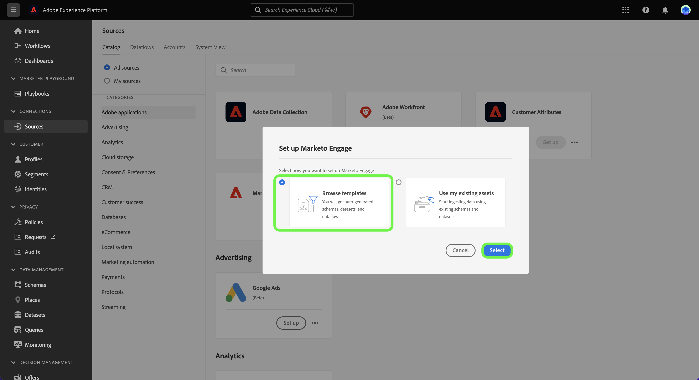

# (Alpha) Crear un flujo de datos de fuentes utilizando plantillas en la interfaz de usuario

>[!IMPORTANT]
>
>Las plantillas están en Alpha y actualmente solo las admite el [[!DNL Marketo Engage] source](../../connectors/adobe-applications/marketo/marketo.md). La documentación y las funcionalidades están sujetas a cambios.

Adobe Experience Platform proporciona plantillas preconfiguradas que puede utilizar para acelerar el proceso de consumo de datos. Las plantillas incluyen recursos generados automáticamente, como esquemas, conjuntos de datos, reglas de asignación, áreas de nombres de identidad y flujos de datos, que se pueden utilizar al importar datos de un origen a un Experience Platform.

Con las plantillas, puede:

* Reduzca el tiempo-valor de la ingesta mediante la aceleración de la creación de activos basada en ML.
* Minimice los errores que se pueden producir durante el proceso de ingesta manual de datos.
* Actualice los recursos generados automáticamente en cualquier momento para adaptarlos a sus casos de uso.

El siguiente tutorial proporciona pasos sobre cómo utilizar plantillas en la interfaz de usuario de Platform mediante el [[!DNL Marketo Engage] source](../../connectors/adobe-applications/marketo/marketo.md).

## Primeros pasos

Este tutorial requiere una comprensión práctica de los siguientes componentes de Experience Platform:

* [Fuentes](../../home.md): Experience Platform permite la ingesta de datos de varias fuentes, al mismo tiempo que le ofrece la capacidad de estructurar, etiquetar y mejorar los datos entrantes mediante los servicios de Platform.
* [[!DNL Experience Data Model (XDM)] Sistema](../../../xdm/home.md): El marco estandarizado mediante el cual el Experience Platform organiza los datos de experiencia del cliente.
* [Sandboxes](../../../sandboxes/home.md): Experience Platform proporciona entornos limitados virtuales que dividen una sola instancia de Platform en entornos virtuales independientes para ayudar a desarrollar y desarrollar aplicaciones de experiencia digital.

## Uso de plantillas en la interfaz de usuario de Platform {#use-templates-in-the-platform-ui}

>[!CONTEXTUALHELP]
>id="platform_sources_templates_accounttype"
>title="Seleccionar tipo de negocio"
>abstract="Seleccione el tipo de negocio adecuado para su caso de uso. El acceso puede variar en función de la cuenta de suscripción a Real-time Customer Data Platform."
>additional-url="https://experienceleague.adobe.com/docs/experience-platform/rtcdp/overview.html?lang=es" text="Información general de Real-Time CDP"

En la interfaz de usuario de Platform, seleccione **[!UICONTROL Fuentes]** desde el panel de navegación izquierdo para acceder a la [!UICONTROL Fuentes] espacio de trabajo. La variable [!UICONTROL Catálogo] muestra una variedad de fuentes que pueden utilizarse para crear una cuenta.

Puede seleccionar la categoría adecuada del catálogo en la parte izquierda de la pantalla. También puede encontrar la fuente específica con la que desea trabajar mediante la barra de búsqueda.

En el [!UICONTROL aplicaciones de Adobe] categoría, seleccione **[!UICONTROL Marketo Engage]** y, a continuación, seleccione **[!UICONTROL Añadir datos]**.

Aparece una ventana emergente que le presenta la opción de examinar plantillas o utilizar esquemas y conjuntos de datos existentes. Para utilizar recursos generados automáticamente, seleccione **[!UICONTROL Examinar plantillas]** y, a continuación, seleccione **[!UICONTROL Select]**.

### Autenticación

Aparece el paso de autenticación, que le solicita que cree una cuenta nueva o que utilice una existente.

#### Cuenta existente

Para usar una cuenta existente, seleccione [!UICONTROL Cuenta existente] y, a continuación, seleccione la cuenta que desee utilizar en la lista que aparece.

#### Nueva cuenta

Para crear una cuenta nueva, seleccione **[!UICONTROL Nueva cuenta]** y, a continuación, proporcione los detalles de conexión de origen y las credenciales de autenticación de la cuenta. Cuando termine, seleccione **[!UICONTROL Conectar a origen]** y permitir que la nueva conexión se establezca algún tiempo.

### Seleccionar plantillas

Una vez que haya autenticado y seleccionado la cuenta, aparecerá una lista de plantillas. Seleccione el icono de vista previa junto al nombre de una plantilla para obtener una vista previa de los datos de ejemplo de la plantilla.

Aparece la ventana de vista previa que le permite explorar e inspeccionar datos de ejemplo de la plantilla. Cuando termine, seleccione **[!UICONTROL Lo tengo]**.

A continuación, seleccione la plantilla que desee utilizar en la lista. Puede seleccionar varias plantillas y crear varios flujos de datos a la vez. Sin embargo, una plantilla solo se puede utilizar una vez por cuenta. Una vez seleccionadas las plantillas, seleccione **[!UICONTROL Finalizar]** y permitir que se generen unos momentos para los recursos.

### Revisar recursos {#review-assets}

>[!CONTEXTUALHELP]
>id="platform_sources_templates_review"
>title="Revise los recursos generados automáticamente"
>abstract="La generación de todos los recursos puede tardar hasta cinco minutos. Si decide salir de la página, recibirá una notificación para que se devuelva una vez que se hayan completado los recursos. Puede revisar los recursos una vez que se hayan generado y realizar configuraciones adicionales en el flujo de datos en cualquier momento."

La variable [!UICONTROL Revisar recursos de plantilla] muestra los recursos generados automáticamente como parte de la plantilla. En esta página, puede ver los esquemas, conjuntos de datos, áreas de nombres de identidad y flujos de datos generados automáticamente y asociados con la conexión de origen.

Los flujos de datos generados automáticamente están habilitados de forma predeterminada. Seleccione los puntos suspensivos (`...`) junto al nombre del flujo de datos y, a continuación, seleccione **[!UICONTROL Previsualizar asignaciones]** para ver los conjuntos de asignación creados para su flujo de datos.

Aparece una página de vista previa que le permite inspeccionar la relación de asignación entre los campos de datos de origen y los campos de esquema de destino. Una vez que haya visto las asignaciones de su flujo de datos. Select **[!UICONTROL Lo tengo.]**

Puede actualizar los flujos de datos en cualquier momento después de la ejecución. Seleccione los puntos suspensivos (`...`) junto al nombre del flujo de datos y, a continuación, seleccione **[!UICONTROL Actualizar flujo de datos]**. Se le redirige a la página de flujo de trabajo de fuentes donde puede actualizar sus detalles del flujo de datos, incluida la configuración para la ingesta parcial, el diagnóstico de errores y las notificaciones de alerta, así como la asignación del flujo de datos.

## Pasos siguientes

Al seguir este tutorial, ahora ha creado flujos de datos, así como recursos como esquemas, conjuntos de datos y áreas de nombres de identidad mediante plantillas. Para obtener información general sobre las fuentes, visite [información general sobre fuentes](../../home.md).