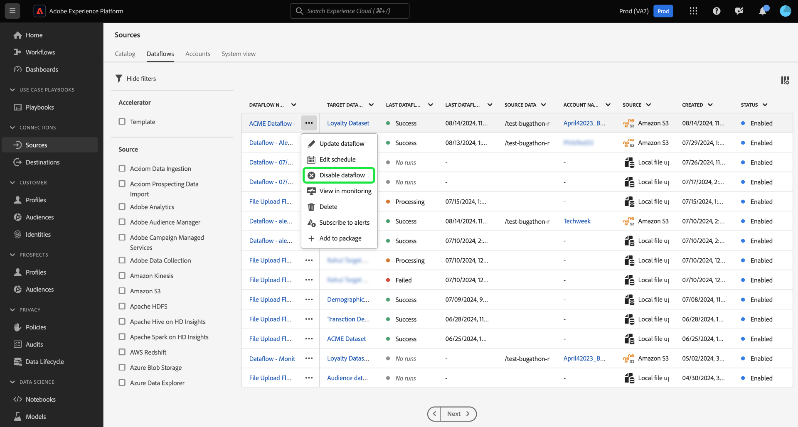

# Actualización de flujos de datos en la IU

Lea este tutorial para ver los pasos sobre cómo actualizar un flujo de datos existente, incluidas sus configuraciones de programación y asignación, mediante el espacio de trabajo de fuentes en la interfaz de usuario de Adobe Experience Platform.

## Introducción 

Este tutorial requiere una comprensión práctica de los siguientes componentes de Experience Platform:

* [Fuentes](../../home.md): El Experience Platform permite la ingesta de datos de varias fuentes, al tiempo que le ofrece la capacidad de estructurar, etiquetar y mejorar los datos entrantes mediante los servicios de Platform.
* [Zonas protegidas](../../../sandboxes/home.md): El Experience Platform proporciona zonas protegidas virtuales que dividen una sola instancia de Platform en entornos virtuales independientes para ayudar a desarrollar y evolucionar aplicaciones de experiencia digital.

## Actualizar flujos de datos {#update-dataflows}

>[!CONTEXTUALHELP]
>id="platform_sources_dataflows_daysRemaining"
>title="Caducidad del conjunto de datos"
>abstract="Esta columna indica el número de días que le quedan al conjunto de datos de destinatario antes de que caduque automáticamente. Un flujo de datos fallará si caduca el conjunto de datos de destino. Para evitar que un flujo de datos falle, asegúrese de que un conjunto de datos de destinatario esté configurado para que caduque en la fecha correcta. Consulte la documentación para obtener información sobre cómo actualizar las fechas de caducidad."

En la interfaz de usuario del Experience Platform, seleccione **[!UICONTROL Orígenes]** en el panel de navegación izquierdo y, a continuación, seleccione **[!UICONTROL Flujos de datos]** en el encabezado superior.

>[!TIP]
>
>Puede ordenar y filtrar los flujos de datos mediante las funciones de filtrado. Lea la guía [filtrado de objetos de origen en la interfaz de usuario](./filter.md) para obtener más información.

La página [!UICONTROL Flujos de datos] muestra una lista de todos los flujos de datos existentes en su organización. Busque el flujo de datos que desea actualizar y, a continuación, seleccione los puntos suspensivos (`...`) que aparecen junto a él. Aparece un menú desplegable que muestra una lista de opciones entre las que puede elegir para realizar configuraciones adicionales en el flujo de datos existente.

Para actualizar el flujo de datos, seleccione **[!UICONTROL Actualizar flujo de datos]**.

Se le redirigirá al flujo de trabajo de fuentes, donde podrá actualizar aspectos de su flujo de datos, incluidos sus detalles, en el paso [!UICONTROL Proporcionar detalles del flujo de datos].

### Actualizar asignación {#update-mapping}

>[!NOTE]
>
>Actualmente, la característica de asignación de edición no es compatible con los siguientes orígenes: Adobe Analytics, Adobe Audience Manager, API HTTP y [!DNL Marketo Engage].

Durante este proceso, también puede actualizar los conjuntos de asignaciones asociados al flujo de datos.  La interfaz de asignación muestra la asignación existente del flujo de datos y no un nuevo conjunto de asignaciones recomendado. Las actualizaciones de asignación solo se aplican a ejecuciones de flujo de datos programadas en el futuro. No se pueden actualizar los conjuntos de asignaciones de un flujo de datos programado para una ingesta única.

Utilice la interfaz de asignación para modificar los conjuntos de asignación aplicados al flujo de datos. Para ver los pasos detallados sobre cómo usar la interfaz de asignación, consulte la [guía de la interfaz de usuario de la preparación de datos](../../../data-prep/ui/mapping.md) para obtener más información.

### Actualizar programación

Una vez que haya actualizado las asignaciones del flujo de datos, puede continuar con la actualización de la programación de ingesta para introducir el flujo de datos con sus nuevos datos de asignación. Solo puede actualizar la programación de ingesta de flujos de datos configurados para la ingesta en una programación recurrente. No puede reprogramar un flujo de datos configurado para una ingesta única.

También puede actualizar la programación de ingesta del flujo de datos mediante la opción de actualización en línea proporcionada en la página de flujos de datos.

En la página de flujos de datos, seleccione los puntos suspensivos (`...`) junto al nombre del flujo de datos y, a continuación, seleccione **[!UICONTROL Editar programación]** en el menú desplegable que aparece.

El cuadro de diálogo **[!UICONTROL Editar programación]** le proporciona opciones para actualizar la frecuencia de ingesta y la tasa de intervalo del flujo de datos. Una vez que haya establecido los valores de frecuencia e intervalo actualizados, seleccione **[!UICONTROL Guardar]**.

### Deshabilitar flujo de datos

Puede deshabilitar el flujo de datos utilizando el mismo menú desplegable. Para deshabilitar el flujo de datos, seleccione **[!UICONTROL Deshabilitar flujo de datos]**.

A continuación, seleccione [!UICONTROL Deshabilitar] en la ventana emergente que aparece.

Si más tarde vuelve a habilitar este flujo de datos y, posteriormente, Experience Platform programará automáticamente ejecuciones de relleno para cubrir el período durante el cual se desactivó el flujo de datos. Por ejemplo, si el flujo de datos se configuró para ejecutarse cada hora y se deshabilitó durante 48 horas, al volver a habilitar este flujo de datos, el Experience Platform creará 48 ejecuciones de relleno para procesar los intervalos perdidos.

## Pasos siguientes

Al seguir este tutorial, ha utilizado correctamente el espacio de trabajo [!UICONTROL Sources] para actualizar la programación de ingesta y los conjuntos de asignaciones del flujo de datos.

Para obtener información sobre cómo realizar estas operaciones mediante programación usando la API [!DNL Flow Service], consulte el tutorial sobre [actualización de flujos de datos mediante la API de Flow Service](../../tutorials/api/update-dataflows.md).
