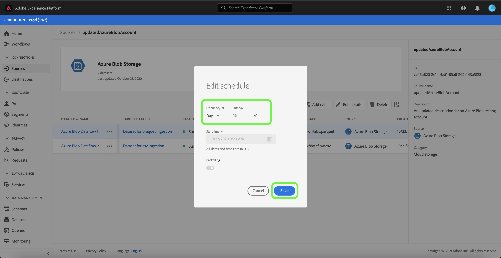

# Actualizar los detalles de la cuenta en la interfaz de usuario

En algunas circunstancias, puede ser necesario actualizar los detalles de una cuenta de fuentes existente. El espacio de trabajo [!UICONTROL Sources] permite agregar, editar y eliminar detalles de un lote o conexión de flujo continuo existente, como su nombre, descripción y credenciales.

El espacio de trabajo [!UICONTROL Sources] también permite editar la programación de flujos de datos por lotes, lo que le permite actualizar su frecuencia de ingesta y su tasa de intervalo.

Este tutorial proporciona pasos para actualizar los detalles y las credenciales de una cuenta existente desde el espacio de trabajo [!UICONTROL Sources], así como para actualizar la programación de ingesta de un flujo de datos.

## Primeros pasos

Este tutorial requiere una comprensión práctica de los siguientes componentes de Adobe Experience Platform:

- [Fuentes](../../home.md): Experience Platform permite la ingesta de datos de varias fuentes, al tiempo que ofrece la capacidad de estructurar, etiquetar y mejorar los datos entrantes mediante los servicios de Platform.
- [Simuladores para pruebas](../../../sandboxes/home.md): Experience Platform proporciona entornos limitados virtuales que dividen una sola instancia de Platform en entornos virtuales independientes para ayudar a desarrollar y desarrollar aplicaciones de experiencia digital.

## Actualizar cuentas

Inicie sesión en la [interfaz de usuario de Experience Platform](https://platform.adobe.com) y, a continuación, seleccione **[!UICONTROL Fuentes]** en el panel de navegación izquierdo para acceder al espacio de trabajo [!UICONTROL Fuentes]. Seleccione **[!UICONTROL Accounts]** en el encabezado superior para ver las cuentas existentes.

Aparece la página **[!UICONTROL Cuentas]**. En esta página hay una lista de cuentas visibles que incluye información sobre su origen, nombre de usuario, número de flujos de datos y fecha de creación.

Seleccione el icono de filtro  en la parte superior izquierda para iniciar el panel de ordenación.

El panel de ordenación proporciona una lista de todas las fuentes. Puede seleccionar más de una fuente de la lista para acceder a una selección filtrada de cuentas asociadas a diferentes fuentes.

Seleccione la fuente con la que desee trabajar para ver una lista de sus cuentas existentes. Una vez identificada la cuenta que desea actualizar, seleccione los puntos suspensivos (`...`) junto al nombre de la cuenta.

Aparece un menú desplegable que le ofrece las opciones **[!UICONTROL Add data]**, **[!UICONTROL Edit details]** y **[!UICONTROL Delete]**. Seleccione **[!UICONTROL Editar detalles]** en el menú para actualizar su cuenta.

El cuadro de diálogo **[!UICONTROL Editar detalles de la cuenta]** permite actualizar el nombre, la descripción y las credenciales de autenticación de una cuenta. Una vez que haya actualizado la información deseada, seleccione **[!UICONTROL Guardar]**.

Después de unos momentos, aparece un cuadro de confirmación en la parte inferior de la pantalla para confirmar que la actualización se ha realizado correctamente.

## Editar programación

Puede editar la programación de ingesta de un flujo de datos desde la página **[!UICONTROL Cuentas]**. En la lista de cuentas, seleccione la cuenta que contiene el flujo de datos que desea volver a programar.

Aparecerá la página flujos de datos. Esta página contiene una lista de flujos de datos existentes asociados con la cuenta seleccionada. Seleccione los puntos suspensivos (`...`) junto al flujo de datos que desea volver a programar.

Aparece un menú desplegable que le ofrece las opciones **[!UICONTROL Editar programación]**, **[!UICONTROL Habilitar flujo de datos]**, **[!UICONTROL Ver en monitoreo]** y **[!UICONTROL Eliminar]**. Seleccione **[!UICONTROL Editar programación]** en el menú.

El cuadro de diálogo **[!UICONTROL Editar programación]** le ofrece opciones para actualizar la frecuencia de ingesta y la velocidad de intervalo del flujo de datos. Una vez configurados los valores de intervalo y frecuencia actualizados, seleccione **[!UICONTROL Guardar]**.

| Programación | Descripción |
| ---------- | ----------- |
| Frecuencia | Frecuencia con la que el flujo de datos recopilará datos. Los valores aceptables para la programación de frecuencia de edición para un flujo de datos ya existente incluyen: `minute`, `hour`, `day` o `week`. |
| Intervalo | El intervalo designa el periodo entre dos ejecuciones de flujo consecutivas. El valor del intervalo debe ser un entero distinto de cero y debe ser mayor o igual que `15`. |

Después de unos momentos, aparece un cuadro de confirmación en la parte inferior de la pantalla para confirmar que la actualización se ha realizado correctamente.

## Pasos siguientes

Siguiendo este tutorial, ha utilizado correctamente el espacio de trabajo [!UICONTROL Sources] para actualizar la información de la cuenta y editar la programación del flujo de datos.

Para ver los pasos sobre cómo realizar estas operaciones mediante programación utilizando la API [!DNL Flow Service], consulte el tutorial sobre la [actualización de la información de conexión mediante la API de servicio de flujo](../../tutorials/api/update.md).