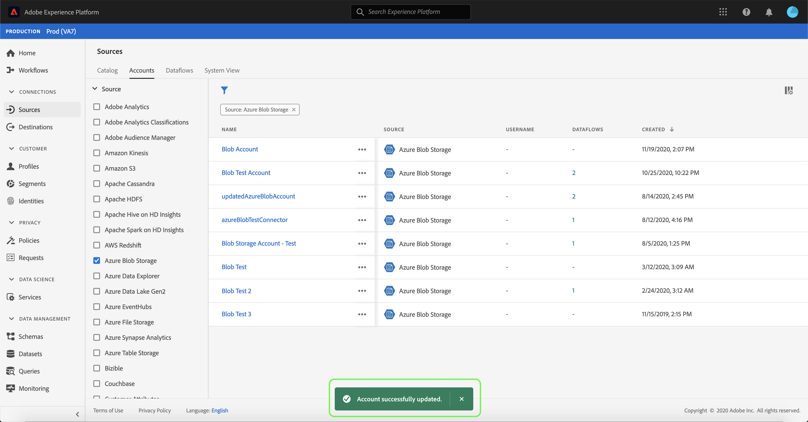

# Actualización de los detalles de la cuenta en la IU

En algunas circunstancias, puede ser necesario actualizar los detalles de una cuenta de fuentes existente. El [!UICONTROL Fuentes] workspace permite agregar, editar y eliminar detalles de una conexión de flujo continuo o por lotes existente, incluido su nombre, descripción y credenciales.

Este tutorial proporciona los pasos para actualizar los detalles y las credenciales de una cuenta existente desde el [!UICONTROL Fuentes] workspace.

## Primeros pasos

Este tutorial requiere una comprensión práctica de los siguientes componentes de Adobe Experience Platform:

- [Fuentes](../../home.md): Experience Platform permite la ingesta de datos desde varias fuentes y, al mismo tiempo, le ofrece la capacidad de estructurar, etiquetar y mejorar los datos entrantes mediante los servicios de Platform.
- [Zonas protegidas](../../../sandboxes/home.md): El Experience Platform proporciona entornos limitados virtuales que dividen una sola instancia de Platform en entornos virtuales independientes para ayudar a desarrollar y evolucionar aplicaciones de experiencia digital.

## Actualización de cuentas

Inicie sesión en [IU de Experience Platform](https://platform.adobe.com) y luego seleccione **[!UICONTROL Fuentes]** desde la navegación izquierda para acceder a [!UICONTROL Fuentes] workspace. Seleccionar **[!UICONTROL Cuentas]** en la cabecera superior para ver las cuentas existentes.

El **[!UICONTROL Cuentas]** página. En esta página hay una lista de cuentas visibles, que incluye información sobre su fuente, nombre de usuario, número de flujos de datos y fecha de creación.

Seleccione el icono de filtro  en la parte superior izquierda para iniciar el panel ordenar.

El panel de ordenación proporciona una lista de todas las fuentes. Puede seleccionar más de un origen en la lista para acceder a una selección filtrada de cuentas asociadas con diferentes orígenes.

Seleccione el origen con el que desea trabajar para ver una lista de sus cuentas existentes. Una vez identificada la cuenta que desea actualizar, seleccione los puntos suspensivos (`...`) junto al nombre de la cuenta.

Aparecerá un menú desplegable con las opciones siguientes **[!UICONTROL Añadir datos]**, **[!UICONTROL Editar detalles]**, y **[!UICONTROL Eliminar]**. Seleccionar **[!UICONTROL Editar detalles]** en el menú para actualizar su cuenta.

El **[!UICONTROL Editar detalles de la cuenta]** permite actualizar el nombre, la descripción y las credenciales de autenticación de una cuenta. Cuando haya actualizado la información deseada, seleccione **[!UICONTROL Guardar]**.

Después de unos momentos, aparece un cuadro de confirmación en la parte inferior de la pantalla para confirmar que la actualización se ha realizado correctamente.

## Pasos siguientes

Al seguir este tutorial, ha utilizado correctamente la variable [!UICONTROL Fuentes] workspace para actualizar la información de una cuenta de origen existente.

Para obtener información sobre los pasos para realizar estas operaciones mediante programación usando [!DNL Flow Service] API, consulte el tutorial sobre [actualizar la información de conexión mediante la API de Flow Service](../../tutorials/api/update.md).
