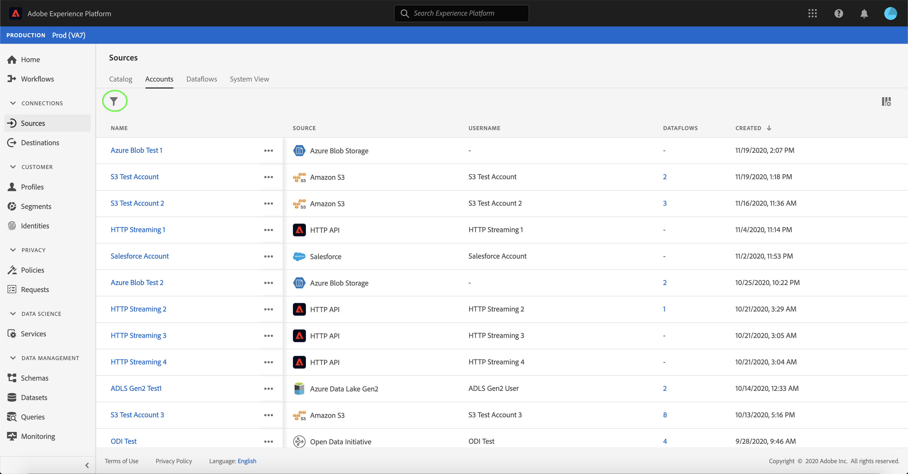

# Actualizar los detalles de la cuenta en la interfaz de usuario

En algunas circunstancias, puede ser necesario actualizar los detalles de una cuenta de fuentes existente. El espacio de trabajo [!UICONTROL Sources] le permite agregar, editar y eliminar detalles de un lote o conexión de flujo existente, incluso su nombre, descripción y credenciales.

El espacio de trabajo [!UICONTROL Sources] también le permite editar la programación de flujos de datos por lotes, lo que le permite actualizar la frecuencia de ingestión y la velocidad de intervalo.

Este tutorial proporciona pasos para actualizar los detalles y las credenciales de una cuenta existente desde el espacio de trabajo [!UICONTROL Fuentes], como así también para actualizar la programación de ingestión de un flujo de datos.

## Primeros pasos

Este tutorial requiere un conocimiento práctico de los siguientes componentes de Adobe Experience Platform:

- [Fuentes](../../home.md): El Experience Platform DNL permite la ingesta de datos desde diversas fuentes, al tiempo que le permite estructurar, etiquetar y mejorar los datos entrantes mediante los servicios de plataforma.
- [Simuladores](../../../sandboxes/home.md): DNL Experience Platform proporciona entornos limitados virtuales que dividen una sola instancia de Plataforma en entornos virtuales independientes para ayudar a desarrollar y desarrollar aplicaciones de experiencia digital.

## Actualizar cuentas

Inicie sesión en la [IU de Experience Platform](https://platform.adobe.com) y, a continuación, seleccione **[!UICONTROL Fuentes]** en el panel de navegación izquierdo para acceder al espacio de trabajo [!UICONTROL Fuentes]. Seleccione **[!UICONTROL Cuentas]** desde el encabezado superior a la vista de cuentas existentes.

Aparece la página **[!UICONTROL Cuentas]**. En esta página hay una lista de cuentas visualizables, que incluye información sobre su origen, nombre de usuario, número de flujos de datos y fecha de creación.

Seleccione el icono de filtro  en la parte superior izquierda para iniciar el panel de ordenación.

El panel Ordenar proporciona una lista de todas las fuentes. Puede seleccionar más de un origen de la lista para acceder a una selección filtrada de cuentas asociadas con diferentes orígenes.

Seleccione el origen con el que desea trabajar para ver una lista de sus cuentas existentes. Una vez identificada la cuenta que desea actualizar, seleccione los puntos suspensivos (`...`) junto al nombre de la cuenta.

Aparece un menú desplegable que le proporciona opciones para **[!UICONTROL Añadir datos]**, **[!UICONTROL Editar detalles]** y **[!UICONTROL Eliminar]**. Seleccione **[!UICONTROL Editar detalles]** en el menú para actualizar su cuenta.

El cuadro de diálogo **[!UICONTROL Editar detalles de la cuenta]** permite actualizar el nombre, la descripción y las credenciales de autenticación de una cuenta. Una vez que haya actualizado la información deseada, seleccione **[!UICONTROL Guardar]**.

Al cabo de unos minutos, aparece un cuadro de confirmación en la parte inferior de la pantalla para confirmar que la actualización se ha realizado correctamente.

## Editar programación

Puede editar la programación de ingestión de un flujo de datos desde la página **[!UICONTROL Cuentas]**. En la lista de cuentas, seleccione la cuenta que contiene el flujo de datos que desea reprogramar.

Aparece la página de flujos de datos. Esta página contiene una lista de flujos de datos existentes asociados con la cuenta seleccionada. Seleccione las elipses (`...`) junto al flujo de datos que desea reprogramar.

Aparece un menú desplegable que le proporciona opciones para **[!UICONTROL Editar programación]**, **[!UICONTROL Habilitar flujo de datos]**, **[!UICONTROL Vista en la supervisión]** y **[!UICONTROL Eliminar]**. Seleccione **[!UICONTROL Editar programación]** en el menú.

El cuadro de diálogo **[!UICONTROL Editar programación]** le ofrece opciones para actualizar la frecuencia de ingestión y la velocidad de intervalo del flujo de datos. Una vez configurados los valores de frecuencia e intervalo actualizados, seleccione **[!UICONTROL Guardar]**.

| Programación | Descripción |
| ---------- | ----------- |
| Frecuencia | Frecuencia con la que el flujo de datos recopilará datos. Los valores aceptables para la programación de frecuencia de edición para un flujo de datos existente incluyen: `minute`, `hour`, `day` o `week`. |
| Intervalo | El intervalo designa el período entre dos ejecuciones de flujo consecutivas. El valor del intervalo debe ser un entero distinto de cero y debe ser bueno o igual a `15`. |

Al cabo de unos minutos, aparece un cuadro de confirmación en la parte inferior de la pantalla para confirmar que la actualización se ha realizado correctamente.

## Pasos siguientes

Siguiendo este tutorial, ha utilizado correctamente el espacio de trabajo [!UICONTROL Fuentes] para actualizar la información de la cuenta y editar la programación de flujo de datos.

Para ver los pasos sobre cómo realizar estas operaciones mediante programación mediante la API [!DNL Flow Service], consulte el tutorial sobre [actualización de la información de conexión mediante la API de servicio de flujo](../../tutorials/api/update.md).