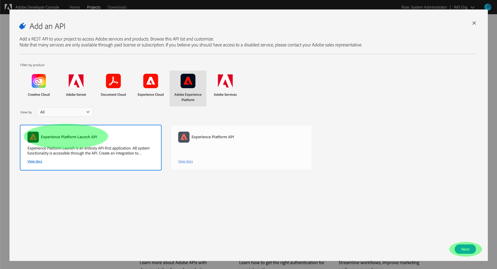

# Autenticación y acceso a la API de Reactor

Para usar la [API de Reactor](https://developer.adobe.com/experience-platform-apis/references/reactor/) para crear y administrar extensiones de etiquetas, cada solicitud debe incluir los siguientes encabezados de autenticación:

* `Authorization: Bearer {ACCESS_TOKEN}`
* `x-api-key: {API_KEY}`
* `x-gw-ims-org-id: {ORG_ID}`

Esta guía explica cómo utilizar la consola de desarrollador de Adobe para recopilar los valores de cada uno de estos encabezados y así poder empezar a realizar llamadas a la API de Reactor.

## Obtener acceso de desarrollador a Adobe Experience Platform {#gain-developer-access}

Para poder generar valores de autenticación para la API de Reactor, debe tener acceso de desarrollador a Experience Platform. Para obtener acceso de desarrollador, siga los pasos iniciales en el [tutorial de autenticación de Experience Platform](/help/landing/api-authentication.md). Una vez que haya completado el paso [Obtener acceso de usuario](/help/landing/api-authentication.md#gain-user-access), vuelva a este tutorial para generar las credenciales específicas de la API de Reactor.

## Generar credenciales de acceso {#generate-access-credentials}

Con Adobe Developer Console, debe generar las tres credenciales de acceso siguientes:

* `{ORG_ID}`
* `{API_KEY}`
* `{ACCESS_TOKEN}`

El identificador (`{ORG_ID}`) y la clave de API (`{API_KEY}`) de su organización se pueden reutilizar en futuras llamadas de API después de haberlas generado inicialmente. Sin embargo, el token de acceso (`{ACCESS_TOKEN}`) es temporal y debe regenerarse cada 24 horas.

Los pasos para generar estos valores se tratan en detalle a continuación.

### Configuración única {#one-time-setup}

Vaya a la [consola de desarrollador de Adobe](https://www.adobe.com/go/devs_console_ui) e inicie sesión con su Adobe ID. A continuación, siga los pasos descritos en el tutorial sobre la [creación de un proyecto vacío](https://developer.adobe.com/developer-console/docs/guides/projects/projects-empty/) en la documentación de la consola de desarrollador.

Una vez creado un proyecto, seleccione **Agregar API** en la pantalla **Información general del proyecto**.

Aparece la pantalla **Añadir una API**. Seleccione la **API de Experience Platform Launch** de la lista de API disponibles antes de seleccionar **Siguiente**.

A continuación, seleccione el tipo de autenticación para generar tokens de acceso y acceder a la API de Experience Platform.

>[!IMPORTANT]
>
>Seleccione el método **[!UICONTROL OAuth Server-to-Server]**, ya que este será el único método admitido a partir de ahora. El método **[!UICONTROL Service Account (JWT)]** está obsoleto. Aunque las integraciones que utilizan el método de autenticación JWT seguirán funcionando hasta el 1 de enero de 2025, Adobe recomienda migrar las integraciones existentes al nuevo método de servidor a servidor OAuth antes de esa fecha. Obtenga más información en la sección [!BADGE Obsoleto]{type=negative}[Genere un token web JSON (JWT)](/help/landing/api-authentication.md#jwt) en el tutorial de autenticación de la API de Experience Platform.

Haga clic en **Siguiente** para continuar.

La siguiente pantalla le solicita que seleccione uno o más perfiles de producto para asociarlos a la integración de API.

>[!NOTE]
>
Su organización gestiona los perfiles de producto a través de Adobe Admin Console y contiene conjuntos específicos de permisos para funciones granulares. Los perfiles de producto y sus permisos solo los pueden administrar usuarios con privilegios de administrador en su organización. Si no está seguro de qué perfiles de producto desea seleccionar para la API, póngase en contacto con su administrador.

Seleccione los perfiles de producto que desee en la lista y, a continuación, seleccione **Guardar API configurada** para completar el registro de la API.

### Recopilar credenciales {#gather-credentials}

Una vez agregada la API al proyecto, la página **[!UICONTROL API de Experience Platform]** del proyecto muestra las siguientes credenciales, que son necesarias en todas las llamadas a las API de Experience Platform:

* `{API_KEY}` ([!UICONTROL ID de cliente])
* `{ORG_ID}` ([!UICONTROL ID de organización])

### Generación de un token de acceso {#generate-access-token}

El siguiente paso es generar una credencial `{ACCESS_TOKEN}` para usarla en llamadas a la API de Experience Platform. A diferencia de los valores de `{API_KEY}` y `{ORG_ID}`, se debe generar un nuevo token cada 24 horas para seguir usando las API de Experience Platform.

>[!TIP]
>
Estos tokens expiran a las 24 horas. Si utiliza esta integración para una aplicación, es aconsejable obtener el token de portador mediante programación desde la aplicación.

Tiene dos opciones para generar los tokens de acceso, según el caso de uso:

* [Generar tokens manualmente](#manual)
* [Automatización de la generación de tokens](#auto-token)

#### Generar tokens de acceso manualmente {#manual}

Para generar manualmente un nuevo `{ACCESS_TOKEN}`, vaya a **[!UICONTROL Credenciales]** > **[!UICONTROL Servidor a servidor OAuth]** y seleccione **[!UICONTROL Generar token de acceso]**, como se muestra a continuación.

Se genera un nuevo token de acceso y se proporciona un botón para copiar el token en el portapapeles. Este valor se usa para el encabezado Autorización requerido y debe proporcionarse con el formato `Bearer {ACCESS_TOKEN}`.

#### Automatización de la generación de tokens {#auto-token}

También puede utilizar un entorno y una colección de Postman para generar tokens de acceso. Para obtener más información, lea la sección sobre [el uso de Postman para autenticar y probar las llamadas a la API](/help/landing/api-authentication.md#use-postman) en la guía de autenticación de la API de Experience Platform.

## Probar credenciales de API {#test-api-credentials}

Si sigue los pasos de este tutorial, debería tener valores válidos para `{ORG_ID}`, `{API_KEY}` y `{ACCESS_TOKEN}`. Ahora puede probar estos valores usándolos en una simple solicitud cURL a la API de Reactor.

Comience por intentar hacer una llamada API a [enumerar todas las empresas](./endpoints/companies.md#list).

>[!NOTE]
>
Es posible que no tenga ninguna empresa en su organización. En este caso, la respuesta será el estado HTTP 404 (no encontrado). Siempre que no obtenga un error 403 (prohibido), sus credenciales de acceso son válidas y funcionan.

Una vez que confirme que sus credenciales de acceso funcionan, siga explorando la documentación de referencia de otras API para conocer las muchas capacidades de la API.

## Lectura de llamadas de API de muestra {#read-sample-api-calls}

Cada guía de extremo proporciona llamadas de API de ejemplo para demostrar cómo dar formato a sus solicitudes. Estas incluyen rutas, encabezados obligatorios y cargas de solicitud con el formato correcto. También se proporciona el JSON de muestra devuelto en las respuestas de la API. Para obtener información sobre las convenciones utilizadas en la documentación de las llamadas de API de ejemplo, consulte la sección sobre [cómo leer las llamadas de API de ejemplo](../../landing/api-guide.md#sample-api) en la guía de introducción a las API de Experience Platform.

## Pasos siguientes {#next-steps}

Ahora que comprende qué encabezados utilizar, está listo para empezar a realizar llamadas a la API de Reactor. Seleccione una de las guías de extremos para empezar:

* [Documentación de referencia de la API de Reactor](https://developer.adobe.com/experience-platform-apis/references/reactor/)
* [Información general sobre la API Reactor](/help/tags/api/overview.md)
