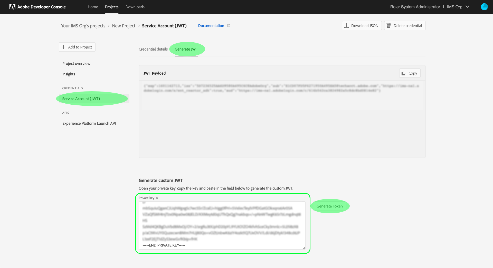

# Introducción a la API de Reactor

Para utilizar la [API de Reactor](https://www.adobe.io/experience-platform-apis/references/reactor/), cada solicitud debe incluir los siguientes encabezados de autenticación:

* `Authorization: Bearer {ACCESS_TOKEN}`
* `x-api-key: {API_KEY}`
* `x-gw-ims-org-id: {ORG_ID}`

Esta guía explica cómo utilizar la consola de desarrollador de Adobe para recopilar los valores de cada uno de estos encabezados y así poder empezar a realizar llamadas a la API de Reactor.

## Obtener acceso de desarrollador a Adobe Experience Platform

Para poder generar valores de autenticación para la API de Reactor, debe tener acceso de desarrollador a Experience Platform. Para obtener acceso de desarrollador, siga los pasos iniciales en el [tutorial de autenticación de Experience Platform](https://www.adobe.com/go/platform-api-authentication-en). Una vez que haya finalizado el paso &quot;Obtener acceso de usuario&quot;, vuelva a este tutorial para generar las credenciales específicas de la API de Reactor.

## Generar credenciales de acceso

Con Adobe Developer Console, debe generar las tres credenciales de acceso siguientes:

* `{ORG_ID}`
* `{API_KEY}`
* `{ACCESS_TOKEN}`

El ID de su organización (`{ORG_ID}`) y clave de API (`{API_KEY}`) se pueden reutilizar en futuras llamadas de API después de haberlas generado inicialmente. Sin embargo, el token de acceso (`{ACCESS_TOKEN}`) es temporal y debe regenerarse cada 24 horas.

Los pasos para generar estos valores se tratan en detalle a continuación.

### Configuración única

Vaya a la [consola de desarrollador de Adobe](https://www.adobe.com/go/devs_console_ui) e inicie sesión con su Adobe ID. A continuación, siga los pasos descritos en el tutorial sobre la [creación de un proyecto vacío](https://developer.adobe.com/developer-console/docs/guides/projects/projects-empty/) en la documentación de la consola de desarrollador.

Una vez creado un proyecto, seleccione **Agregar API** en la pantalla **Información general del proyecto**.


Aparece la pantalla **Añadir una API**. Seleccione la **API de Reactor Experience Platform** de la lista de API disponibles antes de seleccionar **Siguiente**.


En la siguiente pantalla, se le pedirá que cree una credencial de token web de JSON (JWT) que genere un nuevo par de claves o que cargue su propia clave pública. Para este tutorial, seleccione la opción **Generar un par de clabes** y luego seleccione **Generar par de claves** en la esquina inferior derecha.


La siguiente pantalla confirma que el par de claves se ha generado correctamente, y se descarga automáticamente en el equipo una carpeta comprimida que contiene un certificado público y una clave privada. Esta clave privada se requiere en un paso posterior para generar un token de acceso.

Haga clic en **Siguiente** para continuar.


La siguiente pantalla le solicita que seleccione uno o más perfiles de producto para asociarlos a la integración de API.

>[!NOTE]
>
>Su organización gestiona los perfiles de producto a través de Adobe Admin Console y contiene conjuntos específicos de permisos para funciones granulares. Los perfiles de producto y sus permisos solo los pueden administrar usuarios con privilegios de administrador en su organización. Si no está seguro de qué perfiles de producto desea seleccionar para la API, póngase en contacto con su administrador.

Seleccione los perfiles de producto que desee en la lista y, a continuación, seleccione **Guardar API configurada** para completar el registro de la API.


Una vez añadida la API al proyecto, la página del proyecto vuelve a aparecer en la página de la API de Reactor de Experience Platform. Desde aquí, desplácese hacia abajo hasta la sección **Cuenta de servicio (JWT)**, que proporciona las siguientes credenciales de acceso necesarias en todas las llamadas a la API de Reactor:

* **ID DE CLIENTE**: El ID de cliente es la `{API_KEY}` necesaria que debe proporcionarse en el encabezado de `x-api-key`.
* **ID DE ORGANIZACIÓN**: El ID de organización es el valor de `{ORG_ID}` que debe utilizarse en el encabezado de `x-gw-ims-org-id`.


### Autenticación para cada sesión

Ahora que tiene los valores `{API_KEY}` y `{ORG_ID}`, el paso final está generando un valor de `{ACCESS_TOKEN}`.

>[!NOTE]
>
>Estos tokens expiran a las 24 horas. Si utiliza esta integración para una aplicación, es aconsejable obtener el token de portador mediante programación desde la aplicación.

Tiene dos opciones para generar los tokens de acceso, según el caso de uso:

* [Generar tokens manualmente](#manual)
* [Generar tokens mediante programación](#program)

#### Generar tokens de acceso manualmente {#manual}

Abra la clave privada que descargó anteriormente en un explorador o editor de texto y copie su contenido. A continuación, vuelva a Developer Console y pegue la clave privada en la sección **Generar token de acceso** de la página de la API de Reactor para su proyecto antes de seleccionar **Generar token**.


Se genera un nuevo token de acceso y se proporciona un botón para copiar el token en el portapapeles. Este valor se utiliza para el encabezado `Authorization` requerido y debe proporcionarse con el formato `Bearer {ACCESS_TOKEN}`.


#### Generar tokens de acceso mediante programación {#program}

Si utiliza la integración de para una aplicación, puede generar tokens de acceso a través de solicitudes de API mediante programación. Para ello, debe obtener los siguientes valores:

* ID del cliente (`{API_KEY}`)
* Secreto de cliente (`{SECRET}`)
* Un token web JSON (`{JWT}`)

El ID de cliente y el secreto se pueden obtener de la página principal del proyecto, tal como se ve en el [paso anterior](#one-time-setup).


Para obtener sus credenciales de JWT, vaya a **Service Account (JWT)** en el panel de navegación izquierdo y, a continuación, seleccione la pestaña **Generar JWT**. En esta página, en **Generar JWT personalizado**, pegue el contenido de su clave privada en el cuadro de texto proporcionado y, a continuación, seleccione **Generar token**.



El JWT generado aparece a continuación una vez que ha finalizado el procesamiento, junto con un script cURL de ejemplo que puede utilizar para probar el token si lo desea. Utilice el botón **Copiar** para copiar el token en el portapapeles.


Una vez que haya recopilado sus credenciales, puede integrar la llamada de API siguiente en su aplicación para generar mediante programación tokens de acceso.

**Solicitud**

La solicitud debe enviar una carga útil `multipart/form-data`, que proporcione las credenciales de autenticación que se muestran a continuación:

```shell
curl -X POST \
  https://ims-na1.adobelogin.com/ims/exchange/jwt/ \
  -H 'Content-Type: multipart/form-data' \
  -F 'client_id={API_KEY}' \
  -F 'client_secret={SECRET}' \
  -F 'jwt_token={JWT}'
```

**Respuesta**

Una respuesta correcta devuelve un nuevo token de acceso, así como el número de segundos que quedan hasta que expira.

```json
{
  "token_type": "bearer",
  "access_token": "{ACCESS_TOKEN}",
  "expires_in": 86399999
}
```

| Propiedad | Descripción |
| :-- | :-- |
| `access_token` | El valor del token de acceso recién generado. Este valor se utiliza para el encabezado `Authorization` requerido y debe proporcionarse con el formato `Bearer {ACCESS_TOKEN}`. |
| `expires_in` | Tiempo restante hasta que caduque el token, en milisegundos. Una vez que expira un token, se debe generar uno nuevo. |

{style="table-layout:auto"}

## Pasos siguientes

Al seguir los pasos de este tutorial, debe tener valores válidos para `{ORG_ID}`, `{API_KEY}` y `{ACCESS_TOKEN}`. Ahora puede probar estos valores usándolos en una simple solicitud cURL a la API de Reactor.

Comience por intentar hacer una llamada API a [enumerar todas las empresas](./endpoints/companies.md#list).

>[!NOTE]
>
>Es posible que no tenga ninguna empresa en su organización. En este caso, la respuesta será el estado HTTP 404 (no encontrado). Siempre que no obtenga un error 403 (prohibido), sus credenciales de acceso son válidas y funcionan.

Una vez que confirme que sus credenciales de acceso funcionan, siga explorando la documentación de referencia de otras API para conocer las muchas capacidades de la API.

## Recursos adicionales

Bibliotecas JWT y SDK: [https://jwt.io/](https://jwt.io/)

Desarrollo de la API de Postman: [https://www.postman.com/](https://www.postman.com/)
