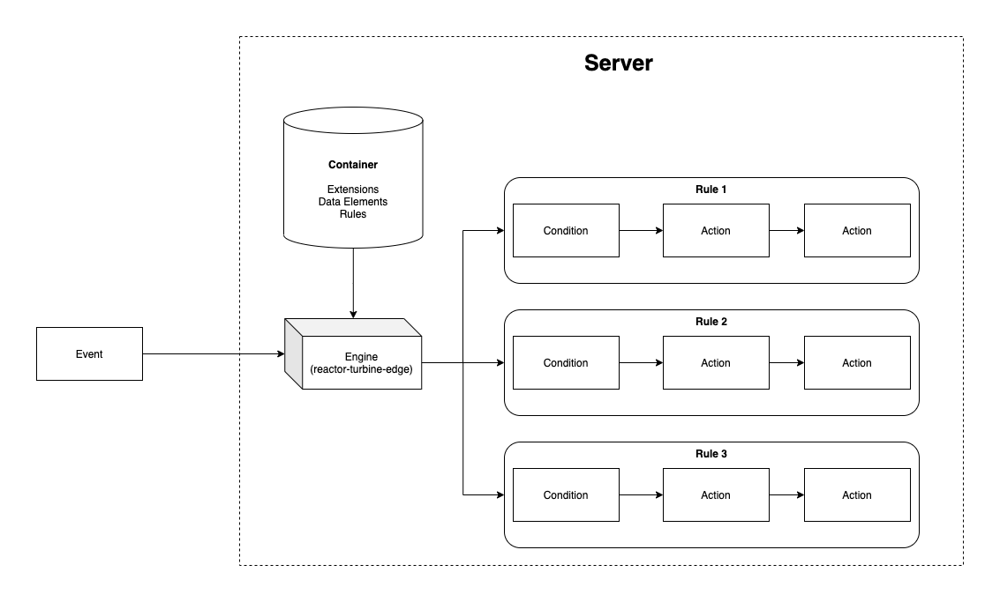

# Flujo de extensión de Edge

>[!NOTE]
>
>Adobe Experience Platform Launch se ha convertido en un grupo de tecnologías de recopilación de datos en Adobe Experience Platform. Como resultado, se han implementado varios cambios terminológicos en la documentación del producto. Consulte el siguiente [documento](../../term-updates.md) para obtener una referencia consolidada de los cambios terminológicos.

En las extensiones de Edge, cada evento, condición, acción y tipo de elemento de datos tiene una vista que permite a los usuarios modificar la configuración y un módulo de biblioteca que se puede modificar en función de la configuración definida por el usuario.

Como se muestra en el siguiente diagrama de alto nivel, la vista de tipo de evento de la extensión se mostrará dentro de un iframe en la aplicación integrada con Adobe Experience Platform. A continuación, la vista se utiliza para modificar la configuración que luego se guarda en Experience Platform. Cuando se crea la biblioteca de tiempo de ejecución de etiquetas, tanto el módulo de biblioteca de tipo de evento de la extensión como la configuración definida por el usuario se incluirán en la biblioteca que se implementa en el nodo Edge. La configuración definida por el usuario desde Experience Platform se inserta en el módulo de biblioteca durante la ejecución.

En el diagrama siguiente se puede ver el vínculo existente entre eventos, condiciones y acciones dentro del flujo de procesamiento de reglas.

El flujo de procesamiento de reglas contiene las fases siguientes:

1. Los métodos `settings` y `trigger` se proporcionan al módulo de biblioteca de evento durante el inicio.
1. Cuando el módulo de biblioteca de evento determina que se ha producido el evento, el módulo de biblioteca de evento llama a `trigger`.
1. Experience Platform pasa `settings` a los módulos de la biblioteca de tipo de condiciones de la regla en los que se evalúan las condiciones.
1. Cada tipo de condición muestra si una condición se evalúa como verdadera.
1. Si se cumplen todas las condiciones, se ejecutan las acciones de la regla.
