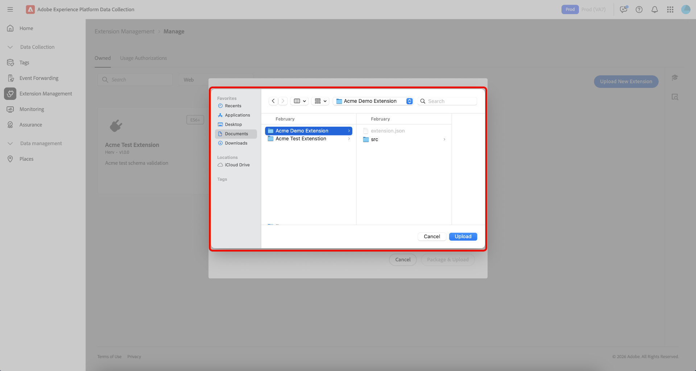
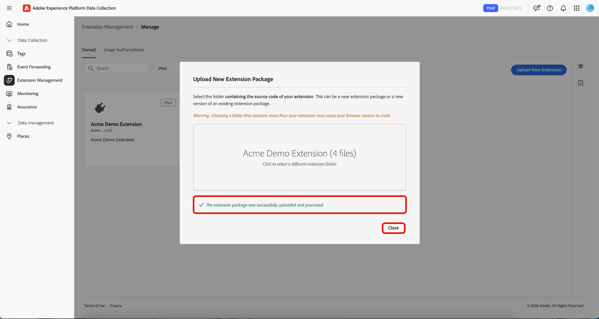

# Administración de extensiones de etiquetas

Adobe Experience Platform le permite administrar **[!UICONTROL Owned]** extensiones. Puede cargar nuevas extensiones, implementar nuevas versiones y lanzarlas a una disponibilidad pública o privada.

## Administración de una extensión  {#manage-extension}

Después de preparar el paquete de extensión localmente, use **[!UICONTROL Extension Management]** en la interfaz de usuario de recopilación de datos para cargarlo, validar el paquete y liberar versiones mediante la disponibilidad de **Desarrollo**, **Privado** y **Público**. A continuación, puede instalar la extensión en una propiedad y utilizarla para realizar pruebas.

### Carga de una extensión {#upload-extension}

Para cargar una extensión, vaya a la interfaz de usuario de recopilación de datos y seleccione **[!UICONTROL Extension Management]** en el panel de navegación izquierdo. Desde aquí, seleccione la ficha **[!UICONTROL Owned]**. Esta pestaña muestra todas las extensiones que le pertenecen a usted o a su organización. Están separadas por plataforma y puede ver qué extensiones tiene en cada plataforma (web, móvil y Edge) mediante la lista desplegable. Seleccione **[!UICONTROL Upload New Extension]**.

En la página **Cargar nueva extensión**, seleccione **[!UICONTROL Select Extension Folder]**, navegue hasta la carpeta que contenga su extensión, seleccione la carpeta y, a continuación, seleccione **[!UICONTROL Upload]**.

Confirme el número de archivos que desea cargar seleccionando **[!UICONTROL Upload]**.

Se muestra el número de archivos que se cargarán, incluido el nombre de la extensión y la versión. Tiene la opción de realizar un **[!UICONTROL Dry Run]** que descargará un archivo zip en su equipo local para su inspección. Seleccione **[!UICONTROL Validate & Upload]**.

Se muestra la confirmación de que la extensión se ha cargado y procesado correctamente junto con la **ID del paquete de extensión**. Seleccione **[!UICONTROL Close]** para regresar a la ficha **[!UICONTROL Owned]** donde se muestra la extensión.

Ha vuelto a la ficha [!UICONTROL Owned], donde se muestra la extensión cargada.

>[!IMPORTANT]
>
>Las extensiones se han cargado con disponibilidad de **Development**. Las extensiones en la disponibilidad de **Development** no se pueden compartir hasta que se publiquen con la disponibilidad de **Private**.

### Lanzamiento de una extensión {#release-extension}

Para que la extensión esté disponible de forma privada, seleccione la extensión para mostrar el panel de información a la derecha. Aquí puede ver los siguientes detalles de la extensión:

* **Versión** - Muestra la versión más reciente y el estado en el que se encuentra actualmente. Puede utilizar el menú desplegable para ver el historial de versiones de la extensión.
* **Acciones** - Permite **[!UICONTROL Upload New Version]** de la extensión y **[!UICONTROL Release To Private]**.
* **Id. de paquete de extensión** - Se muestra en la parte inferior. Esto cambiará según la versión seleccionada.

Seleccione **[!UICONTROL Release To Private]** y, a continuación, seleccione **[!UICONTROL Release To Private]** de nuevo para confirmar la versión.

La confirmación se recibe una vez que la extensión se haya publicado correctamente para que esté disponible en **Privado**. La disponibilidad actualizada se puede ver en el panel derecho.

>[!NOTE]
>
>Una vez lanzada la extensión a **Private**, está disponible para compartirse con otras organizaciones.

Para publicar la extensión con la disponibilidad **Public**, seleccione **[!UICONTROL Request Public Release]** en el panel derecho.

La pantalla de **[!UICONTROL Release Extension Package]** proporciona detalles que se requerirán en el formulario de solicitud, con una opción para copiar los detalles. Seleccione **[!UICONTROL Go To Request Form]**.

Se abre una nueva pestaña del explorador que contiene el formulario de solicitud. Copie y pegue la información de la pantalla **[!UICONTROL Release Extension Package]** en los campos relevantes. Envíe el formulario completado para su revisión. Se le notificará una vez que la extensión se haya hecho pública.

## Uso compartido de paquetes de extensiones con otras organizaciones {#share-extension}

>[!NOTE]
>
>Los paquetes de extensiones deben tener una versión que sea privada o pública para poder compartirse a través de [!UICONTROL Usage Authorizations]. Las versiones marcadas como Disponibilidad de desarrollo no pueden compartirse y no aparecerán en el menú desplegable de autorización. Esto se aplica incluso si ya se ha compartido una versión anterior (por ejemplo, 1.0.0). Las versiones más recientes (por ejemplo, 1.0.1) deben convertirse en privadas como mínimo para que las organizaciones de recepción puedan autorizarlas o instalarlas.
>
>Todas las directrices relativas al uso compartido de paquetes de extensión privados también se aplican si posteriormente decide hacer públicos estos paquetes. Las mismas consideraciones sobre visibilidad, versiones, seguridad, compatibilidad, soporte y documentación siguen siendo relevantes independientemente del estado de disponibilidad del paquete.

**[!UICONTROL Usage Authorizations]** es una característica potente que puede utilizar para compartir de forma segura paquetes de extensión privados con socios de confianza sin ponerlos a disposición del público en el catálogo de extensiones. Utilice esta función para crear un puente seguro entre organizaciones, lo que le permite aprovechar el código de extensión personalizado de cada una de ellas y, al mismo tiempo, mantener la privacidad y el control de las soluciones propietarias.

Las organizaciones suelen desarrollar extensiones especializadas adaptadas a sus necesidades empresariales únicas. Estas extensiones pueden contener lógica propia, integraciones personalizadas o configuraciones confidenciales que no deberían estar disponibles para el público. Las autorizaciones de uso resuelven este desafío habilitando:

* **Uso compartido selectivo**: Comparta extensiones privadas únicamente con organizaciones asociadas de confianza.
* **Privacidad mantenida**: mantenga el código de extensión confidencial fuera del catálogo público.
* **Desarrollo en colaboración**: permita que socios de confianza se beneficien de sus soluciones personalizadas.
* **Acceso controlado**: Mantenga un control total sobre quién puede acceder y utilizar sus extensiones privadas.

El proceso de uso compartido incluye dos participantes clave:

1. **Organización para compartir**: La organización que posee y comparte el paquete de extensión privado
2. **Organización de recepción**: La organización de confianza que obtiene acceso a la extensión compartida

Cuando se comparte una versión privada, la organización receptora obtiene acceso a esa versión específica, lo que crea una conexión directa entre las dos organizaciones. Si posteriormente se convierte en privada una versión más reciente, también estará disponible para la organización receptora sin requerir pasos adicionales por su parte.

### Creación de una autorización de uso del paquete de extensiones {#package-usage-authorization}

Para compartir una extensión, vaya a la interfaz de usuario de recopilación de datos y seleccione **[!UICONTROL Extension Management]** en el panel de navegación izquierdo. Desde aquí, seleccione la ficha **[!UICONTROL Usage Authorizations]**.

Aquí puede ver una lista de las autorizaciones compartidas existentes organizadas en dos categorías:

* **Compartido con esta organización**: Extensiones que otras organizaciones han compartido con usted.
* **Compartido con otras organizaciones**: extensiones compartidas con otras organizaciones.

Seleccione **[!UICONTROL Add Authorization]**.

![La pestaña [!UICONTROL Usage Authorizations] muestra una lista de extensiones compartidas con esta organización, destacando [!UICONTROL Add Authorization]](../images/shared-extensions/add-authorization.png)

>[!IMPORTANT]
>
>Debe obtener **`Organization ID`** de la organización de destino como propietario de la organización. No se puede buscar en las organizaciones por nombre.

Seleccione el **[!UICONTROL Platform]** para el cual desea autorizar una extensión en el menú desplegable. Puede compartir las extensiones **[!UICONTROL Web]**, **[!UICONTROL Mobile]** y **[!UICONTROL Edge]**.

A continuación, seleccione la **[!UICONTROL Extension]** que desee compartir de sus extensiones disponibles en el menú desplegable. La lista muestra las extensiones de su organización junto con su estado de disponibilidad. Las extensiones cuya última versión se encuentre disponible en **Development** no aparecerán en esta lista.

A continuación, introduzca el ID de la organización de recepción y seleccione **[!UICONTROL Save]**.

![Se ha introducido la página [!UICONTROL Create extension package usage authorization] que muestra una extensión seleccionada y el ID de organización de Adobe, destacando [!UICONTROL Save]](../images/shared-extensions/save-authorization.png)

Ha vuelto a la ficha [!UICONTROL Usage Authorizations], donde puede ver la extensión en su lista **[!UICONTROL Shared with other orgs]**. El estado mostrará **Esperando aprobación** hasta que la organización receptora apruebe la autorización, momento en el cual se actualizará a **Aprobado**.

![La ficha [!UICONTROL Usage Authorizations] muestra una lista de extensiones compartidas con otras organizaciones y resalta la nueva autorización](../images/shared-extensions/new-authorization.png)

>[!TIP]
>
>También puede compartir extensiones directamente desde **[!UICONTROL Extension Catalog]** seleccionando el menú (⋯) en la tarjeta de extensión y, a continuación, seleccione la opción de uso compartido en el menú.

Cuando hay una autorización activa, la extensión compartida muestra un distintivo ***Sharing*** en el catálogo que indica que se está compartiendo con otras organizaciones.

![La ficha [!UICONTROL Catalog] que muestra la extensión compartida con el distintivo](../images/shared-extensions/sharing-badge.png)

### Autorización y administración de extensiones compartidas {#manage-shared-extension}

>[!NOTE]
>
>Como organización de recepción, solo puede aprobar o rechazar extensiones compartidas. No puede administrar ni modificar los detalles de autorización, ya que están controlados por la organización que comparte.

Para autorizar una extensión compartida para su organización, vaya a la interfaz de usuario de recopilación de datos, seleccione **[!UICONTROL Extension Management]** en el panel de navegación izquierdo y, a continuación, seleccione la pestaña **[!UICONTROL Usage Authorizations]**.

Puede ver una lista de extensiones compartidas, incluidas las **Esperando aprobación**, en la sección **[!UICONTROL Shared with this org]**. Seleccione la extensión que desee aprobar y, a continuación, seleccione **[!UICONTROL Approve]**.

![La pestaña [!UICONTROL Usage Authorizations] muestra una lista de extensiones compartidas con esta organización con la extensión que está en espera de aprobación seleccionada, destacando [!UICONTROL Approve]](../images/shared-extensions/approve-authorization.png)

>[!NOTE]
>
>También puede rechazar una solicitud en la ficha **[!UICONTROL Usage Authorizations]** si su organización ya no requiere la extensión compartida.

Seleccione **[!UICONTROL OK]** en el cuadro de diálogo **[!UICONTROL Authorization Usages]**.

![Cuadro de diálogo [!UICONTROL Authorization Usages], destacando [!UICONTROL OK]](../images/shared-extensions/confirmation.png)

Ha vuelto a la ficha [!UICONTROL Usage Authorizations], donde puede ver que la extensión ahora muestra el estado **Aprobado**.

![La pestaña [!UICONTROL Usage Authorizations] muestra una lista de extensiones compartidas con esta organización y resalta la extensión con el estado Aprobado](../images/shared-extensions/approved-authorization.png)

Una vez aprobada la autorización, la extensión está disponible en el catálogo y se puede instalar y utilizar como cualquier otra extensión. La extensión compartida muestra un distintivo ***Receiving*** que indica que es una extensión compartida con usted por otra organización.

![La ficha [!UICONTROL Catalog] que muestra la extensión compartida con el distintivo &quot;Recibiendo&quot;](../images/shared-extensions/receiving-badge.png)

### Revocación de autorizaciones {#revoke-authorization}

Como organización propietaria, puede eliminar una autorización en cualquier momento, independientemente de su estado actual (En espera de aprobación, Rechazada o Aprobada).

**Si su extensión nunca se hizo pública:**

* Cualquier versión privada de la organización receptora ya instalada seguirá apareciendo en la lista de extensiones instaladas.
* Si la organización receptora nunca instaló la extensión, esta ya no aparecerá en ninguna parte de su interfaz.

**Si su extensión se hizo pública:**

* Cualquier versión privada que la organización receptora haya instalado permanecerá visible en su lista de extensiones instaladas.
* Si nunca instalaron su versión privada, aún verán la última versión pública en su catálogo y podrán instalarla.
* También pueden cambiar de la versión privada a la última versión pública disponible si lo desea.

Cuando revoca una autorización, la organización receptora conserva ciertos derechos para proteger sus implementaciones existentes:

* **Uso continuado**: la organización receptora puede seguir utilizando cualquier versión privada que ya haya instalado, incluso después de revocar el acceso.
* **Protección contra compilaciones**: Si la organización receptora instaló su versión privada v1.0.0 y más tarde lanza una versión privada v1.0.1, no verá la versión más reciente, pero podrá continuar compilando con v1.0.0 sin interrupciones.
* **Actualizaciones futuras**: Si posteriormente hace pública su extensión (por ejemplo, lanzando la versión 2.0.0 de forma pública), la organización receptora puede actualizar desde su versión 1.0.0 privada directamente a la nueva versión 2.0.0 pública.

>[!IMPORTANT]
>
>La revocación de la autorización no interrumpe las compilaciones o implementaciones existentes. Las organizaciones receptoras mantienen el acceso a cualquier versión privada que ya hayan instalado para garantizar la continuidad empresarial.

## Próximos pasos {#next-steps}

Este documento muestra cómo utilizar la función de extensión compartida en Experience Platform. Para obtener información sobre el desarrollo de extensiones, consulte la [guía del usuario de desarrollo de extensiones](./getting-started.md).

Para obtener información general de alto nivel sobre el desarrollo de extensiones en Experience Platform, consulte [documentación general](./overview.md).
