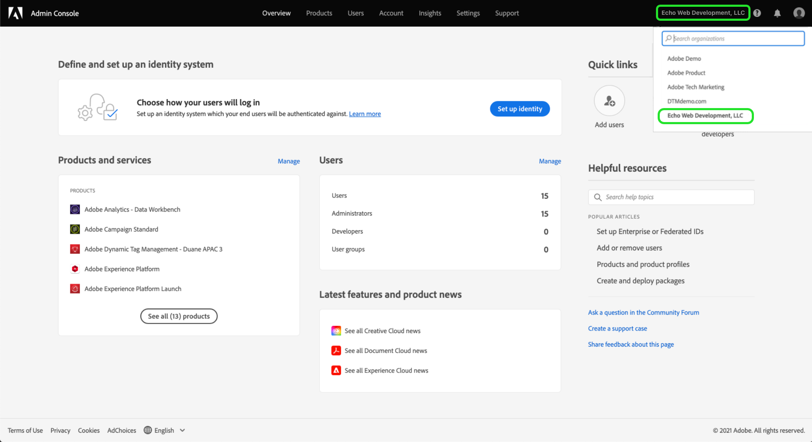

# Conceder acceso al usuario

>[!NOTE]
>
>Adobe Experience Platform Launch se ha convertido en un conjunto de tecnologías de recopilación de datos en Adobe Experience Platform. Como resultado, se han implementado varios cambios terminológicos en la documentación del producto. Consulte el siguiente [documento](../../term-updates.md) para obtener una referencia consolidada de los cambios terminológicos.

Antes de comenzar a usar su extension_package, debe configurar los integrantes de su equipo con cuentas y permisos de usuario.  Esto se hace en [Adobe Admin Console](https://adminconsole.adobe.com/).

Este documento proporciona información sobre los pasos necesarios para conceder acceso a las etiquetas en Adobe Experience Platform a través de Admin Console.

## Requisitos previos

En esta guía se da por sentado que usted es el administrador de la organización, tal como se designa en Admin Console. Si necesita información adicional sobre Admin Console y la asignación de funciones, consulte los recursos siguientes:

* [Guía del usuario de administración](https://helpx.adobe.com/es/enterprise/administering/user-guide.html?topic=/enterprise/administering/morehelp/introduction.ug.js): incluye información sobre todos los aspectos de Admin Console.
* [Funciones de administración empresarial](https://helpx.adobe.com/es/enterprise/using/admin-roles.html): incluye más información sobre las distintas funciones de administración. Para la guía que se describe a continuación, se da por sentado que es usted el administrador de la organización.

## Selección de su organización

El administrador de la organización de Adobe Experience Cloud debe iniciar sesión en [Admin Console](https://adminconsole.adobe.com/). La primera pantalla es la de información general.

Es posible que algunos tengan acceso a más de una organización (Org). Para añadir la capacidad de etiquetas a la organización correcta, seleccione el nombre de la organización que ve en la esquina superior derecha de la pantalla. A continuación, elija la organización en la que desea utilizar las etiquetas de la lista desplegable.

## Creación de un perfil de producto

Un perfil de producto es un grupo. Los derechos individuales se asignan a los perfiles de producto para que los usuarios del perfil hereden estos derechos.

Seleccione el vínculo **[!UICONTROL Productos]** en la parte superior y **[!UICONTROL Experience Cloud]** en la parte izquierda. Si no aparece la interfaz de usuario de recopilación de datos en la lista, los clientes deben ponerse en contacto con el equipo de su cuenta y los socios deben enviar un correo electrónico <ExchangeTechEC@adobe.com>.

La captura de pantalla anterior muestra un perfil de ejemplo; es posible que todavía no tenga uno. Para crear uno, seleccione **[!UICONTROL Nuevo perfil]**. En la pantalla **Crear un nuevo perfil**, simplemente añada un **Nombre de perfil** (por ejemplo, Prueba de recopilación de datos) con una **Descripción** opcional y, a continuación, seleccione **[!UICONTROL Guardar]**:

El perfil de producto ahora se ha añadido a la organización. A continuación, añada usuarios al perfil de producto.

## Asignación de usuarios al perfil de producto

Observe que el perfil de producto muestra el valor cero para los **USUARIOS CON DERECHOS** y los **ADMINISTRADORES**. Seleccione el nombre del perfil de producto que ha creado (Prueba de recopilación de datos en nuestro ejemplo).

Seleccione la pestaña **[!UICONTROL Usuarios]**. Aquí puede buscar usuarios con Adobe ID existentes por correo electrónico, o bien, añadir nuevos usuarios a este perfil de producto. Seleccione **[!UICONTROL Añadir vínculo de usuario]**.

Introduzca un nombre, un grupo de usuarios o una dirección de correo electrónico en el campo de texto correspondiente. Se recomienda incluir nombre y apellido siempre que sea posible. Seleccione **[!UICONTROL Guardar]** para añadir al usuario.

Cuando ya tenga todos los usuarios que necesite en este perfil de producto, añadiremos sus permisos. Seleccione la pestaña **[!UICONTROL Permisos]**. En la pantalla de permisos verá las opciones **[!UICONTROL Propiedades]**, **[!UICONTROL Derechos de compañía]** y **[!UICONTROL Derechos de propiedad]**. Seleccione **[!UICONTROL Editar]**.

Para crear extensiones, su equipo debe tener un mínimo de los siguientes permisos:

* “Administrar” propiedades del grupo de compañías.
* “Administrar extensiones”, “Administrar entornos” y “Desarrollo” del grupo de propiedades.

Puede crear perfiles de producto adicionales con derechos más limitados más adelante, si lo desea, pero por ahora simplemente seleccione **[!UICONTROL + Añadir todo]** para **Derechos de compañía** y **Derechos de propiedad**. Asegúrese de seleccionar **[!UICONTROL Guardar]** en cada uno.

Hasta ahora, hemos elegido la organización adecuada, hemos creado un perfil de producto, hemos añadido usuarios al perfil de producto y hemos asignado permisos.

Esto completa la configuración necesaria en Admin Console. Tanto usted como los integrantes del equipo se han configurado como usuarios y ahora pueden iniciar sesión en [la IU de recopilación de datos](https://launch.adobe.com/).

## Confirmación de aprovisionamiento

Tras otorgar a su compañía acceso a etiquetas, y una vez configurados los usuarios tal como se ha descrito anteriormente, deberá poder acceder al entorno de producción desde la [IU de recopilación de datos](https://launch.adobe.com/). Si ha sido aprovisionado etiquetas y ha completado los pasos de la Admin Console anteriores, pero aun así no puede iniciar sesión en la IU de recopilación de datos, póngase en contacto con los representantes de la asistencia de Adobe.
