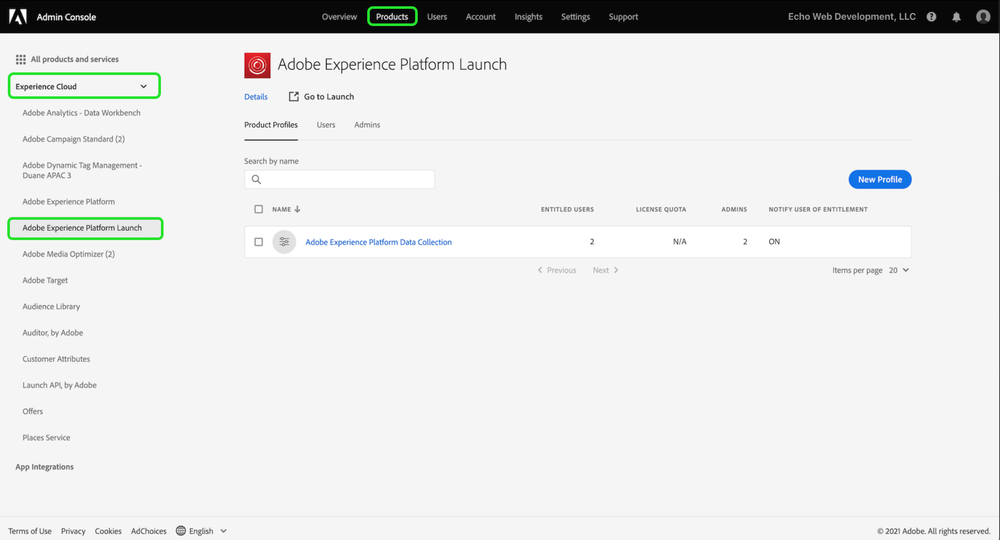
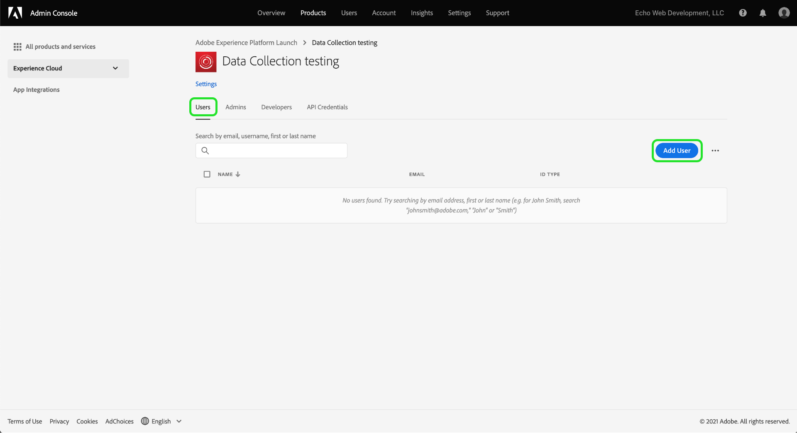

# Conceder acceso al usuario

>[!NOTE]
>
>Adobe Experience Platform Launch se ha convertido en un conjunto de tecnologías de recopilación de datos en Adobe Experience Platform. Como resultado, se han implementado varios cambios terminológicos en la documentación del producto. Consulte el siguiente [documento](../../term-updates.md) para obtener una referencia consolidada de los cambios terminológicos.

Antes de comenzar a usar su extension_package, debe configurar los integrantes de su equipo con cuentas y permisos de usuario.  Esto se hace en [Adobe Admin Console](https://adminconsole.adobe.com/).

Este documento proporciona los pasos para conceder acceso a las etiquetas en Adobe Experience Platform a través de un Admin Console.

## Requisitos previos

En esta guía se da por sentado que usted es el administrador de la organización, tal como se designa en Admin Console. Si necesita información adicional sobre Admin Console y la asignación de funciones, consulte los recursos siguientes:

* [Guía del usuario de administración](https://helpx.adobe.com/es/enterprise/administering/user-guide.html?topic=/enterprise/administering/morehelp/introduction.ug.js): incluye información sobre todos los aspectos de Admin Console.
* [Funciones de administración empresarial](https://helpx.adobe.com/es/enterprise/using/admin-roles.html): incluye más información sobre las distintas funciones de administración. Para la guía que se describe a continuación, se da por sentado que es usted el administrador de la organización.

## Elija su organización

El administrador de la organización de Adobe Experience Cloud debe iniciar sesión en [Admin Console](https://adminconsole.adobe.com/). La primera pantalla es la descripción general.

Algunos de ustedes pueden tener acceso a más de una organización (organización). Para agregar la capacidad de etiquetas a la organización correcta, seleccione el nombre de la organización que ve en la esquina superior derecha de la pantalla. A continuación, elija la organización en la que desea utilizar las etiquetas de la lista desplegable.

## Creación de un perfil de producto

Un perfil de producto es un grupo. Los derechos individuales se asignan a los perfiles de producto para que los usuarios del perfil hereden estos derechos.

Elija el enlace **[!UICONTROL Products]** en la parte superior y **[!UICONTROL Experience Cloud]** en la parte izquierda. Si no aparece la interfaz de usuario de recopilación de datos en la lista, los clientes deben ponerse en contacto con el equipo de su cuenta y los socios deben enviar un correo electrónico <ExchangeTechEC@adobe.com>.

La captura de pantalla anterior muestra un perfil de ejemplo; es posible que todavía no tenga uno. Para crear uno, seleccione **[!UICONTROL Nuevo perfil]**. En la pantalla **Crear un nuevo perfil**, simplemente agregue un **Nombre de perfil** (Prueba de recopilación de datos, por ejemplo) y una **Descripción** opcional y, a continuación, seleccione **[!UICONTROL Guardar]**:

El perfil de producto ahora se ha agregado a la organización. A continuación, agregue usuarios al perfil de producto.

## Asignar usuarios al perfil del producto

Observe que el perfil de producto muestra cero para **USUARIOS CON DERECHO** y **ADMINS**. Seleccione el nombre del perfil de producto que ha creado (prueba de recopilación de datos en nuestro ejemplo).

Seleccione la pestaña **[!UICONTROL Users]**. Aquí puede buscar usuarios de Adobe ID existentes por correo electrónico o agregar nuevos usuarios a este perfil de producto. Seleccione **[!UICONTROL Agregar vínculo de usuario]**.

Introduzca un nombre, un grupo de usuarios o una dirección de correo electrónico en el campo de texto correspondiente. Se recomienda incluir un nombre y un apellido siempre que sea posible. Seleccione **[!UICONTROL Guardar]** para agregar el usuario.

Cuando tenga todos los usuarios que necesite en este perfil de productos, agregaremos permisos para ellos. Seleccione la pestaña **[!UICONTROL Permissions]**. En la pantalla de permisos, verá **[!UICONTROL Propiedades]**, **[!UICONTROL Derechos de la empresa]** y **[!UICONTROL Derechos de propiedad]**. Seleccione **[!UICONTROL Editar]**.

Para crear extensiones, su equipo debe tener un mínimo de los siguientes permisos:

* &quot;Administrar propiedades&quot; del grupo de empresas.
* &quot;Administrar extensiones&quot;, &quot;Administrar entornos&quot; y &quot;Desarrollo&quot; del grupo de propiedades.

Puede crear perfiles de producto adicionales con derechos más limitados más adelante, si lo desea, pero por ahora simplemente seleccione **[!UICONTROL + Agregar todo]** para **Derechos de compañía** y **Derechos de propiedad**. Asegúrese de seleccionar **[!UICONTROL Save]** en cada uno.

Hasta ahora, hemos elegido la organización adecuada, hemos creado un perfil de producto, hemos agregado usuarios al perfil de producto y hemos asignado permisos.

Esto completa la configuración necesaria en Admin Console. Tanto usted como los integrantes del equipo que han sido configurados como usuarios ahora pueden iniciar sesión en [la interfaz de usuario de recopilación de datos](https://launch.adobe.com/).

## Confirmar aprovisionamiento

Una vez que su empresa esté aprovisionada con acceso a las etiquetas y los usuarios estén configurados tal como se ha descrito anteriormente, debe poder acceder al entorno de producción desde la [interfaz de usuario de recopilación de datos](https://launch.adobe.com/). Si ha sido aprovisionado para etiquetas y ha completado los pasos del Admin Console anteriores, pero aún así no puede iniciar sesión en la interfaz de usuario de recopilación de datos, póngase en contacto con los representantes de asistencia de su Adobe.
