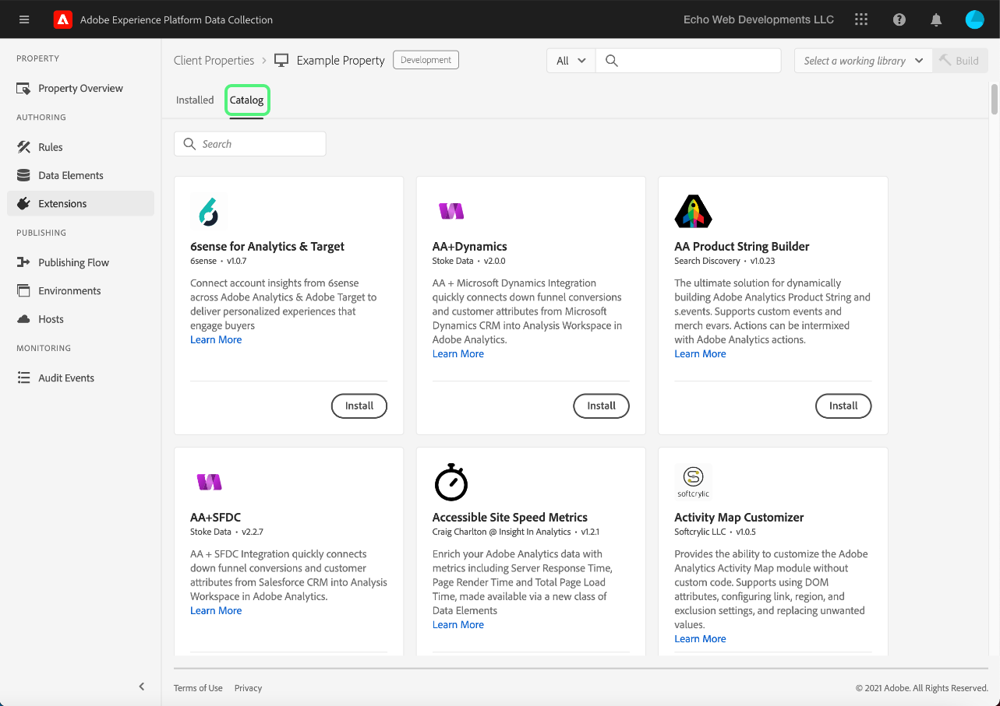
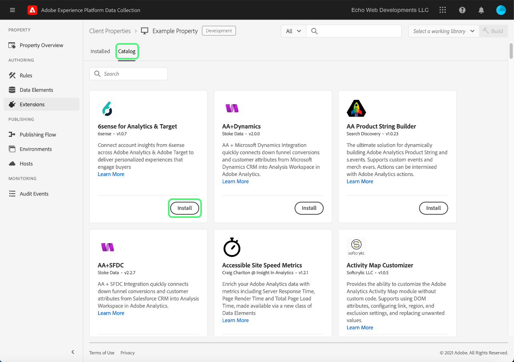
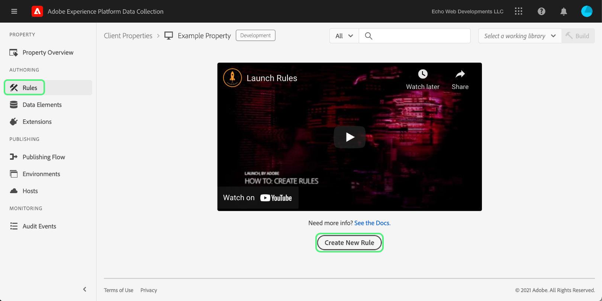
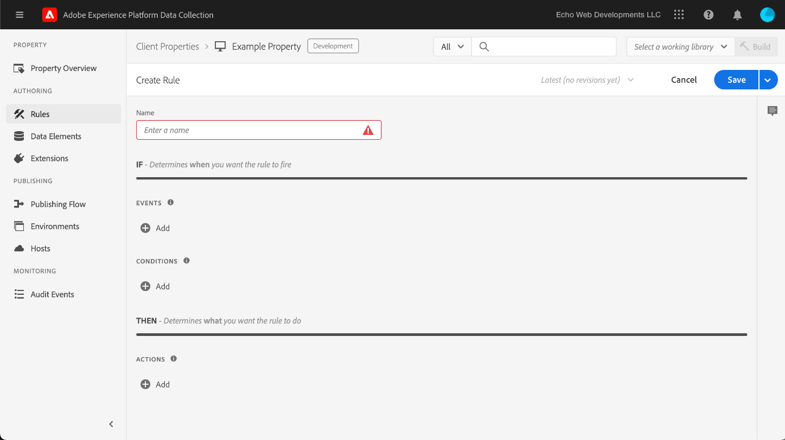
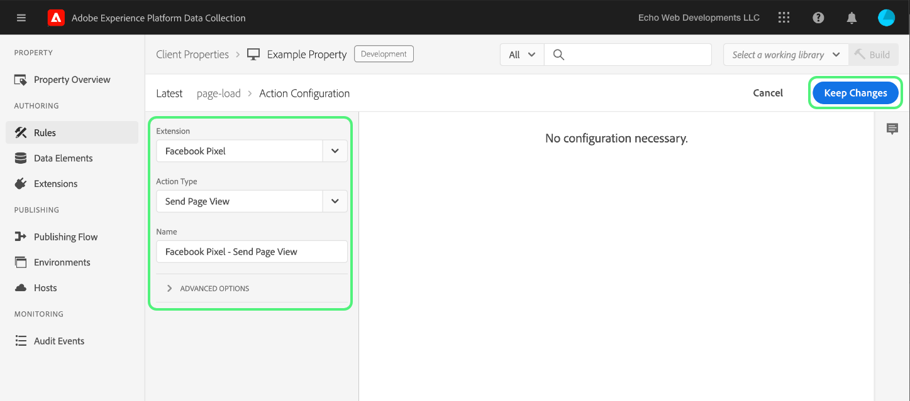

# Carga e implementación de pruebas de extremo a extremo

>[!NOTE]
>
>Adobe Experience Platform Launch se ha convertido en un conjunto de tecnologías de recopilación de datos en Adobe Experience Platform. Como resultado, se han implementado varios cambios terminológicos en la documentación del producto. Consulte el siguiente [documento](../../term-updates.md) para obtener una referencia consolidada de los cambios terminológicos.

Para probar las extensiones de etiquetas en Adobe Experience Platform, utilice la API de etiquetas o las herramientas de línea de comandos para cargar los paquetes de extensiones. A continuación, utilice la IU de recopilación de datos para instalar el paquete de extensión en una propiedad y usar sus funcionalidades dentro de una biblioteca de etiquetas y compilarlo.

Este documento explica cómo implementar pruebas de extremo a extremo para la extensión.

>[!NOTE]
>
>Esta guía presupone que está utilizando macOS con Node.js y npm instalados y disponibles.

## Validación de la extensión {#validate}

Una vez que su equipo esté satisfecho con el rendimiento de su extensión y los resultados que ven en la herramienta de [entorno de pruebas](https://www.npmjs.com/package/@adobe/reactor-sandbox#running-the-sandbox), debe estar preparado para cargar el paquete de extensión en las etiquetas.

Antes de cargar, compruebe que estén presentes los campos o la configuración requeridos. Por ejemplo, revisar el [manifiesto de extensión](../manifest.md), la [configuración de extensión](../configuration.md), las [vistas](../web/views.md) y los [módulos de biblioteca](../web/format.md) (como mínimo) sería una práctica recomendada.

Un ejemplo específico es el archivo de logotipo: añada una línea `"iconPath": "example.svg",` al archivo `extension.json` e incluya ese archivo de imagen de logotipo en el proyecto. Esta es la ruta relativa al icono que se mostrará para la extensión. No debería comenzar con una barra oblicua. Debe hacer referencia a un archivo SVG con una extensión `.svg`. El SVG debería aparecer como aparece normalmente cuando se renderiza como cuadrado y la interfaz de usuario lo escala. Consulte el [artículo Cómo escalar SVG](https://css-tricks.com/scale-svg/) para obtener más detalles.

>[!NOTE]
>
>En el caso de las extensiones públicas, incluya un elemento en su `extension.json` con un vínculo a su listado de Exchange. El [manifiesto de extensión](../manifest.md) debe incluir una entrada como esta: `"exchangeUrl":"https://www.adobeexchange.com/experiencecloud.details.12345.html"` que apunte a la dirección URL de su listado de Exchange.

## Creación de una integración de Adobe I/O {#integration}

Para utilizar la API o las herramientas de línea de comandos, necesita una cuenta técnica de Adobe I/O. Debe crearla en la consola de I/O y, a continuación, utilizar la herramienta Cargador para subir el paquete de extensión.

Para obtener información sobre cómo crear una cuenta técnica para utilizarla con Adobe Experience Platform, consulte la guía [Tokens de acceso](https://developer.adobelaunch.com/api/guides/access_tokens/).

>[!IMPORTANT]
>
>Para crear una integración en Adobe I/O, debe ser administrador de organización de Experience Cloud o desarrollador de organización de Experience Cloud.

Si no puede crear una integración, es probable que no tenga los permisos correctos. Esto requerirá que un administrador de organización complete los pasos por usted o que le asigne como desarrollador.

## Carga del paquete de extensión {#upload}

Ahora que tiene credenciales, está listo para probar el paquete de extensión de principio a fin.

Cuando carga el paquete de extensión por primera vez, pasa a un estado de `development`. Esto significa que solo es visible para su propia organización y solo con una propiedad que se haya marcado para el desarrollo de extensiones.

Utilice la línea de comandos para ejecutar el siguiente comando dentro del directorio que contiene su paquete .zip.

```bash
npx @adobe/reactor-uploader
```

`npx` le permite descargar y ejecutar un paquete npm sin instalarlo realmente en su equipo. Es la forma más sencilla de ejecutar el Uploader.

El Cargador le pedirá que introduzca varios datos. El ID de cuenta técnica, la clave de API y otros datos se pueden recuperar de la consola de Adobe I/O. Vaya a la [página Integraciones](https://console.adobe.io/integrations) en la consola de I/O. Seleccione la organización correcta en el menú desplegable, busque la integración correcta y seleccione **[!UICONTROL Ver]**.

- ¿Cuál es la ruta a la clave privada? /path/to/private.key. Este es el lugar donde guardó la clave privada en el paso 2 anterior.
- ¿Cuál es su ID de organización? Copie y pegue esto desde la página de información general de la consola de I/O que dejó abierta anteriormente.
- ¿Cuál es su ID de cuenta técnica? Copie y pegue esto desde la consola de I/O.
- ¿Cuál es su clave de API? Copie y pegue esto desde la consola de I/O.
- ¿Qué es el secreto del cliente? Copie y pegue esto desde la consola de I/O.
- ¿Cuál es la ruta al extension_package que desea cargar? /path/to/extension_package.zip. Si invoca el cargador desde el directorio que contiene el paquete .zip, solo puede seleccionarlo en la lista en lugar de escribir la ruta.

El paquete de extensión se cargará y el cargador le proporcionará el ID del extension_package.

>[!NOTE]
>
>Al cargar o aplicar parches, los paquetes de extensión se colocan en un estado pendiente mientras el sistema extrae el paquete y lo implementa de forma asíncrona. Mientras se lleva a cabo este proceso, puede sondear el ID del `extension_package` para su estado mediante la API y dentro de la IU de recopilación de datos. Verá una tarjeta de extensión en el catálogo marcado como Pendiente.

>[!NOTE]
>
>Si tiene pensado ejecutar el cargador con frecuencia, poner toda esta información cada vez que lo haga puede ser un lastre. También puede pasarla como argumento desde la línea de comandos. Consulte la sección [Command Line Arguments (argumentos de la línea de comandos)](https://www.npmjs.com/package/@adobe/reactor-uploader#command-line-arguments) de los documentos de NPM para obtener más información.

## Creación de una propiedad de desarrollo {#property}

Después de iniciar sesión en la IU de recopilación de datos, se muestra la pantalla Propiedades. Una propiedad es un contenedor para las etiquetas que desea implementar y se puede utilizar en uno o varios sitios.


La primera vez que inicie sesión no verá ninguna propiedad en la pantalla. Seleccione **Nueva propiedad** para crear una. Escriba un nombre y una dirección URL. Utilice la dirección URL del sitio de prueba o la página donde probará la extensión. Este campo de dominio lo pueden usar algunas extensiones o una condición que utilice la extensión Core.

>[!NOTE]
>
>`localhost` no funcionará como un valor de URL. En su lugar, utilice cualquier valor de prueba si utiliza una dirección URL `localhost`. Por ejemplo, ejemplo.com.

Para utilizar esta propiedad como prueba de desarrollo de extensiones, también debe expandir **OPCIONES AVANZADAS** y asegurarse de marcar la casilla **Configurar para desarrollo de extensiones**.


Seleccione **Guardar** en la parte inferior para guardar la nueva propiedad.

Aparecerá la pantalla Propiedades. Seleccione el nombre de la propiedad que acaba de crear. Aparece la pantalla Información general de la propiedad. Proporciona vínculos a cada área del sistema con los vínculos de navegación global en la columna de la izquierda.

## Instalación de la extensión {#install-extension}

Para instalar la extensión en esta propiedad, seleccione **Extensiones** en los vínculos de navegación principales de la columna izquierda. La extensión **Core** se muestra en la pantalla **Instaladas**. La extensión Core contiene toda la funcionalidad de administración de etiquetas en la recopilación de datos.


Para añadir la extensión, seleccione la pestaña **Catálogo**



El catálogo muestra los iconos de tarjeta de cada extensión disponible. Si la extensión no se muestra en el catálogo, asegúrese de completar los pasos anteriores en las secciones Configuración de la Consola de administración de Adobe y Creación del paquete de extensión. El paquete de extensión también puede aparecer como Pendiente si Platform no ha completado el procesamiento inicial.

Si ha seguido los pasos anteriores y aún no ve un paquete de extensión Pendiente o Fallido en el catálogo, debe comprobar su estado directamente mediante la API. Para obtener información sobre cómo realizar la llamada de API adecuada, lea [Buscar un ExtensionPackage](https://developer.adobelaunch.com/api/reference/1.0/extension_packages/fetch/) en la documentación de la API.

Una vez que el paquete de extensión haya terminado de procesarse, seleccione **Instalar** en la parte inferior de la tarjeta.



Se abre la pantalla de configuración (siempre que la extensión tenga una). Añada la información necesaria para configurar la extensión y seleccione **Guardar** en la parte inferior. El ejemplo de pantalla de configuración que se ve aquí utiliza la extensión de Facebook, que requiere un ID de píxel.


Ahora debería ver la pantalla **Extensiones instaladas** con la extensión Core y la extensión.


## Creación de recursos para probar la extensión {#resources}

Las extensiones proporcionan nuevas funcionalidades a los usuarios de Adobe Experience Platform. Normalmente se muestran en Elementos de datos o en el Generador de reglas.

### Elementos de datos

El propósito de los elementos de datos de etiquetas es ayudar a los usuarios a mantener los valores. Cada elemento de datos es una asignación o un indicador a los datos de origen. Un solo elemento de datos es una variable cuyo valor puede asignarse a cadenas de consulta, direcciones URL, valores de cookies, variables JavaScript, etc. Seleccione **Elementos de datos** en la barra de navegación izquierda y **Crear nuevo elemento de datos**.


Las extensiones pueden definir tipos de elementos de datos si es necesario para que funcione la extensión o simplemente por comodidad para los usuarios. Cuando una extensión proporciona tipos de elementos de datos, aparecen en una lista desplegable para los usuarios en la pantalla **Crear nuevo elemento de datos**:


Cuando un usuario selecciona la extensión desde el menú desplegable **Extensión**, la lista desplegable **Tipo de elemento de datos** se rellena con cualquier tipo de elemento de datos que proporciona la extensión. A continuación, el usuario puede asignar cada elemento de datos a su valor de origen. Los elementos de datos se pueden utilizar cuando se generan reglas en el Evento de cambio de elemento de datos o en el Evento de código personalizado para activar una regla que se va a ejecutar. También se puede utilizar un elemento de datos en la condición de elemento de datos u otras condiciones, excepciones o acciones de una regla.

Una vez creado el elemento de datos (con la asignación configurada), los usuarios pueden hacer referencia a los datos de origen simplemente haciendo referencia al elemento de datos. Si el origen del valor cambia alguna vez (rediseños del sitio, etc.) los usuarios solo deberán actualizar la asignación una vez en la IU de recopilación de datos y todos los elementos de datos recibirán automáticamente el nuevo valor de origen.

### Reglas

Seleccione el vínculo **Reglas** en las opciones de navegación de la izquierda y, a continuación, **Crear nueva regla**.



En primer lugar, escriba un nombre descriptivo para la regla. La pantalla **Crear regla** está configurada como una declaración `if-then`.



Si se produce un evento, las condiciones pasan y no hay excepciones, la acción se activa. Este mismo flujo existe en extensiones donde puede crear o aprovechar eventos, condiciones, excepciones, elementos de datos o acciones.

Con el ejemplo de la extensión de Facebook, añada un evento cada vez que se cargue una página en el sitio de prueba.


El `Window Loaded` **Tipo de evento** garantiza que esta regla se active cada vez que una página se cargue en el sitio de prueba. Seleccione **Conservar cambios**. Para este ejemplo, ignore **Conditions**, ya que la regla debe activarse para cualquier página del sitio de prueba.

En **ACCIONES**, seleccione **Añadir**. Aparecerá la pantalla **Configuración de acción**. A continuación, debe elegir la extensión a la que se aplicará la regla y la acción que se producirá cuando se active la regla. Seleccione **Píxel de Facebook** en la lista desplegable **Extensión** y **Enviar vista de páginas** en la lista desplegable **Tipo de acción**. Seleccione **Conservar cambios** y luego **Guardar** en la siguiente pantalla **Editar regla**.



Al probar la extensión, seleccione cualquier evento, condición, etc. relevantes. que proporcione la extensión en cualquier número de reglas.

## Publicación de los cambios {#publish}

En la navegación principal, seleccione **Publicación** y, a continuación, seleccione el vínculo **Añadir nueva biblioteca**:


Una biblioteca es un conjunto de instrucciones que indican cómo interactúan las extensiones, los elementos de datos y las reglas entre sí y con el sitio web. Las bibliotecas se compilan en compilaciones. Una biblioteca puede contener tantos cambios como desee aplicar o probar a la vez.

En la pantalla **Crear biblioteca**, añada un nombre en el campo de texto **Nombre**. Las etiquetas proporcionan un entorno de desarrollo predeterminado denominado **Desarrollo**. Seleccione **Desarrollo** en la lista desplegable **Entorno**. Para simplificar, añada todos los recursos disponibles. Seleccione **Añadir todos los recursos modificados** y, a continuación, seleccione **Guardar**.

>[!NOTE]
>
>Cuando se añade un recurso a una biblioteca, se toma una instantánea de dicho recurso en ese momento exacto y se añade a la biblioteca. Cuando realice cambios en los recursos más adelante (por ejemplo, como resultado de las correcciones que necesita), también deberá actualizar la biblioteca para incluir los cambios más recientes en los recursos. El botón **Añadir todos los recursos cambiados** también es útil para este propósito.


Ahora que todos los cambios se han incluido en la biblioteca recién creada (denominada **dev** en el ejemplo proporcionado), seleccione **Guardar y crear en desarrollo**.


Una vez completado el proceso de compilación, verá el indicador de **éxito** verde junto al nombre de la biblioteca.


La biblioteca de etiquetas ya está publicada y disponible para su uso. La página de prueba debe utilizar la biblioteca recién creada con el fin de probar el comportamiento de la página para el usuario final en un explorador.

## Instalación de etiquetas en un sitio de prueba {#install-data-collection-tags}

Las instrucciones de instalación están disponibles en la pestaña Entornos. Esta página muestra todos los entornos disponibles y también le permite crear más. Cuando la biblioteca se haya publicado en el entorno de desarrollo, seleccione el icono de cuadro en la columna **INSTALAR** de la fila **Desarrollo**.


La variable **Instrucciones de instalación en la web** para el entorno de desarrollo. Seleccione el icono de copiar para copiar toda la etiqueta `<script>`.


La instalación se completa colocando esta etiqueta única `<script>` dentro de la sección `<head>` del documento o la plantilla del sitio. A continuación, visite el sitio de prueba para examinar el comportamiento de la biblioteca de etiquetas publicada.

## Prueba {#test}

A continuación se muestra una lista de comandos de consola útiles para validar la extensión en la página o el sitio de prueba.

- `_satellite.setDebug(true);` habilitará el modo de depuración y emitirá instrucciones de registro útiles a la consola.
- El objeto `_satellite._container` contiene toda clase de información útil acerca de la biblioteca implementada, incluidos detalles sobre la versión, los elementos de datos, las reglas y las extensiones incluidas.

El objetivo de esta prueba es comprobar la funcionalidad de la biblioteca implementada y garantizar que el paquete de extensión se comporta como se espera después de que se haya compilado en una biblioteca.

Cuando descubre cambios que deben realizarse en el paquete de extensión, el proceso de iteración es similar al proceso de desarrollo.

1. Modifique el código del proyecto..
1. Valide los cambios con la herramienta de entorno de pruebas.
1. Utilice la herramienta Packager para crear un nuevo paquete .zip
1. Utilice la herramienta Cargador para subir el nuevo paquete .zip. El proceso sigue las mismas instrucciones que antes con respecto a la carga inicial. Sin embargo, observará que, como ya hay un paquete de extensión con ese nombre en el modo de desarrollo, el nuevo sobrescribirá la versión anterior en lugar de crear otra.

   >[!NOTE]
   >
   >Los argumentos se pueden pasar en la línea de comandos para ahorrar tiempo, al evitarse la introducción repetida de credenciales. Para obtener más información al respecto, lea la [documentación del cargador de Reactor](https://www.npmjs.com/package/@adobe/reactor-uploader).
1. El paso de instalación se puede omitir al actualizar un paquete existente.
1. Modificar recursos: recursos si se ha cambiado la configuración de cualquiera de los componentes de la extensión, deberá actualizar esos recursos en la IU de recopilación de datos.
1. Añada los cambios más recientes en la biblioteca y vuelva a compilar.
1. Complete otra ronda de pruebas.
