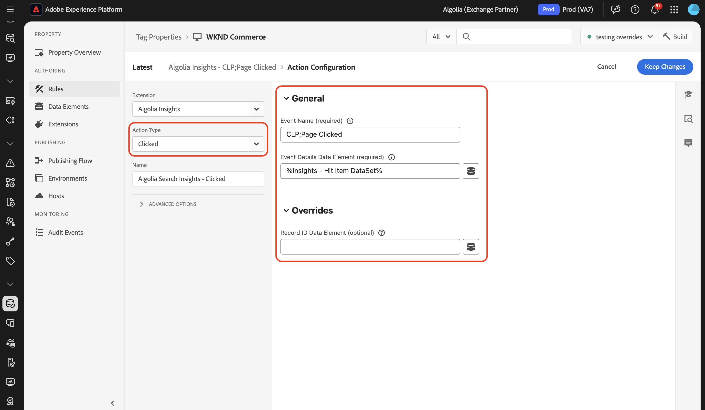

# Información general sobre la extensión de etiquetas [!DNL Algolia]

La extensión de etiquetas [!DNL Algolia] permite a los especialistas en marketing configurar fácilmente reglas que envían datos de interacción del usuario a [!DNL Algolia], lo que permite ofrecer experiencias de búsqueda y descubrimiento de IA más personalizadas.

Esta extensión cuenta con una función clave:

* **[!DNL Algolia]datos**: captura y envía automáticamente eventos de interacción del usuario a [!DNL Algolia], lo que permite análisis eficaces, experiencias personalizadas y una relevancia de búsqueda mejorada.

## Requisitos previos {#prerequisites}

Debe tener una cuenta de [!DNL Algolia] válida para utilizar esta extensión. Vaya a la [[!DNL Algolia] página de registro](https://dashboard.algolia.com/users/sign_up) para crear una cuenta si todavía no la tiene.

### Recopilar detalles de configuración necesarios {#configuration-details}

Para conectar [!DNL Algolia] con Adobe Experience Platform, necesitará la siguiente información:

| Credencial | Descripción | Ejemplo |
| --- | --- | --- |
| ID de aplicación | Su ID de aplicación se encuentra en la sección [Claves de API](https://www.algolia.com/account/api-keys/all) de su panel de [!DNL Algolia]. | 0ABCDEFG12 |
| Clave API de búsqueda | Su clave de API de búsqueda se encuentra en la sección [Claves de API](https://www.algolia.com/account/api-keys/all) del panel de [!DNL Algolia]. | 1234a12345678901b1234567890c1ab1 |

## Instalar y configurar la extensión [!DNL Algolia] Insights {#install-configure}

Para instalar la extensión [!DNL Algolia] Insights, vaya a [!UICONTROL Data Collection UI] y seleccione **[!UICONTROL Tags]** en el panel de navegación izquierdo. Aquí, seleccione una propiedad a la que añadir la extensión o cree una nueva propiedad.

Una vez que haya seleccionado o creado la propiedad deseada, seleccione **[!UICONTROL Extensions]** en el panel de navegación izquierdo y, a continuación, seleccione la pestaña **[!UICONTROL Catalog]**. Busque la tarjeta [!DNL Algolia] datos y, a continuación, seleccione **[!UICONTROL Install]**.


En la vista de configuración que aparece, debe proporcionar los siguientes detalles:

| Propiedad | Descripción |
| --- | --- |
| [!UICONTROL Application ID] | Escriba el [!UICONTROL Application Id] que recopiló anteriormente en la sección [detalles de configuración](#configuration-details). |
| [!UICONTROL Search API Key] | Escriba el [!UICONTROL Search API Key] que recopiló anteriormente en la sección [detalles de configuración](#configuration-details). |
| [!UICONTROL Index Name] | [!UICONTROL Index Name] contiene los productos o el contenido.  Este índice se utilizará como predeterminado. |
| [!UICONTROL User Token Data Element] | El elemento de datos que devolverá el token de usuario. |
| [!UICONTROL Authenticated User Token Data Element] | Establezca el elemento de datos que devolverá el token de usuario autenticado. |
| [!UICONTROL Currency Code] | Introduzca el código de divisa en formato ISO-4217, como USD o EUR. Este campo admite elementos de datos. |


## [!DNL Algolia] tipos de acciones de extensión de Insights {#action-types}

[!DNL Algolia] admite un conjunto de eventos estándar predefinidos, cada uno con contextos y propiedades específicos. Las acciones disponibles en la extensión [!DNL Algolia] se alinean con estos tipos de eventos, lo que facilita la categorización y configuración de los eventos que envía a [!DNL Algolia] según su tipo.

### Cargar perspectivas {#load-insights}

>[!NOTE]
>
>En la mayoría de los casos, se recomienda cargar [!DNL Algolia] Insights en todas las páginas del sitio.

Agregue la acción **[!UICONTROL Load Insights]** a la regla de etiqueta siempre que tenga más sentido cargar [!DNL Algolia] información en función del contexto de la regla. Esta acción carga la biblioteca `search-insights.js` en la página.

Cree una nueva regla de etiqueta o abra una existente. Defina las condiciones según sus necesidades, luego seleccione **[!UICONTROL Algolia]** como [!UICONTROL Extension] y seleccione **[!UICONTROL Load Insights]** como [!UICONTROL Action Type].

| Propiedad | Descripción |
| --- | --- |
| [!UICONTROL Insight Library Version] | La versión de [!DNL Algolia] Insights. El valor predeterminado es `2.17.3`. |
| [!UICONTROL User Opt Out Data Element] | Elemento de datos que captura la preferencia de seguimiento del usuario. |
| [!UICONTROL Use User Token Cookie] | Marque esta casilla para permitir que [!DNL Algolia] genere una cookie de token de usuario. De manera predeterminada, esta opción está establecida en `true`. |


### Clic {#clicked}

Agregue la acción **[!UICONTROL Click]** a la regla de etiqueta para enviar los eventos en los que se hizo clic a [!DNL Algolia]. Cree una nueva regla de etiqueta o abra una existente. Defina las condiciones según sus necesidades, luego seleccione **[!UICONTROL Algolia]** como [!UICONTROL Extension] y seleccione **[!UICONTROL Clicked]** como [!UICONTROL Action Type].

| Propiedad | Descripción |
| --- | --- |
| [!UICONTROL Event Name] | El Nombre del evento que se puede utilizar para restringir aún más este evento de clic. |
| [!UICONTROL Event Details Data Element] | El elemento de datos devuelve detalles del evento en formato JSON, que incluyen: <ul><li>`indexName`</li><li>`objectIDs`</li><li>`queryID` (opcional)</li><li>`positions` (opcional)</li><li>`price` (opcional)</li><li>`quantity` (opcional)</li><li>`discount` (opcional)</li><li>`objectData` (opcional)</li><li>`currency` (opcional)</li></ul> |


>[!NOTE]
>
>Si se incluyen `queryID` y `positions`, el evento se clasifica como **ID de objeto en los que se hizo clic después de la búsqueda**. De lo contrario, se clasifica como un evento **ID de objeto en el que se hizo clic**.
><br>
>Si el elemento de datos no proporciona `indexName`, se usará el **Nombre de índice predeterminado** cuando se envíe el evento.



Para obtener más información sobre las categorías de eventos, consulte [ID de objetos en los que se hizo clic después de buscar](https://www.algolia.com/doc/api-reference/api-methods/clicked-object-ids-after-search/)
y guías de [ID de objetos en los que se hizo clic](https://www.algolia.com/doc/api-reference/api-methods/clicked-object-ids/).

### Convertido {#converted}

Agregue la acción **[!UICONTROL Converted]** a la regla de etiqueta para enviar eventos convertidos a [!DNL Algolia]. Cree una nueva regla de etiqueta o abra una existente. Defina las condiciones según sus necesidades, luego seleccione **[!UICONTROL Algolia]** como [!UICONTROL Extension] y seleccione **[!UICONTROL Converted]** como [!UICONTROL Action Type].

| Propiedad | Descripción |
| --- | --- |
| [!UICONTROL Event Name] | Nombre del evento que se utilizará para restringir aún más este evento **convert**. |
| [!UICONTROL Event Details Data Element] | El elemento de datos devuelve detalles del evento, que incluyen: <ul><li>`indexName`</li><li>`objectIDs`</li><li>`queryID` (opcional)</li><li>`recordID` (opcional)</li></ul> |

>[!NOTE]
>
>Si el elemento de datos contiene `queryId`, el evento se clasifica como **Convertido después de la búsqueda**. De lo contrario, se clasificará como un evento **Converted**.
><br>
>Si el elemento de datos no proporciona `indexName`, se usará el **Nombre de índice predeterminado** cuando se envíe el evento.


Para obtener más información sobre las categorías de eventos, consulte las guías [ID de objeto convertidos después de la búsqueda](https://www.algolia.com/doc/api-reference/api-methods/converted-object-ids-after-search/) y [ID de objeto convertidos](https://www.algolia.com/doc/api-reference/api-methods/converted-object-ids/).

### Añadido al carro {#added-to-cart}

Agregue la acción **[!UICONTROL Added to Cart]** a la regla de etiqueta para enviar los eventos agregados al carro de compras a [!DNL Algolia]. Cree una nueva regla de etiqueta o abra una existente. Defina las condiciones según sus necesidades, luego seleccione **[!UICONTROL Algolia]** como [!UICONTROL Extension] y seleccione **[!UICONTROL Added to cart]** como [!UICONTROL Action Type].

| Propiedad | Descripción |
| --- | --- |
| [!UICONTROL Event Name] | Nombre del evento que se utilizará para restringir aún más este evento **agregar al carro de compras**. |
| [!UICONTROL Event Details Data Element] | El elemento de datos devuelve detalles del evento en formato JSON, que incluyen: <ul><li>`indexName`</li><li>`objectIDs`</li><li>`objectData`</li><li>`price`</li><li>`quantity`</li><li>`discount` (opcional)</li><li>`queryID` (opcional)</li><li>`currency` (opcional)</li></ul>. |

>[!NOTE]
>
>Si el elemento de datos contiene `queryId`, el evento se clasificará como **Se agregará a los identificadores de objeto del carro de compras después de la búsqueda**. De lo contrario, se clasificará como un evento **Se agregó al objeto de carro de compras ID**.
><br>
>Si el elemento de datos no proporciona `indexName`, se usará el **Nombre de índice predeterminado** cuando se envíe el evento.
><br>
>Si los elementos de datos predeterminados no cumplen con sus requisitos, se puede crear un elemento de datos personalizado para devolver los detalles de evento deseados.


Para obtener más información sobre las categorías de eventos, consulte las guías [Agregado a los ID de objetos del carro de compras después de la búsqueda](https://www.algolia.com/doc/api-reference/api-methods/added-to-cart-object-ids-after-search/) y [Agregado a los ID de objetos del carro de compras](https://www.algolia.com/doc/api-reference/api-methods/added-to-cart-object-ids/).

### Adquirido {#purchased}

Agregue la acción **[!UICONTROL Purchased]** a la regla de etiqueta para enviar los eventos comprados a [!DNL Algolia]. Cree una nueva regla de etiqueta o abra una existente. Defina las condiciones según sus necesidades, luego seleccione **[!UICONTROL Algolia]** como [!UICONTROL Extension] y seleccione **[!UICONTROL Purchased]** como [!UICONTROL Action Type].

| Propiedad | Descripción |
| --- | --- |
| [!UICONTROL Event Name] | Nombre del evento que se utilizará para restringir aún más este evento **purchase**. |
| [!UICONTROL Event Details Data Element] | El elemento de datos devuelve detalles del evento en formato JSON, que incluyen: <ul><li>`indexName`</li><li>`objectIDs`</li><li>`objectData`</li><li>`price`</li><li>`quantity`</li><li>`discount` (opcional)</li><li>`queryID` (opcional)</li><li>`currency` (opcional)</li></ul>. |

>[!NOTE]
>
>La acción Comprado recupera los datos de evento del almacenamiento del explorador en función de los ID de artículo comprados. Si alguno de los elementos comprados contiene `queryID` en sus datos almacenados, el evento se clasificará como **Id. de objeto comprados después de la búsqueda**. De lo contrario, se clasificará como un evento **ID de objeto adquiridos**.
><br>
>Este método permite que el evento de compra incluya automáticamente todo el contexto relevante (ID de consulta, nombre de índice, precio, cantidad, descuento) de las interacciones anteriores del usuario con los artículos.


Para obtener más información sobre las categorías de eventos, vea los [Id. de objeto adquiridos después de la búsqueda](https://www.algolia.com/doc/api-reference/api-methods/purchased-object-ids-after-search/)
y [ID de objeto adquiridos](https://www.algolia.com/doc/api-reference/api-methods/purchased-object-ids/) guías.

### Visto {#viewed}

Agregue la acción **[!UICONTROL Viewed]** a la regla de etiqueta para enviar los eventos comprados a [!DNL Algolia]. Cree una nueva regla de etiqueta o abra una existente. Defina las condiciones según sus necesidades, luego seleccione **[!UICONTROL Algolia]** como [!UICONTROL Extension] y seleccione **[!UICONTROL Viewed]** como [!UICONTROL Action Type].

| Propiedad | Descripción |
| --- | --- |
| [!UICONTROL Event Name] | Nombre del evento que se utilizará para restringir aún más este evento **view**. |
| [!UICONTROL Event Details Data Element] | El elemento de datos devuelve detalles del evento en formato JSON, que incluyen: <ul><li>`indexName`</li><li>`objectIDs`</li></ul> |

>[!NOTE]
>
>Si el elemento de datos no proporciona un `indexName`, se usará el **Nombre de índice predeterminado** al enviar el evento.


Para obtener más información sobre el evento de visualización, consulte la guía [ID de objetos visualizados](https://www.algolia.com/doc/api-reference/api-methods/viewed-object-ids/).

## [!DNL Algolia] elementos de datos de extensión de Insights {#data-elements}

[!DNL Algolia] admite un conjunto de elementos de datos predefinidos, cada uno con contextos y propiedades específicos. En las secciones siguientes se describen los elementos de datos disponibles en la extensión [!DNL Algolia] Insights.

### DataSet {#dataset}

El elemento de datos DataSet recupera datos asociados con elementos HTML, que luego se utilizan en [!DNL Algolia] acciones. Este elemento de datos almacena automáticamente los datos de evento recuperados en el almacenamiento del explorador para su uso posterior (como en eventos de conversión o compra).

**Configuración general:**

| Propiedad | Descripción |
| --- | --- |
| [!UICONTROL Hit Element Div/Class Name] | El nombre del elemento HTML o el nombre de clase CSS que contiene los atributos del conjunto de datos, incluidos `data-insights-object-id` y, opcionalmente, `data-insights-query-id` y `data-insights-position` en el elemento HTML. |
| [!UICONTROL Index Name Element Div/Class Name] | El nombre del elemento HTML o el nombre de clase CSS que tiene los atributos del conjunto de datos (`data-indexname`) en el elemento HTML. |

**Configuración de Commerce (opcional):**

| Propiedad | Descripción |
| --- | --- |
| [!UICONTROL Price Data Element] | Elemento de datos que devuelve el precio del artículo. Si se proporciona, esto se incluirá en los datos de evento almacenados para los eventos de comercio. |
| [!UICONTROL Quantity Data Element] | Elemento de datos que devuelve la cantidad del artículo. Si no se proporciona, el valor predeterminado es 1. |
| [!UICONTROL Discount Data Element] | Elemento de datos que devuelve el valor decimal de descuento del artículo. |
| [!UICONTROL Currency Code] | El código de divisa en formato ISO-4217. Si no se especifica ningún código de moneda, se utilizará la moneda predeterminada de la configuración de la extensión. |

**Invalidaciones (opcionales):**

Estos campos permiten anular el comportamiento predeterminado de recuperación de datos de los atributos del conjunto de datos de HTML.

| Propiedad | Descripción |
| --- | --- |
| [!UICONTROL Record ID Data Element] | Anule el método predeterminado para utilizar la dirección URL de la página como ID de registro. El id. de registro se usa para almacenar y buscar los datos que se enviarán a [!DNL Algolia] para este producto/página. |
| [!UICONTROL Query ID Data Element] | El ID de consulta se recupera del conjunto de datos en el elemento HTML. Para anular este comportamiento, utilice esta propiedad para proporcionar un elemento de datos que devuelva el ID de consulta como una cadena. |
| [!UICONTROL Object IDs Data Element] | Los ID de objeto se recuperan del conjunto de datos en el elemento HTML. Para anular este comportamiento, utilice esta propiedad para proporcionar un elemento de datos que devuelva los ID de objeto como una matriz. |
| [!UICONTROL Positions Data Element] | Las posiciones se recuperan del conjunto de datos en el elemento HTML. Para anular este comportamiento, utilice esta propiedad para proporcionar un elemento de datos que devuelva Positions como una matriz. |
| [!UICONTROL Index Name Data Element] | El nombre del índice se recupera del conjunto de datos en el elemento HTML. Para anular este comportamiento, utilice esta propiedad para proporcionar un elemento de datos que devuelva el nombre del índice como una cadena. |


Este elemento de datos devuelve:

```javascript
{
  timestamp,
  queryID,
  indexName,
  objectIDs,
  positions,
  objectData,  // Optional: commerce data if price is provided
  currency,    // Optional: if provided
  recordID
}
```

Un ejemplo de HTML que contiene un conjunto de datos:

```html
<div data-indexname="acme_master_default_products" class="instant-search-comp__hits">
  <div class="hit-card"
    data-insights-object-id="${hit.objectID}"
    data-insights-position="${hit.__position}"
    data-insights-query-id="${hit.__queryID}">
    <h4 class="hit-name">...</h4>   
  </div>
</div>
```

### Cadena de consulta {#query-string}

El elemento de datos de cadena de consulta extrae datos de la cadena de consulta de URL que se va a utilizar en las acciones [!DNL Algolia].

| Propiedad | Descripción |
| --- | --- |
| [!UICONTROL Object ID Param Name] | Nombre del parámetro de consulta que contiene el ID de objeto. |
| [!UICONTROL Index Name Param Name] | Nombre del parámetro de consulta que contiene el nombre del índice. |
| [!UICONTROL Query ID Param Name] | Nombre del parámetro de consulta que contiene el ID de consulta. |
| [!UICONTROL Position Param Name] | El nombre del parámetro de consulta que contiene la posición. |


Este elemento de datos devuelve:

```javascript
{
  timestamp,
  queryID,
  indexName,
  objectIDs,
  positions
}
```

Un ejemplo de HTML que contiene parámetros de consulta:

```html
<a href="product.html?objectID=${hit.objectID}&queryID=${hit.__queryID}&indexName=${indexName}&position=${hit.position}">Read More</a>
```

### Almacenamiento {#storage}

El elemento de datos de almacenamiento recupera datos del almacenamiento de sesión del explorador para usarlos en [!DNL Algolia] acciones. Este elemento de datos también se puede utilizar para aumentar los datos almacenados con información comercial adicional.

Este elemento de datos recupera detalles de evento que anteriormente se almacenaban en el almacenamiento de la sesión (normalmente por el elemento de datos DataSet durante los eventos de clic). Los datos se eliminan automáticamente durante los eventos de conversión a menos que la eliminación esté deshabilitada explícitamente.

**Invalidaciones (opcionales):**

| Propiedad | Descripción |
| --- | --- |
| [!UICONTROL Record ID Data Element] | El ID de registro se utiliza como clave para buscar los datos de evento almacenados en el almacenamiento del explorador. La dirección URL de la página es el identificador de registro predeterminado. Para anular este comportamiento, utilice esta propiedad para proporcionar un elemento de datos que devuelva el ID de registro como una cadena. |
| [!UICONTROL Price Data Element] | Elemento de datos que devuelve el precio del artículo. Si se proporciona, se actualizarán los datos de evento almacenados con la información de precios. |
| [!UICONTROL Quantity Data Element] | Elemento de datos que devuelve la cantidad del artículo. Si se proporciona, se actualizarán los datos de evento almacenados con la información de cantidad. |
| [!UICONTROL Discount Data Element] | Elemento de datos que devuelve el valor decimal de descuento del artículo. Si se proporciona, se actualizarán los datos de evento almacenados con la información de descuento. |
| [!UICONTROL Currency Code] | Introduzca el código de divisa en formato ISO-4217. Si se proporciona, se actualizarán los datos de evento almacenados con la información de moneda. |


Este elemento de datos devuelve lo que se almacena en el almacenamiento de sesión, incluidos los datos de comercio aumentados:

```javascript
{
  timestamp,
  queryID,
  indexName,
  objectIDs,
  positions,      // If available from original event
  objectData,     // Optional: commerce data if price is provided
  currency,       // Optional: if provided
  recordID
}
```

## Se hizo clic o se convirtió después de buscar {#clicked-converted-after-search}

Los eventos *Se hizo clic después de la búsqueda* o *Convertidos después de la búsqueda* requieren un `queryID`, y `positions` también se requiere para *Se hizo clic después de la búsqueda*. Estas propiedades están disponibles cuando el indicador `insights` está habilitado en los parámetros de consulta InstantSearch o Autocompletar. Consulte los siguientes recursos para aprender a configurar Insights para su sitio:

* [Configurando datos en autocompletar](https://www.algolia.com/doc/ui-libraries/autocomplete/api-reference/autocomplete-js/autocomplete/#param-insights)
* [Configuración de perspectivas en InstantSearch.js](https://www.algolia.com/doc/guides/building-search-ui/events/js/#set-the-insights-option-to-true)
* [Introducción a los eventos de clics y conversiones](https://www.algolia.com/doc/guides/sending-events/implementing/how-to/sending-events-backend/)
* [Enviando [!DNL Algolia] eventos de perspectivas](https://www.algolia.com/doc/ui-libraries/autocomplete/guides/sending-algolia-insights-events/)
* [[!DNL Algolia] Repositorio de GitHub de extensión de Launch](https://github.com/algolia/algolia-launch-extension)
* [Documentación de InstantSearch.js](https://www.algolia.com/doc/guides/building-search-ui/what-is-instantsearch/js/)
* [[!DNL Algolia] Documentación de la API de Insights](https://www.algolia.com/doc/rest-api/insights/)
* [Repositorio de código de extensión de Algolia Launch](https://github.com/algolia/algolia-launch-extension)

## Próximos pasos {#next-steps}

En esta guía se explica cómo enviar datos a [!DNL Algolia] mediante la extensión de etiqueta [!DNL Algolia Insights]. Si planea enviar también eventos del lado del servidor a [!DNL Algolia], ahora puede continuar con la instalación y configuración de la [[!DNL Conversions API] extensión de reenvío de eventos](../../server/algolia/overview.md).

Para obtener más información sobre las etiquetas en Experience Platform, consulte la [descripción general de las etiquetas](../../../home.md).
