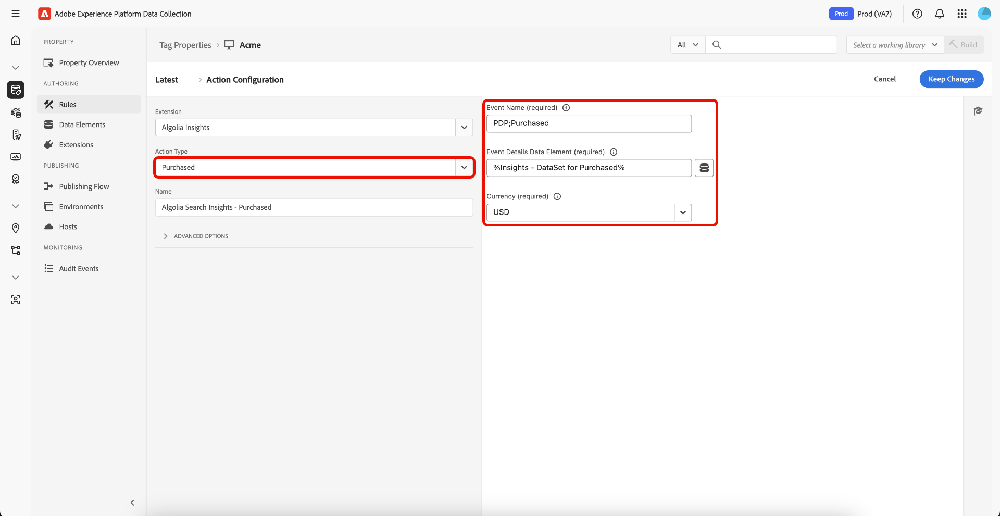
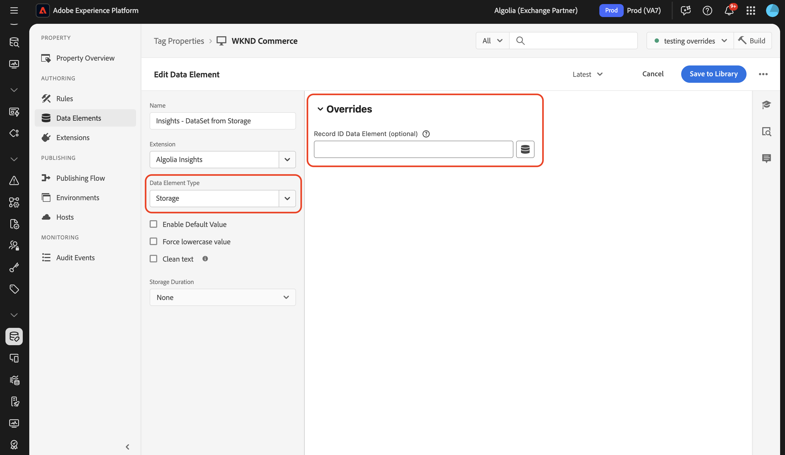

# Información general sobre la extensión de etiquetas [!DNL Algolia]

La extensión de etiquetas [!DNL Algolia] permite a los especialistas en marketing configurar fácilmente reglas que envían datos de interacción del usuario a [!DNL Algolia], lo que permite ofrecer experiencias de búsqueda y descubrimiento de IA más personalizadas.

Esta extensión cuenta con una función clave:

* **[!DNL Algolia]datos**: captura y envía automáticamente eventos de interacción del usuario a [!DNL Algolia], lo que permite análisis eficaces, experiencias personalizadas y una relevancia de búsqueda mejorada.

## Requisitos previos {#prerequisites}

Debe tener una cuenta de [!DNL Algolia] válida para utilizar esta extensión. Vaya a la [[!DNL Algolia] página de registro](https://dashboard.algolia.com/users/sign_up) para crear una cuenta si todavía no la tiene.

### Recopilar detalles de configuración necesarios {#configuration-details}

Para conectar [!DNL Algolia] con Adobe Experience Platform, necesitará la siguiente información:

| Credencial | Descripción | Ejemplo |
| --- | --- | --- |
| ID de aplicación | Su ID de aplicación se encuentra en la sección [Claves de API](https://www.algolia.com/account/api-keys/all) de su panel de [!DNL Algolia]. | 0ABCDEFG12 |
| Clave API de búsqueda | Su clave de API de búsqueda se encuentra en la sección [Claves de API](https://www.algolia.com/account/api-keys/all) del panel de [!DNL Algolia]. | 1234a12345678901b1234567890c1ab1 |

## Instalar y configurar la extensión [!DNL Algolia] Insights {#install-configure}

Para instalar la extensión [!DNL Algolia] Insights, vaya a la [!UICONTROL IU de recopilación de datos] y seleccione **[!UICONTROL Etiquetas]** en el panel de navegación izquierdo. Aquí, seleccione una propiedad a la que añadir la extensión o cree una nueva propiedad.

Una vez que haya seleccionado o creado la propiedad deseada, seleccione **[!UICONTROL Extensiones]** en el panel de navegación izquierdo y, a continuación, seleccione la pestaña **[!UICONTROL Catálogo]**. Busque la tarjeta de [!DNL Algolia] datos y, a continuación, seleccione **[!UICONTROL Instalar]**.


En la vista de configuración que aparece, debe proporcionar los siguientes detalles:

| Propiedad | Descripción |
| --- | --- |
| ID de aplicación | Escriba el [!UICONTROL ID de aplicación] que recopiló anteriormente en la sección [detalles de configuración](#configuration-details). |
| Clave API de búsqueda | Escriba la [!UICONTROL clave de API de búsqueda] que recopiló anteriormente en la sección [detalles de configuración](#configuration-details). |
| Nombre de índice | El [!UICONTROL Nombre de índice] contiene los productos o el contenido.  Este índice se utilizará como predeterminado. |
| Elemento de datos de token de usuario | El elemento de datos que devolverá el token de usuario. |
| Elemento de datos de token de usuario autenticado | Establezca el elemento de datos que devolverá el token de usuario autenticado. |
| Moneda | Seleccione un tipo de moneda.  El valor predeterminado es `USD`. |


## [!DNL Algolia] tipos de acciones de extensión de Insights {#action-types}

[!DNL Algolia] admite un conjunto de eventos estándar predefinidos, cada uno con contextos y propiedades específicos. Las acciones disponibles en la extensión [!DNL Algolia] se alinean con estos tipos de eventos, lo que facilita la categorización y configuración de los eventos que envía a [!DNL Algolia] según su tipo.

### Cargar perspectivas {#load-insights}

>[!NOTE]
>
>En la mayoría de los casos, se recomienda cargar [!DNL Algolia] Insights en todas las páginas del sitio.

Agregue la acción **[!UICONTROL Cargar información]** a la regla de etiquetas siempre que tenga más sentido para cargar [!DNL Algolia] información en función del contexto de la regla. Esta acción carga la biblioteca `search-insights.js` en la página.

Cree una nueva regla de etiqueta o abra una existente. Defina las condiciones según sus necesidades, luego seleccione **[!UICONTROL Algolia]** como [!UICONTROL extensión] y seleccione **[!UICONTROL Cargar información]** como [!UICONTROL Tipo de acción].

| Propiedad | Descripción |
| --- | --- |
| [!UICONTROL Versión de biblioteca de Insight] | La versión de [!DNL Algolia] Insights. El valor predeterminado es `2.13.0`. |
| [!UICONTROL Elemento de datos de exclusión de usuario] | Elemento de datos que captura la preferencia de seguimiento del usuario. |
| [!UICONTROL Usar cookie de token de usuario] | Marque esta casilla para permitir que [!DNL Algolia] genere una cookie de token de usuario. De manera predeterminada, esta opción está establecida en `false`. |


### Clic {#clicked}

Agregue la acción **[!UICONTROL Click]** a la regla de etiqueta para enviar los eventos en los que se hizo clic a [!DNL Algolia]. Cree una nueva regla de etiqueta o abra una existente. Defina las condiciones según sus necesidades, luego seleccione **[!UICONTROL Algolia]** como la [!UICONTROL extensión] y seleccione **[!UICONTROL Se hizo clic]** como [!UICONTROL Tipo de acción].

| Propiedad | Descripción |
| --- | --- |
| [!UICONTROL Nombre del evento] | El Nombre del evento que se puede utilizar para restringir aún más este evento de clic. |
| Elemento de datos Detalles del evento | Elemento de datos que recuperará los detalles del evento, incluidos `indexName`, `objectIDs` y, opcionalmente, `queryID`, `position`. Si se incluyen `queryID` y `position`, el evento se clasificará como *ID de objeto en el que se hizo clic después de la búsqueda*; de lo contrario, se tratará como un evento de *ID de objeto en el que se hizo clic*. Si el elemento de datos no proporciona un Nombre de índice, se utilizará el Nombre de índice predeterminado al enviar el evento. |


### Convertido {#converted}

Agregue la acción **[!UICONTROL Converted]** a la regla de etiquetas para enviar eventos convertidos a [!DNL Algolia]. Cree una nueva regla de etiqueta o abra una existente. Defina las condiciones según sus necesidades, luego seleccione **[!UICONTROL Algolia]** como la [!UICONTROL extensión] y seleccione **[!UICONTROL Convertido]** como [!UICONTROL Tipo de acción].

| Propiedad | Descripción |
| --- | --- |
| Nombre del evento | Nombre del evento que se utilizará para restringir aún más este evento **convert**. |
| Elemento de datos Detalles del evento | Elemento de datos que recuperará los detalles del evento, incluidos `indexName`, `objectId` y, opcionalmente, `queryId`. Si el elemento de datos contiene `queryId`, el evento se clasificará como *Convertido después de la búsqueda*; de lo contrario, se considerará una clase de evento *Convertido*. Si el elemento de datos no proporciona un Nombre de índice, se utilizará el Nombre de índice predeterminado al enviar el evento. |


### Añadido al carro {#added-to-cart}

Agregue la acción **[!UICONTROL Agregado al carro]** a la regla de etiquetas para enviar los eventos agregados al carro de compras a [!DNL Algolia]. Cree una nueva regla de etiqueta o abra una existente. Defina las condiciones según sus necesidades, luego seleccione **[!UICONTROL Algolia]** como la [!UICONTROL Extensión] y seleccione **[!UICONTROL Añadido al carro]** como [!UICONTROL Tipo de acción].

| Propiedad | Descripción |
| --- | --- |
| Nombre del evento | Nombre del evento que se utilizará para restringir aún más este evento **convert**. |
| Elemento de datos Detalles del evento | Elemento de datos que recuperará los detalles del evento, incluidos `indexName`, `objectId` y, opcionalmente, `queryId`, `objectData`. Si el elemento de datos contiene `queryId`, el evento se clasificará como *Se agregará a los identificadores de objetos del carro de compras después de la búsqueda*; de lo contrario, se considerará como una clase de evento *Se agregará a los identificadores de objetos del carro de compras*. Si el elemento de datos no proporciona un Nombre de índice, se utilizará el Nombre de índice predeterminado al enviar el evento. |
| Moneda | Especifica el tipo de moneda, como `USD`. |


### Adquirido {#purchased}

Agregue la acción **[!UICONTROL Agregado al carro]** a su regla de etiquetas para enviar los eventos comprados a [!DNL Algolia]. Cree una nueva regla de etiqueta o abra una existente. Defina las condiciones según sus necesidades, luego seleccione **[!UICONTROL Algolia]** como la [!UICONTROL extensión] y seleccione **[!UICONTROL Adquirido]** como [!UICONTROL Tipo de acción].

| Propiedad | Descripción |
| --- | --- |
| Nombre del evento | Nombre del evento que se utilizará para restringir aún más este evento **purchase**. |
| Elemento de datos Detalles del evento | Elemento de datos que recuperará los detalles del evento, incluidos `indexName`, `objectId` y, opcionalmente, `queryId`. Si el elemento de datos contiene `queryId`, el evento se clasificará como *ID de objeto adquiridos después de la búsqueda*; de lo contrario, se considerará una clase de evento de *ID de objeto adquiridos*. Si el elemento de datos no proporciona un Nombre de índice, se utilizará el Nombre de índice predeterminado al enviar el evento. |



### Visto {#viewed}

Agregue la acción **[!UICONTROL Agregado al carro]** a su regla de etiquetas para enviar los eventos comprados a [!DNL Algolia]. Cree una nueva regla de etiqueta o abra una existente. Defina las condiciones según sus necesidades, luego seleccione **[!UICONTROL Algolia]** como [!UICONTROL extensión] y seleccione **[!UICONTROL Visto]** como [!UICONTROL Tipo de acción].


| Propiedad | Descripción |
| --- | --- |
| Nombre del evento | Nombre del evento que se utilizará para restringir aún más este evento **view**. |
| Elemento de datos Detalles del evento | Elemento de datos que recuperará los detalles del evento, incluidos `indexName` y `objectId`. Si `indexName` no está disponible, se utilizará el nombre de índice predeterminado al enviar los eventos. |

## [!DNL Algolia] elementos de datos de extensión de Insights {#data-elements}

[!DNL Algolia] admite un conjunto de elementos de datos predefinidos, cada uno con contextos y propiedades específicos. En las secciones siguientes se describen los elementos de datos disponibles en la extensión [!DNL Algolia] Insights.

### DataSet {#dataset}

El elemento de datos DataSet recupera datos asociados con elementos HTML, que luego se utilizan en [!DNL Algolia] acciones.

| Propiedad | Descripción |
| --- | --- |
| Div/Nombre de clase del elemento de visita | El nombre del elemento HTML o el nombre de clase CSS que contiene los atributos del conjunto de datos, incluidos `data-insights-object-id` y opcionalmente `data-insights-query-id` y `data-insights-position` en el elemento HTML. |
| Nombre de índice Nombre de elemento Div/Clase | El nombre del elemento HTML o el nombre de clase CSS que tiene los atributos del conjunto de datos (`data-indexname`) en el elemento HTML. |


Este elemento de datos devuelve:

```javascript
{
  timestamp,
    queryID,
    indexName,
    objectIDs,
    positions
}
```

Un ejemplo de HTML que contiene un conjunto de datos:

```html
<div data-indexname="acme_master_default_products" class="instant-search-comp__hits">
  <div class="hit-card"
    data-insights-object-id="${hit.objectID}"
    data-insights-position="${hit.__position}"
    data-insights-query-id="${hit.__queryID}">
    <h4 class="hit-name">...</h4>   
  </div>
</div>
```

### Cadena de consulta {#query-string}

El elemento de datos de cadena de consulta extrae datos de la cadena de consulta de URL que se va a utilizar en las acciones [!DNL Algolia].

| Propiedad | Descripción |
| --- | --- |
| Nombre del parámetro de ID de objeto | Nombre del parámetro de consulta que contiene el ID de objeto. |
| Nombre de parámetro de nombre de índice (opcional) | Nombre del parámetro de consulta que contiene el nombre del índice. |
| Nombre del parámetro de ID de consulta (opcional) | El nombre del parámetro de consulta que contiene el ID de consulta. |
| Nombre del parámetro de posición (opcional) | El nombre del parámetro de consulta que contiene la posición. |


Este elemento de datos devuelve:

```javascript
{
  timestamp,
    queryID,
    indexName,
    objectIDs
}
```

Ejemplo de HTML que contiene parámetros de consulta.

```
<a href="product.html?objectID=${hit.objectID}&queryID=${hit.__queryID}&indexName=${indexName}&position=${hit.position}">Read More</a>
```

### Almacenamiento {#storage}

El elemento de datos de almacenamiento recupera datos del almacenamiento de sesión para usarlos en [!DNL Algolia] acciones.

Este elemento de datos recupera detalles de evento del almacenamiento de sesión. No se requiere ninguna configuración. Los datos se agregan automáticamente durante la acción del evento *click* y se eliminan durante la acción del evento *convert*.



Este elemento de datos devuelve lo que está almacenado en el almacenamiento de sesión.

```javascript
{
  timestamp,
    queryID,
    indexName,
    objectIDs
}
```

## Se hizo clic o se convirtió después de buscar {#clicked-converted-after-search}

Los eventos *Se hizo clic después de la búsqueda* o *Convertidos después de la búsqueda* requieren un `queryId`, y `position` también se requiere para *Se hizo clic después de la búsqueda*. Estas propiedades están disponibles cuando el indicador `insights` está habilitado en los parámetros de consulta InstantSearch o Autocompletar. Consulte los siguientes recursos para aprender a configurar Insights para su sitio:

* [Configurando datos en autocompletar](https://www.algolia.com/doc/ui-libraries/autocomplete/api-reference/autocomplete-js/autocomplete/#param-insights)
* [Configuración de perspectivas en InstantSearch.js](https://www.algolia.com/doc/guides/building-search-ui/events/js/#set-the-insights-option-to-true)
* [Introducción a los eventos de clics y conversiones](https://www.algolia.com/doc/guides/sending-events/implementing/how-to/sending-events-backend/)
* [Enviando [!DNL Algolia] eventos de perspectivas](https://www.algolia.com/doc/ui-libraries/autocomplete/guides/sending-algolia-insights-events/)
* [[!DNL Algolia] Repositorio de GitHub de extensión de Launch](https://github.com/algolia/algolia-launch-extension)
* [Documentación de InstantSearch.js](https://www.algolia.com/doc/guides/building-search-ui/what-is-instantsearch/js/)
* [[!DNL Algolia] Documentación de la API de Insights](https://www.algolia.com/doc/rest-api/insights/)

## Pasos siguientes {#next-steps}

En esta guía se explica cómo enviar datos a [!DNL Algolia] mediante la extensión de etiqueta [!DNL Algolia Insights]. Si planea enviar también eventos del lado del servidor a [!DNL Algolia], ahora puede continuar con la instalación y configuración de la [[!DNL Conversions API] extensión de reenvío de eventos](../../server/algolia/overview.md).

Para obtener más información sobre las etiquetas en Experience Platform, consulte la [descripción general de las etiquetas](../../../home.md).
