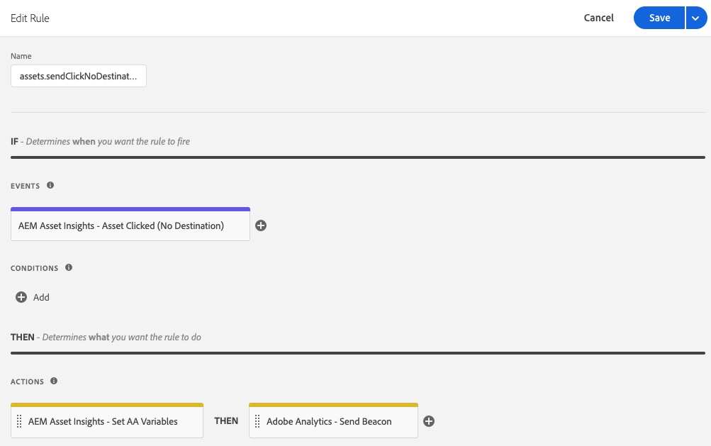

# Información general sobre la extensión de AEM Asset Insights

>[!NOTE]
>
>Adobe Experience Platform Launch se ha convertido en un conjunto de tecnologías de recopilación de datos en Adobe Experience Platform. Como resultado, se han implementado varios cambios terminológicos en la documentación del producto. Consulte el siguiente [documento](../../../term-updates.md) para obtener una referencia consolidada de los cambios terminológicos.

Esta extensión está diseñada para utilizarse junto con [AEM Asset Insights](https://experienceleague.adobe.com/docs/experience-manager-65/assets/managing/touch-ui-configuring-asset-insights.html?lang=es). Más específicamente, reemplaza el proceso pageTracker y el código incrustado. Cuando se configura, esta extensión envía métricas de *impresión* y *clics* de recursos a Adobe Analytics, tras lo cual se importarán en los informes de Insights de AEM Asset. Las métricas de recursos se pueden registrar mediante AEM Asset Insights o Adobe Analytics Project Workspaces.

## Requisitos previos de la extensión

### Analytics

Los informes de AEM Asset de Analytics contienen tres dimensiones de AEM:

* ID del recurso
* Origen de recursos
* Recurso en el que se hizo clic

También hay dos métricas:
* Impresiones de recursos
* Clics en recursos.

Estos informes deben habilitarse con el administrador de Analytics (haga clic en **[!UICONTROL Analytics] > [!UICONTROL Administración] > [!UICONTROL Grupo de informes] > `<report suite>` > [!UICONTROL Editar configuración] > [!UICONTROL AEM] > [!UICONTROL Informes de AEM Assets]**) para que se puedan completar con esta extensión.

La extensión de etiqueta *Adobe Analytics* para Adobe Experience Platform debe instalarse en la misma propiedad web.

### Adobe Experience Manager (AEM)

1. Habilite [AEM Asset Insights](https://experienceleague.adobe.com/docs/experience-manager-65/assets/managing/touch-ui-configuring-asset-insights.html). En AEM, seleccione **[!UICONTROL Herramientas > Recursos]** y, a continuación, abra el panel **[!UICONTROL Configuración de perspectivas]**.

1. Deshabilite el seguimiento de UUID.

   >[!IMPORTANT]
   >
   >Esta extensión *no* funcionará si se marca la configuración de AEM Assets **[!UICONTROL Deshabilitar seguimiento de UUID]**. De forma predeterminada, está desactivada.

   

## Configure Adobe Experience Manager (AEM)

En esta sección se describe cómo configurar AEM con etiquetas en Adobe Experience Platform y cómo habilitar Asset Insight en AEM y el seguimiento de UUID para Assets.

### Integración de AEM con etiquetas

La integración recomendada de [Platform](https://experienceleague.adobe.com/docs/experience-manager-learn/sites/integrations/experience-platform-launch/overview.html?lang=es) con Adobe Experience Manager se realiza mediante Adobe I/O.

1. [Conexión de AEM con etiquetas mediante Adobe I/O](https://experienceleague.adobe.com/docs/experience-manager-learn/sites/integrations/experience-platform-launch/connect-aem-launch-adobe-io.html?lang=es).

2. [Cree una configuración de Cloud Service de Adobe Experience Platform](https://experienceleague.adobe.com/docs/experience-manager-learn/sites/integrations/experience-platform-launch/create-launch-cloud-service.html?lang=es).

### Activar Asset Insight en AEM

Para obtener instrucciones sobre cómo activar Asset Insights, consulte la [guía del usuario Experience Manager 6.5 Assets](https://experienceleague.adobe.com/docs/experience-manager-65/assets/managing/touch-ui-configuring-asset-insights.html).

### Habilitar el seguimiento UUID para Assets

Rastree recursos en Analytics mediante el UUID del recurso en AEM.

Para habilitar el seguimiento con el UUID del recurso, abra la consola de directivas de componentes de la plantilla editable y quite la marca de la casilla de la propiedad &quot;Deshabilitar el seguimiento UUID&quot;. (De forma predeterminada, esta propiedad se comprueba para el componente de imagen OOTB).

Después de habilitar el UUID, debe ver que el elemento de datos &quot;data-asset-id&quot; se rellena con el UUID del recurso. Analytics hace un seguimiento de los clics o las impresiones de los recursos con este UUID.

## Uso de extensiones

Esta extensión tiene dos eventos y una acción.

* **Recurso en el que se hizo clic:** _evento_ que se activa cuando el visitante selecciona un AEM Asset que está habilitado para el seguimiento y tiene un destino (atributo href).

* **Recurso en el que se hizo clic (sin destino):** _evento_ que se activa cuando el visitante hace clic en un AEM Asset que está habilitado para el seguimiento y no tiene ningún destino (sin atributo href).

* **Establecer variables AA:** una _acción_ que establecen las variables de Analytics reservadas para AEM Assets (variables de datos de contexto `a.assets.source`, `a.assets.idlist` y `a.asset.clickedid`) en función del evento que se haya utilizado y de cómo se hayan configurado el evento y la acción. Esta extensión no utiliza eventos, propiedades o eVars de Analytics.

### Impresiones de recursos

Añada la acción Establecer variables AA a una regla de etiquetas nueva o existente que se active en todas las páginas y envíe una solicitud de imagen de Analytics. La acción “Establecer variables AA” debe aparecer **antes** de la acción “Adobe Analytics - Enviar señalización”. Se pueden agregar acciones adicionales según sea necesario.

En la página de configuración **[Establecer variables AA]**, seleccione la opción **[Recursos vistos]** (predeterminada). Esto solo establece el evento Impresiones para los recursos que el visitante ve en realidad.

>[!NOTE]
>
>Aunque no se recomienda, la acción “Establecer variables AA” también admite una opción “cargada”, que envía impresiones de recursos para cada recurso de la página, tanto si el visitante las vio como si no.

### Clics en recursos

Configure una segunda regla con el evento “Se hizo clic en el recurso” y la acción “Establecer variables AA”. El evento “Recurso en el que se ha hecho clic” debe configurarse de modo que “Solicitud de imagen en la que se ha hecho clic en un recurso” se establezca en “On PageLoad” (valor predeterminado). Esta regla no requiere ninguna acción de Adobe Analytics (como Enviar señalización), porque el ID de recurso se guardará en `sessionStorage` y se enviará mediante la regla de impresiones posterior.

El evento “Recurso en el que se ha hecho clic” también admite la configuración “Solicitud de imagen en la que se ha hecho clic” de “Al hacer clic”. Esto envía la métrica de clics a Analytics inmediatamente y requiere una acción “Enviar señalización” de Analytics.

Configure una tercera regla que se activará cuando haya recursos en las páginas sin destino (sin atributo `href`). Como mínimo, la nueva regla debe utilizar el evento “Recurso en el que se ha hecho clic (sin destino)”, así como las acciones “Establecer variables AA” y “Adobe Analytics - Enviar señalización”. Se pueden agregar condiciones y acciones adicionales según sea necesario.

### Sugerencias de pruebas de extensión

Configure tres reglas como se describe anteriormente:

* Impresiones de recursos
* Clics en recursos
* Clics en recursos sin destino

**Impresiones**

1. Vaya a una página que contenga AEM Assets.

1. Si no hay recursos visibles en el explorador, desplácese hasta que vea al menos un recurso y selecciónelo o simplemente navegue a otra página.

1. Consulte la solicitud de imagen de Analytics.

   Si `a.assets.idlist` contiene los ID de recurso que se visualizaban en la página anterior, la regla funciona correctamente.

   Si `a.assets.idlist` no está en la solicitud de imagen, es muy probable que sea por uno de los dos motivos:

   * Nunca hubo un recurso en el área de visualización del explorador

   * No había recursos en la página configurados con [Asset Insights](https://experienceleague.adobe.com/docs/experience-manager-65/assets/managing/touch-ui-configuring-asset-insights.html) habilitado en AEM.

**Clics**

1. Vaya a una página que contenga AEM Assets.

1. Seleccione uno de los recursos.

En la solicitud de imagen de Analytics que aparece (desde la página siguiente), si `a.assets.idlist` tiene los ID de recurso en la página de destino y `a.assets.clickedid` tiene el ID del recurso en el que se hizo clic en la página de origen, la regla funciona correctamente.

Si `a.assets.clickedid` no está en la solicitud de imagen, lo más probable es que el recurso en el que se hizo clic no tenga activados los [Asset Insights](https://experienceleague.adobe.com/docs/experience-manager-65/assets/managing/touch-ui-configuring-asset-insights.html) en AEM.

**Clics sin destino**

1. Vaya a una página que contenga al menos un AEM Asset sin destino (sin atributo `href`).

1. Seleccione ese recurso.

En la solicitud de imagen de Analytics que se obtiene, si `a.assets.clickedid` tiene el ID de recurso, la regla funciona correctamente.

Si `a.assets.clickedid` no está en la solicitud de imagen, lo más probable es que el recurso en el que se hizo clic no tenga activados los [Asset Insights](https://experienceleague.adobe.com/docs/experience-manager-65/assets/managing/touch-ui-configuring-asset-insights.html) en AEM.
