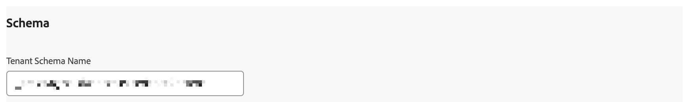

# Información general sobre la extensión Adobe Content Analytics

La extensión de etiqueta [!DNL Adobe Content Analytics] permite el seguimiento de eventos relacionados con contenido en un sitio web. La extensión envía datos de contenido (experiencias y recursos) a un conjunto de datos en Adobe Experience Cloud desde propiedades web a través de Experience Platform Edge Network.

La extensión le permite transmitir datos de evento específicos relacionados con el contenido a Platform para que pueda utilizar esos datos en los informes de análisis de contenido en Customer Journey Analytics.

En este documento se explica cómo configurar la extensión de etiqueta en la interfaz de usuario de Etiquetas.

## Instalación de la extensión de etiquetas de Adobe Content Analytics {#install}

>[!NOTE]
>
>La extensión de etiquetas de Adobe Content Analytics se instala automáticamente como parte de la propiedad de etiquetas que se crea automáticamente al usar el [asistente de configuración guiada de Content Analytics](https://experienceleague.adobe.com/en/docs/analytics-platform/using/content-analytics/configuration/guided){target="_blank"}.

### Instalación manual

En caso de configuración manual, la extensión de etiquetas de Adobe Content Analytics necesita que se instale una propiedad en. Si aún no lo ha hecho, consulte la documentación de [creación de una propiedad de etiqueta](https://experienceleague.adobe.com/en/docs/platform-learn/implement-in-websites/configure-tags/create-a-property).

Después de crear una propiedad o al seleccionar la propiedad creada con el [asistente de configuración guiada de Content Analytics](https://experienceleague.adobe.com/en/docs/analytics-platform/using/content-analytics/configuration/guided), abra la propiedad y seleccione la ficha **[!UICONTROL Extensiones]** en la barra lateral izquierda.

Seleccione la ficha **[!UICONTROL Catálogo]**. En la lista de extensiones disponibles, busque la extensión **[!DNL Adobe Content Analytics]** y seleccione **[!UICONTROL Instalar]**.

Después de seleccionar **[!UICONTROL Instalar]**, debe configurar la extensión de etiquetas de Adobe Content Analytics y guardar la configuración.

<!--
## Configure schema

The [Content Analytics guided configuration wizard](https://experienceleague.adobe.com/en/docs/analytics-platform/using/content-analytics/configuration/guided) automatically populates the proper value for the **[!UICONTROL Tenant Schema Name]**. 

>[!WARNING]
>
>Do not modify the value for **[!UICONTROL Tenant Schema Name]**.

-->

## Configuración de flujos de datos

El asistente de configuración guiada de [Content Analytics](https://experienceleague.adobe.com/en/docs/analytics-platform/using/content-analytics/configuration/guided) selecciona automáticamente el valor adecuado para **[!UICONTROL espacio aislado]** y **[!UICONTROL secuencia de datos de producción]**. Opcionalmente, puede configurar una secuencia de datos de ensayo **[!UICONTROL adicional]** y una secuencia de datos de desarrollo **[!UICONTROL 3}.]**

Puede anular los valores seleccionados automáticamente para **[!UICONTROL espacio aislado]** y **[!UICONTROL secuencia de datos de producción]** en caso de que desee usar Análisis de contenido en un espacio aislado diferente y con flujos de datos diferentes. Al hacerlo, puede seleccionar una zona protegida y flujos de datos en los menús desplegables disponibles, o seleccionar **[!UICONTROL Introducir valores]** e introducir un ID de flujo de datos personalizado para cada entorno.

>[!IMPORTANT]
>
>Al configurar otra zona protegida y flujos de datos, asegúrese de que
>
>* la zona protegida seleccionada no está asociada ya a otra configuración de análisis de contenido, y
>* cualquier flujo de datos seleccionado tiene el servicio Experience Platform configurado con un conjunto de datos de evento de experiencia de Content Analytics habilitado.

Consulte la guía de [flujos de datos](../../../../datastreams/overview.md) para obtener información sobre cómo configurar un flujo de datos.

## Configurar filtrado de eventos

En la sección **[!UICONTROL Filtrado de eventos]**, puede modificar las expresiones regulares para filtrar **[!UICONTROL URL de la página]** y **[!UICONTROL URL de Assets]** al recopilar datos para Análisis de contenido. Las expresiones regulares que ha definido en el [asistente de configuración guiada de Content Analytics](https://experienceleague.adobe.com/en/docs/analytics-platform/using/content-analytics/configuration/guided) se rellenan automáticamente.

### Ejemplos

* Desea excluir todas las páginas de documentación del análisis de contenido. Use la siguiente expresión regular: `^(?!.*documentation).*`
* Desea excluir todas las imágenes de logotipo de JPEG y SVG del análisis de contenido. Use la siguiente expresión regular: `^(?!.*(logo\.jpg|\.svg)).*$`

Puede usar **[!UICONTROL Test Regex]** para probar su expresión regular en el **[!UICONTROL Probador de expresiones regulares]**.

