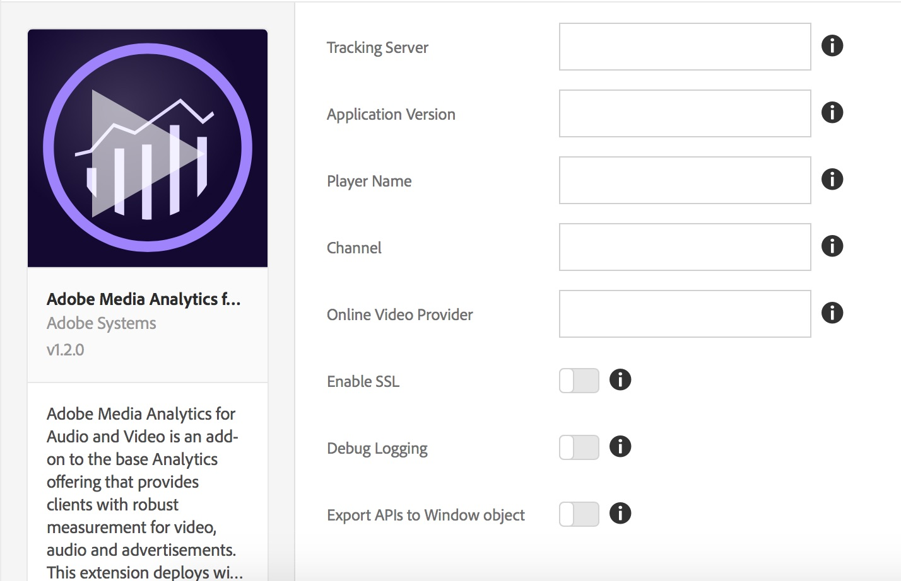

# Información general sobre la extensión de Adobe Media Analytics para audio y vídeo

>[!NOTE]
>
>Adobe Experience Platform Launch se ha convertido en un grupo de tecnologías de recopilación de datos en Adobe Experience Platform. Como resultado, se han implementado varios cambios terminológicos en la documentación del producto. Consulte el siguiente [documento](../../../term-updates.md) para obtener una referencia consolidada de los cambios terminológicos.

Utilice esta documentación para obtener información sobre la instalación, configuración y implementación de la extensión de audio y vídeo de Adobe Media Analytics (extensión Media Analytics). Se incluyen las opciones disponibles al utilizar esta extensión para generar una regla, así como ejemplos y vínculos a muestras.

La extensión Media Analytics (MA) agrega el SDK principal de JavaScript Media SDK (SDK Media 2.x). Esta extensión proporciona la funcionalidad para agregar la instancia de seguimiento `MediaHeartbeat` a un sitio o proyecto de etiquetas. La extensión de MA requiere dos extensiones adicionales:

* [Extensión de Analytics](../analytics/overview.md)
* [Extensión de Experience Cloud ID](../id-service/overview.md)

>[!IMPORTANT]
>
>El seguimiento de audio requiere Analytics Extension v1.6 o superior.

Después de incluir las tres extensiones mencionadas arriba en su proyecto de etiquetas, puede continuar de una de las dos maneras siguientes:

* Use las API de `MediaHeartbeat` desde la aplicación web
* Incluya o cree una extensión específica del reproductor que asigne eventos específicos del reproductor de medios a las API en la instancia de seguimiento de `MediaHeartbeat`. Esta instancia se expone a través de la extensión de MA.

## Instale y configure la extensión de MA

* **Instalación:** para instalar la extensión MA, abra la propiedad de extensión, seleccione **[!UICONTROL Extensiones > Catálogo]**, pase el ratón sobre la extensión de **[!UICONTROL Adobe Media Analytics para audio y vídeo]** y seleccione **[!UICONTROL Instalar]**.

* **Configuración:** para configurar la extensión MA, abra la pestaña [!UICONTROL Extensiones], pase el cursor sobre la extensión y, a continuación, seleccione **[!UICONTROL Configurar]**:



### Opciones de Configuration:

| Opción | Descripción |
| :--- | :--- |
| Servidor de seguimiento | Define el servidor para rastrear latidos de medios (no es el mismo servidor que su Tracking Server de Analytics) |
| Versión de aplicación | La versión del SDK/aplicación del reproductor de medios |
| Nombre del reproductor | Nombre del reproductor de medios en uso, por ejemplo, &quot;AVPlayer&quot;, &quot;HTML5 Player&quot;, &quot;Mi reproductor personalizado&quot; |
| Canal | Propiedad del nombre del canal |
| Proveedor de vídeo en línea | Nombre de la plataforma de vídeo en línea desde la que se distribuye el contenido |
| Registro de depuración | Habilitar o deshabilitar el registro |
| Habilitar SSL | Habilitar o deshabilitar el envío de pings a través de HTTPS |
| Exportar API a objeto de ventana | Habilitar o deshabilitar la exportación de las API de Media Analytics al ámbito global |
| Nombre de variable | Una variable que utiliza para exportar las API de Media Analytics en el objeto `window` |

**Recordatorio:** La extensión de MA requiere las extensiones de [Analytics](../analytics/overview.md) y de [Experience Cloud ID](../id-service/overview.md). También debe agregar estas extensiones a la propiedad de extensión y configurarlas.

## Uso de la extensión MA

### Uso de una página web/aplicación JS

La extensión MA exporta las API de MediaHeartbeat en el objeto window global activando la configuración Export APIs to Window Object en la página [!UICONTROL Configuración]. Exporta las API bajo el nombre de la variable configurada. Por ejemplo, si el Variable Name está configurado para ser `ADB`, se puede acceder a MediaHeartbeat a través de `window.ADB.MediaHeartbeat`.

>[!IMPORTANT]
>
>La extensión de MA exporta las API solo cuando `window["CONFIGURED_VARIABLE_NAME"]` no está definido y tampoco anula las variantes existentes.

1. **Crear instancia de MediaHeartbeat:** `window["CONFIGURED_VARIABLE_NAME"].MediaHeartbeat.getInstance`

   **Parámetros:** Un objeto delegado válido que expone estas funciones:

   | Método |  Descripción   |
   | :--- | :--- |
   | `getQoSObject()` | Devuelve la instancia `theMediaObject` que contiene la información actual de QoS. Se llamará varias veces a este método durante una sesión de reproducción. La implementación del reproductor debe devolver siempre los datos de QoS más recientes que haya disponibles. |
   | `getCurrentPlaybackTime()` | Devuelve la posición actual del cabezal de reproducción. Para el seguimiento de vídeos VOD, el valor se especifica segundos después del comienzo del contenido multimedia. Para el seguimiento LIVE/LIVE, el valor se especifica en segundos desde el comienzo del programa. |

   **Valor devuelto:** Promesa que se resuelve con una instancia de `MediaHeartbeat` o rechaza con un mensaje de error.

1. **Acceso a las constantes de MediaHeartbeat:** `window["CONFIGURED_VARIABLE_NAME"].MediaHeartbeat`

   Esto expone todas las constantes y métodos estáticos de la clase [`MediaHeartbeat`](https://adobe-marketing-cloud.github.io/media-sdks/reference/javascript/MediaHeartbeat.html).

   Puede obtener el reproductor de muestra aquí: [Reproductor de muestra MA](https://github.com/Adobe-Marketing-Cloud/media-sdks/tree/master/samples/launch/js/2.x). El reproductor de muestra actúa como referencia para exhibir cómo utilizar la extensión MA para admitir Media Analytics directamente desde una aplicación web.

1. Cree la instancia de seguimiento de MediaHeartbeat como se indica a continuación:

   ```javascript
   var MediaHeartbeat = window["CONFIGURED_VARIABLE_NAME"].MediaHeartbeat;
   
   var delegate = {
       getCurrentPlaybackTime: this._getCurrentPlaybackTime.bind(this),
       getQoSObject: this._getQoSObject.bind(this),
   };
   
   var config = {
       playerName: "Custom Player",
       ovp: "Custom OVP",
       channel: "Custom Channel"
   };
   
   var self = this;
   MediaHeartbeat.getInstance(delegate, config).then(function(instance) {
       self._mediaHeartbeat = instance;
       // Do Tracking using the MediaHeartbeat instance.
   }).catch(function(err){
       // Getting MediaHeartbeat instance failed.
   });
   ```

### Uso de otras extensiones

La extensión MA expone los módulos compartidos de `get-instance` y `media-heartbeat` a otras extensiones. (Para obtener más información sobre los módulos compartidos, consulte [Shared Modules documentation](../../../extension-dev/web/shared.md).)

>[!IMPORTANT]
>
>Solo se puede acceder a los módulos compartidos desde otras extensiones. Es decir, una aplicación web/JS no puede acceder a los módulos compartidos ni utilizar `turbine` (consulte la muestra de código que aparece a continuación) fuera de una extensión.

1. **Crear instancia de MediaHeartbeat:** Módulo compartido de `get-instance`

   **Parámetros:**

   * Un objeto delegado válido que expone estas funciones:

     | Método |  Descripción   |
     | :--- | :--- |
     | `getQoSObject()` | Devuelve la instancia de `MediaObject` que contiene la información actual de QoS. Se llamará varias veces a este método durante una sesión de reproducción. La implementación del reproductor debe devolver siempre los datos de QoS más recientes que haya disponibles. |
     | `getCurrentPlaybackTime()` | Devuelve la posición actual del cabezal de reproducción. Para el seguimiento de vídeos VOD, el valor se especifica segundos después del comienzo del contenido multimedia. Para el seguimiento LIVE/LIVE, el valor se especifica en segundos desde el comienzo del programa. |

   * Un objeto de configuración opcional que expone estas propiedades:

     | Propiedad | Descripción | Requerido |
     | :--- | :--- | :--- |
     | Proveedor de vídeo en línea | Nombre de la plataforma de vídeo en línea desde la que se distribuye el contenido. | No. Si está presente, anula el valor definido durante la configuración de la extensión. |
     | Nombre del reproductor | Nombre del reproductor de medios en uso, por ejemplo, &quot;AVPlayer&quot;, &quot;HTML5 Player&quot;, &quot;Mi reproductor personalizado&quot; | No. Si está presente, anula el valor definido durante la configuración de la extensión. |
     | Canal | Propiedad del nombre del canal | No. Si está presente, anula el valor definido durante la configuración de la extensión. |

   **Valor devuelto:** Promesa que se resuelve con una instancia de `MediaHeartbeat` o rechaza con un mensaje de error.

1. **Acceso a constantes de MediaHeartbeat:** Módulo compartido de `media-heartbeat`

   Este módulo expone todas las constantes y los métodos estáticos de esta clase: [https://adobe-marketing-cloud.github.io/media-sdks/reference/javascript/MediaHeartbeat.html](https://adobe-marketing-cloud.github.io/media-sdks/reference/javascript/MediaHeartbeat.html).

1. Cree la instancia de seguimiento de MediaHeartbeat como se indica a continuación:

   ```javascript
   var getMediaHeartbeatInstance =
     turbine.getSharedModule('adobe-video-analytics', 'get-instance');
   
   var MediaHeartbeat =
     turbine.getSharedModule('adobe-video-analytics', 'media-heartbeat');
     ...
   
   var delegate = {
       getCurrentPlaybackTime: this._getCurrentPlaybackTime.bind(this),
       getQoSObject: this._getQoSObject.bind(this),
   }
   
   var config = {
       playerName: "Custom Player",
       ovp: "Custom OVP",
       channel: "Custom Channel"
   }
   ...
   
   var self = this;
   getMediaHeartbeatInstance(delegate, config).then(function(instance) {
       self._mediaHeartbeat = instance;
       ...
       // Do Tracking using the MediaHeartbeat instance.
   }).catch(function(err){
       // Getting MediaHeartbeat instance failed.
   });
   
   ...
   ```

1. Con la instancia de Media Heartbeat, siga la [Documentación de Media SDK JS](https://experienceleague.adobe.com/docs/media-analytics/using/legacy-implementations/legacy-media-sdks/setup-javascript/set-up-js-2.html?lang=es) y [la documentación de las API JS](https://adobe-marketing-cloud.github.io/media-sdks/reference/javascript/index.html) para implementar el seguimiento de medios.

>[!NOTE]
>
>**Pruebas:** En esta versión, para probar la extensión debe cargarla en [Experience Platform](../../../extension-dev/submit/upload-and-test.md), donde tiene acceso a todas las extensiones dependientes.


<!--
## Leveraging the sample HTML5 player

You can obtain the MA extension sample HTML5 player here: [HTML5 Sample Player](https://github.com/adobe/reactor-adobe-va-sample-player). The sample player acts as a reference to create video player extensions and to showcase using the MA extension to support media tracking.

### Sample player extension action types

This section describes the action types available in the Sample Player extension.

#### Open Video

The _Open Video_ action provides various configurations for creating and customizing an HTML5 player, providing a video to play and enabling/disabling Adobe Video Analytics tracking.

**Action Configuration / Player Settings:** Note the CSS Selector setting which specifics the `<div>` in the web page where the player is added. Note also that the _Enable Adobe Analytics_ checkbox is checked in the Analytics Settings pane.


* [\[...\]/openVideo/openVideo.jsx](https://github.com/adobe/reactor-adobe-va-sample-player/blob/master/src/view/actions/openVideo/openVideo.jsx) -

  UI Code to configure the Action is defined here.

* [\[...\]/actions/openVideo.js](https://github.com/adobe/reactor-adobe-va-sample-player/blob/master/src/lib/actions/openVideo.js) - This file exports a function that gets executed when the Action is triggered as part of the tag rule.

  This is a code snippet from `openVideo.js` where the `openVideo` Action is executed:

  ```javascript
    function openVideo(settings) {
        let player;
        try {
            Logger.info(LOG_TAG, `Executing action with ${JSON.stringify(settings)}`);

            player = new PlayerFacade(settings);
            PlayerStore.registerPlayer(player);
            player.load(settings.media);
        } catch (ex) {
            Logger.error(LOG_TAG, `Creating player for action openVideo failed with error ${ex.message}`);

            // Cleanup from DOM.
            if (player) {
                player.destroy();
            }
        }
    }
    ...
  ```

* [\[...\]/analytics/adobeAnalyticsProvider.js](https://github.com/adobe/reactor-adobe-va-sample-player/blob/master/src/lib/helpers/analytics/adobeAnalyticsProvider.js) - This file implements Video Analytics tracking by using Shared Modules exposed by the VA extension.

### Sample player extension basic deployment

Once the Sample Player extension is installed, you'll need to create at least one rule to properly deploy it. The Image below shows a sample rule that opens the specified video when the core extension fires the `DOMLoaded` event.


After you have saved this rule, you will need to add it to a Library, and then build and deploy so that you can test the behavior.

-->
