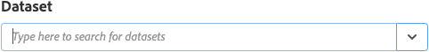

# Extensión de la demostración de Adobe Experience Platform

>[!NOTE]
>
>Adobe Experience Platform Launch se ha convertido en un conjunto de tecnologías de recopilación de datos en Adobe Experience Platform. Como resultado, se han implementado varios cambios terminológicos en la documentación del producto. Consulte el siguiente [documento](../../../term-updates.md) para obtener una referencia consolidada de los cambios terminológicos.

>[!NOTE]
>
>Esta extensión quedará obsoleta y la sustituirá [el SDK web de Adobe Experience Platform](../web-sdk/overview.md).

Las características de esta extensión se transfieren a la nueva. Aquí tiene una rápida comparación de las funciones actuales.

| Extensión de demostración de Platform | SDK web de Platform |
| ------------------ | ----------- |
| Compatibilidad con ID de cliente personalizados | Compatibilidad con ID de cliente personalizados |
| IU de asignación del lado del cliente para XDM | Generar en ECID (no es necesario usar visitor.js) |
| Capacidad para crear una conexión de flujo continuo | Compatibilidad con el servicio de inclusión |
| | Compatibilidad con XDM como elemento de datos |
| | Compatibilidad con dominios de origen |
| | Herramientas de depuración integradas |
| | Recopila el contexto del explorador de forma automática |
| | Código fuente totalmente abierto |

## Configurar la extensión de Adobe Experience Platform

Esta sección proporciona una referencia sobre las opciones disponibles al configurar la extensión de Adobe Experience Platform.

Si la extensión de Adobe Experience Platform aún no está instalada, abra la propiedad, seleccione **[!UICONTROL Extensiones > Catálogo]**, pase el cursor sobre la extensión de Adobe Experience Platform y seleccione **[!UICONTROL Instalar]**.

Para configurar la extensión, abra la pestaña [!UICONTROL Extensiones], pase el cursor sobre la extensión y, a continuación, seleccione **[!UICONTROL Configurar]**.

### Conexión de flujo continuo

La elección de una conexión de flujo continuo es el primer paso para iniciar la transmisión de datos a Adobe Experience Platform. Puede seleccionar una del combobox de conexión de flujo continuo. La conexión de flujo continuo es un campo obligatorio. Si no tiene ninguna conexión de flujo continuo creada, puede crearla seleccionando el botón **[!UICONTROL Crear una conexión de flujo continuo]**.

Si selecciona **[!UICONTROL Crear una conexión de flujo continuo]**, aparecerá una ventana modal.

El modal contiene campos con valores prerrellenados que se pueden cambiar según sus necesidades. Si tiene pensado crear más de una conexión de flujo continuo, debe tener en cuenta que el campo **[!UICONTROL Fuente de datos]** debe ser único. Si intenta crear otra conexión de flujo continuo utilizando una **[!UICONTROL Fuente de datos]** utilizada en otra conexión, no podrá hacerlo.

Una vez que haya seleccionado un extremo de flujo continuo, verá la URL del extremo de flujo continuo y la fuente.

## Tipos de acciones de extensión de Adobe Experience Platform

Esta sección describe los tipos de acción disponibles en la extensión de Adobe Experience Platform.

### Enviar baliza {#send-beacon}

Es el tipo de acción que utilizará para enviar datos a Adobe Experience Platform.

Primero debe seleccionar el conjunto de datos donde se almacenarán los datos. Generalmente, los conjuntos de datos representan una tabla que almacenará los datos enviados mediante la conexión de flujo continuo. Debe crear los conjuntos de datos dentro de Adobe Experience Platform antes de utilizar este tipo de acción.

Una vez que seleccione el conjunto de datos donde se almacenarán los datos, verá detalles sobre el esquema vinculado al conjunto de datos seleccionado.

### Asignación de esquemas

Después de seleccionar el conjunto de datos, puede definir la asignación de esquema.

El campo de valor de fuente acepta un valor o un elemento de datos. Para añadir un elemento de datos, seleccione el botón del elemento de datos situado junto al campo de valor de origen.

El campo de esquema de destino contiene la ruta de un campo XDM definido en el esquema del conjunto de datos. Para los campos definidos más profundamente en la jerarquía de esquema, puede utilizar el punto como separador entre las partes de ruta (p. ej., timeSeriesEvents.eventType).

### Selector de campos de esquema

La extensión ofrece también la posibilidad de seleccionar un campo de esquema de destino con un selector visual. Si selecciona el botón de destino situado junto a la entrada del campo de esquema de destino, se mostrará un menú modal donde verá el árbol de esquema del conjunto de datos. Puede elegir un campo y, a continuación, seleccionar el botón **Seleccionar**, y se actualizará la entrada del campo de esquema de destino que contenga la ruta XDM correcta.

### Campos de identidad dentro de Adobe Experience Platform

Registrar esquemas de datos y esquemas de datos de series temporales puede contener uno o varios campos de identidad. Los campos de identidad se unen para formar una única representación de identidad de un asunto e incluyen información como un identificador CRM, Experience Cloud ID (ECID), cookie del explorador, AdvertisingId u otros ID en distintos dominios.

Los campos de identidad se pueden definir de dos formas dentro del esquema:

1. Los esquemas de registro y series temporales contienen un campo especial, llamado `xdm:identityMap`, que puede contener un mapa de identidades.
1. Los campos clave pueden marcarse como campos de identidad dentro del esquema.

### Campos de identidad dentro de la extensión de Adobe Experience Platform

Para cada campo de esquema definido como campo de identidad, se agregará una fila a la sección de asignación de esquema. Cada fila agregada contendrá el campo de esquema de destino ya rellenado con su ruta de esquema XDM correspondiente. Puede reconocer si un campo de esquema también es un campo de identidad si ve un icono de perfil cerca del campo.

Los campos de identidad primarios siempre son obligatorios, por lo que no puede eliminar las filas que los contengan desde la sección de asignación de esquemas.

Un campo de esquema definido como campo de identidad no principal se añadirá automáticamente a la sección de asignación de esquemas, pero la entrada del valor de origen puede permanecer vacía. Ese campo se puede eliminar. El campo se descartará si la entrada correspondiente del valor de fuente está vacía.

Verá un icono de advertencia cerca de cada campo de identidad no principal que no contenga ningún valor.

Una sección de identidad será visible si el esquema contiene un campo de `xdm:identityMap`. Puede utilizar esta sección si prefiere enviar datos relacionados con identidades usando el método `xdm:identityMap`.

La sección de asignación de identidad puede contener varias filas. Cada fila puede definir un determinado tipo de identidad. Puede definir los atributos siguientes para una identidad: tipo, estado autenticado, principal y valor.

Si tiene varias identidades dentro de la sección de asignación de identidad, solo una identidad se puede marcar como principal.

Si tiene un esquema que tiene un campo de `xdm:identityMap` y al mismo tiempo otro se marca como un campo de identidad principal, la columna principal dentro de la sección de asignación de identidad no será visible.

### Campos requeridos

Algunos esquemas tendrán campos obligatorios de nivel superior. Los más comunes son `timestamp` y `_id`. Sin definir estos campos, la señalización fallará. Puede definirlos dentro de la sección de asignación de esquema.

Si la sección de asignación de esquemas no contiene `timestamp` ni `_id`, pero el esquema de conjuntos de datos los necesita, la extensión de Adobe Experience Platform enviará una señalización que contiene valores generados automáticamente para que la señalización no falle. Los valores generados automáticamente solo se agregarán a los datos de señalización si no se han definido dichos campos dentro de la sección de asignación de esquema.
