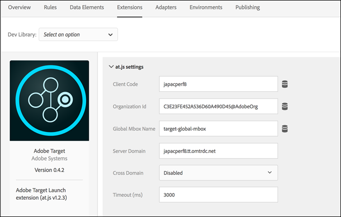

# Información general sobre la extensión de Adobe Target

>[!NOTE]
>
>Adobe Experience Platform Launch se ha convertido en un conjunto de tecnologías de recopilación de datos en Adobe Experience Platform. Como resultado, se han implementado varios cambios terminológicos en la documentación del producto. Consulte el siguiente [documento](../../../term-updates.md) para obtener una referencia consolidada de los cambios terminológicos.

Utilice esta referencia para obtener información sobre las opciones disponibles al utilizar esta extensión para generar una regla.

## Configuración de la extensión de Adobe Target

>[!IMPORTANT]
>
> La extensión Adobe Target requiere at.js. No es compatible con mbox.js.

Si la extensión de Adobe Target todavía no está instalada, abra su propiedad, seleccione **[!UICONTROL Extensiones > Catálogo]**, coloque el puntero sobre la extensión de grupo de destinatarios y seleccione **[!UICONTROL Instalar]**.

Para configurar la extensión, abra la pestaña [!UICONTROL Extensiones], pase el cursor sobre la extensión y, a continuación, seleccione **[!UICONTROL Configurar]**.



### Configuración de at.js

Todos los ajustes de at.js, excepto el Tiempo de espera, se recuperan automáticamente de la configuración de at.js en la interfaz de usuario de Target. La extensión solo recupera la configuración de la interfaz de usuario de Target cuando se agrega por primera vez, por lo que todos los ajustes se deben administrar en la interfaz de usuario si se necesitan actualizaciones adicionales.

Las opciones de configuración disponibles son las siguientes:

#### Código de cliente

El código de cliente es el identificador de cuenta de Target. Esto debe mantenerse casi siempre con el valor predeterminado.

Se puede cambiar utilizando elementos de datos.

#### ID de organización

Este ID vincula la implementación con su cuenta de Adobe Experience Cloud. Esto debe mantenerse casi siempre con el valor predeterminado.

Se puede cambiar utilizando elementos de datos.

#### Nombre de Mbox global

Muestra el nombre de la solicitud global de Target. De forma predeterminada, este nombre es target-global-mbox, a menos que haya cambiado el nombre en la interfaz de usuario de Target antes de añadir la extensión.

Se puede cambiar utilizando elementos de datos.

#### Dominio del servidor

Dominio donde se envían las solicitudes de Target. Esto debe mantenerse casi siempre con el valor predeterminado.

#### Dominio cruzado

Determina dónde establece Target las cookies en los exploradores.

* **Disabled:** establece las cookies solo en el dominio de origen. Esta es la configuración típica.
* **Enabled:** establece cookies tanto en el dominio de origen como en el dominio de terceros de Target (el “dominio del servidor”).

#### Tiempo de espera (ms)

Si la respuesta de Target no se recibe dentro del período definido, se agota el tiempo de espera de la solicitud y se muestra el contenido predeterminado. Se siguen realizando solicitudes adicionales durante la sesión del visitante. El valor predeterminado es 3000 ms, que puede diferir del tiempo de espera configurado en la interfaz de usuario de Target.

Para obtener más información sobre cómo funciona la configuración de Timeout, consulte [la ayuda de Adobe Target](https://experienceleague.adobe.com/docs/target/using/implement-target/client-side/deploy-at-js/implementing-target-without-a-tag-manager.html?lang=es).

#### Otra configuración de at.js disponible en la interfaz de usuario de Target

Varias configuraciones disponibles en la página [!UICONTROL Editar configuración de at.js] de la interfaz de usuario de Target no forman parte de su extensión. Aquí se sugieren soluciones alternativas:

* Crear automáticamente el mbox global: esta configuración se sustituye por la acción Fire Global Mbox de la extensión de Target.
* Encabezado de la biblioteca: Esta configuración no forma parte de la extensión de Target. Coloque el código que se debe cargar antes de at.js en una acción Core Extension > Custom Code antes de utilizar la acción Load Target.
* Pie de página de la biblioteca: esta configuración no forma parte de la extensión de Target. Coloque el código que debe cargarse después de at.js en una acción Core Extension > Custom Code después de utilizar la acción Load Target.

## Tipos de acción de extensión de Target

En esta sección se describen los tipos de acción disponibles en la extensión de Target.

La extensión de Target proporciona las siguientes acciones en la porción Then de una regla:

### Enviar baliza

Añada esta acción a la regla de etiqueta donde tiene sentido cargar Target en el contexto de la regla. Esto carga la biblioteca at.js en la página. En la mayoría de las implementaciones, Target debe cargarse en todas las páginas del sitio.

No es necesaria ninguna configuración.

### Agregar parámetros de Mbox

Añada parámetros a todas las solicitudes de mbox. La acción Load Target debe usarse anteriormente.

1. Especifique el nombre y el valor de cualquier parámetro que desee añadir.
1. Seleccione el icono **más (+)** para añadir más parámetros.

### Agregar parámetros de mbox globales

Añada parámetros únicamente a las solicitudes de mbox globales. La acción Load Target debe usarse anteriormente.

1. Especifique el nombre y el valor de cualquier parámetro que desee añadir.
1. Seleccione el icono **más (+)** para añadir más parámetros.

### Fire Global Mbox

Activa el mbox global en su página. La acción Load Target debe usarse anteriormente.

Especifique si desea habilitar la ocultación del cuerpo para evitar parpadeos y el estilo utilizado al ocultar el elemento de cuerpo.

Las opciones disponibles son las siguientes:

* **Ocultación del cuerpo:** puede habilitar o deshabilitar esta configuración. El valor predeterminado es Enabled, lo cual significa que BODY de HTML está oculto.
* **Estilo de cuerpo oculto:** el valor predeterminado es `body{opacity:0}`. Este valor se puede cambiar por otro, por ejemplo, `body{display:none}`.

Para obtener más información, consulte la [documentación de ayuda en línea de Target](https://experienceleague.adobe.com/docs/target/using/implement-target/client-side/mbox-implement/advanced-mboxjs-settings.html?lang=es).

## Implementación básica de Adobe Target

Una vez que está instalada la extensión de Target, debe crear al menos una regla para implementarla correctamente. Primero debe cargar la biblioteca de Target (at.js), especificar los parámetros que desea utilizar con el mbox global y activar el mbox global.

Una regla de Target con esta implementación básica tiene este aspecto:


Una vez guardada esta regla, debe añadirla a una biblioteca y crearla o implementarla para poder probar su comportamiento.

## Extensión de Adobe Target con implementación asíncrona

Las etiquetas se pueden implementar de forma asíncrona. Si carga la biblioteca de etiqueta de forma asíncrona con Target dentro de ella, Target también se cargará de forma asíncrona. Se trata de una situación totalmente compatible, pero hay una consideración adicional que se debe gestionar.

En implementaciones asíncronas, es posible que la página termine de procesar el contenido predeterminado antes de que la biblioteca de Target se cargue completamente y haya realizado el intercambio de contenido. Esto puede llevar a lo que se conoce como &quot;parpadeo&quot; en el que el contenido predeterminado se muestra brevemente antes de ser reemplazado por el contenido personalizado especificado por Target. Si desea evitar este parpadeo, le sugerimos utilizar un fragmento preocultado y cargar el paquete de etiqueta de forma asíncrona para evitar cualquier parpadeo del contenido.

A continuación se indican algunos aspectos que se deben tener en cuenta al utilizar el fragmento de preocultamiento:

* Se debe agregar el fragmento antes de cargar el código incrustado del encabezado de etiqueta.
* Las etiquetas no pueden gestionar este código, por lo que debe añadirse directamente a la página.
* La página se muestra cuando ocurren los siguientes eventos:
   * Cuando se recibe la respuesta del mbox global
   * Cuando se agota el tiempo de espera de la solicitud del mbox global
   * Cuando se agota el tiempo de espera del propio fragmento
* La acción &quot;Fire Global Mbox&quot; debe usarse en todas las páginas utilizando el fragmento de ocultamiento previo para minimizar su duración.

El fragmento de código de preocultamiento es el siguiente y se puede minimizar. Las opciones configurables se encuentran al final:

```javascript
;(function(win, doc, style, timeout) {
  var STYLE_ID = 'at-body-style';

  function getParent() {
    return doc.getElementsByTagName('head')[0];
  }

  function addStyle(parent, id, def) {
    if (!parent) {
      return;
    }

    var style = doc.createElement('style');
    style.id = id;
    style.innerHTML = def;
    parent.appendChild(style);
  }

  function removeStyle(parent, id) {
    if (!parent) {
      return;
    }

    var style = doc.getElementById(id);

    if (!style) {
      return;
    }

    parent.removeChild(style);
  }

  addStyle(getParent(), STYLE_ID, style);
  setTimeout(function() {
    removeStyle(getParent(), STYLE_ID);
  }, timeout);
}(window, document, "body {opacity: 0 !important}", 3000));
```

De forma predeterminada, el fragmento preoculta el BODY de HTML entero. En algunos casos solo se pueden preocultar determinados elementos HTML y no la página completa. Se puede conseguir personalizando el parámetro de estilo. Sustitúyala por algo que preoculte únicamente partes concretas de la página.

Imagine que tiene dos regiones identificadas por los contenedores de ID container-1 y container-2; el estilo se puede reemplazar de este modo:

```css
#container-1, #container-2 {opacity: 0 !important}
```

En vez del valor predeterminado:

```css
body {opacity: 0 !important}
```

De forma predeterminada, el tiempo de espera del fragmento es de 3000 ms o 3 segundos. Este valor se puede personalizar.
