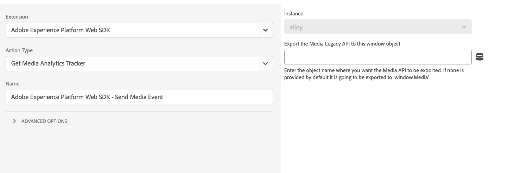
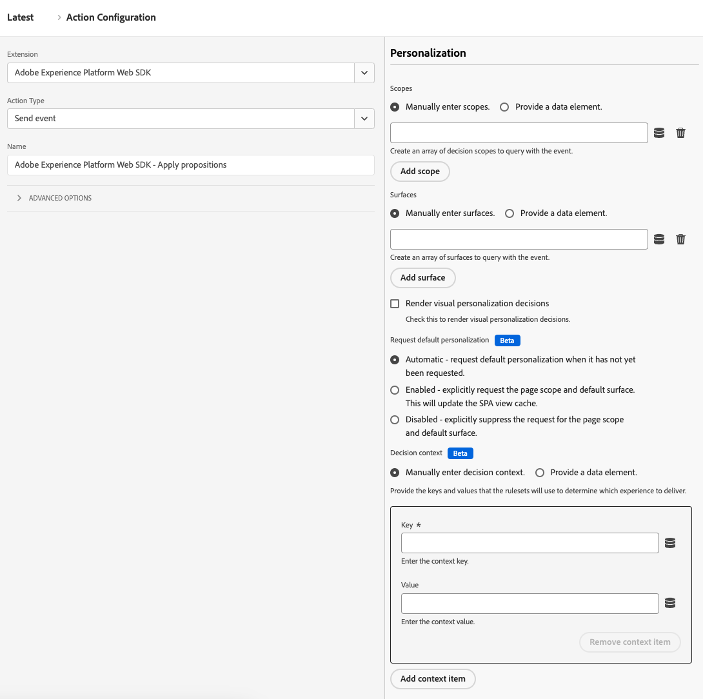

# Tipos de acción

Después de configurar la [extensión de etiquetas del SDK web de Adobe Experience Platform](web-sdk-extension-configuration.md), debe configurar los tipos de acción.

En esta página se describen los tipos de acción admitidos por la [extensión de etiqueta de SDK web de Adobe Experience Platform](web-sdk-extension-configuration.md).

## Aplicar propuestas {#apply-propositions}

El tipo de acción **[!UICONTROL Aplicar propuestas]** le permite procesar propuestas en aplicaciones de una sola página sin incrementar las métricas.

Este tipo de acción es útil cuando se trabaja con aplicaciones de una sola página en las que se vuelven a procesar partes de la página, sobrescribiendo potencialmente las personalizaciones ya aplicadas a la página.

Puede utilizar este tipo de acción para varios casos de uso, como:

1. **Procesar ofertas de HTML de mbox**. Las propuestas solicitadas explícitamente a través de un ámbito o superficie desde una acción **[!UICONTROL Enviar evento]** no se representan automáticamente. Puede usar el tipo de acción **[!UICONTROL Aplicar propuestas]** para indicarle al SDK web dónde procesarlas especificando los metadatos de la propuesta.
2. **Procesar las ofertas para una vista en una aplicación de una sola página**. Al procesar un evento de cambio de vista, si los datos de Analytics aún no están listos, puede utilizar la acción **[!UICONTROL Aplicar propuestas]** para procesar las propuestas de vista en la parte superior de la página. Consulte [eventos de parte superior e inferior de la página (segunda vista de página: opción 2)](../../../../web-sdk/use-cases/top-bottom-page-events.md) para obtener más información. Para usar esto, ingrese un **[!UICONTROL Nombre de vista]** en el formulario.
3. **Volver a procesar propuestas**. Cuando el sitio utiliza un marco de trabajo como React para volver a procesar contenido, es posible que tenga que volver a aplicar la personalización. En estos casos, puede usar la acción **[!UICONTROL Aplicar propuestas]** para hacerlo.

Este tipo de acción no enviará un evento de visualización para propuestas procesadas. Realizará un seguimiento de las propuestas procesadas para que se puedan incluir en las llamadas a **[!UICONTROL Send event]** subsiguientes.

Este tipo de acción admite los siguientes campos:

* **[!UICONTROL Propositions]**: matriz de objetos de propuesta que desea volver a procesar.
* **[!UICONTROL Nombre de vista]**: Nombre de la vista que se va a procesar.
* **[!UICONTROL Metadatos de la propuesta]**: Un objeto que determina cómo se pueden aplicar las ofertas del HTML. Puede proporcionar esta información a través del formulario o de un elemento de datos. Contiene las siguientes propiedades:
   * **[!UICONTROL Ámbito]**
   * **[!UICONTROL Selector]**
   * **[!UICONTROL Tipo de acción]**

## Aplicar respuesta {#apply-response}

Utilice el tipo de acción **[!UICONTROL Aplicar respuesta]** cuando desee realizar diversas acciones basadas en una respuesta del Edge Network. Este tipo de acción se utiliza generalmente en implementaciones híbridas en las que el servidor realiza una llamada inicial al Edge Network y, a continuación, toma la respuesta de esa llamada e inicializa el SDK web en el explorador.

El uso de este tipo de acción puede reducir los tiempos de carga del cliente para casos de uso de personalización híbrida.

Este tipo de acción admite las siguientes opciones de configuración:

* **[!UICONTROL Instancia]**: seleccione la instancia del SDK web que está utilizando.
* **[!UICONTROL Encabezados de respuesta]**: seleccione el elemento de datos que devuelve un objeto que contiene las claves de encabezado y los valores devueltos por la llamada al servidor del Edge Network.
* **[!UICONTROL Cuerpo de respuesta]**: seleccione el elemento de datos que devuelve el objeto que contiene la carga útil JSON proporcionada por la respuesta del Edge Network.
* **[!UICONTROL Procesar decisiones de personalización visuales]**: habilite esta opción para procesar automáticamente el contenido de personalización proporcionado por el Edge Network y ocultarlo previamente para evitar parpadeos.

## Evaluar conjuntos de reglas {#evaluate-rulesets}

Este tipo de acción déclencheur manualmente la evaluación del conjunto de reglas. Adobe Journey Optimizer devuelve los conjuntos de reglas para que sean compatibles con funciones como los mensajes en el explorador.

Este tipo de acción admite las siguientes opciones:

* **[!UICONTROL Procesar decisiones de personalización visuales]**: habilite esta opción para procesar decisiones de personalización visual para los elementos de conjunto de reglas que coincidan.
* **[!UICONTROL Contexto de decisión]**: Se trata de un mapa de clave-valor que se usa al evaluar conjuntos de reglas de Adobe Journey Optimizer para la toma de decisiones en el dispositivo. Puede proporcionar el contexto de decisión manualmente o mediante un elemento de datos.

## Obtener rastreador de Media Analytics {#get-media-analytics-tracker}

Esta acción se utiliza para obtener la API heredada de Media Analytics. Al configurar la acción y proporcionar un nombre de objeto, la API heredada de Media Analytics se exportará a ese objeto de ventana. Si no se proporciona ninguno, se exportará a `window.Media` como lo hace la biblioteca Media JS actual.

## Redirigir con identidad {#redirect-with-identity}

Utilice este tipo de acción para compartir identidades de la página actual con otros dominios. Esta acción está diseñada para utilizarse con un tipo de evento **[!UICONTROL click]** y una condición de comparación de valores. Consulte [Anexar identidad a una URL mediante la extensión del SDK web](../../../../web-sdk/commands/appendidentitytourl.md#extension) para obtener más información sobre cómo usar este tipo de acción.

## Enviar evento {#send-event}

Envía un evento a Experience Platform para que pueda recopilar los datos enviados y actuar con esa información. Los datos que desee enviar se pueden enviar en el campo **[!UICONTROL Datos XDM]**. Use un objeto [!DNL JSON] que se ajuste a la estructura del esquema [!DNL XDM]. Este objeto se puede crear en la página o mediante un **[!UICONTROL código personalizado]** **[!UICONTROL elemento de datos]**.

El tipo de acción **[!UICONTROL Enviar evento]** admite los campos y la configuración que se describen a continuación. Todos estos campos son opcionales.

### Configuración de instancias {#instance}

Utilice el selector **[!UICONTROL Instancia]** para elegir la instancia del SDK web que desea configurar. Si solo tiene una instancia, se preseleccionará.

* **[!UICONTROL Instancia]**: seleccione la instancia del SDK web que desea configurar. Si solo tiene una instancia, se preseleccionará.
* **[!UICONTROL Usar eventos guiados]**: habilite esta opción para rellenar u ocultar automáticamente ciertos campos y habilitar un caso de uso determinado. Al habilitar esta opción, se déclencheur la visualización de la siguiente configuración.
   * **[!UICONTROL Solicitar personalización]**: se pretende llamar a este evento en la parte superior de la página. Cuando se selecciona, este evento establece los siguientes campos:
      * **[!UICONTROL Tipo]**: **[!UICONTROL Recuperación de propuesta de decisión]**
      * **[!UICONTROL Enviar automáticamente un evento de visualización]**: **[!UICONTROL false]**
      * Para procesar automáticamente la personalización en este caso, habilite la opción **[!UICONTROL Procesar decisiones de personalización visuales]**.
   * **[!UICONTROL Recopilar análisis]**: se pretende llamar a este evento en la parte inferior de la página. Cuando se selecciona, este evento establece los siguientes campos:
      * **[!UICONTROL Incluir propuestas procesadas]**: **[!UICONTROL true]**
      * La configuración de **[!UICONTROL Personalization]** está oculta

  >[!NOTE]
  >
  >Los eventos guiados están relacionados con [los eventos superiores e inferiores de la página](../../../../web-sdk/use-cases/top-bottom-page-events.md).

### Datos {#data}

* **[!UICONTROL Tipo]**: este campo le permite especificar un tipo de evento que se registrará en el esquema XDM. Consulte [`type`](/help/web-sdk/commands/sendevent/type.md) en el comando `sendEvent` para obtener más información.
* **[!UICONTROL XDM]**:
* **[!UICONTROL Datos]**: utilice este campo para enviar datos que no coincidan con un esquema XDM. Este campo es útil si intenta actualizar un perfil de Adobe Target o enviar atributos de Recommendations de Target. Consulte [`data`](/help/web-sdk/commands/sendevent/data.md) en el comando `sendEvent` para obtener más información.
* **[!UICONTROL Incluir propuestas procesadas]**: habilite esta opción para incluir todas las propuestas que se han procesado, pero no se ha enviado ningún evento de visualización. Use esto en conjunto con **[!UICONTROL Enviar automáticamente un evento de visualización]** deshabilitado. Esta configuración actualiza el campo XDM `_experience.decisioning` con información sobre las propuestas procesadas.
* **[!UICONTROL Se descargará el documento]**: habilite esta opción para asegurarse de que los eventos lleguen al servidor incluso si el usuario sale de la página. Esto permite que los eventos lleguen al servidor, pero las respuestas se omiten.
* **[!UICONTROL Id. de combinación]**: **Este campo está obsoleto**. Esto rellenará el campo XDM `eventMergeId`.

### Personalización {#personalization}

* **[!UICONTROL Ámbitos]**: seleccione los ámbitos (Adobe Target [!DNL mboxes]) que desee solicitar explícitamente desde la personalización. Puede introducir los ámbitos manualmente o proporcionando un elemento de datos.
* **[!UICONTROL Superficies]**: configure las superficies web que están disponibles en la página para su personalización. Consulte la [documentación de Adobe Journey Optimizer](https://experienceleague.adobe.com/docs/journey-optimizer/using/web/create-web.html) para obtener más información.
* **Procesar decisiones de personalización visuales:** Si desea procesar contenido personalizado en su página, marque la casilla de verificación **[!UICONTROL Procesar decisiones de personalización visual]**. También puede especificar ámbitos de decisión o superficies si es necesario. Consulte la [documentación de personalización](/help/web-sdk/personalization/rendering-personalization-content.md#automatically-rendering-content) para obtener más información sobre cómo procesar contenido personalizado.
* **[!UICONTROL Solicitar personalización predeterminada]**: utilice esta sección para controlar si se solicitan el ámbito de toda la página (mbox global) y la superficie predeterminada (superficie web basada en la dirección URL actual). De manera predeterminada, esto se solicita automáticamente durante la primera llamada de `sendEvent` de la carga de la página. Puede elegir entre las siguientes opciones:
   * **[!UICONTROL Automático]**: Este es el comportamiento predeterminado. Solicitar solo la personalización predeterminada cuando aún no se ha solicitado. Esto corresponde a `requestDefaultPersonalization` no establecido en el comando del SDK web.
   * **[!UICONTROL Habilitado]**: solicite explícitamente el ámbito de página y la superficie predeterminada. SPA Esto actualiza la caché de vista de la. Esto corresponde a `requestDefaultPersonalization` establecido en `true`.
   * **[!UICONTROL Deshabilitado]**: suprime explícitamente la solicitud para el ámbito de página y la superficie predeterminada. Esto corresponde a `requestDefaultPersonalization` establecido en `false`.
* **[!UICONTROL Contexto de decisión]**: Se trata de un mapa de clave-valor que se usa al evaluar conjuntos de reglas de Adobe Journey Optimizer para la toma de decisiones en el dispositivo. Puede proporcionar el contexto de decisión manualmente o mediante un elemento de datos.

### Anulaciones de configuración de secuencia de datos {#datastream-overrides}

Las anulaciones de las secuencias de datos permiten definir configuraciones adicionales para las secuencias de datos, que pasan a la red perimetral mediante el SDK web.

Esto le ayuda a almacenar en déclencheur comportamientos de flujo de datos diferentes a los predeterminados, sin crear un nuevo flujo de datos ni modificar la configuración existente. Consulte la documentación sobre [configuración de invalidaciones de secuencia de datos](web-sdk-extension-configuration.md#datastream-overrides) para obtener más detalles.

## Enviar evento multimedia {#send-media-event}

Envía un evento multimedia a Adobe Experience Platform o Adobe Analytics. Esta acción es útil cuando realiza un seguimiento de eventos de medios en el sitio web. Seleccione una instancia (si tiene más de una). La acción requiere un `playerId` que represente un identificador único para una sesión multimedia rastreada. También requiere **[!UICONTROL Calidad de la experiencia]** y un elemento de datos `playhead` al iniciar una sesión multimedia.

El tipo de acción **[!UICONTROL Enviar evento multimedia]** admite las siguientes propiedades:

* **[!UICONTROL Instancia]**: La instancia del SDK web que se está usando.
* **[!UICONTROL Tipo de evento de medios]**: El tipo de evento de medios que se está rastreando.
* **[!UICONTROL ID del reproductor]**: El identificador único de la sesión multimedia.
* **[!UICONTROL Cabezal de reproducción]**: Posición actual de la reproducción de contenido, en segundos.
* **[!UICONTROL Detalles de la sesión de contenido]**: al enviar un evento de inicio de contenido, se deben especificar los detalles necesarios de la sesión de contenido.
* **[!UICONTROL Detalles del capítulo]**: En esta sección puede especificar los detalles del capítulo al enviar un evento multimedia de inicio de capítulo.
* **[!UICONTROL Detalles de Advertising]**: al enviar un evento `AdBreakStart`, debe especificar los detalles de publicidad requeridos.
* **[!UICONTROL Detalles del pod de Advertising]**: detalles sobre el pod de publicidad al enviar un evento `AdStart`.
* **[!UICONTROL Detalles del error]**: Detalles sobre el error de reproducción que se está rastreando.
* **[!UICONTROL Detalles de actualización de estado]**: El estado del reproductor que se está actualizando.
* **[!UICONTROL Metadatos personalizados]**: Los metadatos personalizados sobre el evento multimedia que se está rastreando.
* **[!UICONTROL Calidad de la experiencia]**: La calidad multimedia de los datos de experiencia de los que se está realizando un seguimiento.

## Definir consentimiento {#set-consent}

Una vez que haya recibido el consentimiento de su usuario, este se debe comunicar al SDK para web de Adobe Experience Platform mediante el tipo de acción Definir consentimiento. Actualmente se admiten dos tipos de estándares: Adobe y IAB TCF. Ver [Preferencias de consentimiento del cliente de soporte](../../../../web-sdk/commands/setconsent.md). Al utilizar la versión 2.0 del Adobe, solo se admite un valor de elemento de datos. Deberá crear un elemento de datos que se resuelva en el objeto de consentimiento.

En esta acción, también se le proporciona un campo opcional para incluir un mapa de identidad, de modo que las identidades se puedan sincronizar una vez recibido el consentimiento. La sincronización es útil cuando el consentimiento está configurado como Pendiente o Fuera porque la llamada de consentimiento es probablemente la primera llamada a activación.

## Actualizar variable {#update-variable}

Utilice esta acción para modificar un objeto XDM como resultado de un evento. Esta acción está diseñada para crear un objeto al que posteriormente se pueda hacer referencia desde una acción **[!UICONTROL Enviar evento]** para registrar el objeto XDM de evento.

Para usar este tipo de acción, debe haber definido un elemento de datos [variable](data-element-types.md#variable). Una vez que elija un elemento de datos de variable para modificar, aparecerá un editor, similar al editor del elemento de datos [XDM object](data-element-types.md#xdm-object).

El esquema XDM utilizado para el editor es el esquema seleccionado en el elemento de datos [!UICONTROL variable]. Puede establecer una o más propiedades del objeto haciendo clic en una de las propiedades del árbol de la izquierda y, a continuación, modificando el valor de la derecha. Por ejemplo, en la captura de pantalla siguiente, la propiedad productionBy se establece en el elemento de datos &quot;Producido por el elemento de datos&quot;.

Existen algunas diferencias entre el editor de la acción de la variable de actualización y el editor del elemento de datos del objeto XDM. En primer lugar, la acción de actualización de la variable tiene un elemento de nivel raíz denominado &quot;xdm&quot;. Si hace clic en este elemento, puede especificar un elemento de datos para utilizar y establecer el objeto completo. En segundo lugar, la acción actualizar variable tiene casillas de verificación para borrar los datos del objeto xdm. Haga clic en una de las propiedades de la izquierda y, a continuación, marque la casilla de verificación de la derecha para borrar el valor. Esto borrará el valor actual antes de establecer cualquier valor en la variable.

## Pasos siguientes {#next-steps}

Después de leer este artículo, debería comprender mejor cómo configurar sus acciones. A continuación, obtenga información sobre cómo [configurar los tipos de elementos de datos](data-element-types.md).
