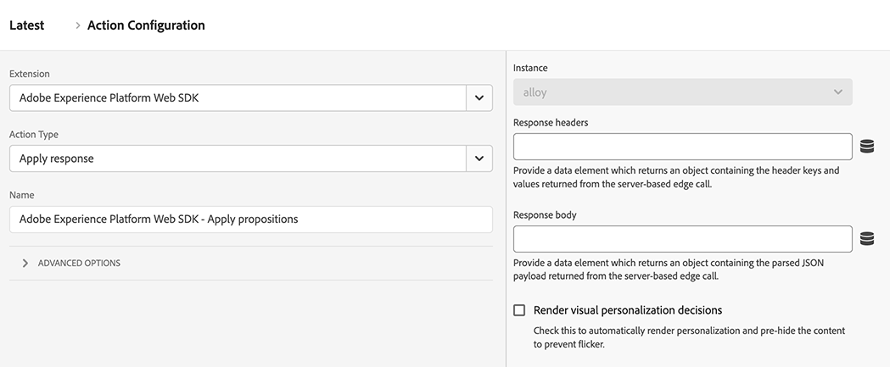

# Aplicar respuesta

El tipo de acción **[!UICONTROL Apply response]** le permite realizar diversas acciones en función de una respuesta de Edge Network. Este tipo de acción se utiliza generalmente en implementaciones híbridas en las que el servidor realiza una llamada inicial a Edge Network y, a continuación, toma la respuesta de esa llamada e inicializa Web SDK en el explorador. El uso de este tipo de acción puede reducir los tiempos de carga del cliente para casos de uso de personalización híbrida.

1. Inicie sesión en [experience.adobe.com](https://experience.adobe.com) con sus credenciales de Adobe ID.
1. Vaya a **[!UICONTROL Data Collection]** > **[!UICONTROL Tags]**.
1. Seleccione la propiedad de etiquetas que desee.
1. Vaya a **[!UICONTROL Rules]** y, a continuación, seleccione la regla que desee.
1. En [!UICONTROL Actions], seleccione una acción existente o cree una acción.
1. Establezca el campo desplegable [!UICONTROL Extension] en **[!UICONTROL Adobe Experience Platform Web SDK]**, luego establezca [!UICONTROL Action type] en **[!UICONTROL Apply response]**.

## Casos de uso

* **División manual entre la recopilación de datos y la personalización**: puede almacenar en déclencheur una acción [Enviar evento](send-event.md) con decisiones de procesamiento establecidas en `false` y luego hacer que una regla &quot;Enviar evento completado&quot; alcance la promesa. La primera acción dentro de esta regla puede ser &quot;Aplicar respuesta&quot;. Este flujo de trabajo permite retrasar la manipulación de DOM hasta que el código de su propia organización termine con el resto del trabajo.
* **Respuesta de Edge recibida desde fuera de Web SDK**: si utiliza otra biblioteca para comunicarse con Edge Network, puede permitir que Web SDK siga controlando la respuesta de Edge Network mediante esta acción.

## Campos disponibles

Este tipo de acción admite las siguientes opciones de configuración:

* **[!UICONTROL Instance]**: la instancia de SDK a la que se aplica la acción. Este menú desplegable está desactivado si su implementación utiliza una sola instancia de SDK.
* **[!UICONTROL Response headers]**: seleccione el elemento de datos que devuelve un objeto que contiene las claves de encabezado y los valores devueltos por la llamada al servidor de Edge Network.
* **[!UICONTROL Response body]**: seleccione el elemento de datos que devuelve el objeto que contiene la carga útil JSON proporcionada por la respuesta de Edge Network.
* **[!UICONTROL Render visual personalization decisions]**: active esta opción para procesar automáticamente el contenido de personalización proporcionado por Edge Network y ocultarlo previamente para evitar parpadeos.
