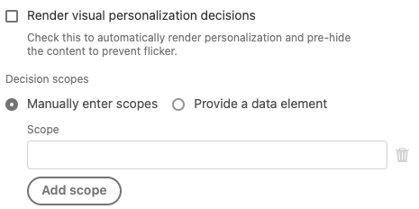

# Tipos de eventos

En esta página se describen los tipos de eventos de Adobe Experience Platform que proporciona la extensión de etiquetas de SDK web de Adobe Experience Platform. Están acostumbrados a [generar reglas](https://experienceleague.adobe.com/docs/platform-learn/data-collection/tags/build-rules.html) y no deben confundirse con el [`eventType` Campo en XDM](https://experienceleague.adobe.com/docs/experience-platform/edge/fundamentals/tracking-events.html?lang=es).

## [!UICONTROL Enviar evento completado]

Normalmente, la propiedad tendría una o más reglas que utilizan el [[!UICONTROL Enviar evento] acción](action-types.md#send-event) para enviar eventos a Adobe Experience Platform Edge Network. Cada vez que se envía un evento a Edge Network, se devuelve una respuesta al explorador con datos útiles. Sin el [!UICONTROL Enviar evento completado] tipo de evento, no tendría acceso a estos datos devueltos.

Para acceder a los datos devueltos, cree una regla independiente y, a continuación, añada una [!UICONTROL Enviar evento completado] a la regla. Esta regla se activa cada vez que se recibe una respuesta correcta del servidor como resultado de un [!UICONTROL Enviar evento] acción.

Cuando un [!UICONTROL Enviar evento completado] déclencheur una regla, proporciona datos devueltos por el servidor que pueden ser útiles para realizar determinadas tareas. Normalmente, agregará un [!UICONTROL Custom Code] acción (desde el [!UICONTROL Núcleo] extensión) a la misma regla que contiene la variable [!UICONTROL Enviar evento completado] evento. En el [!UICONTROL Custom Code] acción, el código personalizado tendrá acceso a una variable denominada `event`. Esta `event` contendrá los datos devueltos por el servidor.

La regla para administrar los datos devueltos por Edge Network puede tener un aspecto similar al siguiente:


A continuación se muestran algunos ejemplos de cómo realizar determinadas tareas utilizando [!UICONTROL Custom Code] acción en esta regla.

### Procesar manualmente contenido personalizado

En la acción Custom Code, que se encuentra en la regla para administrar los datos de respuesta, puede acceder a las propuestas de personalización que se devolvieron desde el servidor. Para ello, debe escribir el siguiente código personalizado:

```javascript
var propositions = event.propositions;
```

If `event.propositions` existe, es una matriz que contiene objetos de propuesta de personalización. Las propuestas incluidas en la matriz están determinadas, en gran parte, por la forma en que se envió el evento al servidor.

Para este primer escenario, supongamos que no ha marcado la variable [!UICONTROL Procesar decisiones] y no han proporcionado ninguna [!UICONTROL ámbitos de decisión] dentro de [!UICONTROL Enviar evento] acción responsable de enviar el evento.



En este ejemplo, la variable `propositions` La matriz solo contiene propuestas relacionadas con el evento que pueden procesarse automáticamente.

El `propositions` La matriz puede tener un aspecto similar al de este ejemplo:

```json
[
  {
    "id": "AT:eyJhY3Rpdml0eUlkIjoiMTI3MDE5IiwiZXhwZXJpZW5jZUlkIjoiMCJ9",
    "scope": "__view__",
    "items": [
      {
        "id": "11223344",
        "schema": "https://ns.adobe.com/personalization/dom-action",
        "data": {
          "content": "<h2 style=\"color: yellow\">An HTML proposition.</h2>",
          "selector": "#hero",
          "type": "setHtml"
        },
        "meta": {}
      }
    ],
    "renderAttempted": false
  },
  {
    "id": "AT:PyJhY3Rpdml0eUlkIjoiMTI3MDE5IiwiZXhwZXJpZW5jZUlkIjoiMCJ8",
    "scope": "__view__",
    "items": [
      {
        "id": "11223345",
        "schema": "https://ns.adobe.com/personalization/dom-action",
        "data": {
          "content": "<h2 style=\"color: yellow\">Another HTML proposition.</h2>",
          "selector": "#sidebar",
          "type": "setHtml"
        },
        "meta": {}
      }
    ],
    "renderAttempted": false
  }
]
```

Al enviar el evento, la variable [!UICONTROL Procesar decisiones] La casilla de verificación de no estaba marcada, por lo que el SDK no intentó procesar automáticamente ningún contenido. Sin embargo, el SDK recuperó automáticamente el contenido apto para el procesamiento automático y le proporcionó el procesamiento manual si así lo desea. Observe que cada objeto de propuesta tiene su `renderAttempted` propiedad establecida en `false`.

Si, en su lugar, hubiera marcado la [!UICONTROL Procesar decisiones] casilla de verificación al enviar el evento, el SDK habría intentado procesar todas las propuestas elegibles para el procesamiento automático. Como consecuencia, cada uno de los objetos de la propuesta tendría su `renderAttempted` propiedad establecida en `true`. No sería necesario procesar manualmente estas propuestas en este caso.

Hasta ahora, solo ha visto el contenido de personalización que puede procesarse automáticamente (por ejemplo, cualquier contenido creado en el Compositor de experiencias visuales de Adobe Target). Para recuperar cualquier contenido de personalización _no_ apto para el procesamiento automático, solicite el contenido proporcionando ámbitos de decisión utilizando [!UICONTROL Ámbitos de decisión] en el campo [!UICONTROL Enviar evento] acción. Un ámbito es una cadena que identifica una propuesta concreta que desea recuperar del servidor.

El [!UICONTROL Enviar evento] La acción tendría el siguiente aspecto:


En este ejemplo, si las propuestas se encuentran en el servidor que coinciden con la variable `salutation` o `discount` ámbito, se devuelven y se incluyen en la variable `propositions` matriz. Tenga en cuenta que las propuestas que cumplen los requisitos para el procesamiento automático seguirán incluyéndose en la `propositions` , independientemente de cómo configure la [!UICONTROL Procesar decisiones] o [!UICONTROL Ámbitos de decisión] campos en la [!UICONTROL Enviar evento] acción. El `propositions` , en este caso, tendría un aspecto similar al de este ejemplo:

```json
[
  {
    "id": "AT:cZJhY3Rpdml0eUlkIjoiMTI3MDE5IiwiZXhwZXJpZW5jZUlkIjoiMCJ2",
    "scope": "salutation",
    "items": [
      {
        "schema": "https://ns.adobe.com/personalization/json-content-item",
        "data": {
          "id": "4433221",
          "content": {
            "salutation": "Welcome, esteemed visitor!"
          }
        },
        "meta": {}
      }
    ],
    "renderAttempted": false
  },
  {
    "id": "AT:FZJhY3Rpdml0eUlkIjoiMTI3MDE5IiwiZXhwZXJpZW5jZUlkIjoiMCJ0",
    "scope": "discount",
    "items": [
      {
        "schema": "https://ns.adobe.com/personalization/html-content-item",
        "data": {
          "id": "4433222",
          "content": "<div>50% off your order!</div>",
          "format": "text/html"
        },
        "meta": {}
      }
    ],
    "renderAttempted": false
  },
  {
    "id": "AT:eyJhY3Rpdml0eUlkIjoiMTI3MDE5IiwiZXhwZXJpZW5jZUlkIjoiMCJ9",
    "scope": "__view__",
    "items": [
      {
        "id": "11223344",
        "schema": "https://ns.adobe.com/personalization/dom-action",
        "data": {
          "content": "<h2 style=\"color: yellow\">An HTML proposition.</h2>",
          "selector": "#hero",
          "type": "setHtml"
        },
        "meta": {}
      }
    ],
    "renderAttempted": false
  },
  {
    "id": "AT:PyJhY3Rpdml0eUlkIjoiMTI3MDE5IiwiZXhwZXJpZW5jZUlkIjoiMCJ8",
    "scope": "__view__",
    "items": [
      {
        "id": "11223345",
        "schema": "https://ns.adobe.com/personalization/dom-action",
        "data": {
          "content": "<h2 style=\"color: yellow\">Another HTML proposition.</h2>",
          "selector": "#sidebar",
          "type": "setHtml"
        },
        "meta": {}
      }
    ],
    "renderAttempted": false
  }
]
```

En este punto, puede procesar el contenido de la propuesta como crea conveniente. En este ejemplo, la propuesta que coincide con el `discount` El ámbito es una propuesta del HTML creada con el Compositor de experiencias basadas en formularios de Adobe Target. Supongamos que tiene un elemento en la página con el ID de `daily-special` y desea procesar el contenido del `discount` propuesta en la `daily-special` Elemento. Haga lo siguiente:

1. Extraer propuestas de `event` objeto.
1. Recorra en bucle cada propuesta, buscando la propuesta con un ámbito de `discount`.
1. Si encuentra una propuesta, revise cada elemento de la propuesta en busca del elemento que sea contenido del HTML. (Es mejor comprobar que suponer).
1. Si encuentra un elemento con contenido de HTML, busque la variable `daily-special` en la página y reemplace su HTML por el contenido personalizado.

Su código personalizado dentro de [!UICONTROL Custom Code] la acción puede aparecer de la siguiente manera:

```javascript
var propositions = event.propositions;

var discountProposition;
if (propositions) {
  // Find the discount proposition, if it exists.
  for (var i = 0; i < propositions.length; i++) {
    var proposition = propositions[i]; 
    if (proposition.scope === "discount") {
      discountProposition = proposition;
      break;
    }
  }
}

var discountHtml;
if (discountProposition) {
  // Find the item from proposition that should be rendered.
  // Rather than assuming there a single item that has HTML
  // content, find the first item whose schema indicates
  // it contains HTML content.
  for (var j = 0; j < discountProposition.items.length; j++) {
    var discountPropositionItem = discountProposition.items[i]; 
    if (discountPropositionItem.schema === "https://ns.adobe.com/personalization/html-content-item") {
      discountHtml = discountPropositionItem.data.content;
      break;
    }
  }
}

if (discountHtml) {
  // Discount HTML exists. Time to render it.
  var dailySpecialElement = document.getElementById("daily-special");
  dailySpecialElement.innerHTML = discountHtml;
}
```

### Acceso a tokens de respuesta de Adobe Target

El contenido de personalización devuelto desde Adobe Target incluye [tokens de respuesta](https://experienceleague.adobe.com/docs/target/using/administer/response-tokens.html), que son detalles sobre la actividad, oferta, experiencia, perfil de usuario, información geográfica y más. Estos detalles se pueden compartir con herramientas de terceros o utilizar para la depuración. Los tokens de respuesta se pueden configurar en la interfaz de usuario de Adobe Target.

En la acción Custom Code, que se encuentra en la regla para administrar los datos de respuesta, puede acceder a las propuestas de personalización que se devolvieron desde el servidor. Para ello, escriba el siguiente código personalizado:

```javascript
var propositions = event.propositions;
```

If `event.propositions` existe, es una matriz que contiene objetos de propuesta de personalización. Consulte [Procesar manualmente contenido personalizado](#manually-render-personalized-content) para obtener más información sobre el contenido de `result.propositions`.

Supongamos que desea recopilar todos los nombres de las actividades de todas las propuestas que el SDK web procesó automáticamente e insertarlos en una sola matriz. A continuación, puede enviar la matriz única a un tercero. En este caso, escriba código personalizado dentro de la variable [!UICONTROL Custom Code] acción para:

1. Extraer propuestas de `event` objeto.
1. Recorra en bucle cada propuesta.
1. Determine si el SDK procesó la propuesta.
1. Si es así, realice un bucle en cada elemento de la propuesta.
1. Recupere el nombre de la actividad de la `meta` , que es un objeto que contiene tokens de respuesta.
1. Inserte el nombre de la actividad en una matriz.
1. Envíe los nombres de las actividades a un tercero.

```javascript
var propositions = event.propositions;
if (propositions) {
  var activityNames = [];
  propositions.forEach(function(proposition) {
    if (proposition.renderAttempted) {
      proposition.items.forEach(function(item) {
        if (item.meta) {
          // item.meta contains the response tokens.
          var activityName = item.meta["activity.name"];
          // Ignore duplicates
          if (activityNames.indexOf(activityName) === -1) {
            activityNames.push(activityName);  
          }
        }
      });
    }
  });
  // Now that activity names are in an array,
  // you can send them to a third party or use
  // them in some other way.
}
```
