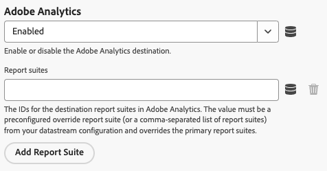

# Configuración de la extensión de etiquetas Web SDK

La extensión de etiquetas [!DNL Web SDK] envía datos a Adobe Experience Cloud desde las propiedades web a través de Experience Platform Edge Network.

La extensión de le permite transmitir datos a Platform, sincronizar identidades, procesar señales de consentimiento de clientes y recopilar automáticamente datos de contexto.

En este documento se explica cómo configurar la extensión de etiqueta en la interfaz de usuario de Etiquetas.

## Instalación de la extensión de etiquetas de Web SDK {#install}

La extensión de etiquetas Web SDK necesita que haya una propiedad instalada en. Si aún no lo ha hecho, consulte la documentación de [creación de una propiedad de etiqueta](https://experienceleague.adobe.com/docs/platform-learn/implement-in-websites/configure-tags/create-a-property.html).

Después de crear una propiedad, ábrala y seleccione la ficha **[!UICONTROL Extensiones]** en la barra lateral izquierda.

Seleccione la ficha **[!UICONTROL Catálogo]**. En la lista de extensiones disponibles, busque la extensión [!DNL Web SDK] y seleccione **[!UICONTROL Instalar]**.

Después de seleccionar **[!UICONTROL Instalar]**, debe configurar la extensión de etiquetas Web SDK y guardar la configuración.

>[!NOTE]
>
>La extensión de etiqueta solo se instala después de guardar la configuración. Consulte las secciones siguientes para obtener información sobre cómo configurar la extensión de etiqueta.

## Crear una compilación personalizada de Web SDK {#custom-build}

La biblioteca Web SDK incluye varios módulos para varias funciones, como personalización, identidad, seguimiento de vínculos y mucho más. Según sus casos de uso, es posible que solo necesite funciones específicas en lugar de toda la biblioteca. La creación de una versión personalizada de Web SDK le permite seleccionar solo los módulos que necesita, reducir el tamaño de la biblioteca y mejorar el rendimiento.

Al crear una compilación personalizada de Web SDK, esta se utiliza en todas las instancias de Web SDK.

>[!IMPORTANT]
>
>Al deshabilitar los componentes de Web SDK, se puede interrumpir la implementación existente. Cada vez que deshabilite un componente, asegúrese de probar la implementación a fondo para asegurarse de que todas las funcionalidades que necesita funcionan según lo esperado.
>Cuando desactiva un componente, ya no puede editar su configuración.

Para crear una compilación personalizada de Web SDK mediante la extensión de etiquetas de Web SDK, siga los pasos a continuación.

1. En la página de configuración de la extensión de etiquetas, expanda la sección **[!UICONTROL Componentes de compilación personalizados]**.
1. Active o desactive los componentes según sus necesidades. Puede seleccionar entre los siguientes componentes:
   * **[!UICONTROL Recopilador de actividades]**: este componente habilita la recopilación automática de vínculos y el seguimiento de Activity Map.
   * **[!UICONTROL Audiencias]**: Este componente habilita la integración de Audience Manager, incluidos los destinos basados en cookies y URL, y las sincronizaciones de ID.
   * **[!UICONTROL Consentimiento]**: este componente habilita las integraciones de consentimiento. Al deshabilitar este componente, se deshabilitan los siguientes elementos:
      * [Establecer tipo de acción de consentimiento](action-types.md#set-consent)
   * **[!UICONTROL Contexto]**: este componente habilita la recopilación automática de datos de contexto.
   * **[!UICONTROL Combinación de eventos]**: _Obsoleto_. Al deshabilitar este componente, se deshabilitan los siguientes elementos:
      * [ID de combinación de eventos](action-types.md#data) elemento de datos
      * **[!UICONTROL Restablecer tipo de acción de ID de combinación de eventos]**
   * **[!UICONTROL Puente de Media Analytics]**: Este componente habilita Edge Network Streaming Media mediante la interfaz de Media Analytics. Al deshabilitar este componente, se deshabilitan los siguientes elementos:
      * [Obtener rastreador de Media Analytics](action-types.md#get-media-analytics-tracker) tipo de acción
   * **[!UICONTROL Personalization]**: este componente habilita las integraciones de Adobe Target y Adobe Journey Optimizer. Al deshabilitar este componente, se deshabilitan los siguientes elementos:
      * [Aplicar propuesta de tipo action](action-types.md)
   * **[!UICONTROL Motor de reglas]**: Este componente habilita la toma de decisiones en el dispositivo de Adobe Journey Optimizer. Al deshabilitar este componente, se deshabilitan los siguientes elementos:
      * [Evaluar conjuntos de reglas](action-types.md#evaluate-rulesets) tipo de acción
      * [Suscribir elementos de conjunto de reglas](event-types.md#subscribe-ruleset-items) tipo de evento
   * **[!UICONTROL Medios de streaming]**: Este componente habilita los medios de streaming de Edge Network. Al deshabilitar este componente, se deshabilitan los siguientes elementos:
      * [Enviar evento multimedia](action-types.md#send-media-event) tipo de acción

## Configuración de la instancia {#general}

Las opciones de configuración en la parte superior de la página indican a Adobe Experience Platform dónde enrutar los datos y qué configuraciones utilizar en el servidor.

* **[!UICONTROL Nombre]**: la extensión de Adobe Experience Platform Web SDK admite varias instancias en la página. El nombre se utiliza para enviar datos a varias organizaciones con una configuración de etiquetas. El nombre de instancia predeterminado es `alloy`. Sin embargo, puede cambiar el nombre de la instancia a cualquier nombre de objeto de JavaScript válido.
* **[!UICONTROL ID de organización de IMS]**: El ID de la organización a la que desea que se envíen los datos en Adobe. La mayoría de las veces, utilice el valor predeterminado que se rellena automáticamente. Cuando tenga varias instancias en la página, rellene este campo con el valor de la segunda organización a la que desee enviar datos.
* **[!UICONTROL Dominio de Edge]**: Dominio desde el cual la extensión envía y recibe datos. Adobe recomienda utilizar un dominio de origen (CNAME) para esta extensión. El dominio de terceros predeterminado funciona para entornos de desarrollo, pero no es adecuado para entornos de producción. Las instrucciones sobre cómo configurar un CNAME de origen se enumeran [aquí](https://experienceleague.adobe.com/docs/core-services/interface/ec-cookies/cookies-first-party.html?lang=es).

## Configuración del flujo de datos {#datastreams}

Esta sección le permite seleccionar los flujos de datos que deben utilizarse para cada uno de los tres entornos disponibles (producción, ensayo y desarrollo).

Cuando se envía una solicitud a Edge Network, se utiliza un ID de conjunto de datos para hacer referencia a la configuración del lado del servidor. Puede actualizar la configuración sin tener que realizar cambios en el código del sitio web.

Consulte la guía de [flujos de datos](../../../../datastreams/overview.md) para obtener información sobre cómo configurar un flujo de datos.

Puede elegir una secuencia de datos de los menús desplegables disponibles, o seleccionar **[!UICONTROL Introducir valores]** e introducir un ID de secuencia de datos personalizado para cada entorno.

## Configuración de privacidad {#privacy}

Esta sección le permite configurar cómo Web SDK gestiona las señales de consentimiento de los usuarios desde el sitio web. En concreto, le permite seleccionar el nivel de consentimiento predeterminado que se supone de un usuario si no se ha proporcionado ninguna otra preferencia de consentimiento explícita.

El nivel de consentimiento predeterminado no se guarda en el perfil de usuario.

| [!UICONTROL Nivel de consentimiento predeterminado] | Descripción |
| --- | --- |
| [!UICONTROL En] | Recopilar eventos que se producen antes de que el usuario proporcione preferencias de consentimiento. |
| [!UICONTROL Fuera] | Descartar los eventos que se producen antes de que el usuario proporcione preferencias de consentimiento. |
| [!UICONTROL Pendiente] | Eventos de cola que se producen antes de que el usuario proporcione preferencias de consentimiento. Cuando se proporcionan las preferencias de consentimiento, los eventos se recopilan o descartan según las preferencias proporcionadas. |
| [!UICONTROL Proporcionado por el elemento de datos] | El nivel de consentimiento predeterminado está determinado por un elemento de datos independiente que usted defina. Al utilizar esta opción, debe especificar el elemento de datos mediante el menú desplegable proporcionado. |

>[!TIP]
>
>Use **[!UICONTROL Out]** o **[!UICONTROL Pending]** si necesita el consentimiento explícito del usuario para sus operaciones comerciales.

## Configuración de la identidad {#identity}

Esta sección le permite definir el comportamiento de Web SDK cuando se trata de gestionar la identificación del usuario.

* **[!UICONTROL Migrar ECID desde VisitorAPI]**: esta opción está habilitada de manera predeterminada. Cuando esta característica está habilitada, SDK puede leer las cookies `AMCV` y `s_ecid` y establecer la cookie `AMCV` que usa [!DNL Visitor.js]. Esta característica es importante al migrar a Web SDK, ya que algunas páginas podrían seguir utilizando [!DNL Visitor.js]. Esta opción permite que SDK siga usando el mismo(a) [!DNL ECID] para que los usuarios no se identifiquen como dos usuarios independientes.
* **[!UICONTROL Usar cookies de terceros]**: cuando esta opción está habilitada, Web SDK intenta almacenar un identificador de usuario en una cookie de terceros. Si se realiza correctamente, el usuario se identifica como un solo usuario a medida que navega por varios dominios, en lugar de identificarse como un usuario independiente en cada dominio. Si esta opción está habilitada, es posible que SDK aún no pueda almacenar el identificador de usuario en una cookie de terceros si el explorador no admite cookies de terceros o si el usuario lo ha configurado para no permitir cookies de terceros. En este caso, SDK solo almacena el identificador en el dominio de origen.

  >[!IMPORTANT]
  >>Las cookies de terceros no son compatibles con la funcionalidad [ID de dispositivo de origen](../../../../web-sdk/identity/first-party-device-ids.md) en Web SDK.
Puede usar ID de dispositivos de origen o cookies de terceros, pero no puede usar ambas funciones simultáneamente.
  >
## Configuración de la personalización {#personalization}

Esta sección le permite configurar cómo desea ocultar determinadas partes de una página mientras se carga contenido personalizado. Esto garantiza que los visitantes solo vean la página personalizada.

* **[!UICONTROL Migrar Target de at.js a Web SDK]**: use esta opción para permitir que [!DNL Web SDK] lea y escriba las cookies heredadas de `mbox` y `mboxEdgeCluster` que usan las bibliotecas de at.js `1.x` o `2.x`. Esto le ayuda a mantener el perfil del visitante mientras se desplaza de una página que utiliza Web SDK a una página que utiliza bibliotecas at.js `1.x` o `2.x`, y viceversa.

### Estilo preocultado {#prehiding-style}

El editor de estilos preocultado permite definir reglas CSS personalizadas para ocultar secciones específicas de una página. Cuando se carga la página, Web SDK utiliza este estilo para ocultar las secciones que deben personalizarse, recupera la personalización y, a continuación, muestra las secciones de página personalizadas. De este modo, los visitantes ven las páginas ya personalizadas, sin ver el proceso de recuperación de la personalización.

### Preocultando fragmento {#prehiding-snippet}

El fragmento preocultado es útil cuando la biblioteca Web SDK se carga asincrónicamente. En este caso, para evitar parpadeos, se recomienda ocultar el contenido antes de cargar la biblioteca Web SDK.

Para utilizar el fragmento preocultado, cópielo y péguelo dentro del elemento `<head>` de su página.

>[!IMPORTANT]
>
Al utilizar el fragmento preocultado, Adobe recomienda utilizar la misma regla de [!DNL CSS] que la utilizada por el [estilo preocultado](#prehiding-style).

## Configuración de la recopilación de datos {#data-collection}

Administrar las opciones de configuración de recopilación de datos. Hay configuraciones similares disponibles en la biblioteca JavaScript mediante el comando [`configure`](/help/web-sdk/commands/configure/overview.md).

* **[!UICONTROL Activado antes de la devolución de llamada de envío de evento]**: Una función de devolución de llamada para evaluar y modificar la carga útil enviada a Adobe. Utilice la variable `content` dentro de la función de devolución de llamada para modificar la carga útil. Esta llamada de retorno es la etiqueta equivalente a [`onBeforeEventSend`](/help/web-sdk/commands/configure/onbeforeeventsend.md) en la biblioteca de JavaScript.
* **[!UICONTROL Recopilar clics en vínculos internos]**: Casilla de verificación que permite recopilar datos de seguimiento de vínculos internos del sitio o la propiedad. Al activar esta casilla de verificación, aparecen las opciones de agrupación de eventos:
   * **[!UICONTROL Sin agrupación de eventos]**: los datos de seguimiento de vínculos se envían a Adobe en eventos independientes. Los clics en vínculos enviados en eventos independientes pueden aumentar el uso contractual de los datos enviados a Adobe Experience Platform.
   * **[!UICONTROL Agrupación de eventos mediante el almacenamiento de sesión]**: almacena los datos de seguimiento de vínculos en el almacenamiento de sesión hasta el siguiente evento de página. En la página siguiente, los datos de seguimiento de vínculos almacenados y los datos de vista de página se envían a Adobe al mismo tiempo. Adobe recomienda habilitar esta configuración al realizar el seguimiento de vínculos internos.
   * **[!UICONTROL Agrupación de eventos mediante el objeto local]**: almacena los datos de seguimiento de vínculos en un objeto local hasta el siguiente evento de página. Si un visitante navega a una página nueva, se pierden los datos de seguimiento de vínculos. Esta configuración es más beneficiosa en el contexto de aplicaciones de una sola página.
* **[!UICONTROL Recopilar clics en vínculos externos]**: Casilla de verificación que habilita la recopilación de vínculos externos.
* **[!UICONTROL Recopilar clics en vínculos de descarga]**: Casilla de verificación que habilita la recopilación de vínculos de descarga.
* **[!UICONTROL Calificador de vínculo de descarga]**: una expresión regular que califica una dirección URL de vínculo como vínculo de descarga.
* **[!UICONTROL Filtrar propiedades de clic]**: una función de devolución de llamada para evaluar y modificar las propiedades relacionadas con los clics antes de la colección. Esta función se ejecuta antes de [!UICONTROL Activado antes de la devolución de llamada del envío de evento].
* **Configuración de contexto**: recopile automáticamente información del visitante para rellenar automáticamente campos XDM específicos. Puede elegir **[!UICONTROL Toda la información contextual predeterminada]** o **[!UICONTROL Información contextual específica]**. Es la etiqueta equivalente a [`context`](/help/web-sdk/commands/configure/context.md) en la biblioteca de JavaScript.
   * **[!UICONTROL Web]**: recopila información sobre la página actual.
   * **[!UICONTROL Dispositivo]**: recopila información sobre el dispositivo del usuario.
   * **[!UICONTROL Entorno]**: recopila información acerca del explorador del usuario.
   * **[!UICONTROL Contexto del lugar]**: recopila información sobre la ubicación del usuario.
   * **[!UICONTROL Sugerencias de usuario-agente de alta entropía]**: Recopila información más detallada acerca del dispositivo del usuario.

>[!TIP]
>
El campo **[!UICONTROL Activado antes de hacer clic en el vínculo enviar]** es una llamada de retorno obsoleta que solo está visible para propiedades que ya lo tienen configurado. Es la etiqueta equivalente a [`onBeforeLinkClickSend`](/help/web-sdk/commands/configure/onbeforelinkclicksend.md) en la biblioteca de JavaScript. Use la llamada de retorno **[!UICONTROL Filtrar propiedades de clic]** para filtrar o ajustar datos de clics, o use la llamada de retorno **[!UICONTROL Activado antes del envío de evento]** para filtrar o ajustar la carga útil general enviada a Adobe. Si se establecen tanto la devolución de llamada **[!UICONTROL Filter click properties]** como la devolución de llamada **[!UICONTROL Activada antes de enviar clic en vínculo]**, solo se ejecutará la devolución de llamada **[!UICONTROL Filter click properties]**.

## Configuración de la colección de medios {#media-collection}

La función de recopilación de contenido le ayuda a recopilar datos relacionados con las sesiones de contenido del sitio web.

Los datos recopilados pueden incluir información sobre reproducciones de contenido, pausas, finalizaciones y otros eventos relacionados. Una vez recopilados, puede enviar estos datos a Adobe Experience Platform o Adobe Analytics para generar informes. Esta función proporciona una solución completa para realizar el seguimiento y comprender el comportamiento del consumo de medios en el sitio web.

* **[!UICONTROL Canal]**: Nombre del canal donde se produce la recopilación de medios. Ejemplo: `Video channel`.
* **[!UICONTROL Nombre del reproductor]**: El nombre del reproductor multimedia.
* **[!UICONTROL Versión de la aplicación]**: La versión de la aplicación del reproductor multimedia.
* **[!UICONTROL Intervalo de ping principal]**: Frecuencia de pings para el contenido principal, en segundos. El valor predeterminado es `10`. Los valores pueden oscilar entre `10` y `50` segundos.  Si no se especifica ningún valor, se usa el valor predeterminado al usar [sesiones con seguimiento automático](../../../../web-sdk/commands/createmediasession.md#automatic).
* **[!UICONTROL Intervalo de ping de anuncio]**: Frecuencia de pings para contenido de anuncio, en segundos. El valor predeterminado es `10`. Los valores pueden oscilar entre `1` y `10` segundos. Si no se especifica ningún valor, se usa el valor predeterminado al usar [sesiones con seguimiento automático](../../../../web-sdk/commands/createmediasession.md#automatic)

## Configurar anulaciones de secuencia de datos {#datastream-overrides}

Las anulaciones de las secuencias de datos permiten definir configuraciones adicionales para las secuencias de datos, que pasan a la red perimetral mediante el SDK web.

Esto le ayuda a activar comportamientos de secuencias de datos diferentes de los predeterminados, sin crear una nueva secuencia de datos ni modificar la configuración existente.

La anulación de la configuración de la secuencia de datos es un proceso de dos pasos:

1. En primer lugar, debe definir las anulaciones de configuración de la secuencia de datos en la [página de configuración de secuencia de datos](/help/datastreams/configure.md).
2. A continuación, debe enviar las invalidaciones a Edge Network mediante un comando de Web SDK o utilizando la extensión de etiquetas de Web SDK.

Consulte la documentación sobre las anulaciones de configuración de la secuencia de datos [1} para obtener instrucciones detalladas sobre cómo anular las configuraciones de la secuencia de datos.](/help/datastreams/overrides.md)

Como alternativa a pasar las invalidaciones a través de un comando de Web SDK, puede configurarlas en la pantalla de extensión de etiquetas que se muestra a continuación.

>[!IMPORTANT]
>
Las anulaciones de flujos de datos deben configurarse por entorno. Los entornos de desarrollo, ensayo y producción tienen invalidaciones independientes. Puede copiar los ajustes entre ellos utilizando las opciones dedicadas que se muestran en la pantalla siguiente.

De forma predeterminada, la anulación de la configuración de la secuencia de datos está desactivada. La opción **[!UICONTROL Coincidir configuración de secuencia de datos]** está seleccionada de forma predeterminada.

Para habilitar las invalidaciones de secuencia de datos en la extensión de etiqueta, seleccione **[!UICONTROL Habilitado]** en el menú desplegable.

Después de habilitar las invalidaciones de configuración de la secuencia de datos, puede configurar las invalidaciones para cada servicio descrito a continuación.

La configuración de anulación de la secuencia de datos que aparece a continuación anulará cualquier configuración y regla del conjunto de datos del lado del servidor para el entorno seleccionado.

### Adobe Analytics {#analytics}

Utilice la configuración de esta sección para anular el enrutamiento de datos al servicio Adobe Analytics.

* **[!UICONTROL Habilitado]** / **[!UICONTROL Deshabilitado]**: Use este menú desplegable para habilitar o deshabilitar el enrutamiento de datos al servicio Adobe Analytics.
* **[!UICONTROL Grupos de informes]**: Los ID de los grupos de informes de destino en Adobe Analytics. El valor debe ser un grupo de informes de anulación preconfigurado (o una lista de grupos de informes separados por comas) de la configuración del conjunto de datos. Esta configuración anula los grupos de informes principales.
* **[!UICONTROL Agregar grupo de informes]**: seleccione esta opción para agregar grupos de informes adicionales.

### Adobe Audience Manager {#audience-manager}

Utilice la configuración de esta sección para anular el enrutamiento de datos al servicio Adobe Audience Manager.

* **[!UICONTROL Habilitado]** / **[!UICONTROL Deshabilitado]**: Use este menú desplegable para habilitar o deshabilitar el enrutamiento de datos al servicio Adobe Audience Manager.
* **[!UICONTROL Contenedor de sincronización de ID de terceros]**: El ID del contenedor de sincronización de ID de terceros de destino en Audience Manager. El valor debe ser un contenedor secundario preconfigurado de la configuración del conjunto de datos y anula el contenedor principal.

### Adobe Experience Platform {#experience-platform}

Utilice la configuración de esta sección para anular el enrutamiento de datos al servicio Adobe Experience Platform.

* **[!UICONTROL Habilitado]** / **[!UICONTROL Deshabilitado]**: Use este menú desplegable para habilitar o deshabilitar el enrutamiento de datos al servicio Adobe Experience Platform.
* **[!UICONTROL Conjunto de datos de evento]**: ID del conjunto de datos de evento de destino en Adobe Experience Platform. El valor debe ser un conjunto de datos secundario preconfigurado de la configuración del conjunto de datos.
* **[!UICONTROL Offer Decisioning]**: Utilice este menú desplegable para habilitar o deshabilitar el enrutamiento de datos al servicio [!DNL Offer Decisioning].
* **[!UICONTROL Segmentación de Edge]**: use este menú desplegable para habilitar o deshabilitar el enrutamiento de datos al servicio [!DNL Edge Segmentation].
* **[!UICONTROL Destinos de Personalization]**: utilice este menú desplegable para habilitar o deshabilitar el enrutamiento de datos a destinos de personalización.
* **[!UICONTROL Adobe Journey Optimizer]**: Utilice este menú desplegable para habilitar o deshabilitar el enrutamiento de datos al servicio [!DNL Adobe Journey Optimizer].

### Reenvío de eventos del lado del servidor de Adobe {#ssf}

Utilice la configuración de esta sección para anular el enrutamiento de datos al servicio de reenvío de eventos del lado del servidor de Adobe.

* **[!UICONTROL Habilitado]** / **[!UICONTROL Deshabilitado]**: Utilice este menú desplegable para habilitar o deshabilitar el enrutamiento de datos al servicio de reenvío de eventos del lado del servidor de Adobe.

### Adobe Target {#target}

Utilice la configuración de esta sección para anular el enrutamiento de datos al servicio Adobe Target.

* **[!UICONTROL Habilitado]** / **[!UICONTROL Deshabilitado]**: Use este menú desplegable para habilitar o deshabilitar el enrutamiento de datos al servicio Adobe Target.

## Configuración avanzada

Utilice el campo **[!UICONTROL ruta base de Edge]** si necesita cambiar la ruta base que se usa para interactuar con Edge Network. Esto no debería requerir una actualización, pero en caso de que participe en una versión beta o alfa, Adobe podría pedirle que cambie este campo.

