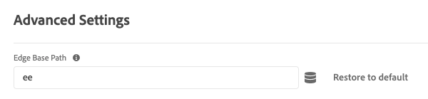

# Configurar la extensión de etiqueta del SDK web

El [!DNL Web SDK] La extensión de etiqueta de envía datos a Adobe Experience Cloud desde las propiedades web a través de Experience Platform Edge Network.

La extensión de le permite transmitir datos a Platform, sincronizar identidades, procesar señales de consentimiento de clientes y recopilar automáticamente datos de contexto.

En este documento se explica cómo configurar la extensión de etiqueta en la interfaz de usuario de Etiquetas.

## Instalación de la extensión de etiqueta del SDK web {#install}

La extensión de etiqueta del SDK web necesita que se instale una propiedad en. Si aún no lo ha hecho, consulte la documentación sobre [creación de una propiedad de etiqueta](https://experienceleague.adobe.com/docs/platform-learn/implement-in-websites/configure-tags/create-a-property.html).

Una vez creada una propiedad, ábrala y seleccione la opción **[!UICONTROL Extensiones]** en la barra lateral izquierda.

Seleccione el **[!UICONTROL Catálogo]** pestaña. En la lista de extensiones disponibles, busque [!DNL Web SDK] extensión y seleccione **[!UICONTROL Instalar]**.

Después de seleccionar **[!UICONTROL Instalar]**, debe configurar la extensión de etiqueta del SDK web y guardar la configuración.

>[!NOTE]
>
>La extensión de etiqueta solo se instala después de guardar la configuración. Consulte las secciones siguientes para obtener información sobre cómo configurar la extensión de etiqueta.

## Configuración de la instancia {#general}

Las opciones de configuración en la parte superior de la página indican a Adobe Experience Platform dónde enrutar los datos y qué configuraciones utilizar en el servidor.

* **[!UICONTROL Nombre]**: la extensión del SDK web de Adobe Experience Platform admite varias instancias en la página. El nombre se utiliza para enviar datos a varias organizaciones con una configuración de etiquetas. El nombre de instancia predeterminado es `alloy`. Sin embargo, puede cambiar el nombre de la instancia a cualquier nombre de objeto JavaScript válido.
* **[!UICONTROL ID de organización IMS]**: ID de la organización a la que desea que se envíen los datos durante el Adobe. La mayoría de las veces, utilice el valor predeterminado que se rellena automáticamente. Cuando tenga varias instancias en la página, rellene este campo con el valor de la segunda organización a la que desee enviar datos.
* **[!UICONTROL Dominio de Edge]**: Dominio desde el cual la extensión envía y recibe datos. El Adobe recomienda utilizar un dominio de origen (CNAME) para esta extensión. El dominio de terceros predeterminado funciona para entornos de desarrollo, pero no es adecuado para entornos de producción. Las instrucciones sobre cómo configurar un CNAME de origen se enumeran [aquí](https://experienceleague.adobe.com/docs/core-services/interface/ec-cookies/cookies-first-party.html?lang=es).

## Configuración del flujo de datos {#datastreams}

Esta sección le permite seleccionar los flujos de datos que deben utilizarse para cada uno de los tres entornos disponibles (producción, ensayo y desarrollo).

Cuando se envía una solicitud a la red perimetral, se utiliza un ID de secuencia de datos para hacer referencia a la configuración del lado del servidor. Puede actualizar la configuración sin tener que realizar cambios en el código del sitio web.

Consulte la guía de [flujos de datos](../../../../datastreams/overview.md) para aprender a configurar una secuencia de datos.

Puede elegir una secuencia de datos de los menús desplegables disponibles o seleccionar **[!UICONTROL Introducir valores]** e introduzca un ID de flujo de datos personalizado para cada entorno.

## Configuración de privacidad {#privacy}

Esta sección le permite configurar cómo el SDK web gestiona las señales de consentimiento de los usuarios desde el sitio web. En concreto, le permite seleccionar el nivel de consentimiento predeterminado que se supone de un usuario si no se ha proporcionado ninguna otra preferencia de consentimiento explícita.

El nivel de consentimiento predeterminado no se guarda en el perfil de usuario.

| [!UICONTROL Nivel de consentimiento predeterminado] | Descripción |
| --- | --- |
| [!UICONTROL En] | Recopilar eventos que se producen antes de que el usuario proporcione preferencias de consentimiento. |
| [!UICONTROL Fuera] | Descartar los eventos que se producen antes de que el usuario proporcione preferencias de consentimiento. |
| [!UICONTROL Pendiente] | Eventos de cola que se producen antes de que el usuario proporcione preferencias de consentimiento. Cuando se proporcionan las preferencias de consentimiento, los eventos se recopilan o descartan según las preferencias proporcionadas. |
| [!UICONTROL Proporcionado por el elemento de datos] | El nivel de consentimiento predeterminado está determinado por un elemento de datos independiente que usted defina. Al utilizar esta opción, debe especificar el elemento de datos mediante el menú desplegable proporcionado. |

>[!TIP]
>
>Uso **[!UICONTROL Fuera]** o **[!UICONTROL Pendiente]** si necesita el consentimiento explícito del usuario para sus operaciones comerciales.

## Configuración de la identidad {#identity}

Esta sección le permite definir el comportamiento del SDK web en lo que respecta a la gestión de la identificación del usuario.

* **[!UICONTROL Migrar ECID desde VisitorAPI]**: Esta opción está habilitada de forma predeterminada. Cuando esta función está habilitada, el SDK puede leer el `AMCV` y `s_ecid` y configure las `AMCV` cookie utilizada por [!DNL Visitor.js]. Esta función es importante al migrar al SDK web, ya que algunas páginas pueden seguir utilizando [!DNL Visitor.js]. Esta opción permite que el SDK siga utilizando el mismo [!DNL ECID] para que los usuarios no se identifiquen como dos usuarios independientes.
* **[!UICONTROL Uso de cookies de terceros]**: cuando esta opción está habilitada, el SDK web intenta almacenar un identificador de usuario en una cookie de terceros. Si se realiza correctamente, el usuario se identifica como un solo usuario a medida que navega por varios dominios, en lugar de identificarse como un usuario independiente en cada dominio. Si esta opción está habilitada, es posible que el SDK aún no pueda almacenar el identificador de usuario en una cookie de terceros si el explorador no admite cookies de terceros o si el usuario lo ha configurado para no permitir cookies de terceros. En este caso, el SDK solo almacena el identificador en el dominio de origen.

## Configuración de la personalización {#personalization}

Esta sección le permite configurar cómo desea ocultar determinadas partes de una página mientras se carga contenido personalizado.

Puede especificar los elementos que desea ocultar en el editor de estilos de preocultación. A continuación, puede copiar el fragmento de ocultamiento previo predeterminado que se le ha proporcionado y pegarlo dentro de la variable `<head>` del sitio... [!DNL HTML] código.

* **[!UICONTROL Migración de Target de at.js al SDK web]**: utilice esta opción para habilitar [!DNL Web SDK] para leer y escribir el legado `mbox` y `mboxEdgeCluster` cookies que utiliza at.js `1.x` o `2.x` bibliotecas. Esto le ayuda a mantener el perfil del visitante mientras se desplaza de una página que utiliza el SDK web a una página que utiliza at.js `1.x` o `2.x` bibliotecas y viceversa.

## Configuración de la recopilación de datos {#data-collection}

* **[!UICONTROL Función Callback]**: La función de llamada de retorno proporcionada en la extensión también se denomina [`onBeforeEventSend` función](https://experienceleague.adobe.com/docs/experience-platform/edge/fundamentals/configuring-the-sdk.html?lang=es) en la biblioteca. Esta función le permite modificar eventos globalmente antes de enviarlos a la red perimetral. Encontrará información más detallada sobre cómo utilizar esta función [aquí](../../../../edge/fundamentals/tracking-events.md#modifying-events-globally).
* **[!UICONTROL Habilitar la recopilación de datos de clics]**: el SDK web puede recopilar automáticamente la información sobre clics en vínculos. Esta función está habilitada de forma predeterminada, pero se puede deshabilitar con esta opción. Los vínculos también se etiquetan como vínculos de descarga si contienen una de las expresiones de descarga enumeradas en la variable [!UICONTROL Cualificador de vínculo de descarga] cuadro de texto. El Adobe le proporciona algunos calificadores de vínculo de descarga predeterminados. Puede editarlas según sus necesidades.
* **[!UICONTROL Datos de contexto recopilados automáticamente]**: De forma predeterminada, el SDK web recopila determinados datos de contexto relacionados con el contexto del dispositivo, la web, el entorno y el lugar. Si desea ver una lista de los datos que recopila el Adobe de información, puede encontrarla [aquí](../../../../edge/data-collection/automatic-information.md). Si no desea que se recopilen estos datos o solo desea que se recopilen determinadas categorías de datos, seleccione **[!UICONTROL Información de contexto específica]** y seleccione los datos que desea recopilar.

## Configurar anulaciones de secuencia de datos {#datastream-overrides}

Las anulaciones de las secuencias de datos permiten definir configuraciones adicionales para las secuencias de datos, que pasan a la red perimetral mediante el SDK web.

Esto le ayuda a activar comportamientos de secuencias de datos diferentes de los predeterminados, sin crear una nueva secuencia de datos ni modificar la configuración existente.

La anulación de la configuración de la secuencia de datos es un proceso de dos pasos:

1. En primer lugar, debe definir las anulaciones de configuración de la secuencia de datos en la [página de configuración de secuencia de datos](../../../../datastreams/configure.md).
2. A continuación, debe enviar las anulaciones a Edge Network mediante un comando del SDK web o la extensión de etiqueta del SDK web.

Consulte la secuencia de datos [la configuración anula la documentación](../../../../datastreams/overrides.md) para obtener instrucciones detalladas sobre cómo anular las configuraciones de secuencia de datos.

Como alternativa a pasar las invalidaciones a través de un comando del SDK web, puede configurarlas en la pantalla de extensión de etiquetas que se muestra a continuación.

>[!IMPORTANT]
>
> Las anulaciones de flujos de datos deben configurarse por entorno. Los entornos de desarrollo, ensayo y producción tienen invalidaciones independientes. Puede copiar los ajustes entre ellos utilizando las opciones dedicadas que se muestran en la pantalla siguiente.

## Configuración avanzada

Utilice el **[!UICONTROL Ruta base del borde]** campo si necesita cambiar la ruta base que se utiliza para interactuar con la red perimetral. Esto no debería requerir ninguna actualización, pero en caso de que participe en una versión beta o alfa, Adobe podría pedirle que cambie este campo.

