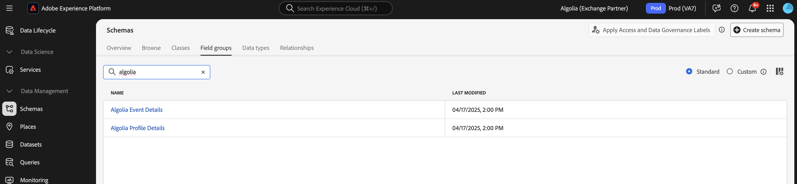

# Información general sobre la extensión de reenvío de eventos [!DNL Algolia] {#overview}

Use [!DNL Algolia] para ofrecer experiencias de búsqueda rápidas, relevantes y personalizadas. Con la optimización con tecnología de IA, puede mejorar los resultados de búsqueda y las recomendaciones para ayudar a los usuarios a encontrar rápidamente los productos, el contenido o la información que necesitan.

Utilice la extensión de reenvío de eventos [!DNL Algolia] para enviar eventos de comportamiento de usuario a [!DNL Algolia] mediante [!DNL Insights API]. Estos datos de comportamiento habilitan recomendaciones impulsadas por IA, experiencias personalizadas y capacidades de búsqueda inteligente.

## Requisitos previos {#prerequisites}

Antes de instalar la extensión, asegúrese de que dispone de una cuenta de [!DNL Algolia] con acceso a [!DNL Insights API]. Si no tiene una cuenta, [regístrese](https://dashboard.algolia.com/users/sign_up) y habilite el acceso a la API.

Asegúrese también de comprender cómo usar [!DNL Algolia] [!DNL Insights API]. Para obtener información general sobre cómo enviar eventos, consulte [envío de eventos con la API de Insights](https://www.algolia.com/doc/guides/sending-events/getting-started/).

Recopile los siguientes valores de su tablero de cuenta de [!DNL Algolia]:
- **[!UICONTROL Application ID]**
- **[!UICONTROL Search API Key]**
- **[!UICONTROL Index Name]**

## Instalación de la extensión {#install}

Para instalar la extensión [!DNL Algolia], siga estos pasos:

Vaya a **[!UICONTROL Data Collection]** en [!DNL Adobe Experience Platform]. Seleccione la pestaña **[!UICONTROL Extensions]** .

Abra **[!UICONTROL Catalog]**, busque la extensión **[!UICONTROL Algolia Event Forwarding]** y seleccione **[!UICONTROL Install]**.

### Configuración de la extensión {#configure-extension}

Para configurar la extensión de reenvío de eventos [!DNL Algolia], vaya a la pestaña **[!UICONTROL Extensions]**, seleccione la extensión **[!UICONTROL Algolia]** y, a continuación, seleccione **[!UICONTROL Configure]**.

| Propiedad | Descripción |
|----------|-------------|
| **[!UICONTROL Application ID]** | Escriba el [!UICONTROL Application ID] que se encuentra en el panel de Algolia en la sección [Claves de API](https://www.algolia.com/account/api-keys/all). |
| **[!UICONTROL Search API Key]** | Escriba el [!UICONTROL Search API Key] que se encuentra en el panel de Algolia en la sección [Claves de API](https://www.algolia.com/account/api-keys/all). |
| **[!UICONTROL Index Name]** | Escriba [!UICONTROL Index Name] que contenga sus productos o contenido. Este índice se utiliza como valor predeterminado. |

{style="table-layout:auto"}

## [!DNL Algolia] tipos de acciones de extensión de reenvío de eventos {#action-types}

La extensión de reenvío de eventos [!DNL Algolia] ofrece un único tipo de acción que se puede usar en la sección **[!UICONTROL Then]** de una regla:

### Enviar evento {#send-event}

Configure la acción **[!UICONTROL Send event]** para reenviar eventos a [!DNL Algolia]:

Seleccione **[!UICONTROL Rules]** > **[!UICONTROL Add Rule]** o una regla existente. En la parte **[!UICONTROL Then]** de la regla, agregue una acción y seleccione **[!UICONTROL Extension]**: [!DNL Algolia] Reenvío de eventos > **[!UICONTROL Action Type]**: **[!UICONTROL Send Events]**.

## Implementar el grupo de campos de evento [!DNL Algolia] {#algolia-field-group}

Asegúrese de agregar el grupo de campos de evento [!DNL Algolia] al esquema antes de usar la extensión de reenvío de eventos [!DNL Algolia]. Es uno de los grupos de campos estándar que se proporcionan a través de Experience Platform.

### Agregar el grupo de campos de evento [!DNL Algolia] al esquema {#add-algolia-field-group}

Para agregar el grupo de campos de evento [!DNL Algolia]:

Vaya a **[!UICONTROL Schemas]** y seleccione **[!UICONTROL Browse]**.

Agregue un nuevo esquema o actualice uno existente que use para enviar eventos web y pase el ratón sobre el icono **[!UICONTROL Add]**. Escriba *[!DNL Algolia]* en el cuadro de búsqueda para reducir los resultados.

Seleccione el botón **[!DNL Algolia]Detalles del evento** grupo de campos > **[!UICONTROL Add field group]** > **[!UICONTROL Save]**.

### Asignar y enviar datos con la etiqueta [!UICONTROL Data Collection]

La extensión de reenvío de eventos [!DNL Algolia] se puede usar con **[!DNL Adobe Experience Platform Web SDK]** para enviar datos del sitio web a [!DNL Algolia]. Para ello, cree una propiedad de etiqueta, asigne datos al objeto [!DNL XDM] y configure las reglas para enviar eventos.

#### Paso 1: Crear una propiedad de etiquetas con la web SDK

1. Cree una propiedad de etiqueta.
2. Instale la extensión [!DNL Adobe Experience Platform Web SDK].
3. Utilice esta extensión para asignar datos de HTML al grupo de campos **[!DNL Algolia]Evento**.

#### Paso 2: Crear un elemento de datos para la asignación [!DNL XDM]

1. Crear un(a) [!UICONTROL Data Element] utilizando **[!DNL Adobe Experience Platform Web SDK]**.
2. Seleccione **[!UICONTROL XDM object]** como tipo de elemento de datos.
3. Asigne los datos a los [!DNL XDM] campos apropiados, asegurándose de que se rellenen los campos específicos de [!DNL Algolia].

#### Paso 3: Crear una regla para enviar eventos

1. Cree una nueva regla en la propiedad de etiquetas.
2. Añada los déclencheur de evento necesarios, como la carga de página o los eventos de clic.
3. Agregar una acción mediante **[!DNL Adobe Experience Platform Web SDK]**.
4. Seleccione **[!UICONTROL Send event]** como tipo de acción.
5. Configure la acción para utilizar el elemento de datos [!DNL XDM].

#### Paso 4: Publicación y prueba

1. Publique las reglas y los cambios de extensión en el entorno de destino.
2. Use [!DNL Adobe Experience Platform Debugger] para comprobar que los datos se envían a Adobe Experience Platform y se reenvían a [!DNL Algolia].

### Verificar eventos en [!DNL Algolia]

Después de configurar la extensión de reenvío de eventos [!DNL Algolia], puede comprobar que los eventos se envían y reciben correctamente siguiendo estos pasos:

Vaya a su panel de [!DNL Algolia] y luego a **[!UICONTROL Data Sources > Events > Debugger]**.

Seleccione el evento que coincida con el evento enviado desde la extensión de reenvío de eventos de [!DNL Algolia] y compruebe que los datos esperados estén presentes en el evento.

## Escenarios de implementación comunes

Utilice la extensión de reenvío de eventos [!DNL Algolia] para capturar y enviar datos de interacción del usuario en varios casos de uso, lo que mejora la relevancia y personalización de las búsquedas.

### Seguimiento de vistas de productos o contenido

Utilice la extensión para rastrear cuándo ven los usuarios las páginas de producto o contenido, lo que ayuda a [!DNL Algolia] a comprender los intereses de los usuarios.

### Seguimiento de eventos de conversión

Rastree eventos de complementos al carro de compras y otros eventos de conversión para optimizar las recomendaciones de [!DNL Algolia] que utilizan IA.

## Resolución de problemas

Si tiene problemas al implementar la extensión de reenvío de eventos [!DNL Algolia], siga estos pasos para la solución de problemas:

### Los eventos no aparecen en [!DNL Algolia]

Si los eventos no aparecen en [!DNL Algolia], compruebe lo siguiente:

- **Verificar credenciales de API**: Asegúrese de que **[!UICONTROL Application ID]** y **[!UICONTROL API Key]** coinciden con los valores del panel de [!DNL Algolia].
- **Comprobar el depurador de eventos**: use el depurador de eventos [!DNL Algolia] para confirmar si se reciben eventos. Si no es así, compruebe la configuración de reglas del reenvío de eventos.
- **Inspeccionar asignación XDM**: Asegúrese de que todos los campos obligatorios del esquema [!DNL Algolia] estén asignados correctamente en el objeto [!DNL XDM].

### Datos de evento incorrectos

- Asegúrese de que el elemento de datos del objeto [!DNL XDM] esté asignado con precisión al esquema [!DNL Algolia], con todos los campos obligatorios.
- Confirme que los parámetros de evento coinciden con el formato y la estructura esperados descritos en la documentación de la API de Insights de [!DNL Algolia].

## Próximos pasos

En esta guía se explica cómo enviar datos a [!DNL Algolia] mediante [!DNL Algolia Event Forwarding Extension]. Para obtener más información sobre las capacidades de reenvío de eventos en [!DNL Adobe Experience Platform], lea la [descripción general del reenvío de eventos](../../../ui/event-forwarding/overview.md).

Para obtener más información sobre cómo depurar la implementación con la herramienta de supervisión de Experience Platform Debugger y reenvío de eventos, lea la [descripción general de Adobe Experience Platform Debugger](../../../../debugger/home.md) y [Supervisar las actividades en el reenvío de eventos](../../../ui/event-forwarding/monitoring.md).

## Recursos adicionales

- [[!DNL Algolia] Documentación de la API de Insights](https://www.algolia.com/doc/rest-api/insights/)
- [[!DNL Algolia] Documentación de eventos](https://www.algolia.com/doc/guides/sending-events/getting-started/)
- [[!DNL Adobe Experience Platform] Documentación del reenvío de eventos](https://experienceleague.adobe.com/docs/experience-platform/tags/event-forwarding/overview.html)
- [[!DNL Algolia] Resumen de características de IA](https://www.algolia.com/products/ai-search/)
