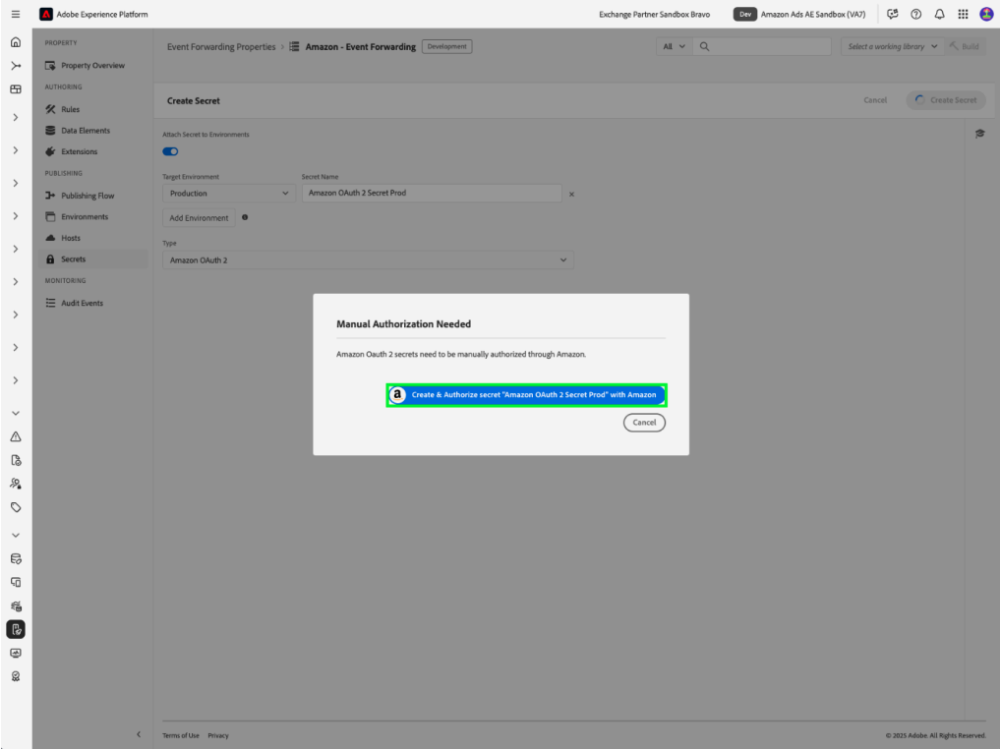

# Información general sobre la extensión API de eventos web [!DNL Amazon]

La extensión de la API de conversiones [!DNL Amazon] crea una conexión directa entre los datos de marketing del servidor de un anunciante y [!DNL Amazon]. Esto permite a los anunciantes evaluar la eficacia de la campaña independientemente de la ubicación de conversión y optimizar las campañas en consecuencia. La extensión proporciona una atribución más completa, una fiabilidad de los datos mejorada y una entrega optimizada.

## [!DNL Amazon] requisitos previos {#prerequisites}

Antes de instalar y configurar la extensión de la API Conversiones [!DNL Amazon], debe completar varios pasos previos para garantizar la autenticación y el acceso a los datos adecuados.

### Crear un secreto y un elemento de datos {#secret}

La autenticación con [!DNL Amazon] requiere un token seguro que debe almacenarse correctamente y al que se debe hacer referencia:

1. Cree un nuevo secreto de reenvío de eventos [!DNL Amazon] con un nombre único para la autenticación.
2. Cree un elemento de datos con la extensión **Core** con un tipo de elemento de datos **Secret** para hacer referencia a su secreto [!DNL Amazon].

Este proceso garantiza que las credenciales de autenticación permanezcan seguras y que la extensión pueda acceder a ellas cuando sea necesario.

## Instalar y configurar la extensión [!DNL Amazon]

La instalación de la extensión requiere acceso a la propiedad de reenvío de eventos en Experience Platform:

- Cree o edite una propiedad de reenvío de eventos.
- Seleccione **Extensiones** en el panel de navegación izquierdo y, a continuación, seleccione [!DNL Amazon] extensión en la pestaña Catálogo.
- Seleccione **Instalar**.

Se seleccionó la extensión ![[!DNL Amazon] en el catálogo de extensiones junto con el botón de instalación.](../../../images/extensions/server/amazon/amazon-extension.png)

- Configurar con:

- **Token de acceso**: El secreto del elemento de datos que contiene el token de OAuth 2

- **Id. de entidad**: Su Id. de entidad (que se encuentra en la dirección URL del portal de Campaign Manager con el prefijo &quot;entity&quot;)

- Seleccione **Guardar**.

Estos valores de configuración establecen la conexión entre Platform y su cuenta de [!DNL Amazon].

### [!DNL Amazon] OAuth 2 {#oauth}

Para crear un secreto de OAuth 2 de [!DNL Amazon]:

- Seleccione [!DNL Amazon] OAuth 2 del menú desplegable **Tipo** y seleccione **Crear secreto**.

- Seleccione **Crear y autorizar secreto con Amazon** en la ventana emergente para autorizar manualmente el secreto y continuar.

- Escriba sus credenciales de [!DNL Amazon] en el cuadro de diálogo que aparece. Siga las indicaciones para conceder acceso al reenvío de eventos a sus datos.

Una vez finalizado, verá su secreto con su estado y fecha de caducidad en la ficha **Secretos**.

## Configuración de una regla de reenvío de eventos {#config-rule}

Una vez configurados todos los elementos de datos, puede crear reglas de reenvío de eventos que determinen cuándo y cómo se enviarán los eventos a Amazon.

- Vaya a **Reglas** y cree una nueva regla de reenvío de eventos.
- En **Acciones**, seleccione **Extensión de la API de conversiones de Amazon**.
- Establezca **Tipo de acción** en **Importar eventos de conversión**.

- Configure las propiedades del evento como se describe a continuación:

| Entrada | Descripción |
| --- | --- |
| **Nombre del evento** | Nombre del evento de conversión. |
| **Tipo de evento** | Define el tipo de evento rastreado (por ejemplo, compras, adiciones al carro de compras). |
| **Marca de tiempo** | Hora del evento en formato ISO. |
| **ID de desduplicación de cliente** | Un ID único para la anulación de duplicación. |
| **Claves de coincidencia** | Identificadores de usuario y dispositivo para la atribución. |
| **Valor** | Valor monetario del evento. |
| **Código de divisa** | Moneda en formato ISO-4217. |
| **Unidades vendidas** | Cantidad de artículos comprados. |
| **Código de país** | País donde ocurrió el evento. |
| **Opciones de procesamiento de datos** | Indica el uso limitado de los datos. |
| **Consentimiento** | Indica el consentimiento del usuario para el uso de datos publicitarios. |

- Seleccione **Conservar cambios** para guardar la regla.

## Deduplicación de eventos {#deduplication}

Si usa la etiqueta de Advertising [!DNL Amazon] (AAT) y la extensión de API de conversiones [!DNL Amazon] para los mismos eventos, se requiere la configuración de anulación de duplicación. Incluya `clientDedupeId` en cada evento compartido para garantizar la deduplicación adecuada.
La deduplicación no es necesaria si los eventos del cliente y del servidor no se superponen.

La deduplicación adecuada evita los recuentos de conversión inflados y garantiza que los datos de optimización sigan siendo precisos.

Consulte la [Guía de anulación de duplicación de eventos de Amazon](https://advertising.amazon.com/) para obtener más información.

## Pasos siguientes

En esta guía se explica cómo configurar y enviar eventos de conversión a [!DNL Amazon] mediante la extensión de API de conversiones [!DNL Amazon]. Para obtener más información sobre las capacidades de reenvío de eventos en [!DNL Adobe Experience Platform], consulte la [descripción general del reenvío de eventos](../../../ui/event-forwarding/overview.md)

Para obtener más información sobre cómo depurar la implementación con la herramienta de supervisión de Experience Platform Debugger y reenvío de eventos, lea la [descripción general de Adobe Experience Platform Debugger](https://experienceleague.adobe.com/en/docs/experience-platform/debugger/home) y [Supervisar actividades](https://experienceleague.adobe.com/en/docs/experience-platform/tags/event-forwarding/monitoring) en el reenvío de eventos.