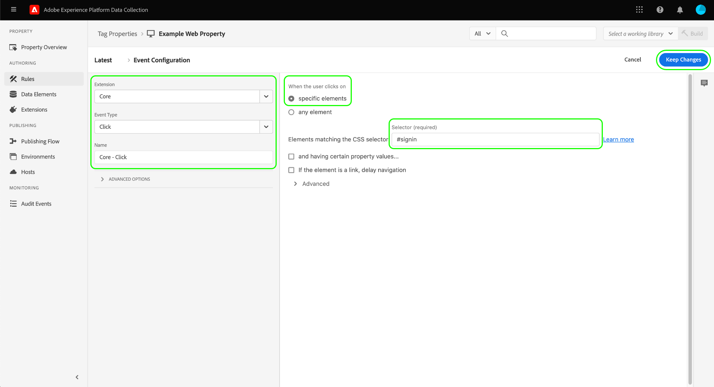

# [!DNL Braze Track Events API] extensión de reenvío de eventos

[[!DNL Braze]](https://www.braze.com) es una plataforma de participación del cliente que potencia las interacciones centradas en el cliente entre consumidores y marcas en tiempo real. Uso [!DNL Braze], puede hacer lo siguiente:

* Entregue datos (como mensajes de marketing) a los usuarios objetivo en función de sus preferencias de idioma, preferencias de ubicación, etc., para aumentar las tasas de conversión y lograr los objetivos clave del negocio.
* Envíe mensajes personalizados a los clientes a través de varios canales, incluidos correos electrónicos, notificaciones push y mensajes en la aplicación, en el momento adecuado y en los idiomas que prefieran.
* Diríjase a usuarios específicos para campañas de marketing y promocionales a fin de aumentar el número de clientes que repiten.
* Estudie el comportamiento y los patrones del usuario para dirigirse a audiencias específicas con mensajes personalizados, lo que podría ayudar a aumentar los ingresos.

La variable [!DNL Braze Track Events API] [reenvío de eventos](../../../ui/event-forwarding/overview.md) permite aprovechar los datos capturados en la red perimetral de Adobe Experience Platform y enviarlos a [!DNL Braze] en forma de eventos del lado del servidor utilizando la variable [[!DNL Braze User Identify]](https://www.braze.com/docs/api/endpoints/user_data/post_user_identify) y [[!DNL Braze User Track]](https://www.braze.com/docs/api/endpoints/user_data/post_user_track) API.

Este documento cubre los casos de uso de la extensión, cómo instalarla en las bibliotecas de reenvío de eventos y cómo utilizar sus capacidades en un reenvío de eventos [regla](../../../ui/managing-resources/rules.md).

## Casos de uso

Esta extensión debe usarse si desea utilizar datos de la red perimetral en [!DNL Braze] para aprovechar las capacidades de orientación y análisis de clientes.

Por ejemplo, considere una organización de venta minorista que tiene una presencia multicanal (sitio web y móvil) y que captura las entradas transaccionales o conversacionales como datos de eventos de su sitio web y plataformas móviles. Uso de varias [etiqueta](../../../home.md) , estos datos se envían a la red perimetral en tiempo real. Desde aquí, la variable [!DNL Braze] la extensión de reenvío de eventos envía automáticamente los eventos relevantes a [!DNL Braze] del lado del servidor.

Una vez enviados los datos, los equipos de análisis de la organización pueden aprovechar [!DNL Braze's] funciones para procesar los conjuntos de datos y derivar perspectivas empresariales para generar gráficos, tableros u otras visualizaciones que informen a las partes interesadas del negocio. Consulte la [[!DNL Braze] clientes](https://www.braze.com/customers) para obtener más información sobre los distintos casos de uso de la plataforma.

## [!DNL Braze] requisitos previos y protecciones {#prerequisites}

Debe tener un [!DNL Braze] para utilizar sus tecnologías. Si no tiene una cuenta, vaya a la [Página Introducción](https://www.braze.com/get-started/) en [!DNL Braze] para conectarse a [!DNL Braze Sales] e inicie el proceso de creación de cuentas.

### Protecciones de API

La extensión utiliza dos de [!DNL Braze]Las API de y sus límites se describen a continuación:

| API | Límites de tasa |
| --- | --- |
| [!DNL User Track] | 50.000 solicitudes por minuto.  Consulte la [[!DNL User Track] Documentación de API](https://www.braze.com/docs/api/endpoints/user_data/post_user_track#rate-limit) para obtener más información. |
| [!DNL User Identify] | 20.000 solicitudes por minuto.  Consulte la [[!DNL User Identify] Documentación de API](https://www.braze.com/docs/api/endpoints/user_data/post_user_identify#rate-limit) para obtener más información. |

>[!NOTE]
>
>Consulte la guía de [[!DNL Braze] Límites de API](https://www.braze.com/docs/api/api_limits/) para obtener más información sobre los límites que imponen.

### Explicación del ciclo vital del perfil del usuario

[!DNL Braze] crea perfiles de usuario anónimos mediante el identificador único, `deviceId`, configurado por [!DNL Braze]. Una vez que se identifica a un usuario proporcionando un ID de usuario, se crea un perfil de usuario identificado.

En la primera instancia de asignación de un `external_id` a un perfil de usuario desconocido, todos los datos de perfil de usuario existentes y cualquier evento anónimo se migran al nuevo perfil de usuario. Los perfiles de usuario anónimos que comparten lo mismo `deviceId` también están asociados al perfil de usuario identificado.

[!DNL Braze] combina y conserva todos los datos asociados con el perfil de solo alias. Sin embargo, los datos de usuario anónimos posteriores quedarán huérfanos. Consulte la [!DNL Braze] páginas de documentación en [perfiles de usuario identificados](https://www.braze.com/docs/user_guide/data_and_analytics/user_data_collection/user_profile_lifecycle/#identified-user-profiles) y [prácticas recomendadas de recopilación de datos](https://www.braze.com/docs/user_guide/data_and_analytics/user_data_collection/best_practices/#overview) para obtener más información.

### Puntos de datos facturables

Envío de atributos personalizados adicionales a [!DNL Braze] puede aumentar su [!DNL Braze] consumo de puntos de datos. Consulte con su [!DNL Braze] administrador de cuentas antes de enviar atributos personalizados adicionales. Consulte la [!DNL Braze] documentación sobre [puntos de datos facturables](https://www.braze.com/docs/user_guide/onboarding_with_braze/data_points/#billable-data-points) para obtener más información.

### Recopilar los detalles de configuración necesarios {#configuration-details}

Para conectar la red perimetral a [!DNL Braze], se requieren las siguientes entradas:

| Tipo de clave | Descripción | Ejemplo |
| --- | --- | --- |
| [!DNL Braze] Instancia | El extremo REST asociado con la variable [!DNL Braze] cuenta. Consulte la [!DNL Braze] documentación sobre [instancias](https://www.braze.com/docs/user_guide/administrative/access_braze/braze_instances) para obtener más información. | `rest.iad-03.braze.com` |
| Clave de API | La variable [!DNL Braze] Clave de API asociada a la variable [!DNL Braze] cuenta.  Consulte la [!DNL Braze] documentación sobre [Clave de API de REST](https://www.braze.com/docs/api/basics/#rest-api-key) para obtener más información. | `YOUR-BRAZE-REST-API-KEY` |

## Requisitos previos del Experience Cloud

Esta sección cubre los pasos previos en Experience Cloud para todas las implementaciones. Según las necesidades de implementación individuales, puede resultar útil configurar las siguientes construcciones antes de configurar la extensión:

1. A [esquema](../../../../xdm/schema/composition.md) para describir la estructura de los datos que está incorporando en Experience Cloud
1. A [datastream](https://experienceleague.adobe.com/docs/platform-learn/data-collection/event-forwarding/set-up-a-datastream.html) para enrutar los datos entrantes a las aplicaciones de Adobe Experience Cloud adecuadas
1. A [conjunto de datos](https://experienceleague.adobe.com/docs/platform-learn/tutorials/data-ingestion/create-datasets-and-ingest-data.html?lang=es) para almacenar los datos recopilados

Para todas las implementaciones, se requiere lo siguiente en el lado del Experience Cloud:

1. [Crear un secreto](#create-a-secret)
1. [Configuración de propiedades de etiquetas](#set-up-tag-properties)
1. [Adición de elementos de datos dentro de las propiedades de etiquetas](#add-data-elements-within-tag-properties)
1. [Agregar reglas dentro de las propiedades de etiquetas](#add-rules-within-tag-properties)

### Crear un secreto

Cree una nueva [secreto de reenvío de eventos](../../../ui/event-forwarding/secrets.md) y establezca el valor en su [[!DNL Braze] Clave de API](#configuration-details). Se utilizará para autenticar la conexión con su cuenta mientras se mantiene el valor seguro.

### Configuración de propiedades de etiquetas

[Crear una propiedad de etiqueta](https://experienceleague.adobe.com/docs/platform-learn/implement-in-websites/configure-tags/create-a-property.html?lang=en) o elija una propiedad existente para editarla en su lugar. Esta propiedad se configura para recopilar las estructuras de datos necesarias para [!DNL Braze] ya que se incorporan a la red perimetral antes de enviarse mediante el reenvío de eventos.

### Adición de elementos de datos dentro de las propiedades de etiquetas

Si su sitio web utiliza la variable [!DNL Braze] SDK, debe [crear un elemento de datos](../../../ui/managing-resources/data-elements.md) que usa la variable **[!UICONTROL Cookie]** tipo (proporcionado por el [[!UICONTROL Principal] extensión de etiqueta](../../client/core/overview.md)) de modo que la variable [!DNL Braze] `deviceId` se puede leer desde la cookie .

La variable **[!UICONTROL Nombre de la cookie]** debe coincidir con la variable [!DNL Braze] nombre de la cookie para el sitio web. El nombre debe tener un formato similar al `ab.storage.deviceId.{BRAZE_PROJECT_TOKEN_FOR_WEBSITE}`. Seleccione **[!UICONTROL Guardar]** cuando haya terminado.

Para el segundo elemento de datos, establezca el tipo en **[!UICONTROL Objeto XDM]** (desde el [Extensión de Adobe Experience Platform Web SDK](../../client/sdk/overview.md)) y asignarlo al esquema creado anteriormente. Al asignar los datos, asegúrese de que el valor de la variable `deviceId` elemento de datos (que contiene la variable [!DNL Braze] `deviceId` de la cookie) se hace referencia como un valor dentro de uno de los campos de esquema.

>[!NOTE]
>
>Si el sitio web no está ejecutando la variable [!DNL Braze] SDK, se utilizará un Adobe Experience Cloud ID (ECID) como alternativa `deviceId` valor que se transmitirá con el evento enviado a [!DNL Braze].

Según el escenario, es posible que tenga que crear otro elemento de datos que se pueda utilizar para asignar al nombre del evento en el esquema. Esto se puede hacer utilizando la variable **[!UICONTROL Constante]** tipo proporcionado por el [!UICONTROL Principal] extensión.

### Agregar reglas dentro de las propiedades de etiquetas

El paso final antes de instalar el [!DNL Braze] extensión es crear una etiqueta [regla](../../../ui/managing-resources/rules.md) (o varias reglas de etiquetas) que se activan para los eventos de identificación de usuarios de los que se está realizando un seguimiento, como inicios de sesión, registros, etc.

Al configurar la variable **[!UICONTROL Eventos]** para la regla, seleccione los tipos de eventos adecuados que almacenarán en déclencheur la regla. A continuación se muestra un ejemplo de un evento que déclencheur la regla de inicio de sesión en un clic de usuario:

Finalmente, al seleccionar la variable **[!UICONTROL Acciones]** para la regla, seleccione el **[!UICONTROL Enviar evento]** tipo de acción proporcionado por la extensión web SDK. En **[!UICONTROL Datos XDM]**, seleccione [!UICONTROL Objeto XDM] tipo de datos creado [previous](#add-data-elements-within-tag-properties).

## Instale y configure el [!DNL Braze] Extensión {#install}

Para instalar la extensión, [crear una propiedad de reenvío de eventos](../../../ui/event-forwarding/overview.md#properties) o elija una propiedad existente para editarla en su lugar.

Select **[!UICONTROL Extensiones]** en el panel de navegación izquierdo. En el **[!UICONTROL Catálogo]** , seleccione **[!UICONTROL Instalar]** en la tarjeta para la variable [!DNL Braze] extensión.

![Instale el [!DNL Braze] extensión.](../../../images/extensions/server/braze/install-extension.png)

En la siguiente pantalla, introduzca lo siguiente [valores de configuración](#configuration-details) que ha recopilado anteriormente de [!DNL Braze]:

* **[!UICONTROL URL del extremo del resto de Brazo]**: Puede introducir el valor de su [!DNL Braze] reposar URL de extremo como texto sin formato en la entrada proporcionada.
* **[!UICONTROL Clave de API]**: Seleccione el [elemento de datos secreto](#create-a-secret) que creó anteriormente, que contiene su [!DNL Braze] Clave de API.

Seleccione **[!UICONTROL Guardar]** cuando haya terminado.

![La variable [!DNL Braze] página de configuración de la extensión.](../../../images/extensions/server/braze/configure-extension.png)

## Configuración de elementos de datos de reenvío de eventos

Después de instalar y configurar la extensión, el siguiente paso es crear elementos de datos de reenvío de eventos que recopilen las construcciones de datos necesarias a las que se envía [!DNL Braze].

### Cree un `deviceId` elemento de datos

Si su sitio está configurado con la variable [!DNL Braze] SDK, ya ha definido un [elemento de datos secreto](#add-data-elements-within-tag-properties) que contiene el [!DNL Braze] `deviceId` en la propiedad tag. Ahora debe configurar un elemento de datos independiente en el reenvío de eventos que señale a este valor cuando se envíe en formato XDM.

Al crear el elemento de datos, seleccione **[!UICONTROL Principal]** para la extensión, seleccione **[!UICONTROL Ruta]** para el tipo de elemento de datos. Para el valor, introduzca la ruta de notación de puntos en la variable `deviceId` tal como existe en el esquema. Seleccione **[!UICONTROL Guardar]** cuando haya terminado.

### Cree un `EventName` elemento de datos

En la propiedad de reenvío de eventos, cree un elemento de datos que use la variable **[!UICONTROL Ruta]** tipo de desde el **[!UICONTROL Principal]** extensión. Para el valor, introduzca la ruta de notación de puntos al nombre del evento tal como existe en el esquema.

### Creación de elementos de datos para eventos y compras

La variable [[!DNL Braze User Track] API](https://www.braze.com/docs/api/endpoints/user_data/post_user_track) admite dos acciones diferentes: custom [events](https://www.braze.com/docs/api/objects_filters/event_object/#what-is-the-event-object) y [compras](https://www.braze.com/docs/api/objects_filters/purchase_object/#what-is-a-purchase-object). La API también admite [attributes](https://www.braze.com/docs/api/objects_filters/user_attributes_object/) que corresponden a [!DNL Braze] puntos de datos.

Los elementos de datos para `deviceId` y `EventName` son necesarios tanto para eventos personalizados como para compras, pero hay elementos de datos adicionales que se pueden incluir para cualquiera de los tipos de evento. Se enumeran a continuación.

>[!NOTE]
>
>Todos los elementos de datos enumerados a continuación deben utilizar la variable **[!UICONTROL Ruta]** para que se puedan asignar a campos específicos del esquema como se describe en la sección **Ruta del esquema** para abrir el Navegador.

#### Eventos personalizados

| [!DNL Braze] key | Ruta del esquema | Descripción | Obligatorio |
| --- | --- | --- | --- |
| [!DNL Braze] ID del dispositivo | `arc.event.xdm._extconndev.brazeDeviceId` | `deviceId` identifica al usuario que realizó el evento. `deviceId` debe especificarse en cada evento, ya que es crucial para [!DNL Braze] para realizar análisis. | Sí |
| Tipo de evento | `arc.event.xdm._extconndev.event_Type` | El nombre del evento. | Sí |
| Identificador de usuario | `arc.event.xdm._extconndev.userId` | El correo electrónico o el ID de inicio de sesión del usuario, si está disponible. |  |
| ID de aplicación | `arc.event.xdm._extconndev.appId` | Cadena que indica dónde se activó el evento. |  |
| Campos de evento | `arc.event.xdm._extconndev.event_Properties` | Un objeto JSON que representa todos los atributos del evento. |  |

{style="table-layout:auto"}

#### Compras

| [!DNL Braze] key | Ruta del esquema | Descripción | Obligatorio |
| --- | --- | --- | --- |
| [!DNL Braze] ID del dispositivo | `arc.event.xdm._extconndev.brazeDeviceId` | `deviceId` identifica al usuario que realizó el evento. `deviceId` debe especificarse en cada evento, ya que es crucial para [!DNL Braze] para realizar análisis. | Sí |
| Tipo de evento | `arc.event.xdm._extconndev.event_Type` | El nombre del evento. | Sí |
| Identificador de usuario | `arc.event.xdm._extconndev.userId` | El correo electrónico o el ID de inicio de sesión del usuario, si está disponible. |  |
| ID de aplicación | `arc.event.xdm._extconndev.appId` | Cadena que indica dónde se activó el evento. |  |
| ID del producto | `arc.event.xdm._extconndev.product_Id` | Un identificador para la compra, como UPC, ISBN, categoría de producto o nombre de producto. | Sí |
| Moneda | `arc.event.xdm._extconndev.currency` | La moneda utilizada para la compra, en [Formato de código ISO 4217](https://www.iso.org/iso-4217-currency-codes.html). | Sí |
| Precio | `arc.event.xdm._extconndev.price` | El valor de la compra en números. | Sí |
| Cantidad | `arc.event.xdm._extconndev.quantity` | La cantidad de producto comprado. | Sí |
| Campos adicionales | `arc.event.xdm._extconndev.event_Properties` | Un objeto JSON que representa atributos adicionales sobre el evento. Consulte la [[!DNL Braze] documentación](https://www.braze.com/docs/user_guide/onboarding_with_braze/data_points/#billable-data-points) para obtener información detallada sobre los puntos de datos que se facturan. |  |

{style="table-layout:auto"}

## Configuración de reglas de reenvío de eventos

Una vez configurados todos los elementos de datos, puede empezar a crear reglas de reenvío de eventos que determinen cuándo y cómo se enviarán sus eventos y compras personalizados a [!DNL Braze].

Dado que la variable [!DNL Braze User Track] La API admite eventos personalizados y compras como dos acciones independientes. Debe crear al menos dos reglas para que [!DNL Braze's] analytics para cada se puede aprovechar correctamente.

Como resultado, la variable [!DNL Braze] permite añadir los siguientes tipos de acción a las reglas:

* **[!UICONTROL Evento de Brazo]**
* **[!UICONTROL Evento de compra de Brazo]**

>[!IMPORTANT]
>
>Debe tener al menos una regla con un tipo de acción **[!UICONTROL Evento de Brazo]**. Sin esta regla, la red perimetral no enviará eventos a [!DNL Braze].

### Cree un [!DNL Track Event] regla {#tracking-rule}

Comience a crear una regla nueva en la propiedad de reenvío de eventos. En **[!UICONTROL Condiciones]**, agregue un **[!UICONTROL Value Comparison]** tipo de condición (proporcionado por la variable [!UICONTROL Principal] ) para comprobar que `EventName` no es `Purchase`. Esto garantizará que los eventos se envíen con la carga útil de objeto correcta a la variable [!DNL Braze] API.

En **[!UICONTROL Acciones]**, agregue una nueva acción y establezca la extensión en **[!UICONTROL Brazo]**. A continuación, establezca el tipo de acción en **[!UICONTROL Evento de Brazo]** para enviar eventos de Adobe Experience Edge Network a [!DNL Braze].

A partir de aquí, debe asignar la variable **[!UICONTROL Nombre del evento]** a la propiedad de nombre de evento entrante, así como a la variable **[!UICONTROL Hora del evento]**. Otros campos opcionales incluyen [!UICONTROL ID de usuario externo], [!UICONTROL ID de usuario de Brazo], [!UICONTROL Etiqueta Alias], [!UICONTROL Nombre de alias]y [!UICONTROL Identificador de aplicación].

>[!NOTE]
>
>La variable **[!UICONTROL Evento de Brazo]** la acción solo requiere un **[!UICONTROL Nombre del evento]** y **[!UICONTROL Hora del evento]** que se va a especificar, pero debe incluir la mayor cantidad de información posible en los campos restantes. Para obtener más información sobre [!DNL Braze] objeto de evento, consulte la [documentación oficial](https://www.braze.com/docs/api/objects_filters/event_object/).

Una vez que la variable [!UICONTROL Evento de Brazo] se añade a la regla, también puede incluir un **[!UICONTROL Compras en Brasil]** si el evento que rastrea es un evento de compra. A continuación se muestra un ejemplo de configuración para la acción de compra:

>[!NOTE]
>
>Para obtener más información sobre [!DNL Braze] objeto purchase , consulte la sección [documentación oficial](https://www.braze.com/docs/api/objects_filters/purchase_object/).

La variable [!DNL Track Event] la regla está completa y debe tener un aspecto similar a la imagen siguiente. Select **[!UICONTROL Guardar]** para agregar la regla a la biblioteca.

>[!IMPORTANT]
>
>Si el sitio web está usando la variable [!DNL Braze] SDK, puede continuar con el siguiente paso de [validar los datos en [!DNL Braze]](#validate). Si no usa la variable [!DNL Braze] SDK, debe [crear una regla de seguimiento de identidad independiente](#create-an-identity-tracking-rule) para garantizar que los eventos y `deviceId` se envían a [!DNL Braze] cuando se produce un evento de identificación de usuario.

### Creación de una regla de seguimiento de identidad

Si no usa la variable [!DNL Braze SDK], el siguiente paso es crear otra regla que utilice tanto la variable **[!UICONTROL Evento de Brazo]** y **[!UICONTROL Alias de espacio]** tipos de acción. Esta regla garantiza que, cada vez que se produzca un evento de identificación de usuario en el sitio web (como un inicio de sesión, registro, etc.), se produzcan los eventos y `deviceId` se envían a [!DNL Braze].

Comience a definir una regla nueva para rastrear eventos de identidad. En este ejemplo, se está definiendo una regla específicamente para un evento de registro.

Similar a la variable [!DNL Track Event] regla, en **[!UICONTROL Condiciones]**, incluya un **[!UICONTROL Value Comparison]** tipo de condición que comprueba que `EventName` es igual que `Registration`. Esto garantiza que este evento solo se active para los eventos de registro.

![Configuración de la acción para [!DNL Braze] tipos de acción Alias e Identify.](../../../images/extensions/server/braze/ef-registration-condition.png)

Para garantizar que [!DNL Braze] puede combinar automáticamente las identidades de usuario, debe agregar los siguientes tipos de acción a la regla, que son proporcionados por la variable [!DNL Braze] extensión:

* **[!UICONTROL Evento de Brazo]**
* **[!UICONTROL Evento de alias de Brazo]**

Configure las variables **[!UICONTROL Evento de Brazo]** de la misma manera que la función [regla de seguimiento de eventos](#tracking-rule), incluida la mayor cantidad de información posible en los campos proporcionados.

![Configuración de la variable [!DNL Braze] Acción de evento](../../../images/extensions/server/braze/registration-braze-event.png)

La variable  **[!UICONTROL Evento de alias de Brazo]** la acción requiere un [identificador de usuario](https://www.braze.com/docs/api/objects_filters/aliases_to_identify)y, opcionalmente, puede proporcionar un [identificador de aplicación](https://www.braze.com/docs/api/identifier_types/) si procede.

![Configuración de la variable [!DNL Braze] Acción Alias](../../../images/extensions/server/braze/registration-braze-alias.png)

Una vez que ambas acciones se hayan agregado a la regla, seleccione **[!UICONTROL Guardar]** para agregar la regla a la biblioteca de trabajo. Desde aquí, puede crear la biblioteca en uno de sus entornos para validar si funciona correctamente.

![Ambas [!DNL Braze] las acciones se añaden a la regla](../../../images/extensions/server/braze/registration-rule-complete.png)

## Validar datos en [!DNL Braze] {#validate}

Si la recopilación de eventos y [!DNL Adobe Experience Platform] si la integración se ha realizado correctamente, verá eventos dentro de [!DNL Braze] consola cuando [visualización de perfiles de usuario](https://www.braze.com/docs/user_guide/engagement_tools/segments/user_profiles/). Específicamente, los nuevos datos de evento enviados a [!DNL Braze] se refleja en la variable [!DNL Purchases] de la sección de un usuario en particular [ficha Información general](https://www.braze.com/docs/user_guide/engagement_tools/segments/user_profiles/#overview-tab).

## Pasos siguientes

Esta guía explica cómo enviar eventos de conversión a [!DNL Braze] uso del reenvío de eventos. Para obtener más información sobre las aplicaciones descendentes para los datos de evento enviados a [!DNL Braze], consulte [documentación oficial](https://www.braze.com/docs).

Para obtener más información sobre las funcionalidades de reenvío de eventos en Experience Platform, consulte la [información general sobre el reenvío de eventos](../../../ui/event-forwarding/overview.md).