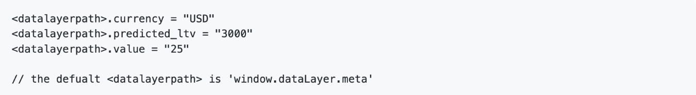

# [!DNL Meta Conversions API] información general de la extensión

La variable [[!DNL Meta Conversions API]](https://developers.facebook.com/docs/marketing-api/conversions-api/) le permite conectar los datos de marketing del lado del servidor a [!DNL Meta] tecnologías para optimizar el targeting de anuncios, reducir el coste por acción y medir los resultados. Los eventos están vinculados a un [[!DNL Meta Pixel]](https://developers.facebook.com/docs/meta-pixel/) ID y se procesan de forma similar a los eventos del lado del cliente.

Al usar la variable [!DNL Meta Conversions API] , puede aprovechar las capacidades de la API en su [reenvío de eventos](../../../ui/event-forwarding/overview.md) reglas para enviar datos a [!DNL Meta] de Adobe Experience Platform Edge Network. Este documento explica cómo instalar la extensión y utilizar sus capacidades en un reenvío de eventos [regla](../../../ui/managing-resources/rules.md).

## Requisitos previos

Se recomienda encarecidamente utilizar [!DNL Meta Pixel] y [!DNL Conversions API] para compartir y enviar los mismos eventos desde el lado del cliente y del servidor, respectivamente, ya que esto puede ayudar a recuperar eventos que no fueron recogidos por [!DNL Meta Pixel]. Antes de instalar la variable [!DNL Conversions API] , consulte la guía de [[!DNL Meta Pixel] Extensión](../../client/meta/overview.md) para ver los pasos sobre cómo integrarlo en las implementaciones de etiquetas del lado del cliente.

>[!NOTE]
>
>La sección de [deduplicación de eventos](#deduplication) más adelante en este documento se tratan los pasos para garantizar que el mismo evento no se utilice dos veces, ya que se puede recibir desde el explorador y desde el servidor.

Para usar la variable [!DNL Conversions API] extensión, debe tener acceso al reenvío de eventos y tener una [!DNL Meta] cuenta con acceso a [!DNL Ad Manager] y [!DNL Event Manager]. Específicamente, debe copiar el ID de un [[!DNL Meta Pixel]](https://www.facebook.com/business/help/952192354843755?id=1205376682832142) (o [crear una nueva [!DNL Pixel]](https://www.facebook.com/business/help/952192354843755) ) para que la extensión se pueda configurar en su cuenta de .

## Instalación de la extensión

Para instalar el [!DNL Meta Conversions API] , vaya a la IU de recopilación de datos o a la IU del Experience Platform y seleccione **[!UICONTROL Reenvío de eventos]** desde el panel de navegación izquierdo. Desde aquí, seleccione una propiedad a la que añadir la extensión o cree una nueva propiedad.

Una vez seleccionada o creada la propiedad deseada, seleccione **[!UICONTROL Extensiones]** en el panel de navegación izquierdo, seleccione **[!UICONTROL Catálogo]** pestaña . Busque la variable [!UICONTROL API de metadatos] tarjeta y, a continuación, seleccione **[!UICONTROL Instalar]**.

![La variable [!UICONTROL Instalar] botón seleccionado para la variable [!UICONTROL API de metadatos] en la interfaz de usuario de la recopilación de datos.](../../../images/extensions/server/meta/install.png)

En la vista de configuración que aparece, debe proporcionar la variable [!DNL Pixel] ID que ha copiado anteriormente para vincular la extensión a su cuenta de . Puede pegar el ID directamente en la entrada o puede utilizar un elemento de datos en su lugar.

También debe proporcionar un token de acceso para utilizar la variable [!DNL Conversions API] específicamente. Consulte la [!DNL Conversions API] documentación sobre [generación de un token de acceso](https://developers.facebook.com/docs/marketing-api/conversions-api/get-started#access-token) para ver los pasos sobre cómo obtener este valor.

Cuando termine, seleccione **[!UICONTROL Guardar]**

![La variable [!DNL Pixel] ID proporcionado como elemento de datos en la vista de configuración de la extensión.](../../../images/extensions/server/meta/configure.png)

La extensión está instalada y ahora puede utilizar sus capacidades en las reglas de reenvío de eventos.

## Configuración de una regla de reenvío de eventos {#rule}

Esta sección explica cómo usar la variable [!DNL Conversions API] en una regla genérica de reenvío de eventos. En la práctica, debe configurar varias reglas para enviar todas las aceptadas [eventos estándar](https://developers.facebook.com/docs/meta-pixel/reference) via [!DNL Meta Pixel] y [!DNL Conversions API].

>[!NOTE]
>
>Los eventos deben [enviado en tiempo real](https://www.facebook.com/business/help/379226453470947?id=818859032317965) o lo más cerca posible de tiempo real para una mejor optimización de la campaña de publicidad.

Comience a crear una nueva regla de reenvío de eventos y configure sus condiciones como desee. Al seleccionar las acciones para la regla, seleccione **[!UICONTROL Extensión de la API de Meta Conversions]** para la extensión, seleccione **[!UICONTROL Enviar evento de API de conversiones]** para el tipo de acción.

![La variable [!UICONTROL Enviar vista de página] tipo de acción que se está seleccionando para una regla en la interfaz de usuario de la recopilación de datos.](../../../images/extensions/server/meta/select-action.png)

Aparecen controles que permiten configurar los datos de evento a los que se enviarán [!DNL Meta] a través de la variable [!DNL Conversions API]. Estas opciones se pueden introducir directamente en las entradas proporcionadas o se pueden seleccionar elementos de datos existentes para representar los valores. Las opciones de configuración se dividen en cuatro secciones principales, tal como se describe a continuación.

| Sección Config | Descripción |
| --- | --- |
| [!UICONTROL Parámetros de eventos del servidor] | Información general sobre el evento, incluido el tiempo en que se produjo y la acción de origen que lo activó. Consulte la [!DNL Meta] documentación para desarrolladores para obtener más información sobre [parámetros de evento estándar](https://developers.facebook.com/docs/marketing-api/conversions-api/parameters/server-event) aceptado por el [!DNL Conversions API].  Si usa ambas [!DNL Meta Pixel] y [!DNL Conversions API] para enviar eventos, asegúrese de incluir ambas variables **[!UICONTROL Nombre del evento]** (`event_name`) y **[!UICONTROL ID de evento]** (`event_id`) con cada evento, ya que estos valores se utilizan para [deduplicación de eventos](#deduplication).  También tiene la opción de **[!UICONTROL Habilitar uso limitado de datos]** para ayudarle a cumplir con las exclusiones de los clientes. Consulte la [!DNL Conversions API] documentación sobre [opciones de procesamiento de datos](https://developers.facebook.com/docs/marketing-apis/data-processing-options/) para obtener más información sobre esta función. |
| [!UICONTROL Parámetros de información del cliente] | Datos de identidad de usuario que se utilizan para atribuir el evento a un cliente. Algunos de estos valores deben tener un cifrado hash para poder enviarse a la API.  Para garantizar una buena conexión API común y una alta calidad de coincidencia de eventos (EMQ), se recomienda enviar todas las [parámetros de información de cliente aceptados](https://developers.facebook.com/docs/marketing-api/conversions-api/parameters/customer-information-parameters) junto con eventos de servidor. Estos parámetros también deben [priorizado basado en su importancia e impacto en EMQ](https://www.facebook.com/business/help/765081237991954?id=818859032317965). |
| [!UICONTROL Datos personalizados] | Datos adicionales que se utilizarán para la optimización del envío de anuncios, proporcionados en forma de objeto JSON. Consulte la [[!DNL Conversions API] documentación](https://developers.facebook.com/docs/marketing-api/conversions-api/parameters/custom-data) para obtener más información sobre las propiedades aceptadas para este objeto.  Si está enviando un evento de compra, debe utilizar esta sección para proporcionar los atributos necesarios `currency` y `value`. |
| [!UICONTROL Evento de prueba] | Esta opción se utiliza para verificar si la configuración está causando que los eventos del servidor sean recibidos por [!DNL Meta] según lo esperado. Para utilizar esta función, seleccione la opción **[!UICONTROL Enviar como evento de prueba]** y, a continuación, proporcione el código de evento de prueba que elija en la entrada siguiente. Una vez implementada la regla de reenvío de eventos, si ha configurado la extensión y la acción correctamente, debería ver las actividades que aparecen dentro de la variable **[!DNL Test Events]** ver en [!DNL Meta Events Manager]. |

{style="table-layout:auto"}

Cuando termine, seleccione **[!UICONTROL Conservar cambios]** para agregar la acción a la configuración de regla.

![[!UICONTROL Conservar cambios] seleccionado para la configuración de la acción.](../../../images/extensions/server/meta/keep-changes.png)

Cuando esté satisfecho con la regla, seleccione **[!UICONTROL Guardar en biblioteca]**. Finalmente, publicar un nuevo reenvío de eventos [versión](../../../ui/publishing/builds.md) para habilitar los cambios realizados en la biblioteca.

## Deduplicación de eventos {#deduplication}

Como se menciona en la sección [sección de requisitos previos](#prerequisites), se recomienda usar ambas variables [!DNL Meta Pixel] extensión de etiqueta y [!DNL Conversions API] extensión de reenvío de eventos para enviar los mismos eventos desde el cliente y el servidor en una configuración redundante. Esto puede ayudar a recuperar eventos que no fueron recogidos por una extensión o por la otra.

Si está enviando diferentes tipos de eventos desde el cliente y el servidor sin superposición entre los dos, no es necesario deduplicar. Sin embargo, si un solo evento es compartido por ambos [!DNL Meta Pixel] y [!DNL Conversions API], debe asegurarse de que estos eventos redundantes se dedupliquen para que los informes no se vean afectados de forma adversa.

Al enviar eventos compartidos, asegúrese de incluir un ID de evento y un nombre con cada evento que envíe desde el cliente y el servidor. Cuando se reciben varios eventos con el mismo ID y el mismo nombre, [!DNL Meta] emplea automáticamente varias estrategias para deduplicarlas y conservar los datos más relevantes. Consulte la [!DNL Meta] documentación sobre [deduplicación para [!DNL Meta Pixel] y [!DNL Conversions API] events](https://www.facebook.com/business/help/823677331451951?id=1205376682832142) para obtener más información sobre este proceso.

## Flujo de trabajo de inicio rápido: Extensión de la API de Meta Conversions (Beta) {#quick-start}

>[!IMPORTANT]
>
>* La función de inicio rápido está disponible para los clientes que hayan adquirido el paquete Real-Time CDP Prime y Ultimate. Póngase en contacto con su representante del Adobe para obtener más información.
>* Esta función es para nuevas implementaciones de red y actualmente no es compatible con la instalación automática de extensiones y configuraciones en etiquetas existentes y propiedades de reenvío de eventos.

La función de inicio rápido le ayuda a configurarse con facilidad y eficiencia con la API de Meta Conversions y las extensiones de Meta Pixel. Esta herramienta automatiza varios pasos que se realizan en las etiquetas de Adobe y el reenvío de eventos, lo que reduce considerablemente el tiempo de configuración.

Esta función instala y configura automáticamente la API de Meta Conversions y las extensiones de Meta Pixel en una propiedad de reenvío de eventos y etiquetas autogeneradas con las reglas y los elementos de datos necesarios. Además, también instala y configura automáticamente el SDK web y el almacén de datos del Experience Platform. Por último, la función de inicio rápido publica automáticamente la biblioteca en la URL designada en un entorno de desarrollo, lo que permite la recopilación de datos del lado del cliente y el reenvío de eventos del lado del servidor en tiempo real mediante el reenvío de eventos y Experience Edge.

El siguiente vídeo proporciona una introducción a la función de inicio rápido.

>[!VIDEO](https://publish.tv.adobe.com/bucket/1/category/5138/video/3416939/)

### Instalación de la función de inicio rápido

>[!NOTE]
>
>Esta función está diseñada para ayudarle a empezar con la implementación del reenvío de eventos. No ofrecerá una implementación completa y completa que se adapte a todos los casos de uso.

Esta configuración instala automáticamente la API de Meta Conversions y las extensiones de Meta Pixel. Meta recomienda esta implementación híbrida para recopilar y reenviar conversiones de evento del lado del servidor.
La función de configuración rápida está diseñada para ayudar a los clientes a iniciarse en la implementación del reenvío de eventos y no está diseñada para ofrecer una implementación integral y completamente funcional que se adapte a todos los casos de uso.

Para instalar la función, seleccione **[!UICONTROL Introducción]** para **[!DNL Send Conversions Data to Meta]** en la recopilación de datos de Adobe Experience Platform **[!UICONTROL Página principal]** página.

Escriba la **[!UICONTROL Dominio]** y, a continuación, seleccione **[!UICONTROL Siguiente]**. Este dominio se utilizará como convención de nombres para las propiedades, reglas, elementos de datos, conjuntos de datos, etc. generadas automáticamente.

En el **[!UICONTROL Configuración inicial]** introduzca su **[!UICONTROL Meta Pixel ID]**, **[!UICONTROL Token de acceso a la API de conversión de metadatos]** y **[!UICONTROL Ruta de capa de datos]** y, a continuación, seleccione **[!UICONTROL Siguiente]**.

Espere unos minutos para que se complete el proceso de configuración inicial y, a continuación, seleccione **[!UICONTROL Siguiente]**.

En el **[!UICONTROL Agregar código a su sitio]** copie el código proporcionado mediante la copia  y péguelo en la función `<head>` del sitio web de origen. Una vez implementado, seleccione **[!UICONTROL Iniciar validación]**

La variable [!UICONTROL Resultados de validación] muestra los resultados de implementación de Meta extension . Seleccione **[!UICONTROL Siguiente]**. También puede ver resultados de validación adicionales seleccionando la variable **[!UICONTROL Garantía]** vínculo.

La variable **[!UICONTROL Pasos siguientes]** pantalla confirma la finalización de la configuración. Desde aquí tiene la opción de optimizar la implementación añadiendo nuevos eventos, que se muestran en la siguiente sección.

Si no desea agregar eventos adicionales, seleccione **[!UICONTROL Cerrar]**.

#### Adición de eventos adicionales

Para agregar nuevos eventos, seleccione **[!UICONTROL Editar la propiedad web de etiquetas]**.

Seleccione la regla que corresponde al meta evento que desea editar. Por ejemplo, **MetaConversion_AddToCart**.

>[!NOTE]
>
>Si no hay ningún evento, esta regla no se ejecutará. Esto se aplica a todas las reglas, con la variable **MetaConversion_PageView** siendo la excepción.

Para añadir un evento, seleccione **[!UICONTROL Agregar]** en el [!UICONTROL Eventos] encabezado.

Seleccione el [!UICONTROL Tipo de evento]. En este ejemplo, se ha seleccionado la variable [!UICONTROL Haga clic en] y lo configuró como déclencheur cuando la variable **.add-to-cart-button** está seleccionado. Seleccione **[!UICONTROL Conservar cambios]**.

Se ha guardado el nuevo evento. Select **[!UICONTROL Seleccionar una biblioteca de trabajo]** y seleccione la biblioteca a la que desea compilar.

A continuación, seleccione la lista desplegable junto a **[!UICONTROL Guardar en biblioteca]** y seleccione **[!UICONTROL Guardar en biblioteca y crear]**. Esto publicará el cambio en la biblioteca .

Repita estos pasos para cualquier otro evento de metaconversión que desee configurar.

#### Configuración de la capa de datos

>[!IMPORTANT]
>
>La forma de actualizar esta capa de datos global depende de la arquitectura del sitio web. Una aplicación de una sola página será diferente a una aplicación de procesamiento del lado del servidor. También existe la posibilidad de que esté totalmente a cargo de la creación y actualización de estos datos dentro del producto Etiquetas . En todos los casos, la capa de datos deberá actualizarse entre la ejecución de cada `MetaConversion_* rules`. Si no actualiza los datos entre reglas, también puede encontrarse con un caso en el que esté enviando datos antiguos del último `MetaConversion_* rule` en el `MetaConversion_* rule`.

Durante la configuración, se le preguntó dónde reside la capa de datos. De forma predeterminada, esto sería `window.dataLayer.meta`y dentro de la variable `meta` , los datos se esperarían como se muestra a continuación.

Esto es importante para comprender cada `MetaConversion_*` La regla utiliza esta estructura de datos para pasar los datos relevantes a la variable [!DNL Meta Pixel] y [!DNL Meta Conversions API]. Consulte la documentación de [eventos estándar](https://developers.facebook.com/docs/meta-pixel/reference#standard-events) para obtener más información sobre los datos que requieren los diferentes metaeventos.

Por ejemplo, si desea usar la variable `MetaConversion_Subscribe` , tendría que actualizar `window.dataLayer.meta.currency`, `window.dataLayer.meta.predicted_ltv`y `window.dataLayer.meta.value` según las propiedades de objeto descritas en la documentación de [eventos estándar](https://developers.facebook.com/docs/meta-pixel/reference#standard-events).

A continuación se muestra un ejemplo de lo que sería necesario ejecutar en un sitio web para actualizar la capa de datos antes de ejecutar la regla.

De forma predeterminada, la variable `<datalayerpath>.conversionData.eventId` se generará aleatoriamente mediante la acción &quot;Generar nuevo ID de evento&quot; en cualquiera de los `MetaConversion_* rules`.

Para obtener una referencia local del aspecto que debe tener la capa de datos, puede abrir el editor de código personalizado en la `MetaConversion_DataLayer` elemento de datos de su propiedad.

## Pasos siguientes

Esta guía describe cómo enviar datos de eventos del lado del servidor a [!DNL Meta] usando la variable [!DNL Meta Conversions API] extensión. A partir de aquí, se recomienda expandir la integración conectándose más [!DNL Pixels] y compartir más eventos cuando corresponda. Realizar cualquiera de estas acciones puede ayudar a mejorar aún más el rendimiento de la publicidad:

* Conectar cualquier otro [!DNL Pixels] que aún no están conectadas a un [!DNL Conversions API] integración.
* Si envía ciertos eventos exclusivamente a través de [!DNL Meta Pixel] en el lado del cliente, envíe estos mismos eventos a la variable [!DNL Conversions API] del lado del servidor.

Consulte la [!DNL Meta] documentación sobre [prácticas recomendadas para [!DNL Conversions API]](https://www.facebook.com/business/help/308855623839366?id=818859032317965) para obtener más información sobre cómo implementar su integración de forma eficaz. Para obtener información más general sobre las etiquetas y el reenvío de eventos en Adobe Experience Cloud, consulte la [información general sobre las etiquetas](../../../home.md).
