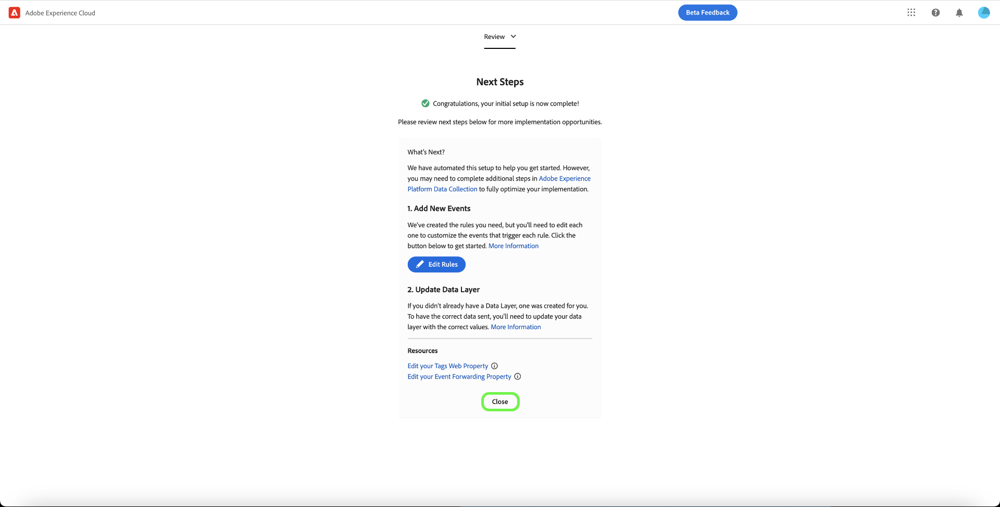

# [!DNL Meta Conversions API] información general sobre extensiones

El [[!DNL Meta Conversions API]](https://developers.facebook.com/docs/marketing-api/conversions-api/) le permite conectar los datos de marketing del lado del servidor a [!DNL Meta] para optimizar la segmentación de anuncios, reducir el coste por acción y medir los resultados. Los eventos están vinculados a una [[!DNL Meta Pixel]](https://developers.facebook.com/docs/meta-pixel/) Los ID y se procesan de forma similar a los eventos del lado del cliente.

Uso del [!DNL Meta Conversions API] , puede aprovechar las capacidades de la API en su [reenvío de eventos](../../../ui/event-forwarding/overview.md) reglas para enviar datos a [!DNL Meta] de Adobe Experience Platform Edge Network. Este documento explica cómo instalar la extensión y utilizar sus funcionalidades en un reenvío de eventos [regla](../../../ui/managing-resources/rules.md).

## Requisitos previos

Se recomienda encarecidamente utilizar [!DNL Meta Pixel] y el [!DNL Conversions API] para compartir y enviar los mismos eventos del lado del cliente y del lado del servidor, respectivamente, ya que esto puede ayudar a recuperar eventos que no recogieron [!DNL Meta Pixel]. Antes de instalar el [!DNL Conversions API] extensión, consulte la guía de la [[!DNL Meta Pixel] extensión](../../client/meta/overview.md) para ver los pasos necesarios para integrarlo en las implementaciones de etiquetas del lado del cliente.

>[!NOTE]
>
>La sección sobre [deduplicación de eventos](#deduplication) más adelante en este documento se explican los pasos para garantizar que el mismo evento no se utilice dos veces, ya que puede recibirse tanto desde el explorador como desde el servidor.

Para utilizar la variable [!DNL Conversions API] extensión, debe tener acceso al reenvío de eventos y tener un válido [!DNL Meta] cuenta con acceso a [!DNL Ad Manager] y [!DNL Event Manager]. Específicamente, debe copiar el ID de un [[!DNL Meta Pixel]](https://www.facebook.com/business/help/952192354843755?id=1205376682832142) (o [crear un nuevo [!DNL Pixel]](https://www.facebook.com/business/help/952192354843755) en su lugar) para que la extensión se pueda configurar en su cuenta de.

>[!INFO]
>
>Si planea utilizar esta extensión con datos de aplicaciones móviles o si también trabaja con datos de eventos sin conexión en su [!DNL Meta] Para las campañas de, debe crear el conjunto de datos a través de una aplicación existente y seleccionar **Crear a partir de un ID de píxel** cuando se le solicite. Consulte el artículo [Decida qué opción de creación de conjuntos de datos es la adecuada para su empresa](https://www.facebook.com/business/help/5270377362999582?id=490360542427371) para obtener más información. Consulte la [API de conversiones para eventos de aplicación](https://developers.facebook.com/docs/marketing-api/conversions-api/app-events) para todos los parámetros de seguimiento de aplicación opcionales y requeridos.

## Instalar la extensión

Para instalar el [!DNL Meta Conversions API] extensión, vaya a la IU de recopilación de datos o a la IU del Experience Platform y seleccione **[!UICONTROL Reenvío de eventos]** en el panel de navegación izquierdo. Aquí, seleccione una propiedad a la que añadir la extensión o cree una nueva propiedad.

Una vez seleccionada o creada la propiedad deseada, seleccione **[!UICONTROL Extensiones]** en el panel de navegación izquierdo, seleccione la opción **[!UICONTROL Catálogo]** pestaña. Busque la variable [!UICONTROL API de metaconversiones] y, a continuación, seleccione **[!UICONTROL Instalar]**.

![El [!UICONTROL Instalar] opción que se está seleccionando para [!UICONTROL API de metaconversiones] en la IU de recopilación de datos.](../../../images/extensions/server/meta/install.png)

En la vista de configuración que aparece, debe proporcionar el [!DNL Pixel] ID que copió anteriormente para vincular la extensión a su cuenta. Puede pegar el ID directamente en la entrada o utilizar un elemento de datos en su lugar.

También debe proporcionar un token de acceso para utilizar [!DNL Conversions API] específicamente. Consulte la [!DNL Conversions API] documentación sobre [generación de un token de acceso](https://developers.facebook.com/docs/marketing-api/conversions-api/get-started#access-token) para ver los pasos para obtener este valor.

Cuando termine, seleccione **[!UICONTROL Guardar]**

![El [!DNL Pixel] El ID proporcionado como elemento de datos en la vista de configuración de la extensión.](../../../images/extensions/server/meta/configure.png)

La extensión está instalada y ahora puede utilizar sus funcionalidades en las reglas de reenvío de eventos.

## Integración con la extensión Meta Business (MBE) {#mbe}

La integración con la mejora de Meta Business Extensions (MBE) le permite autenticarse rápidamente en su cuenta de Meta Business. A continuación, rellena automáticamente su [!UICONTROL ID de píxel] y la API de metaconversiones [!UICONTROL Token de acceso], lo que facilita la instalación y configuración de la API de conversiones de metadatos.

Aparecerá un mensaje de diálogo para autenticarse en MBE al instalar el [!UICONTROL API de metaconversiones] extensión.

![El [!UICONTROL Extensión de API de metaconversiones] resaltado de página de instalación [!UICONTROL Conectar con Meta].](../../../images/extensions/server/meta/mbe-extension-install.png)

También aparece un mensaje de diálogo para autenticarse en MBE en la interfaz de usuario del flujo de trabajo de inicio rápido dentro del reenvío de eventos.

![Resaltado de la IU del flujo de trabajo de inicio rápido [!UICONTROL Conectar con Meta].](../../../images/extensions/server/meta/mbe-extension-quick-start.png)

## Integración con la puntuación de coincidencia de calidad de evento (EMQ) {#emq}

La integración con la puntuación de coincidencia de calidad de evento (EMQ) le permite ver fácilmente la eficacia de su implementación mostrando puntuaciones EMQ. Esta integración minimiza el cambio de contexto y le ayuda a mejorar el éxito de las implementaciones de la API de conversiones de metadatos. Estas puntuaciones de eventos aparecen en la variable [!UICONTROL Extensión de API de metaconversiones] pantalla de configuración.

![El [!UICONTROL Extensión de API de metaconversiones] resaltado de página de configuración [!UICONTROL Ver puntuación EMQ].](../../../images/extensions/server/meta/emq-score.png)

## Integración con LiveRamp (Alpha) {#alpha}

[!DNL LiveRamp] clientes que tienen [!DNL LiveRamp]La solución de tráfico autenticado (ATS) de implementada en sus sitios puede optar por compartir RampID como parámetro de información del cliente. Trabaje con su [!DNL Meta] equipo de cuenta para unirse al programa de Alpha de esta función.

![El reenvío de eventos Meta [!UICONTROL Regla] resaltado de página de configuración [!UICONTROL Nombre del socio (alpha)] y [!UICONTROL ID de socio (alpha)].](../../../images/extensions/server/meta/live-ramp.png)

## Configuración de una regla de reenvío de eventos {#rule}

Esta sección explica cómo usar el [!DNL Conversions API] en una regla genérica de reenvío de eventos. En la práctica, debe configurar varias reglas para enviar todos los mensajes aceptados [eventos estándar](https://developers.facebook.com/docs/meta-pixel/reference) mediante [!DNL Meta Pixel] y [!DNL Conversions API]. Para los datos de aplicaciones móviles, consulte los campos obligatorios, los campos de datos de aplicaciones, los parámetros de información del cliente y los detalles de datos personalizados [aquí](https://developers.facebook.com/docs/marketing-api/conversions-api/app-events).

>[!NOTE]
>
>Los eventos deben ser [enviado en tiempo real](https://www.facebook.com/business/help/379226453470947?id=818859032317965) o lo más cerca posible del tiempo real para una mejor optimización de la campaña publicitaria.

Comience a crear una nueva regla de reenvío de eventos y configure sus condiciones como desee. Al seleccionar las acciones para la regla, seleccione **[!UICONTROL Extensión de API de metaconversiones]** para la extensión, seleccione **[!UICONTROL Enviar evento de API de conversiones]** para el tipo de acción.

![El [!UICONTROL Enviar vista de página] Tipo de acción seleccionado para una regla de la IU de recopilación de datos.](../../../images/extensions/server/meta/select-action.png)

Aparecen controles que permiten configurar los datos de evento que se envían a [!DNL Meta] a través de [!DNL Conversions API]. Estas opciones se pueden introducir directamente en las entradas proporcionadas o puede seleccionar elementos de datos existentes para representar los valores. Las opciones de configuración se dividen en cuatro secciones principales, como se describe a continuación.

| Sección Config | Descripción |
| --- | --- |
| [!UICONTROL Parámetros de evento del servidor] | Información general sobre el evento, incluida la hora en que se produjo y la acción de origen que lo activó. Consulte la [!DNL Meta] documentación para desarrolladores para obtener más información sobre [parámetros de evento estándar](https://developers.facebook.com/docs/marketing-api/conversions-api/parameters/server-event) aceptado por el [!DNL Conversions API].  Si utiliza ambos [!DNL Meta Pixel] y el [!DNL Conversions API] para enviar eventos, asegúrese de incluir un **[!UICONTROL Nombre del evento]** (`event_name`) y **[!UICONTROL ID de evento]** (`event_id`) con cada evento, ya que estos valores se utilizan para [deduplicación de eventos](#deduplication).  También tiene la opción de **[!UICONTROL Habilitar uso limitado de datos]** para ayudar a cumplir con las exclusiones de los clientes. Consulte la [!DNL Conversions API] documentación sobre [opciones de procesamiento de datos](https://developers.facebook.com/docs/marketing-apis/data-processing-options/) para obtener más información sobre esta función. |
| [!UICONTROL Parámetros de información del cliente] | Datos de identidad del usuario que se utilizan para atribuir el evento a un cliente. Algunos de estos valores deben tener un cifrado hash para poder enviarlos a la API.  Para garantizar una buena conexión API común y una alta calidad de coincidencia de eventos (EMQ), se recomienda enviar todos los [parámetros de información de cliente aceptados](https://developers.facebook.com/docs/marketing-api/conversions-api/parameters/customer-information-parameters) junto con eventos de servidor. Estos parámetros también deben ser [priorizadas en función de su importancia e impacto en EMQ](https://www.facebook.com/business/help/765081237991954?id=818859032317965). |
| [!UICONTROL Datos personalizados] | Datos adicionales que se utilizarán para la optimización de la entrega de anuncios, proporcionados en forma de objeto JSON. Consulte la [[!DNL Conversions API] documentación](https://developers.facebook.com/docs/marketing-api/conversions-api/parameters/custom-data) para obtener más información sobre las propiedades aceptadas para este objeto.  Si envía un evento de compra, debe utilizar esta sección para proporcionar los atributos necesarios `currency` y `value`. |
| [!UICONTROL Evento de prueba] | Esta opción se utiliza para comprobar si la configuración está provocando que reciba eventos de servidor [!DNL Meta] como se esperaba. Para utilizar esta función, seleccione la **[!UICONTROL Enviar como evento de prueba]** y, a continuación, proporcione un código de evento de prueba de su elección en la entrada siguiente. Una vez implementada la regla de reenvío de eventos, si configuró la extensión y la acción correctamente, debería ver las actividades que aparecen dentro de la variable **[!DNL Test Events]** ver en [!DNL Meta Events Manager]. |

{style="table-layout:auto"}

Cuando termine, seleccione **[!UICONTROL Conservar cambios]** para añadir la acción a la configuración de regla.

![[!UICONTROL Conservar cambios] seleccionado para la configuración de acción.](../../../images/extensions/server/meta/keep-changes.png)

Cuando esté satisfecho con la regla, seleccione **[!UICONTROL Guardar en biblioteca]**. Por último, publique un nuevo reenvío de eventos [generar](../../../ui/publishing/builds.md) para habilitar los cambios realizados en la biblioteca.

## Deduplicación de eventos {#deduplication}

Como se menciona en el [sección de requisitos previos](#prerequisites), se recomienda utilizar tanto la variable [!DNL Meta Pixel] extensión de etiquetas y [!DNL Conversions API] extensión de reenvío de eventos para enviar los mismos eventos desde el cliente y el servidor en una configuración redundante. Esto puede ayudar a recuperar eventos que no fueron recogidos por una extensión u otra.

Si envía diferentes tipos de eventos desde el cliente y el servidor sin superposición entre los dos, la anulación de duplicación no es necesaria. Sin embargo, si un solo evento lo comparten ambos [!DNL Meta Pixel] y el [!DNL Conversions API], debe asegurarse de que estos eventos redundantes se dedupliquen para que la creación de informes no se vea afectada negativamente.

Al enviar eventos compartidos, asegúrese de incluir un ID y un nombre de evento con cada evento que envíe desde el cliente y el servidor. Cuando se reciben varios eventos con el mismo ID y nombre, [!DNL Meta] emplea automáticamente varias estrategias para deduplicarlas y conservar los datos más relevantes. Consulte la [!DNL Meta] documentación sobre [deduplicación para [!DNL Meta Pixel] y [!DNL Conversions API] eventos](https://www.facebook.com/business/help/823677331451951?id=1205376682832142) para obtener más información sobre este proceso.

## Flujo de trabajo de inicio rápido: Extensión de API de metaconversiones (Beta) {#quick-start}

>[!IMPORTANT]
>
>* La función de inicio rápido está disponible para los clientes que han adquirido el paquete Real-Time CDP Prime y Ultimate. Póngase en contacto con el representante del Adobe para obtener más información.
>* Esta función es para nuevas implementaciones de red y, actualmente, no admite la instalación automática de extensiones y configuraciones en propiedades de etiquetas y reenvío de eventos existentes.

>[!NOTE]
>
>Cualquier cliente existente puede utilizar los flujos de trabajo de inicio rápido para crear una implementación de referencia que se pueda utilizar para lo siguiente:
>* Utilícelo como el inicio de una implementación completamente nueva.
>* Aproveche esta implementación como referencia que puede examinar para ver cómo se ha configurado y luego duplicarla en las implementaciones de producción actuales.

La función de inicio rápido le ayuda a configurarse con facilidad y eficacia con la API de conversiones de metadatos y las extensiones de píxeles. Esta herramienta automatiza varios pasos que se realizan en las etiquetas de Adobe y en el reenvío de eventos, lo que reduce significativamente el tiempo de configuración.

Esta función instala y configura automáticamente la API de conversiones de metadatos y las extensiones de píxeles en una propiedad de etiquetas y reenvío de eventos generada automáticamente con las reglas y los elementos de datos necesarios. Además, también instala y configura automáticamente el SDK web de Experience Platform y el conjunto de datos. Por último, la función de inicio rápido publica automáticamente la biblioteca en la dirección URL designada en un entorno de desarrollo, lo que permite la recopilación de datos del lado del cliente y el reenvío de eventos del lado del servidor en tiempo real mediante el reenvío de eventos y la red perimetral del Experience Platform.

El siguiente vídeo proporciona una introducción a la función de inicio rápido.

>[!VIDEO](https://video.tv.adobe.com/v/3416939?quality=12&learn=on)

### Instalar función de inicio rápido

>[!NOTE]
>
>Esta función está diseñada para ayudarle a empezar con una implementación de reenvío de eventos. No proporcionará una implementación integral y completamente funcional que se ajuste a todos los casos de uso.

Este programa de instalación instala automáticamente la API de metaconversiones y las extensiones de metapíxeles. Meta recomienda esta implementación híbrida para recopilar y reenviar conversiones de eventos del lado del servidor.
La función de configuración rápida está diseñada para ayudar a los clientes a empezar con una implementación de reenvío de eventos y no pretende ofrecer una implementación integral y funcional que se adapte a todos los casos de uso.

Para instalar la función, seleccione **[!UICONTROL Primeros pasos]** para **[!DNL Send Conversions Data to Meta]** en la recopilación de datos de Adobe Experience Platform **[!UICONTROL Inicio]** página.

Introduzca su **[!UICONTROL Dominio]**, luego seleccione **[!UICONTROL Siguiente]**. Este dominio se utilizará como convención de nombres para las propiedades, reglas, elementos de datos, flujos de datos, etc. de etiquetas y reenvío de eventos generados automáticamente.

En el **[!UICONTROL Configuración inicial]** diálogo introduzca su **[!UICONTROL ID de metapíxel]**, **[!UICONTROL Token de acceso a API de metaconversión]**, y **[!UICONTROL Ruta de capa de datos]**, luego seleccione **[!UICONTROL Siguiente]**.

Espere unos minutos para que se complete el proceso de configuración inicial y, a continuación, seleccione **[!UICONTROL Siguiente]**.

Desde el **[!UICONTROL Añadir código en el sitio]** diálogo copie el código proporcionado utilizando la copia  y péguelo en la `<head>` del sitio web de origen. Una vez implementada, seleccione **[!UICONTROL Iniciar validación]**

El [!UICONTROL Resultados de validación] muestra los resultados de la implementación de la extensión Meta. Seleccionar **[!UICONTROL Siguiente]**. También puede ver resultados de validación adicionales seleccionando la variable **[!UICONTROL Assurance]** vínculo.

El **[!UICONTROL Pasos siguientes]** la pantalla confirma la finalización de la configuración. Desde aquí tiene la opción de optimizar la implementación añadiendo nuevos eventos, que se muestran en la siguiente sección.

Si no desea añadir eventos adicionales, seleccione **[!UICONTROL Cerrar]**.

#### Adición de eventos adicionales

Para añadir nuevos eventos, seleccione **[!UICONTROL Editar la propiedad web de etiquetas]**.

Seleccione la regla que corresponda al metaevento que desee editar. Por ejemplo, **MetaConversion_AddToCart**.

>[!NOTE]
>
>Si no hay ningún evento, esta regla no se ejecutará. Esto es así para todas las reglas, con la variable **MetaConversion_PageView** regla que es la excepción.

Para añadir un evento, seleccione **[!UICONTROL Añadir]** en el [!UICONTROL Eventos] encabezado.

Seleccione el [!UICONTROL Tipo de evento]. En este ejemplo, se ha seleccionado la variable [!UICONTROL Clic] y lo configuró en déclencheur cuando el **.add-to-cart-button** está seleccionado. Seleccione **[!UICONTROL Conservar cambios]**.

Se ha guardado el nuevo evento. Seleccionar **[!UICONTROL Seleccionar una biblioteca de trabajo]** y seleccione la biblioteca en la que desea compilar.

A continuación, seleccione el menú desplegable situado junto a **[!UICONTROL Guardar en biblioteca]** y seleccione **[!UICONTROL Guardar en biblioteca y crear]**. Esto publicará el cambio en la biblioteca.

Repita estos pasos para cualquier otro evento de metaconversión que desee configurar.

#### Configuración de capa de datos {#configuration}

>[!IMPORTANT]
>
>La forma de actualizar esta capa de datos global depende de la arquitectura del sitio web. Una aplicación de una sola página será diferente a una aplicación de procesamiento del lado del servidor. También existe la posibilidad de que esté totalmente a cargo de la creación y actualización de estos datos dentro del producto Etiquetas. En todos los casos, la capa de datos deberá actualizarse entre la ejecución de cada uno de los `MetaConversion_* rules`. Si no actualiza los datos entre reglas, también puede encontrar un caso en el que esté enviando datos antiguos desde el último `MetaConversion_* rule` en el actual `MetaConversion_* rule`.

Durante la configuración, se le preguntó dónde reside su capa de datos. De forma predeterminada, sería `window.dataLayer.meta`, y dentro de `meta` objeto, sus datos serían esperados como se muestra abajo.

Esto es importante entenderlo como cada `MetaConversion_*` utiliza esta estructura de datos para pasar los fragmentos de datos relevantes al [!DNL Meta Pixel] y a la [!DNL Meta Conversions API]. Consulte la documentación sobre [eventos estándar](https://developers.facebook.com/docs/meta-pixel/reference#standard-events) para obtener más información sobre los datos que requieren los distintos metaeventos.

Por ejemplo, si desea utilizar la variable `MetaConversion_Subscribe` regla, debería actualizar `window.dataLayer.meta.currency`, `window.dataLayer.meta.predicted_ltv`, y `window.dataLayer.meta.value` según las propiedades del objeto descritas en la documentación sobre [eventos estándar](https://developers.facebook.com/docs/meta-pixel/reference#standard-events).

A continuación se muestra un ejemplo de lo que sería necesario ejecutar en un sitio web para actualizar la capa de datos antes de ejecutar la regla.

De forma predeterminada, la variable `<datalayerpath>.conversionData.eventId` se generará aleatoriamente mediante la acción &quot;Generar nuevo ID de evento&quot; en cualquiera de las `MetaConversion_* rules`.

Para obtener una referencia local del aspecto que debería tener la capa de datos, puede abrir el editor de código personalizado en el `MetaConversion_DataLayer` elemento de datos de su propiedad.

## Pasos siguientes

En esta guía se explica cómo enviar datos de eventos del lado del servidor a [!DNL Meta] uso del [!DNL Meta Conversions API] extensión. Desde aquí, se recomienda ampliar la integración conectando más [!DNL Pixels] y compartir más eventos cuando corresponda. Realizar cualquiera de las siguientes acciones puede ayudar a mejorar aún más el rendimiento de su anuncio:

* Conectar cualquier otro [!DNL Pixels] que aún no están conectados a un [!DNL Conversions API] integración.
* Si envía ciertos eventos exclusivamente a través de [!DNL Meta Pixel] en el lado del cliente, envíe estos mismos eventos a [!DNL Conversions API] también desde el lado del servidor.

Consulte la [!DNL Meta] documentación sobre [prácticas recomendadas para [!DNL Conversions API]](https://www.facebook.com/business/help/308855623839366?id=818859032317965) para obtener más información sobre cómo implementar de forma eficaz su integración. Para obtener información más general sobre las etiquetas y el reenvío de eventos en Adobe Experience Cloud, consulte [información general sobre etiquetas](../../../home.md).
