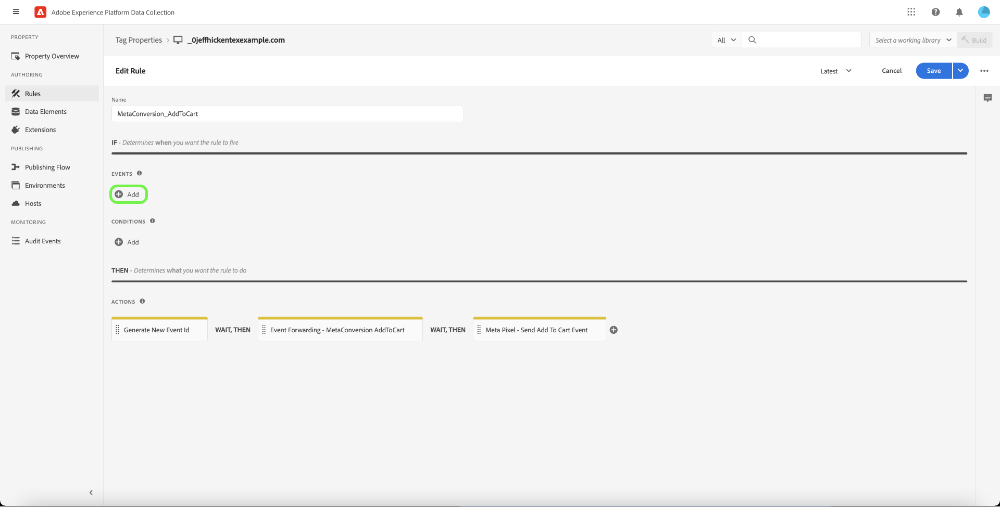

# Información general sobre la extensión [!DNL Meta Conversions API]

[[!DNL Meta Conversions API]](https://developers.facebook.com/docs/marketing-api/conversions-api/) le permite conectar los datos de marketing del lado del servidor a las tecnologías [!DNL Meta] para optimizar la segmentación de anuncios, reducir el coste por acción y medir los resultados. Los eventos están vinculados a un ID [[!DNL Meta Pixel]](https://developers.facebook.com/docs/meta-pixel/) y se procesan de manera similar a los eventos del lado del cliente.

Con la extensión [!DNL Meta Conversions API], puede aprovechar las capacidades de la API en sus reglas de [reenvío de eventos](../../../ui/event-forwarding/overview.md) para enviar datos a [!DNL Meta] desde el Edge Network de Adobe Experience Platform. Este documento explica cómo instalar la extensión y utilizar sus funcionalidades en una regla de reenvío de eventos [rule](../../../ui/managing-resources/rules.md).

## Demostración

El siguiente vídeo pretende facilitar su comprensión de [!DNL Meta Conversions API].

>[!VIDEO](https://unlockmarketingdata.com/video-meta-conversions-api)

## Requisitos previos

Se recomienda encarecidamente usar [!DNL Meta Pixel] y [!DNL Conversions API] para compartir y enviar los mismos eventos del lado del cliente y del lado del servidor, respectivamente, ya que esto puede ayudar a recuperar eventos que [!DNL Meta Pixel] no captó. Antes de instalar la extensión [!DNL Conversions API], consulte la guía de la extensión [[!DNL Meta Pixel] extension](../../client/meta/overview.md) para ver los pasos necesarios para integrarla en las implementaciones de etiquetas del lado del cliente.

>[!NOTE]
>
>La sección sobre la [anulación de duplicación de eventos](#deduplication) que se incluye más adelante en este documento trata los pasos para garantizar que el mismo evento no se utilice dos veces, ya que puede recibirse tanto del explorador como del servidor.

Para usar la extensión [!DNL Conversions API], debe tener acceso al reenvío de eventos y una cuenta de [!DNL Meta] válida con acceso a [!DNL Ad Manager] y [!DNL Event Manager]. Específicamente, debe copiar el ID de un(a) [[!DNL Meta Pixel]](https://www.facebook.com/business/help/952192354843755?id=1205376682832142) existente(o [crear un(a)  [!DNL Pixel]](https://www.facebook.com/business/help/952192354843755) nuevo(a) en su lugar) para que la extensión se pueda configurar en su cuenta.

>[!INFO]
>
>Si planea usar esta extensión con datos de aplicaciones móviles, o si también trabaja con datos de eventos sin conexión en sus campañas de [!DNL Meta], deberá crear su conjunto de datos a través de una aplicación existente y seleccionar **Crear a partir de un ID de píxel** cuando se le solicite. Consulte el artículo [Decida qué opción de creación de conjuntos de datos es la adecuada para su empresa](https://www.facebook.com/business/help/5270377362999582?id=490360542427371) para obtener más información. Consulte el documento [API de conversiones para eventos de aplicación](https://developers.facebook.com/docs/marketing-api/conversions-api/app-events) para todos los parámetros de seguimiento de aplicación opcionales y requeridos.

## Instalación de la extensión

Para instalar la extensión [!DNL Meta Conversions API], vaya a la IU de recopilación de datos o a la IU del Experience Platform y seleccione **[!UICONTROL Reenvío de eventos]** en el panel de navegación izquierdo. Aquí, seleccione una propiedad a la que añadir la extensión o cree una nueva propiedad.

Una vez que haya seleccionado o creado la propiedad deseada, seleccione **[!UICONTROL Extensiones]** en el panel de navegación izquierdo y, a continuación, seleccione la pestaña **[!UICONTROL Catálogo]**. Busque la tarjeta [!UICONTROL API de metaconversiones] y, a continuación, seleccione **[!UICONTROL Instalar]**.

![Se está seleccionando la opción [!UICONTROL Instalar] para la extensión de la API [!UICONTROL Meta Conversiones] en la IU de recopilación de datos.](../../../images/extensions/server/meta/install.png)

En la vista de configuración que aparece, debe proporcionar el ID de [!DNL Pixel] que copió anteriormente para vincular la extensión a su cuenta. Puede pegar el ID directamente en la entrada o utilizar un elemento de datos en su lugar.

También debe proporcionar un token de acceso para usar específicamente [!DNL Conversions API]. Consulte la documentación de [!DNL Conversions API] sobre [generación de un token de acceso](https://developers.facebook.com/docs/marketing-api/conversions-api/get-started#access-token) para ver los pasos sobre cómo obtener este valor.

Cuando termine, seleccione **[!UICONTROL Guardar]**

![El identificador [!DNL Pixel] proporcionado como elemento de datos en la vista de configuración de la extensión.](../../../images/extensions/server/meta/configure.png)

La extensión está instalada y ahora puede utilizar sus funcionalidades en las reglas de reenvío de eventos.

## Integración con la extensión de Facebook y Instagram {#facebook}

La integración con la extensión Facebook y Instagram le permite autenticarse rápidamente en su cuenta de Meta Business. Esto rellena automáticamente su [!UICONTROL ID de píxel] y el token de acceso [!UICONTROL del token de acceso] de la API de metaconversiones, lo que facilita la instalación y configuración de la API de metaconversiones.

Aparecerá un mensaje de diálogo para autenticarse en Facebook y Instagram al instalar la extensión [!UICONTROL Meta Conversions API].

![La página de instalación de [!UICONTROL Extensión de la API de conversiones de metadatos] resalta [!UICONTROL Conectarse a Meta].](../../../images/extensions/server/meta/mbe-extension-install.png)

También aparece un mensaje de diálogo para autenticarse en Facebook y Instagram en la interfaz de usuario del flujo de trabajo de inicio rápido dentro del reenvío de eventos.

![Resaltar la interfaz de usuario del flujo de trabajo de inicio rápido [!UICONTROL Conectar con Meta].](../../../images/extensions/server/meta/mbe-extension-quick-start.png)

## Integración con la puntuación de coincidencia de calidad de evento (EMQ) {#emq}

La integración con la puntuación de coincidencia de calidad de evento (EMQ) le permite ver fácilmente la eficacia de su implementación mostrando puntuaciones EMQ. Esta integración minimiza el cambio de contexto y le ayuda a mejorar el éxito de las implementaciones de la API de conversiones de metadatos. Estas puntuaciones de eventos aparecen en la pantalla de configuración [!UICONTROL Extensión de API de metaconversiones].

![La página de configuración de la extensión de la API de [!UICONTROL metaconversiones] destaca [!UICONTROL Ver puntuación de EMQ].](../../../images/extensions/server/meta/emq-score.png)

## Integración con LiveRamp (Alpha) {#alpha}

Los clientes de [!DNL LiveRamp] que tienen la solución de tráfico autenticado (ATS) de [!DNL LiveRamp] implementada en sus sitios pueden optar por compartir RampID como parámetro de información del cliente. Trabaje con el equipo de su cuenta de [!DNL Meta] para unirse al programa de Alpha de esta función.

![La página de configuración del reenvío de eventos Meta [!UICONTROL Regla] resalta [!UICONTROL Nombre de socio (alpha)] y [!UICONTROL ID de socio (alpha)].](../../../images/extensions/server/meta/live-ramp.png)

## Configuración de una regla de reenvío de eventos {#rule}

Esta sección explica cómo usar la extensión [!DNL Conversions API] en una regla genérica de reenvío de eventos. En la práctica, debe configurar varias reglas para enviar todos los [eventos estándar](https://developers.facebook.com/docs/meta-pixel/reference) aceptados a través de [!DNL Meta Pixel] y [!DNL Conversions API]. Para los datos de aplicaciones móviles, consulte los campos obligatorios, los campos de datos de aplicaciones, los parámetros de información de clientes y los detalles de datos personalizados [aquí](https://developers.facebook.com/docs/marketing-api/conversions-api/app-events).

>[!NOTE]
>
>Los eventos deben [enviarse en tiempo real](https://www.facebook.com/business/help/379226453470947?id=818859032317965) o lo más cerca posible del tiempo real para optimizar la campaña publicitaria.

Comience a crear una nueva regla de reenvío de eventos y configure sus condiciones como desee. Al seleccionar las acciones de la regla, seleccione **[!UICONTROL Extensión de API de metaconversiones]** para la extensión y, a continuación, seleccione **[!UICONTROL Enviar evento de API de conversiones]** para el tipo de acción.

![Se está seleccionando el tipo de acción [!UICONTROL Enviar vista de página] para una regla en la IU de recopilación de datos.](../../../images/extensions/server/meta/select-action.png)

Aparecen controles que le permiten configurar los datos de evento que se enviarán a [!DNL Meta] mediante [!DNL Conversions API]. Estas opciones se pueden introducir directamente en las entradas proporcionadas o puede seleccionar elementos de datos existentes para representar los valores. Las opciones de configuración se dividen en cuatro secciones principales, como se describe a continuación.

| Sección Config | Descripción |
| --- | --- |
| [!UICONTROL Parámetros de evento del servidor] | Información general sobre el evento, incluida la hora en que se produjo y la acción de origen que lo activó. Consulte la documentación para desarrolladores de [!DNL Meta] para obtener más información sobre los [parámetros de evento estándar](https://developers.facebook.com/docs/marketing-api/conversions-api/parameters/server-event) aceptados por [!DNL Conversions API].  Si usa [!DNL Meta Pixel] y [!DNL Conversions API] para enviar eventos, asegúrese de incluir **[!UICONTROL Nombre del evento]** (`event_name`) y **[!UICONTROL Id. del evento]** (`event_id`) con cada evento, ya que estos valores se usan para [anulación de duplicación de eventos](#deduplication).  También tiene la opción de **[!UICONTROL Habilitar el uso limitado de datos]** para ayudar a cumplir con las exclusiones de los clientes. Consulte la documentación de [!DNL Conversions API] sobre [opciones de procesamiento de datos](https://developers.facebook.com/docs/marketing-apis/data-processing-options/) para obtener detalles sobre esta característica. |
| [!UICONTROL Parámetros de información del cliente] | Datos de identidad del usuario que se utilizan para atribuir el evento a un cliente. Algunos de estos valores deben tener un cifrado hash para poder enviarlos a la API.  Para garantizar una buena conexión de API común y una alta calidad de coincidencia de eventos (EMQ), se recomienda que envíe todos los [parámetros de información de clientes aceptados](https://developers.facebook.com/docs/marketing-api/conversions-api/parameters/customer-information-parameters) junto con los eventos del servidor. Estos parámetros también deben tener una prioridad [en función de su importancia e impacto en EMQ](https://www.facebook.com/business/help/765081237991954?id=818859032317965). |
| [!UICONTROL Datos personalizados] | Datos adicionales que se utilizarán para la optimización de la entrega de anuncios, proporcionados en forma de objeto JSON. Consulte la [[!DNL Conversions API] documentación](https://developers.facebook.com/docs/marketing-api/conversions-api/parameters/custom-data) para obtener más información sobre las propiedades aceptadas para este objeto.  Si está enviando un evento de compra, debe utilizar esta sección para proporcionar los atributos necesarios `currency` y `value`. |
| [!UICONTROL Evento de prueba] | Esta opción se usa para comprobar si su configuración está causando que [!DNL Meta] reciba eventos de servidor según lo esperado. Para usar esta característica, seleccione la casilla de verificación **[!UICONTROL Enviar como evento de prueba]** y, a continuación, proporcione el código de evento de prueba que elija en la entrada siguiente. Una vez implementada la regla de reenvío de eventos, si configuró la extensión y la acción correctamente, debería ver las actividades que aparecen en la vista **[!DNL Test Events]** en [!DNL Meta Events Manager]. |

{style="table-layout:auto"}

Cuando termine, seleccione **[!UICONTROL Conservar cambios]** para agregar la acción a la configuración de regla.

![[!UICONTROL Mantener cambios] seleccionados para la configuración de acción.](../../../images/extensions/server/meta/keep-changes.png)

Cuando esté satisfecho con la regla, seleccione **[!UICONTROL Guardar en biblioteca]**. Por último, publique un nuevo reenvío de eventos [build](../../../ui/publishing/builds.md) para habilitar los cambios realizados en la biblioteca.

## Deduplicación de eventos {#deduplication}

Como se menciona en la [sección de requisitos previos](#prerequisites), se recomienda usar tanto la extensión de etiqueta [!DNL Meta Pixel] como la extensión de reenvío de eventos [!DNL Conversions API] para enviar los mismos eventos desde el cliente y el servidor en una configuración redundante. Esto puede ayudar a recuperar eventos que no fueron recogidos por una extensión u otra.

Si envía diferentes tipos de eventos desde el cliente y el servidor sin superposición entre los dos, la anulación de duplicación no es necesaria. Sin embargo, si [!DNL Meta Pixel] y [!DNL Conversions API] comparten un solo evento, debe asegurarse de que se dedupliquen estos eventos redundantes para que la creación de informes no se vea afectada negativamente.

Al enviar eventos compartidos, asegúrese de incluir un ID y un nombre de evento con cada evento que envíe desde el cliente y el servidor. Cuando se reciben varios eventos con el mismo ID y nombre, [!DNL Meta] emplea automáticamente varias estrategias para anular la duplicación y conservar los datos más relevantes. Consulte la documentación de [!DNL Meta] sobre la [anulación de duplicación para [!DNL Meta Pixel] y [!DNL Conversions API] eventos](https://www.facebook.com/business/help/823677331451951?id=1205376682832142) para obtener más información sobre este proceso.

## Flujo de trabajo de inicio rápido: Extensión de la API de metaconversiones (Beta) {#quick-start}

>[!IMPORTANT]
>
>* La función de inicio rápido está disponible para los clientes que han adquirido el paquete Real-Time CDP Prime y Ultimate. Póngase en contacto con el representante del Adobe para obtener más información.
>* Esta función es para nuevas implementaciones de red y, actualmente, no admite la instalación automática de extensiones y configuraciones en propiedades de etiquetas y reenvío de eventos existentes.

>[!NOTE]
>
>Cualquier cliente existente puede utilizar los flujos de trabajo de inicio rápido para crear una implementación de referencia que se pueda utilizar para lo siguiente:
>* Utilícelo como el inicio de una implementación completamente nueva.
>* Aproveche esta implementación como referencia que puede examinar para ver cómo se ha configurado y luego duplicarla en las implementaciones de producción actuales.

La función de inicio rápido le ayuda a configurarse con facilidad y eficacia con la API de conversiones de metadatos y las extensiones de píxeles. Esta herramienta automatiza varios pasos que se realizan en las etiquetas de Adobe y en el reenvío de eventos, lo que reduce significativamente el tiempo de configuración.

Esta función instala y configura automáticamente la API de conversiones de metadatos y las extensiones de píxeles en una propiedad de etiquetas y reenvío de eventos generada automáticamente con las reglas y los elementos de datos necesarios. Además, también instala y configura automáticamente el SDK web de Experience Platform y el conjunto de datos. Por último, la función de inicio rápido publica automáticamente la biblioteca en la dirección URL designada en un entorno de desarrollo, lo que permite la recopilación de datos del lado del cliente y el reenvío de eventos del lado del servidor en tiempo real mediante el reenvío de eventos y el Edge Network del Experience Platform.

El siguiente vídeo proporciona una introducción a la función de inicio rápido.

>[!VIDEO](https://video.tv.adobe.com/v/3416939?quality=12&learn=on)

### Instalar función de inicio rápido

>[!NOTE]
>
>Esta función está diseñada para ayudarle a empezar con una implementación de reenvío de eventos. No proporcionará una implementación integral y completamente funcional que se ajuste a todos los casos de uso.

Este programa de instalación instala automáticamente la API de metaconversiones y las extensiones de metapíxeles. Meta recomienda esta implementación híbrida para recopilar y reenviar conversiones de eventos del lado del servidor.
La función de configuración rápida está diseñada para ayudar a los clientes a empezar con una implementación de reenvío de eventos y no pretende ofrecer una implementación integral y funcional que se adapte a todos los casos de uso.

Para instalar la característica, selecciona **[!UICONTROL Introducción]** para **[!DNL Send Conversions Data to Meta]** en la página de recopilación de datos de Adobe Experience Platform **[!UICONTROL Inicio]**.

Escribe tu **[!UICONTROL dominio]** y selecciona **[!UICONTROL Siguiente]**. Este dominio se utilizará como convención de nombres para las propiedades, reglas, elementos de datos, flujos de datos, etc. de etiquetas y reenvío de eventos generados automáticamente.

En el cuadro de diálogo **[!UICONTROL Configuración inicial]**, escriba su **[!UICONTROL Id. de metapíxel]**, **[!UICONTROL Token de acceso a la API de metaconversión]** y **[!UICONTROL Ruta de la capa de datos]**; a continuación, seleccione **[!UICONTROL Siguiente]**.

Espere unos minutos para que se complete el proceso de configuración inicial y, a continuación, seleccione **[!UICONTROL Siguiente]**.

Desde el cuadro de diálogo **[!UICONTROL Agregar código en su sitio]** copie el código proporcionado mediante la función Copiar  y péguelo en el `<head>` del sitio web de origen. Una vez implementada, seleccione **[!UICONTROL Iniciar validación]**

El cuadro de diálogo [!UICONTROL Resultados de validación] muestra los resultados de la implementación de la extensión Meta. Seleccione **[!UICONTROL Siguiente]**. También puede ver resultados de validación adicionales seleccionando el vínculo **[!UICONTROL Garantía]**.

La pantalla **[!UICONTROL Pasos siguientes]** confirma la finalización de la instalación. Desde aquí tiene la opción de optimizar la implementación añadiendo nuevos eventos, que se muestran en la siguiente sección.

Si no desea agregar más eventos, seleccione **[!UICONTROL Cerrar]**.

#### Adición de eventos adicionales

Para agregar nuevos eventos, seleccione **[!UICONTROL Editar la propiedad web de etiquetas]**.

Seleccione la regla que corresponda al metaevento que desee editar. Por ejemplo, **MetaConversion_AddToCart**.

>[!NOTE]
>
>Si no hay ningún evento, esta regla no se ejecutará. Esto se cumple en todas las reglas, con la regla **MetaConversion_PageView** como excepción.

Para agregar un evento, seleccione **[!UICONTROL Agregar]** bajo el encabezado [!UICONTROL Eventos].

Seleccione [!UICONTROL Tipo de evento]. En este ejemplo, se ha seleccionado el evento [!UICONTROL Click] y se ha configurado en déclencheur cuando se selecciona **.add-to-cart-button**. Seleccione **[!UICONTROL Conservar cambios]**.

Se ha guardado el nuevo evento. Seleccione **[!UICONTROL Seleccionar una biblioteca en funcionamiento]** y seleccione la biblioteca en la que desea compilar.

A continuación, seleccione el menú desplegable junto a **[!UICONTROL Guardar en biblioteca]** y seleccione **[!UICONTROL Guardar en biblioteca y crear]**. Esto publicará el cambio en la biblioteca.

Repita estos pasos para cualquier otro evento de metaconversión que desee configurar.

#### Configuración de capa de datos {#configuration}

>[!IMPORTANT]
>
>La forma de actualizar esta capa de datos global depende de la arquitectura del sitio web. Una aplicación de una sola página será diferente a una aplicación de procesamiento del lado del servidor. También existe la posibilidad de que esté totalmente a cargo de la creación y actualización de estos datos dentro del producto Etiquetas. En todos los casos, la capa de datos deberá actualizarse entre la ejecución de cada uno de los `MetaConversion_* rules`. Si no actualiza los datos entre reglas, también podría encontrarse con un caso en el que esté enviando datos antiguos de los últimos `MetaConversion_* rule` en el `MetaConversion_* rule` actual.

Durante la configuración, se le preguntó dónde reside su capa de datos. De manera predeterminada, sería `window.dataLayer.meta` y, dentro del objeto `meta`, se esperarían los datos como se muestra a continuación.

Esto es importante de entender, ya que cada regla de `MetaConversion_*` utiliza esta estructura de datos para pasar los datos relevantes a la extensión [!DNL Meta Pixel] y a [!DNL Meta Conversions API]. Consulte la documentación de [eventos estándar](https://developers.facebook.com/docs/meta-pixel/reference#standard-events) para obtener más información sobre los datos que requieren los distintos metaeventos.

Por ejemplo, si desea utilizar la regla `MetaConversion_Subscribe`, debe actualizar `window.dataLayer.meta.currency`, `window.dataLayer.meta.predicted_ltv` y `window.dataLayer.meta.value` según las propiedades de objeto descritas en la documentación sobre [eventos estándar](https://developers.facebook.com/docs/meta-pixel/reference#standard-events).

A continuación se muestra un ejemplo de lo que sería necesario ejecutar en un sitio web para actualizar la capa de datos antes de ejecutar la regla.

De manera predeterminada, `<datalayerpath>.conversionData.eventId` se generará aleatoriamente mediante la acción &quot;Generar nuevo identificador de evento&quot; en cualquiera de las `MetaConversion_* rules`.

Para obtener una referencia local del aspecto que debería tener la capa de datos, puede abrir el editor de código personalizado en el elemento de datos `MetaConversion_DataLayer` de su propiedad.

## Pasos siguientes

En esta guía se explica cómo enviar datos de evento del lado del servidor a [!DNL Meta] mediante la extensión [!DNL Meta Conversions API]. A partir de aquí, se recomienda ampliar la integración conectando más [!DNL Pixels] y compartiendo más eventos cuando corresponda. Realizar cualquiera de las siguientes acciones puede ayudar a mejorar aún más el rendimiento de su anuncio:

* Conecte cualquier otro(a) [!DNL Pixels] que aún no esté conectado a una integración de [!DNL Conversions API].
* Si está enviando ciertos eventos exclusivamente a través de [!DNL Meta Pixel] en el lado del cliente, envíe también estos mismos eventos al [!DNL Conversions API] desde el lado del servidor.

Consulte la documentación de [!DNL Meta] sobre las [prácticas recomendadas para [!DNL Conversions API]](https://www.facebook.com/business/help/308855623839366?id=818859032317965) para obtener más información sobre cómo implementar de forma eficaz su integración. Para obtener información más general sobre las etiquetas y el reenvío de eventos en Adobe Experience Cloud, consulte [información general sobre etiquetas](../../../home.md).
