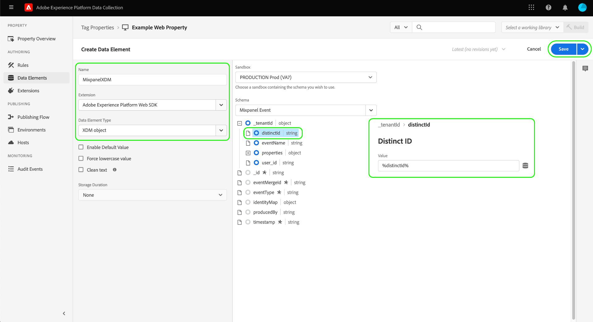
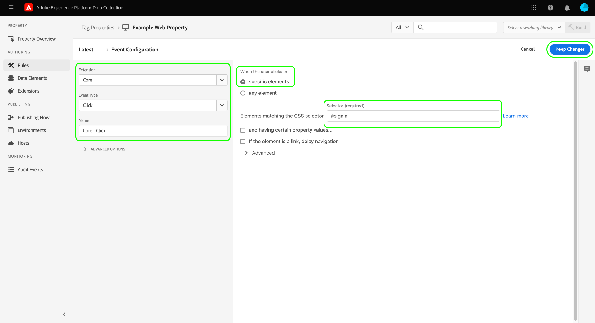
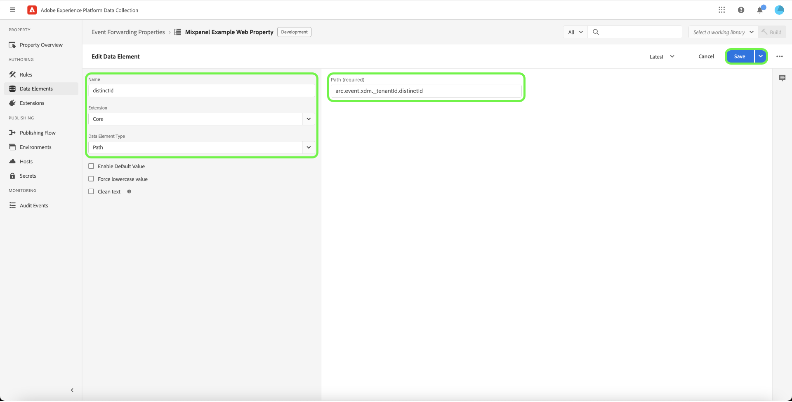

# [!DNL Mixpanel Track Events] Extensión de reenvío de eventos de API

[[!DNL Mixpanel]](https://www.mixpanel.com) es una herramienta de análisis de producto que le permite capturar datos sobre cómo interactúan los usuarios con un producto digital. Puede analizar los datos del producto con informes interactivos y simples que le permiten consultar y visualizar los datos con solo unos clics. [!DNL Mixpanel] diseñado para que los equipos sean más eficientes, ya que permite a todos analizar los datos de los usuarios en tiempo real para identificar tendencias, comprender el comportamiento de los usuarios y tomar decisiones sobre su producto.

[!DNL Mixpanel] emplea un modelo basado en eventos y centrado en el usuario que conecta cada interacción con un único usuario. La variable [!DNL Mixpanel] el modelo de datos se basa en los conceptos de usuarios, eventos y propiedades.

>[!NOTE]
>
>Consulte la [!DNL Mixpanel] documentación sobre [administración de identidades](https://help.mixpanel.com/hc/en-us/articles/360041039771-Getting-Started-with-Identity-Management) para comprender cómo [!DNL Mixpanel] combina eventos para crear clústeres de identidad. También se recomienda revisar el documento en [ID distintos](https://help.mixpanel.com/hc/en-us/articles/115004509426-Distinct-ID-Creation-JavaScript-iOS-Android-) para comprender cómo se utilizan para identificar a los usuarios en los datos de evento.

La variable [!DNL Mixpanel Track Events] La extensión de API permite aprovechar ambas [reenvío de eventos](../../../ui/event-forwarding/overview.md) y [etiquetas](../../../home.md) para capturar información de evento en la red perimetral de Adobe Experience Platform y enviarla a [!DNL Mixpanel] usando la variable [[!DNL Track Events] API](https://developer.mixpanel.com/reference/track-event). Este documento cubre los casos de uso de la extensión, cómo instalarla y cómo integrar sus capacidades en el reenvío de eventos [reglas](../../../ui/managing-resources/rules.md).

## Casos de uso

Esta extensión debe usarse si desea utilizar datos de la red perimetral en [!DNL Mixpanel] para aprovechar las funciones de análisis de productos.

Por ejemplo, considere una organización minorista que tiene una presencia multicanal (sitio web y móvil). La organización captura la entrada transaccional o de conversación como datos de evento de sus plataformas y lo carga en [!DNL Mixpanel] uso de la extensión de reenvío de eventos.

Los equipos de análisis pueden aprovechar [!DNL Mixpanel's] capacidades para procesar los conjuntos de datos y derivar perspectivas empresariales, que pueden utilizarse para generar gráficos, tableros u otras visualizaciones para informar a las partes interesadas del negocio.

Para obtener más información sobre casos de uso específicos de [!DNL Mixpanel], consulte la siguiente documentación:

* [Nuevo en [!DNL Mixpanel]](https://help.mixpanel.com/hc/en-us/sections/360008533532-New-to-Mixpanel)
* [¿Qué es  [!DNL Mixpanel]?](https://developer.mixpanel.com/docs)
* [12 prueba obligatoria [!DNL Mixpanel] características](https://mixpanel.com/blog/12-things-you-probably-didnt-know-you-could-do-with-mixpanel/)

## [!DNL Mixpanel] requisitos previos {#prerequisites-mixpanel}

Debe tener una [!DNL Mixpanel] para utilizar esta extensión. Vaya a la [[!DNL Mixpanel] página de registro](https://mixpanel.com/register/) para registrar y crear una cuenta si todavía no la tiene.

Asegúrese de que la variable [[!DNL Identity Merge]](https://help.mixpanel.com/hc/en-us/articles/9648680824852-ID-Merge-Implementation-Best-Practices) está habilitado para el proyecto. Vaya a **[!DNL Settings]** > **[!DNL Project Setting]** > **[!DNL Identity Merge]** y alterne la configuración .

<!-- (If these don't apply, do we need to include here at all?)
### API guardrails {#guardrails}

Refer to the [[!DNL Mixpanel] documentation](https://developer.mixpanel.com/reference/import-events#rate-limits) for limits and response codes. As [!DNL Mixpanel] only sends live events these limits should not apply.
-->

### Recopilar los detalles de configuración necesarios {#configuration-details}

Para conectar el Experience Platform a [!DNL Mixpanel] debe tener las siguientes entradas:

| Tipo de clave | Descripción | Ejemplo |
| --- | --- | --- |
| Token del proyecto | El token de proyecto asociado con su [!DNL Mixpanel] cuenta. Consulte la [!DNL Mixpanel] documentación sobre [búsqueda del token del proyecto](https://help.mixpanel.com/hc/en-us/articles/115004502806-Find-Project-Token-) para obtener más información. | `25470xxxxxxxxxxxxxxxxxxx1289` |

## Requisitos previos del Experience Cloud

Esta sección cubre los pasos previos en Experience Cloud para todas las implementaciones. Según las necesidades de implementación individuales, puede resultar útil configurar las siguientes construcciones antes de configurar la extensión:

1. A [esquema](../../../../xdm/schema/composition.md) para describir la estructura de los datos que está incorporando en Experience Cloud
1. A [datastream](https://experienceleague.adobe.com/docs/platform-learn/data-collection/event-forwarding/set-up-a-datastream.html) para enrutar los datos entrantes a las aplicaciones de Adobe Experience Cloud adecuadas
1. A [conjunto de datos](https://experienceleague.adobe.com/docs/platform-learn/tutorials/data-ingestion/create-datasets-and-ingest-data.html?lang=es) para almacenar los datos recopilados

Para todas las implementaciones, se requiere lo siguiente en el lado del Experience Cloud:

1. [Crear un secreto](#create-a-secret)
1. [Configuración de propiedades de etiquetas](#set-up-tag-properties)
1. [Adición de elementos de datos dentro de las propiedades de etiquetas](#add-data-elements-within-tag-properties)
1. [Agregar reglas dentro de las propiedades de etiquetas](#add-rules-within-tag-properties)

### Crear un secreto

Cree una nueva [secreto de reenvío de eventos](../../../ui/event-forwarding/secrets.md) y establezca el valor en su [[!DNL Mixpanel] token del proyecto](#configuration-details). Se utilizará para autenticar la conexión con su cuenta mientras se mantiene el valor seguro.

### Configuración de propiedades de etiquetas

[Crear una propiedad de etiqueta](https://experienceleague.adobe.com/docs/platform-learn/implement-in-websites/configure-tags/create-a-property.html?lang=en) o elija una propiedad existente para editarla en su lugar. Esta propiedad se configura para recopilar las estructuras de datos necesarias para [!DNL Mixpanel] ya que se incorporan a la red perimetral antes de enviarse mediante el reenvío de eventos.

### Adición de elementos de datos dentro de las propiedades de etiquetas

Si su sitio web utiliza la variable [[!DNL Mixpanel] SDK](https://developer.mixpanel.com/docs/nodejs), debe [crear un elemento de datos](../../../ui/managing-resources/data-elements.md) que usa la variable **[!UICONTROL Cookie]** tipo (proporcionado por el [[!UICONTROL Principal] extensión de etiqueta](../../client/core/overview.md)) de modo que la variable [!DNL Mixpanel] `distinct_id` se puede leer desde la cookie .

La variable **[!UICONTROL Nombre de la cookie]** debe coincidir con la variable [!DNL Mixpanel] nombre de la cookie para el sitio web. El nombre debe tener un formato similar al `mp_{MIXPANEL_PROJECT_TOKEN_FOR_WEBSITE}_mixpanel`. Seleccione **[!UICONTROL Guardar]** cuando haya terminado.

>[!IMPORTANT]
>
>El nombre del elemento de datos anterior (`distinctId` en este ejemplo) debe coincidir con el nombre utilizado para el mismo campo en el esquema. Esto también se aplica al elemento de datos de reenvío de eventos que va a crear más adelante.

Para el segundo elemento de datos, establezca el tipo en **[!UICONTROL Objeto XDM]** (desde el [Extensión de Adobe Experience Platform Web SDK](../../client/sdk/overview.md)) y asignarlo al esquema creado anteriormente. Al asignar los datos, asegúrese de que el valor de la variable `distinct_id` elemento de datos (que contiene la variable [!DNL Mixpanel] `distinct_id` de la cookie) se hace referencia como un valor dentro de uno de los campos de esquema.

>[!NOTE]
>
>Si el sitio web no está ejecutando la variable [!DNL Mixpanel] SDK, se utilizará un Adobe Experience Cloud ID (ECID) como alternativa `distinct_id` valor que se transmitirá con el evento enviado a [!DNL Mixpanel].

Según el escenario, es posible que tenga que crear otro elemento de datos que se pueda utilizar para asignar al nombre del evento en el esquema. Esto se puede hacer utilizando la variable **[!UICONTROL Atributo DOM]** tipo proporcionado por el [!UICONTROL Principal] extensión.

### Agregar reglas dentro de las propiedades de etiquetas

Una vez configurados los elementos de datos, puede empezar a crear reglas que determinen qué eventos resultarán en el envío de datos a [!DNL Mixpanel].

Comience creando una regla que se active para el evento de identificación del usuario. Esto puede representar los inicios de sesión, los registros, los registros o cualquier otro evento que desee utilizar para la identificación del usuario.

En **[!UICONTROL Eventos]**, agregue una condición (específica del sitio web) que almacene en déclencheur el evento de identificación. A continuación se muestra un ejemplo de cómo activar la regla de inicio de sesión en un clic de usuario:

Select **[!UICONTROL Conservar cambios]** para agregar el evento a la regla.

A continuación, en **[!UICONTROL Acciones]**, agregue las acciones resultantes que desea que la regla realice cuando se active. Entre estas acciones debe figurar **[!UICONTROL Enviar evento]** proporcionado por la extensión web SDK de Platform, que envía el evento a la red perimetral, donde se puede recoger mediante extensiones de reenvío de eventos como [!DNL Mixpanel].

Al configurar la acción, en **[!UICONTROL Datos XDM]** seleccione [elemento de datos creado anteriormente](#add-data-elements-within-tag-properties) que contiene el `distinct_id` valor.

Select **[!UICONTROL Conservar cambios]** para agregar el evento a la regla, seleccione **[!UICONTROL Guardar]** para agregar la regla a la biblioteca de etiquetas. Desde aquí puede [crear una nueva compilación e implementarla en el sitio web](../../../ui/publishing/overview.md).

## Instale y configure el [!DNL Mixpanel] Extensión {#install}

Para instalar la extensión, [crear una propiedad de reenvío de eventos](../../../ui/event-forwarding/overview.md#properties) o elija una propiedad existente para editarla en su lugar.

Select **[!UICONTROL Extensiones]** en el panel de navegación izquierdo. En el **[!UICONTROL Catálogo]** , seleccione **[!UICONTROL Instalar]** en la tarjeta para la variable [!DNL Mixpanel] extensión.

![La instalación del [!DNL Mixpanel] extensión.](../../../images/extensions/server/mixpanel/install-extension.png)

## Configuración de elementos de datos de reenvío de eventos

Después de instalar la extensión, el siguiente paso es crear elementos de datos de reenvío de eventos que recopilen las construcciones de datos necesarias a las que se envía [!DNL Mixpanel].

### Cree un `distinctId` elemento de datos

Agregue elementos de datos en el reenvío de eventos. Si el sitio está configurado con la variable [[!DNL Mixpanel] SDK](https://developer.mixpanel.com/docs/nodejs) el [elemento de datos de propiedad de etiqueta](#setup-tag-properties-data-element) se habría definido. Para el elemento de datos de reenvío de eventos, ahora debe proporcionar un **[!UICONTROL Ruta]** en su lugar.

### Cree un `event_type` elemento de datos

A continuación se muestra un ejemplo de un elemento de datos que se ha definido para un tipo de evento:

### Crear asignaciones de elementos de datos adicionales

La variable `distinctId` y `event_type` los elementos de datos son necesarios para enviar datos a [!DNL Mixpanel], pero también se recomienda incluir un ID de usuario conocido y un objeto de datos personalizado con cada evento si está disponible. Consulte la guía de [[!DNL Mixpanel Track Events] API de REST](https://developer.mixpanel.com/reference/track-event) para obtener más información.

A continuación se describen las asignaciones de elementos de datos recomendadas.

>[!IMPORTANT]
>
>Todos los elementos de datos enumerados a continuación deben utilizar la variable **[!UICONTROL Ruta]** para que se puedan asignar a campos específicos del esquema como se describe en la sección **Ruta del esquema** para abrir el Navegador.
>
>Para las rutas de esquema, debe reemplazar la variable `{TENANT_ID}` marcador de posición con su [ID de inquilino](../../../../xdm/api/getting-started.md#know-your-tenant_id), que actúa como área de nombres para campos personalizados definidos por su organización.

| [!DNL Mixpanel] key | Ruta del esquema | Descripción | Obligatorio |
| --- | --- | --- | --- |
| [!DNL Mixpanel Distinct ID] | `arc.event.xdm._{TENANT_ID}.distinct_id` | `distinct_id` identifica al usuario que realizó el evento. `distinct_id` debe especificarse en cada evento, ya que es crucial para [!DNL Mixpanel] para realizar análisis de comportamiento de forma correcta y eficaz, incluidos usuarios únicos, canales, retención, cohortes y más. | Sí |
| [!DNL Event Type] | `arc.event.xdm._{TENANT_ID}.event_type` | Es el nombre del evento. [!DNL Mixpanel] recomienda mantener el número de nombres de evento únicos relativamente pequeño y utilizar propiedades para cualquier contexto de variable adjunto al evento.  Por ejemplo, en lugar de rastrear eventos con nombres como &quot;suscripción paga&quot; y &quot;suscripción gratuita&quot;, se recomienda rastrear un evento llamado &quot;suscripción&quot; y tener una propiedad llamada &quot;tipo de cuenta&quot; con valores potenciales &quot;pago&quot; y &quot;gratuito&quot;. | Sí |
| [!DNL Known User ID] | `arc.event.xdm._{TENANT_ID}.LoginID` | El ID de correo electrónico o de inicio de sesión del usuario, si está disponible. | No |
| [!DNL Data] | `arc.event.xdm._{TENANT_ID}.properties` | Un objeto JSON que representa todas las propiedades del evento. Los datos se truncan a 255 caracteres. | No |

{style="table-layout:auto"}

## Configuración de reglas de reenvío de eventos

Una vez configurados todos los elementos de datos, puede empezar a crear reglas de reenvío de eventos que determinen cuándo y cómo se enviarán los eventos a [!DNL Mixpanel]. Sin embargo, antes de configurar las reglas, es importante comprender cómo funcionan los clústeres de identidad en [!DNL Mixpanel] de modo que los eventos que envíe se atribuyan correctamente a usuarios individuales.

### Explicación de los clústeres de identidad en [!DNL Mixpanel]

En [!DNL Mixpanel], un clúster de identidad contiene una colección de `distinct_id` valores que se conectan a un usuario individual. [!DNL Mixpanel] gestiona la agrupación de identidades de cada usuario y resuelve una única actividad canónica `distinct_id` de cada clúster que se utilizará en los informes. También puede incluir su propio identificador (denominado `distinct_id`) para eventos anónimos que se producen antes de un evento de identificación de usuario.

[!DNL Mixpanel] resuelve los clústeres de identidad mediante dos métodos:

* **Identificar** : [!DNL Mixpanel] conecta el identificador seleccionado con un `distinct_id`. Si la variable [!DNL Mixpanel] El SDK está configurado en el sitio web, Platform utilizará la variable `distinct_id` asignado al usuario que ha iniciado sesión en ese momento.
* **Alias**: [!DNL Mixpanel] combina dos no anónimos `distinct_id`s juntos si se pasan otros criterios de combinación.

>[!NOTE]
>
>Consulte la [!DNL Mixpanel] documento en [administración de identidades](https://help.mixpanel.com/hc/en-us/articles/360041039771-Getting-Started-with-Identity-Management#user-identification) para obtener más información sobre estos métodos.
>
>Confirme que ha habilitado la variable [[!DNL Mixpanel] característica de combinación de identidades](#prerequisites-mixpanel) para garantizar que los clústeres de identidad se resuelvan adecuadamente.

En consecuencia, la variable [!DNL Mixpanel] la extensión de reenvío de eventos es compatible con **[!UICONTROL Rastrear evento]** tipo de acción para la configuración de reglas.

>[!IMPORTANT]
>
>Para cada regla, independientemente del método de resolución de clúster de identidad utilizado, una de las acciones debe utilizar la variable **[!UICONTROL Rastrear evento]** tipo . Sin este tipo de acción, la regla no enviará eventos de Adobe Experience Edge Network a [!DNL Mixpanel].

### Creación de una regla de seguimiento de eventos

Comience a crear una regla nueva en la propiedad de reenvío de eventos. En **[!UICONTROL Acciones]**, agregue una nueva acción y establezca la extensión en **[!UICONTROL Panel de mezcla]**. A continuación, establezca el tipo de acción en **[!UICONTROL Rastrear evento]** para enviar eventos de Adobe Experience Edge Network a [!DNL Mixpanel].

| Entrada | Descripción |
| --- | --- |
| [!UICONTROL Token del proyecto] | Este campo debe asignarse al token de proyecto asociado con su [!DNL Mixpanel] cuenta. |
| [!UICONTROL Tipo de evento] | El nombre del evento. |
| [!UICONTROL Hora del evento] | La hora del evento. |
| [!UICONTROL ID distintivo de panel mixto] | Este campo debe asignarse a la variable `distinctId` elemento de datos creado anteriormente. |
| [!UICONTROL Insertar ID] | Este campo debe asignarse a la variable `insertId` elemento de datos. |
| [!UICONTROL Propiedades del evento] | Seleccione esta opción para proporcionar JSON sin procesar o utilizar un conjunto simplificado de entradas de valor clave. |

>[!NOTE]
>
>Para obtener más información sobre los campos estándar de un [!DNL Mixpanel] , consulte la [documentación oficial](https://developer.mixpanel.com/reference/import-events#event).

Una vez que la variable [!UICONTROL Rastrear evento] se agrega a la regla, puede configurar las condiciones de la regla para que solo se active para ciertos eventos o puede dejar vacía la sección condiciones para que la regla se active para todos los eventos.

>[!IMPORTANT]
>
>Si el sitio web está usando la variable [!DNL Mixpanel] SDK, puede continuar con el siguiente paso de [validar los datos en [!DNL Mixpanel]](#validate). Si no usa la variable [!DNL Mixpanel] SDK, debe [crear una regla de seguimiento de identidad independiente](#create-an-identity-tracking-rule) para garantizar que los eventos y `distinct_id` se envían a [!DNL Mixpanel] cuando se produce un evento de identificación de usuario.

### Creación de una regla de seguimiento de identidad

Si no usa la variable [!DNL Mixpanel SDK], el siguiente paso es crear otra regla. Esta regla garantiza que, cada vez que se produzca un evento de identificación de usuario en el sitio web (como un inicio de sesión, registro, etc.), se produzcan los eventos y `distinct_id` se envían a [!DNL Mixpanel].

Inicie el proceso de creación de una regla nueva. Para la variable [!UICONTROL Condiciones] , agregue una condición que compruebe si el evento es un evento de identificación de usuario. En el ejemplo siguiente, la condición utiliza un [!UICONTROL Value Comparison] (desde el [!UICONTROL Principal] ) para comprobar si el evento entrante tiene un nombre de evento igual a `signin`, lo que indica un evento de inicio de sesión del usuario.

![Muestra la configuración de la acción para [!DNL Mixpanel] tipos de acción Alias e Identify.](../../../images/extensions/server/mixpanel/ef-rule-condition.png)

Una vez que haya añadido las condiciones adecuadas a la regla, debe crear una [!UICONTROL Enviar evento] para enviar eventos de Adobe Experience Edge Network a [!DNL Mixpanel].

>[!NOTE]
>
>Para obtener más información sobre las identidades en [!DNL Mixpanel], consulte [documentación oficial](https://developer.mixpanel.com/reference/create-identity).

Una vez añadida la acción a la regla, seleccione **[!UICONTROL Guardar]** para agregar la regla a la biblioteca de reenvío de eventos. Desde aquí puede [cree una nueva compilación y active los cambios](../../../ui/publishing/overview.md).

![Agregar una regla de reenvío de eventos para [!DNL Mixpanel] tipos de acción Alias e Identify.](../../../images/extensions/server/mixpanel/ef-rule-complete.png)

## Validar datos en [!DNL Mixpanel] {#validate}

Si la implementación se realiza correctamente y se recopilan eventos, verá eventos dentro de la variable [[!DNL Mixpanel] consola](https://help.mixpanel.com/hc/en-us/articles/4402837164948).

Compruebe si [!DNL Mixpanel] ha combinado los eventos posteriores al inicio de sesión rellenados con valores de correo electrónico y los eventos creados al usar **[!UICONTROL Enviar evento]**. Si se implementa correctamente, [!DNL Mixpanel] los asociará con un solo [perfil de usuario](https://help.mixpanel.com/hc/en-us/articles/115004501966).

## Pasos siguientes

Esta guía explica cómo enviar eventos de conversión a [!DNL Mixpanel] uso del reenvío de eventos. Esta extensión de reenvío de eventos aprovecha la variable [!DNL Mixpanel] SDK y API de JavaScript. Para obtener más información sobre estas tecnologías subyacentes, consulte la documentación oficial:

* [[!DNL Mixpanel] SDK](https://developer.mixpanel.com/docs/nodejs)
* [[!DNL Mixpanel] API de JavaScript](https://developer.mixpanel.com/docs/javascript-full-api-reference#mixpanelidentify)

Para obtener más información sobre las funcionalidades de reenvío de eventos en Experience Platform, consulte la [información general sobre el reenvío de eventos](../../../ui/event-forwarding/overview.md).
