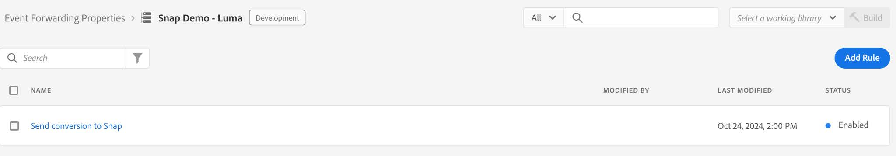

# Información general sobre la extensión API de conversiones [!DNL Snapchat]

La extensión de la API de conversión de [!DNL Snap] es una interfaz segura de [Edge Network API](https://developer.adobe.com/data-collection-apis/docs/) que te permite compartir información con [!DNL Snapchat] directamente acerca de las acciones del usuario en tus sitios web. Puede aprovechar las reglas de reenvío de eventos para enviar datos de **[!DNL Adobe Experience Platform Edge Network]** a **[!DNL Snapchat]** mediante la extensión de API de conversión **[!DNL Snap]**.

## [!DNL Snapchat] requisitos previos {#prerequisites}

Para usar la API de conversiones de [!DNL Snapchat]:

* Debe tener una [propiedad de reenvío de eventos](/help/tags/ui/event-forwarding/getting-started.md) configurada en Adobe Experience Platform.
* También debe tener los [permisos necesarios](/help/collection/permissions.md) para editar la propiedad.

Cree una [secuencia de datos](/help/tags/ui/event-forwarding/getting-started.md) y agréguele el [servicio de reenvío de eventos](/help/tags/ui/event-forwarding/getting-started.md#enable-event-forwarding).

Se requiere una cuenta de **[!DNL Snapchat]** [Business Manager](https://business.snapchat.com/) para usar la API de conversiones. Business Manager ayuda a los anunciantes a integrar los esfuerzos de marketing de **[!DNL Snapchat]** en su negocio y con socios externos. Consulte el **[!DNL Snapchat]** [artículo del centro de ayuda](https://businesshelp.snapchat.com/s/article/get-started?language=en_US) sobre la creación de una cuenta de Business Manager si no dispone de una.

Se debe configurar un(a) [[!DNL [Snap Pixel]]](https://businesshelp.snapchat.com/s/article/pixel-website-install?language=en_US) en el Administrador de anuncios de Snapchat y usted debe tener acceso para ver el(la) `Pixel ID`. `Pixel ID` se encuentra en la sección [[!UICONTROL [Administrador de eventos]]](https://businesshelp.snapchat.com/s/article/events-manager?language=en_US).

Necesita un token de API estático y de larga duración. Consulte la [[!DNL Snapchat] Documentación de la API de conversiones](https://developers.snap.com/api/marketing-api/Conversions-API/GetStarted#access-token) para obtener este token.

## Instale y configure la extensión de la API de eventos web [!DNL Snapchat] {#install}

Para instalar la extensión, vaya a **[!UICONTROL Recopilación de datos]**>**[!UICONTROL Reenvío de eventos]**. Seleccione la propiedad en la que desea instalar la extensión.

Una vez seleccionada la propiedad deseada, siga estos pasos:

1. En el panel de navegación izquierdo, seleccione **[!UICONTROL Extensiones]**.
2. Busque la **[!UICONTROL extensión de API de conversión Snap]** y seleccione **[!UICONTROL Instalar]**.

   

3. En la pantalla de configuración, introduzca los siguientes valores:

* **[!UICONTROL Id. de píxel]**
* **[!UICONTROL Token de API]**

Cuando termine, seleccione **[!UICONTROL Guardar]**.


<!-- 
![[!DNL Snap] configuration screen for the [!DNL Snap] conversion API extension.](../../../images/extensions/server/snap/configure.png) -->

## Creación de elementos de datos {#create-data-elements}

Para enviar datos a la extensión de la API Conversiones [!DNL Snapchat], cree [elementos de datos](https://experienceleague.adobe.com/en/docs/platform-learn/implement-web-sdk/event-forwarding/setup-event-forwarding#create-an-event-forwarding-data-element) para cada parámetro de datos. Siga estos pasos:

1. Vaya a **[!UICONTROL Creación]**>**[!UICONTROL Elementos de datos]** en la pantalla de **[!UICONTROL Información de propiedad]** de su propiedad y, a continuación, seleccione **[!UICONTROL Agregar elemento de datos]**.

   

2. Introduzca un nombre para el elemento de datos.

3. Seleccione **[!UICONTROL Core]** como extensión y **[!UICONTROL Path]** como tipo de elemento de datos.

4. En el menú desplegable, seleccione el elemento apropiado y rellene el campo [!UICONTROL Ruta] en el panel derecho para hacer referencia a los datos deseados en el esquema.

   

Por ejemplo, si está creando un elemento de datos que hace referencia a `snapClickId` en el esquema que se muestra a continuación:


Debe configurar el elemento de datos porque `snapClickId` se encuentra en `_snap.inc.exchange` en el esquema XDM.


Consulte la [documentación de propiedades del reenvío de eventos](/help/tags/ui/event-forwarding/overview.md#data-elements) para obtener más información sobre la creación de elementos de datos.

## Crear reglas para enviar eventos de conversión a Snap {#create-snap-rules}

Se utilizan [reglas](https://experienceleague.adobe.com/en/docs/platform-learn/implement-web-sdk/event-forwarding/setup-event-forwarding#create-an-event-forwarding-rule) para almacenar en déclencheur las extensiones en Experience Platform. En esta sección se describe cómo crear reglas dentro de la propiedad de reenvío de eventos para enviar eventos de conversión a Snap mediante la extensión de API de conversiones.

### Crear una regla nueva

1. Vaya a la propiedad de reenvío de eventos y seleccione **[!UICONTROL Reglas]** en el menú Autor. A continuación, haga clic en **[!UICONTROL Crear nueva regla]**.

   

2. Asigne un nombre a la regla y configure una condición para activar el evento Snap. Por ejemplo, para enviar un evento `PURCHASE` cada vez que un evento incluya un número de pedido, establezca una condición para comprobar si la interacción del usuario contiene un número de pedido de compra válido.

   

3. Después de guardar la condición, agregue una acción para almacenar en déclencheur la API de conversión de instantáneas. En el panel del lado izquierdo:

   * Establezca el menú desplegable [!UICONTROL Extensión] en [!UICONTROL Extensión de API de conversiones de instantáneas].

   * Establezca el menú desplegable [!UICONTROL Tipo de acción] en [!UICONTROL Conversiones web de informe].

   * Asigne un nombre a la regla.

   

4. Configure los [valores de parámetro de CAPI](https://developers.snap.com/api/marketing-api/Conversions-API/Parameters) que desee enviar para el evento en la sección **[!UICONTROL Enlaces de datos]** del panel derecho. Los campos de la extensión se asignan a parámetros CAPI como se muestra a continuación. Consulte la [Documentación de la API de conversiones de Snapchat](https://developers.snap.com/api/marketing-api/Conversions-API/Parameters) para obtener más información sobre cada parámetro.

| Campo de enlace de datos | Ajustar parámetro CAPI |
| --- | --- |
| Tipo de evento (obligatorio) | `event_name` |
| Correo electrónico | `em` |
| Número de teléfono | `ph` |
| Agente de usuario | `client_user_agent` |
| Dirección IP | `client_ip_address` |
| ID de clic | `sc_click_id` |
| Cookie1 | `so_cookie1` |
| Nombre | `fn` |
| Apellidos | `ln` |
| Género | `ge` |
| Ciudad | `ph` |
| Estado | `st` |
| Código postal | `zp` |
| País | `country` |
| ID externo | `external_id` |
| ID de socio | `partner_id` |
| ID de suscripción | `subscription_id` |
| ID de posible cliente | `lead_id` |
| Elemento o categoría | `content_category` |
| Nombre del contenido | `content_ids` |
| Tipo de contenido | `content_name` |
| Contenido | `contents` |
| Descripción | `description` |
| Etiqueta de evento | `event_tag` |
| Número de artículos | `num_items` |
| Precio | `value` |
| Moneda | `currency` |
| El ID de transacción | `order_id` (también se envió para `event_id` en lugar de `client dedup idD`) |
| LTV previsto | `predicted_ltv` |
| Cadena de búsqueda | `search_string` |
| Método de registro | `sign_up_method` |
| ID de desduplicación de cliente | `event_id` |
| Uso de datos limitado | `data_processing_options` |
| URL de página | `event_source_url` |

{style="table-layout:auto"}

### Campos obligatorios y opcionales

Cada evento requiere `event_source`, que siempre se establece en `WEB.`. Para la coincidencia, también se requiere al menos uno de los siguientes campos o combinaciones:

* Correo electrónico
* Número de teléfono
* Dirección IP y agente de usuario

**Notas adicionales:**

* Para `Purchase` eventos, los campos `Currency` y `Price` son obligatorios.

* Al habilitar la casilla de verificación **[!UICONTROL Modo de prueba]**, se envían eventos como eventos de prueba, que aparecen en la herramienta de eventos de prueba en lugar de en los informes estándar. Consulte este [artículo del centro de ayuda empresarial](https://businesshelp.snapchat.com/s/article/capi-event-testing?language=en_US#:~:text=Snap&#39;s%20Conversions%20API%20(CAPI)%20Test,being%20processed%20as%20production%20results.) para obtener más información.

* El parámetro `contents` debe ser una cadena JSON que contenga al menos uno de los campos siguientes:

   * `id`
   * `item_category`
   * `brand`
   * `delivery_category`
   * `item_price`
   * `quantity`

Por ejemplo:

```json
{
  "id": "id1",
  "brand": "brand1",
  "delivery_category": "c1",
  "item_price": 2.00,
  "quantity": 2
}
```

Para usar [valor de conversiones personalizadas e informes de ROAS](https://businesshelp.snapchat.com/s/article/custom-conversions-value-roas?language=en_US), incluya parámetros relevantes en el campo `contents`. Un ejemplo de configuración para un evento de compra podría tener el siguiente aspecto: `brand`, `item_price`, `id`.

Ejemplo de configuración para un evento `Purchase`:


Los campos opcionales se pueden configurar como se muestra a continuación:


Una vez que haya establecido el nombre, la condición y la acción de la regla como se ha descrito anteriormente, guarde la regla y asegúrese de que esté habilitada.



Ahora puede publicar estos cambios en su propiedad. Consulte la documentación sobre [flujo de publicación](/help/tags/ui/publishing/overview.md) para obtener más información.

## Resolución de problemas {#troubleshoot}

Para solucionar problemas y optimizar la configuración, revise las [recomendaciones de puntuación de calidad de evento](https://businesshelp.snapchat.com/s/article/event-quality-score) para garantizar que los eventos logren las tasas de coincidencia y los resultados de rendimiento más altos posibles.

Si experimentas problemas con tu **Puntuación de calidad del evento**, obtén más información sobre nuestras recomendaciones para mejorarla [aquí](https://businesshelp.snapchat.com/s/article/esq-issues-recommendations?language=en_US).

## Pasos siguientes {#next-steps}

En esta guía se explica cómo enviar datos de evento del lado del servidor a **[!DNL Snap]** mediante la extensión **[!DNL Snap Conversions API]**. Para obtener más información sobre las funcionalidades de reenvío de eventos en Experience Platform, consulte [Resumen del reenvío de eventos](../../../ui/event-forwarding/overview.md).
