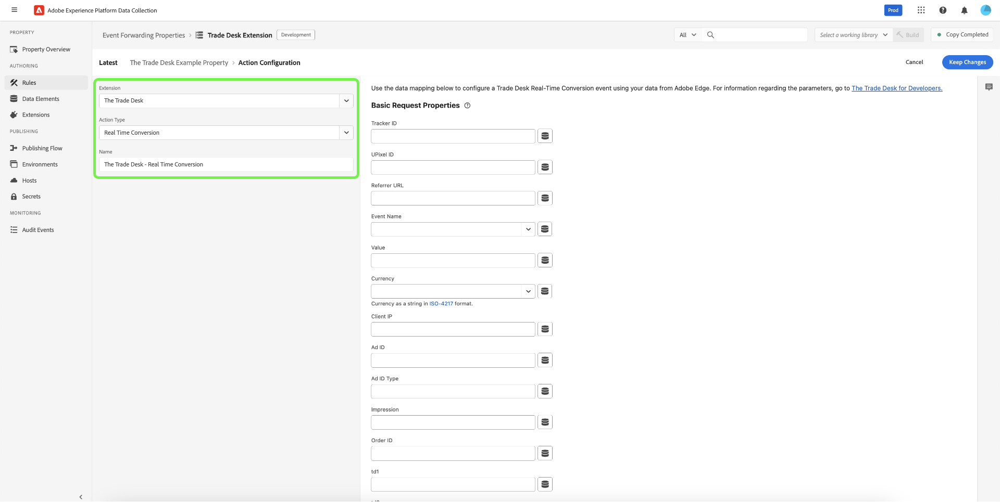

# Información general sobre la extensión [!DNL The Trade Desk Real-Time Conversions API]

Puede usar la extensión [[!DNL The Trade Desk Real-Time Conversions API]](https://partner.thetradedesk.com/v3/portal/data/doc/DataConversionEventsApi) para enviar datos del Edge Network de Adobe Experience Platform a [!DNL The Trade Desk] mediante las funciones de la API en sus reglas de [reenvío de eventos](../../../ui/event-forwarding/overview.md).

Con la extensión [!DNL The Trade Desk Real-Time Conversions API], puede aprovechar las capacidades de la API en sus reglas de [reenvío de eventos](../../../ui/event-forwarding/overview.md) para enviar datos a [!DNL The Trade Desk] desde el Edge Network de Adobe Experience Platform.

Lea este documento para obtener información sobre cómo instalar la extensión y utilizar sus funcionalidades en una regla de reenvío de eventos [rule](../../../ui/managing-resources/rules.md).

>[!NOTE]
>
>El equipo [!DNL The Trade Desk] mantiene esta extensión y esta página de documentación. Para cualquier consulta o solicitud de actualización, póngase en contacto con ellos directamente.

## Requisitos previos {#prerequisites}

Para configurar [[!DNL The Trade Desk Real-Time Conversions API]](https://partner.thetradedesk.com/v3/portal/data/doc/DataConversionEventsApi), debes tener un ID de anunciante, un ID de píxel de UP e ID de rastreador relevantes en tu cuenta de [!DNL The Trade Desk].

>[!INFO]
>
>Si es un comerciante, también deberá obtener su ID de comerciante.

## Instalar y configurar la API de conversiones en tiempo real de [!DNL The Trade Desk] {#install}

Para instalar la extensión, [cree una propiedad de reenvío de eventos](../../../ui/event-forwarding/overview.md#properties) o seleccione una propiedad existente para editar en su lugar.

Seleccione **[!UICONTROL Extensiones]** en el panel de navegación izquierdo. En la ficha **[!UICONTROL Catálogo]**, seleccione la tarjeta de API **[!UICONTROL The Trade Desk]** Conversiones en tiempo real y, a continuación, seleccione **[!UICONTROL Instalar]**.

![Catálogo de extensiones que muestra la tarjeta de extensión [!DNL The Trade Desk] que resalta la instalación.](../../../images/extensions/server/tradedesk/install-extension.png)

En la pantalla siguiente, escribe [!UICONTROL ID del anunciante] y, opcionalmente, [!UICONTROL ID de comerciante]. Puede pegar el ID directamente en estas entradas o utilizar un elemento de datos en su lugar. Estos servirán como valores predeterminados utilizados al realizar una llamada de evento a la API de conversiones en tiempo real de [!DNL The Trade Desk]. Seleccione **[!UICONTROL Guardar]** cuando haya terminado.

Para obtener información sobre cómo crear elementos de datos y ponerlos a disposición de las extensiones de su propiedad de etiquetas, siga el tutorial [Crear elementos de datos](https://experienceleague.adobe.com/en/docs/platform-learn/data-collection/tags/create-data-elements).

![Se ha resaltado la página de configuración de la extensión [!DNL The Trade Desk] con los campos [!UICONTROL ID del anunciante] e [!UICONTROL ID del comerciante].](../../../images/extensions/server/tradedesk/configure-extension.png)

La extensión está instalada y ahora puede utilizar sus funcionalidades en las reglas de reenvío de eventos.

## Configuración de una regla de reenvío de eventos {#rule}

Una vez que haya instalado y configurado la extensión, puede empezar a crear reglas de reenvío de eventos que determinen cómo y cuándo se enviarán los eventos a [!DNL The Trade Desk].

Considere la posibilidad de configurar varias reglas para enviar todas las [propiedades de solicitud](https://partner.thetradedesk.com/v3/portal/data/doc/DataConversionEventsApi#properties) aceptadas a través de la API [!DNL The Trade Desk] y [!DNL The Trade Desk] de conversiones en tiempo real.

>[!NOTE]
>
>Los eventos deben enviarse en tiempo real o lo más cerca posible del tiempo real.

Cree una nueva regla [rule](../../../ui/managing-resources/rules.md) de reenvío de eventos en su propiedad de reenvío de eventos. En **[!UICONTROL Acciones]**, agregue una nueva acción y establezca la extensión en **[!UICONTROL Trade Desk]**. A continuación, seleccione **[!UICONTROL Conversión en tiempo real]** para **[!UICONTROL Tipo de acción]**.

Después de la selección, aparecen controles adicionales para configurar aún más los datos de evento que se enviarán a [!DNL The Trade Desk]. Seleccione **[!UICONTROL Conservar cambios]** para guardar la regla.

Las opciones de configuración se dividen en tres secciones principales, como se describe a continuación:

**[!UICONTROL Propiedades de solicitud básica]**

| Entrada | Descripción |
| --- | --- |
| ID de rastreador | El ID de plataforma del rastreador de eventos. |
| ID de UPixel | El ID de píxel universal para el evento. |
| URL de referente | Dirección URL del sitio web desde el que se produjo el evento, si lo hay. |
| Nombre del evento | El tipo de evento definido por la plataforma de socio. |
| Valor | El valor de seguimiento de ingresos en una cadena decimal (por ejemplo, &quot;19,98&quot;). |
| Moneda | Código de divisa en formato ISO. |
| IP del cliente | La dirección IP del cliente IPv4 o IPv6. |
| ID de anuncio | ID único de publicidad del evento. |
| Tipo de ID de anuncio | El tipo de ID de publicidad especificado en la propiedad AD ID: TDID, IDFA, AAID, DAID, NAID, IDL, EUID o UID2. |
| Impresión | Una cadena de 36 caracteres (incluidos guiones) que sirve como ID único para la impresión a la que se atribuye el evento. |
| ID de pedido | El identificador de pedido asociado del evento. |
| td1-td10 | Diez propiedades dinámicas personalizadas numeradas secuencialmente que se pueden utilizar para proporcionar metadatos de conversión adicionales. |

{style="table-layout:auto"}

![La sección [!DNL Basic Request Properties] muestra datos de ejemplo introducidos en los campos.](../../../images/extensions/server/tradedesk/configure-extension-basic-request-properties.png)

Consulte la documentación para desarrolladores de [!DNL The Trade Desk] para obtener más información sobre las [propiedades de solicitud](https://partner.thetradedesk.com/v3/portal/data/doc/DataConversionEventsApi#properties) aceptadas por la API de conversiones en tiempo real de [!DNL The Trade Desk].

**[!UICONTROL Parámetros de solicitud de objeto]**

Objeto JSON que contiene más información. Tiene la opción de utilizar un conjunto reducido de entradas clave-valor o de proporcionar JSON sin procesar. Además, puede recuperar datos dinámicos de un elemento de datos seleccionando los discos () a la derecha.

![La sección [!DNL Object Request Parameters] muestra los campos disponibles.](../../../images/extensions/server/tradedesk/configure-object-request-params.png)

Consulte la documentación de [Evento de conversiones en tiempo real](https://partner.thetradedesk.com/v3/portal/data/doc/DataConversionEventsApi#properties-items) para obtener más información sobre [!UICONTROL Parámetros de solicitud de objeto] y sus propiedades.

**[!UICONTROL Anulaciones de configuración]**

>[!NOTE]
>
>Los campos [!UICONTROL Anulaciones de configuración] le permiten establecer un(a) [!DNL Advertiser ID] y/o [!DNL Merchant ID] diferente en cada regla.

| Entrada | Descripción |
| --- | --- |
| ID de anunciante | Identificador único del anunciante al que está asociado este evento. Se puede proporcionar un ID del anunciante diferente para anular el ID proporcionado en la configuración de la extensión. |
| ID de comerciante | El identificador único que cada comerciante recibe de [!DNL The Trade Desk] durante todo el procedimiento de incorporación. Se puede proporcionar un ID de comerciante diferente para anular el ID proporcionado en la configuración de la extensión. |

![La sección [!DNL Configuration Overrides] muestra los campos disponibles.](../../../images/extensions/server/tradedesk/configure-overrides.png)

Cuando esté satisfecho con la regla, seleccione **[!UICONTROL Guardar en biblioteca]**. Por último, publique un nuevo reenvío de eventos [build](../../../ui/publishing/builds.md) para habilitar los cambios realizados en la biblioteca.

## Pasos siguientes

En esta guía se explica cómo enviar datos de evento del lado del servidor a [!DNL The Trade Desk] mediante la extensión de API de conversiones en tiempo real de [!DNL The Trade Desk]. A partir de aquí, se recomienda ampliar la integración creando reglas distintas que envíen eventos de conversión específicos según corresponda por campaña. Para obtener más información sobre las capacidades de reenvío de eventos en [!DNL Adobe Experience Platform], lea la [descripción general del reenvío de eventos](../../../ui/event-forwarding/overview.md).

Consulte la documentación de [!DNL The Trade Desk] sobre las [prácticas recomendadas para la API [!DNL The Trade Desk] conversiones en tiempo real](https://www.facebook.com/business/help/308855623839366?id=818859032317965) para obtener más información sobre cómo implementar de forma eficaz su integración.

Para obtener más información sobre cómo depurar la implementación con la herramienta de supervisión de Experience Platform Debugger y reenvío de eventos, lea la [descripción general del Adobe Experience Platform Debugger](../../../../debugger/home.md) y [Supervisar las actividades en el reenvío de eventos](../../../ui/event-forwarding/monitoring.md).
