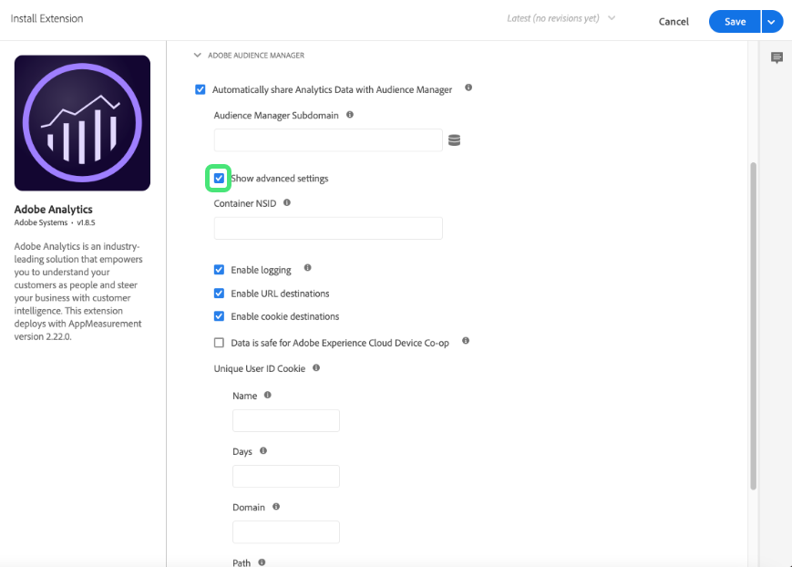

# Información general sobre la extensión Adobe Analytics

>[!NOTE]
>
>Adobe Experience Platform Launch se ha convertido en un conjunto de tecnologías de recopilación de datos en Adobe Experience Platform. Como resultado, se han implementado varios cambios terminológicos en la documentación del producto. Consulte el siguiente [documento](../../../term-updates.md) para obtener una referencia consolidada de los cambios terminológicos.

Utilice esta referencia para obtener información sobre cómo configurar la extensión de Adobe Analytics y las opciones disponibles al utilizar esta extensión para generar una regla.

## Configurar la extensión de Adobe Analytics

Esta sección proporciona una referencia sobre las opciones disponibles al configurar la extensión de Adobe Analytics.

Si la extensión de Adobe Analytics todavía no está instalada, abra su propiedad, seleccione **[!UICONTROL Extensiones > Catálogo]**, pase el cursor sobre la extensión de Adobe Analytics y seleccione **[!UICONTROL Instalar]**.

Para configurar la extensión, abra la pestaña Extensiones, pase el puntero sobre la extensión y, a continuación, seleccione **[!UICONTROL Configurar]**.


## Administración de bibliotecas

Seleccione una opción de la sección Administración de biblioteca de la página de configuración. Las opciones de configuración disponibles son las siguientes:

### Administrar la biblioteca por mí

#### Grupos de informes

Especifique uno o varios grupos de informes para cada uno de los entornos siguientes:

* Desarrollo
* Ensayo
* Producción

### Utilizar la biblioteca ya instalada en la página

#### Configurar los siguientes grupos de informes en el rastreador

Si selecciona esta opción, especifique uno o varios grupos de informes para cada uno de los entornos siguientes:

* Desarrollo
* Ensayo
* Producción

#### Uso del módulo de Activity Map

El Activity Map se carga como un módulo independiente (como el módulo AAM). De forma predeterminada, el Activity Map está activado, pero si prefiere desactivarlo, puede desmarcar la casilla durante la configuración.

#### Se puede acceder al rastreador desde la variable global nombrada

Si selecciona esta casilla, el objeto Rastreador se utilizará de forma global. Por ejemplo, puede definir la variable `window.s.pageName` en cualquier parte del sitio.

### Cargar la biblioteca desde una URL personalizada

#### URL HTTP

Especifique la URL donde está ubicada la biblioteca.

#### URL HTTPS

Especifique la URL donde está ubicada la biblioteca.

#### Configurar los siguientes grupos de informes en el rastreador

Si selecciona esta opción, especifique uno o varios grupos de informes para cada uno de los entornos siguientes:

* Desarrollo
* Ensayo
* Producción

#### Se puede acceder al rastreador desde la variable global nombrada

Especifique el objeto Rastreador que se utilizará globalmente.

### Posibilidad de proporcionar un código de biblioteca personalizado

#### Abrir editor

Permite insertar código principal de [AppMeasurement.js](https://experienceleague.adobe.com/docs/analytics/implementation/js/overview.html?lang=es). El código se rellena automáticamente al utilizar el método de configuración automática.

>[!NOTE]
>
>El validador utilizado en el editor de código de etiquetas se ha diseñado para identificar los problemas con el código escrito por el desarrollador. El código que ha pasado por un proceso de minificación (como el código AppMeasurement.js descargado del Administrador de códigos) pueden recibir falsas advertencias sobre problemas por el validador de etiquetas, que generalmente se pueden ignorar.

#### Configurar los siguientes grupos de informes en el rastreador

Si selecciona esta opción, especifique uno o varios grupos de informes para cada uno de los entornos siguientes:

* Desarrollo
* Ensayo
* Producción

#### Se puede acceder al rastreador desde la variable global nombrada

Especifique el objeto Rastreador que se utilizará globalmente.

## General

Seleccione una opción en la sección General de la página de configuración. Las opciones de configuración disponibles son las siguientes:

### Permitir conformidad con la UE de Adobe Analytics

Habilita o deshabilita el rastreo en base a las cookies de privacidad de la UE.

Al marcar la casilla de verificación Cumplimiento de la UE, aparece el campo [!UICONTROL Rastrear nombre de la cookie]. La cookie de seguimiento (Tracking Cookie) sobrescribe el nombre de la cookie de seguimiento predeterminada. Puede personalizar el nombre que utilizan las etiquetas para rastrear el estado de exclusión y recibir otras cookies.

Cuando se carga una página, el sistema comprueba si hay una cookie denominada sat\_track configurada (o el nombre de cookie personalizado especificado en la página Editar propiedad). Consideremos la información siguiente:

* Si la cookie no existe, o si existe pero está establecida en cualquier valor excepto como “True”, la carga de la herramienta se omite al activar esta configuración. Lo que significa que cualquier parte de una regla que utilice la herramienta no se aplicará. Si una regla cuenta con análisis de Cumplimiento de la UE y código de terceros y la cookie se configura como “False”, se seguirá ejecutando el código de terceros. Sin embargo, las variables de análisis no se configurarán.
* Si la cookie existe y está establecida en “True”, la herramienta se cargará de forma normal.

Usted es el responsable de configurar la cookie sat\_ track (o personalizada) en “False” si un visitante decide excluirse. Puede realizar esto mediante el uso de un código personalizado:

```javascript
_satellite.cookie.set("sat_track", "false");
```

También debe disponer de un mecanismo para definir esa cookie en “True”, si desea que un visitante pueda unirse más adelante:

```javascript
_satellite.cookie.set("sat_track", "true");
```

### Conjunto de caracteres

Determina cómo se codifica la solicitud de imagen. Si su implementación o sitio utiliza caracteres que no sean ASCII, es importante definir aquí los caracteres. Puede seleccionar un conjunto de caracteres preestablecido o especificar un conjunto de caracteres personalizado. Adobe recomienda utilizar la misma codificación de caracteres que el sitio. Normalmente este valor es UTF -8.

El conjunto de caracteres puede configurarse en el código personalizado de Analytics mediante la variable `s.charSet`.
Para obtener más información sobre los conjuntos de caracteres, consulte la [documentación de charSet](https://experienceleague.adobe.com/docs/analytics/implementation/vars/config-vars/charset.html?lang=es).

### Código de moneda

Determina la tasa de conversión que se aplicará a los eventos de ingresos y monetarios. Si el sitio permite que los visitantes compren en múltiples divisas, configurar el código de divisa garantiza que la cantidad monetaria se convierta y almacene correctamente.

Para obtener más información sobre los códigos de moneda admitidos, consulte [currencyCode](https://experienceleague.adobe.com/docs/analytics/implementation/vars/config-vars/currencycode.html?lang=es).

### Servidor de seguimiento

Se utiliza para implementaciones de cookies personales para dictar dónde se almacena la cookie de origen. Si utiliza el servicio de Experience Cloud ID, Adobe no aconseja rellenar este campo.

El servidor de seguimiento puede configurarse en el código personalizado de Analytics mediante la variable `s.trackingServer`.

Consulte [trackingServer](https://experienceleague.adobe.com/docs/analytics/implementation/vars/config-vars/trackingserver.html?lang=es) en la guía de implementación de Adobe Analytics.

### Servidor de seguimiento de SSL

Se utiliza SSL para implementaciones de cookies personales para dictar dónde se almacena la cookie de origen. Si utiliza el servicio de Experience Cloud ID, Adobe no aconseja rellenar este campo. Si no se define, los datos SSL utilizan el Servidor de seguimiento.

El servidor de seguimiento SSL se puede configurar en el código personalizado de Analytics mediante la variable `s.trackingServerSecure`.

Consulte [trackingServerSecure](https://experienceleague.adobe.com/docs/analytics/implementation/vars/config-vars/trackingserversecure.html?lang=es).

## Variables globales

Utilice esta sección para configurar [eVars y propiedades](https://experienceleague.adobe.com/docs/analytics/implementation/vars/page-vars/evar.html?lang=es) y crear jerarquías.

Las variables globales son variables que se establecen en el objeto de seguimiento de Analytics cuando el objeto se inicializa en la página. Todas las variables que configure se establecerán cuando el objeto de seguimiento se cree en cada página. Una vez configuradas estas variables, funcionan igual que cualquier otra variable establecida de otra manera. Es decir, una regla puede modificar, cambiar o borrar estas variables.

Si la aplicación web suele enviar una señal por página, esta sección puede ayudarle a configurar las variables en un solo lugar. Si la aplicación envía más de una señal por página (por ejemplo, en una aplicación de una sola página) y necesita borrar las variables y restablecerlas utilizando el mismo objeto de seguimiento, es más sencillo confiar en las reglas para configurar y borrar las variables.

## Seguimiento de vínculos

Seleccione una opción de la sección Seguimiento de vínculos (Link Tracking) de la página de configuración. Las opciones de configuración disponibles son las siguientes:

### Habilitar ClickMap

[ClickMap](https://experienceleague.adobe.com/docs/analytics/analyze/activity-map/activity-map.html?lang=es) es un plug-in para Internet Explorer y Firefox, y un módulo de Reports &amp; Analytics.

### Rastrear vínculos de descarga

Rastrea los vínculos a archivos descargables del sitio.

Consulte [s.trackDownLoadLinks](https://experienceleague.adobe.com/docs/analytics/implementation/vars/config-vars/trackdownloadlinks.html?lang=es).

### Extensiones de descarga

Si la opción Track Download Links (Seguimiento de vínculos de descarga) está habilitada, puede seleccionar las extensiones de los vínculos de archivos que se incluyen en el informe Descargas si el sitio contiene vínculos a archivos con cualquiera de las extensiones enumeradas, las direcciones URL de estos vínculos aparecerán en los informes.

Consulte [s.linkDownloadFileTypes](https://experienceleague.adobe.com/docs/analytics/implementation/vars/config-vars/linkdownloadfiletypes.html?lang=es).

### Rastrear vínculos salientes

Determina si un vínculo en el que se hace clic es un vínculo de salida.

Consulte [s.trackExternalLinks](https://experienceleague.adobe.com/docs/analytics/implementation/vars/config-vars/trackexternallinks.html?lang=es).

**Consideraciones para aplicaciones de una sola página (SPA):** Debido al tipo de codificación de algunos sitios web de SPA, es posible que los vínculos internos a una página de la SPA parezcan un vínculo de salida.

Puede utilizar uno de los siguientes métodos para rastrear los vínculos de salida de los sitios de la SPA:

* Si no desea rastrear ningún vínculo de salida de su SPA, introduzca una entrada en la sección No rastrear nunca. Por ejemplo, `http://testsite.com/spa/\#`. Todos los enlaces \# a este host se ignoran. Se rastrearán todos los vínculos de salida a otros hosts, como [https://www.google.com](https://www.google.com).
* Si hay algún vínculo que quiera rastrear en su SPA, utilice la sección Rastrear siempre.

Por ejemplo, si tiene una página spa/\#/about, puede poner “about” en la sección Rastrear siempre.

La página “about” será el único vínculo de salida que se rastreará. No se rastreará ningún otro vínculo de la página (por ejemplo, [https://www.google.com](https://www.google.com)).

>[!NOTE]
>
>Estas dos opciones son mutuamente excluyentes.

### Mantener parámetros de URL

Conserva las cadenas de consulta.

Consulte [s.linkLeaveQueryString](https://experienceleague.adobe.com/docs/analytics/implementation/vars/config-vars/linkleavequerystring.html?lang=es).

## Cookies

Configure las descripciones de los campos de la configuración global de Cookies utilizada para implementar la extensión de Adobe Analytics. Las opciones de configuración disponibles son las siguientes:

### ID de visitante

Valor único que representa a un cliente en ambos sistemas (en línea y sin conexión).

Consulte [visitorID](https://experienceleague.adobe.com/docs/analytics/implementation/vars/config-vars/visitorid.html?lang=es).

### Área de nombres del visitante

Variable para identificar el dominio con el que se configuran las cookies.

Consulte [visitorNamespace](https://experienceleague.adobe.com/docs/analytics/implementation/vars/config-vars/visitornamespace.html?lang=es).

### Períodos del dominio

Dominio en el cual se configuran las cookies de Analytics `s_cc` y `s_sq`; para ello, determina el número de períodos en la dirección URL de la página. Algunos complementos también usan esta variable para determinar el dominio correcto donde se configurará la cookie del complemento.

Consulte [s.cookieDomainPeriods](https://experienceleague.adobe.com/docs/analytics/implementation/vars/config-vars/cookiedomainperiods.html?lang=es).

### Períodos de dominio de origen

La variable `fpCookieDomainPeriods` está destinada a cookies configuradas por JavaScript (`s_sq`, `s_cc`, complementos) que son cookies inherentemente de origen, aunque su implementación utilice los dominios de terceros 2o7.net u omtrdc.net.

Consulte [s.fpCookieDomainPeriods](https://experienceleague.adobe.com/docs/analytics/implementation/vars/config-vars/fpcookiedomainperiods.html?lang=es).

### Duración de la cookie

Determina la vida útil de una cookie.

Consulte [s.cookieLifetime](https://experienceleague.adobe.com/docs/analytics/implementation/vars/config-vars/cookielifetime.html?lang=es).

### Cookies seguras

Esta variable permite que AppMeasurement escriba cookies seguras.

Consulte [writeSecureCookies](https://experienceleague.adobe.com/docs/analytics/implementation/vars/config-vars/writesecurecookies.html?lang=es).


## Personalización del código de la página

Utilice el editor para personalizar el código de la página.

## Adobe Audience Manager

Utilice esta sección de la configuración de la extensión para especificar cómo Audience Manager funciona junto a Analytics.

Habilite **Automatically share Analytics data with Audience Manager**.

Aparecen las siguientes opciones:


Adobe Audience Manager asigna el subdominio Audience Manager. A veces se denomina “Nombre de socio” o “Subdominio de socio”. Póngase en contacto con su asesor de Adobe o con el Servicio de atención al cliente si no conoce su Nombre de socio.

Puede establecer la configuración avanzada seleccionando **Mostrar configuración avanzada** e introduciendo sus preferencias.



Para obtener información sobre cada configuración, seleccione el icono de información o consulte la [documentación de Adobe Audience Manager](https://docs.adobe.com/content/help/es-ES/experience-cloud/user-guides/home.translate.html).

## Tipos de acción de extensión de Analytics

En esta sección se describen los tipos de acción disponibles en la extensión de Analytics.

La extensión de Analytics proporciona las siguientes acciones:

* [Configurar variables](#set-variables)
* [Enviar baliza](#send-beacon)
* [Borrar variables](#clear-variables)

### Configurar variables {#set-variables}

Importante: Usar una acción “set variables” no enviará la señal. Debe utilizar la acción &quot;send beacon&quot;.

#### eVars

Configure una o más [eVars](https://experienceleague.adobe.com/docs/analytics/implementation/vars/page-vars/evar.html).

1. Seleccione una eVar en la lista desplegable.
1. Especifique si desea configurar la eVar como valor (Set As) o Copiar (Duplicate From) otra eVar.
1. Proporcione un valor Set As o seleccione la eVar que desee duplicar.
1. (Opcional) Seleccione Añadir eVar para configurar más eVars.
1. Seleccione **[!UICONTROL Conservar cambios]**.

#### Props

Configure una o varias [props](https://experienceleague.adobe.com/docs/analytics/implementation/vars/page-vars/prop.html?lang=es).

1. Seleccione una prop en la lista desplegable.
1. Especifique si desea configurar la prop como valor (Set As) o Copiar (Duplicate From) otra eVar.
1. Proporcione un valor Set As o seleccione la eVar con la que desee duplicar la prop.
1. (Opcional) Seleccione **[!UICONTROL Añadir prop]** para establecer más props.
1. Seleccione **[!UICONTROL Conservar cambios]**.

#### Eventos

Configure uno o varios [eventos](https://experienceleague.adobe.com/docs/analytics/implementation/vars/page-vars/events/events-overview.html?lang=es).

1. Seleccione un evento en la lista desplegable.
1. (Opcional) Seleccione o especifique un elemento de datos utilizado para la [serialización de eventos](https://experienceleague.adobe.com/docs/analytics/implementation/vars/page-vars/events/event-serialization.html?lang=es).
1. (Opcional) Seleccione **[!UICONTROL Añadir evento]** para definir más eventos.
1. Seleccione **[!UICONTROL Conservar cambios]**.

#### Jerarquía

Configure la variable [Jerarquía](https://experienceleague.adobe.com/docs/analytics/implementation/vars/page-vars/hier.html?lang=es) de Analytics.

Especifique cada nivel en la jerarquía.

Si lo desea, configure jerarquías adicionales.

#### Nombre de la página

Este valor hace referencia al nombre de una página determinada y corresponde a la variable [`pageName` variable](https://experienceleague.adobe.com/docs/analytics/implementation/vars/page-vars/pagename.html) en Analytics.

>[!IMPORTANT]
>
>En las implementaciones de Adobe Experience Manager, esta variable indica AEM dónde almacenar el informe de Analytics recuperado. Para garantizar que los informes se mantengan correctamente, la cadena del nombre de la página debe tener el formato de una ruta al sitio separada por dos puntos.
>
>Por ejemplo, una página web en `content/we-retail/language-masters/en/men.html` debe tener el valor de nombre de página de `content:we-retail:language-masters:en:men`.

#### Otra información

Especifique otra información utilizada por sus páginas.

Esta configuración incluye:

* URL de página
* Servidor
* Canal
* Referente
* Campaign
* ID de compra

   Especifique un valor o un parámetro de consulta

* Estado
* Código postal
* El ID de transacción

Esta configuración se encuentra en el menú Variables globales, al seleccionar la casilla de verificación Configuración adicional.

#### Código de página personalizado

**Descripción**

Utilice el editor para indicar el código personalizado de la página.

**Configuración**

1. Seleccione **[!UICONTROL Abrir editor]**.
1. Escriba el Custom Code.
1. Seleccione **[!UICONTROL Guardar]**.

### Enviar baliza {#send-beacon}

#### Incremente una vista de página: s.t()

Seleccione si desea incrementar una vista de página.

#### No incremente una vista de página: s.tl()

Seleccione si no desea incrementar una vista de página.

**Configuración**

1. Seleccione un tipo de vínculo.

   Puede seleccionar cualquiera de estas opciones:

   * Vínculo personalizado.
   * Vínculo de descarga.
   * Vínculo de salida.

1. Defina el parámetro del vínculo seleccionado.
   * Vínculo personalizado: Especifique el nombre del vínculo.
   * Vínculo de descarga: Especifique un nombre de archivo.
   * Vínculo de salida: Especifique la dirección URL de destino.
1. Seleccione **[!UICONTROL Conservar cambios]**.

### Borrar variables {#clear-variables}

No hay opciones de configuración si está seleccionada la acción Clear Variables.
