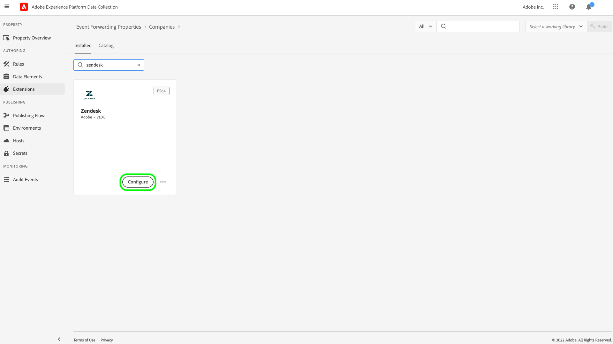

# [!DNL Zendesk] Información general sobre la extensión de la API de eventos

[Zendesk](https://www.zendesk.com) es una solución de servicio al cliente y una herramienta de ventas. Zendesk [reenvío de eventos](../../../ui/event-forwarding/overview.md) la extensión de aprovecha la variable [[!DNL Zendesk Events API]](https://developer.zendesk.com/api-reference/custom-data/events-api/events-api/) para enviar eventos desde Adobe Experience Platform Edge Network a Zendesk para un procesamiento posterior. Puede utilizar la extensión para recopilar interacciones de perfil del cliente para utilizarlas en análisis y acciones descendentes.

Este documento explica cómo instalar y configurar la extensión en la interfaz de usuario de .

## Requisitos previos

Debe tener una cuenta de Zendesk para utilizar esta extensión. Puede registrarse en una cuenta de Zendesk en la [Sitio web de Zendesk](https://www.zendesk.com/register/).

También debe recopilar los siguientes detalles para la configuración de Zendesk:

| Tipo de clave | Descripción | Ejemplo |
| --- | --- | --- |
| Subdomain | Durante el proceso de registro, un **subdominio** se crea de forma específica para la cuenta. Consulte la [Documentación de Zendesk](https://developer.zendesk.com/documentation/ticketing/working-with-oauth/creating-and-using-oauth-tokens-with-the-api/) para obtener más información. | `xxxxx.zendesk.com` (donde `xxxxx` es el valor que se proporcionó durante la creación de la cuenta) |
| Token de API | Zendesk utiliza tokens al portador como mecanismo de autenticación para comunicarse con la API de Zendesk. Después de iniciar sesión en el portal de Zendesk, genere un token de API. Consulte la [Documentación de Zendesk](https://support.zendesk.com/hc/en-us/articles/4408889192858-Generating-a-new-API-token) para obtener más información. | `cwWyOtHAv12w4dhpiulfe9BdZFTz3OKaTSzn2QvV` |

{style=&quot;table-layout:auto&quot;}

Finalmente, debe crear un secreto de reenvío de eventos para el token de API. Establezca el tipo de secreto en **[!UICONTROL Token]** y establezca el valor en el token de API que ha recopilado de la configuración de Zendesk. Consulte la documentación de [secretos en reenvío de eventos](../../../ui/event-forwarding/secrets.md) para obtener más información sobre la configuración de secretos.

## Instalación de la extensión {#install}

Para instalar la extensión de Zendesk en la interfaz de usuario, vaya a **Reenvío de eventos** y seleccione una propiedad a la que añadir la extensión o cree una nueva propiedad.

Una vez seleccionada o creada la propiedad deseada, vaya a **Extensiones** > **Catálogo**. Buscar &quot;[!DNL Zendesk]&quot; y, a continuación, seleccione **[!DNL Install]** en la extensión de Zendesk.

## Configurar la extensión de {#configure}

>[!IMPORTANT]
>
>Según las necesidades de implementación, es posible que tenga que crear un esquema, elementos de datos y un conjunto de datos antes de configurar la extensión. Revise todos los pasos de configuración antes de comenzar para determinar qué entidades debe configurar para su caso de uso.

Select **Extensiones** en el panel de navegación izquierdo. En **Installed**, seleccione **Configurar** en la extensión Zendesk.

En **[!UICONTROL Dominio de Zendesk]**, introduzca el valor del subdominio Zendesk. En **[!UICONTROL Token de Zendesk]**, seleccione el secreto que creó anteriormente que contiene el token de API.

## Configuración de una regla de reenvío de eventos

Comience a crear una nueva regla de reenvío de eventos [regla](../../../ui/managing-resources/rules.md) y configure sus condiciones como desee. Al seleccionar las acciones para la regla, seleccione la variable [!UICONTROL Zendesk] y, a continuación, seleccione [!UICONTROL Crear evento] tipo de acción.

Al configurar la configuración de la acción, se le pedirá que asigne elementos de datos a las distintas propiedades que se enviarán a Zendesk.

Estos elementos de datos deben asignarse como se hace referencia a continuación.

### `event` keys

`event` es un objeto JSON que representa el evento activado por el usuario. Consulte el documento de Zendesk en la [anatomía de un evento](https://developer.zendesk.com/documentation/custom-data/events/anatomy-of-an-event/) para obtener más información sobre las propiedades capturadas por la variable `event` objeto.

Se puede hacer referencia a las claves siguientes dentro del `event` al asignar a elementos de datos:

| `event` key | Tipo | Ruta de acceso de plataforma | Descripción | Obligatorio | Límites |
| --- | --- | --- | --- | --- | --- |
| `source` | Cadena | `arc.event.xdm._extconndev.event_source` | La aplicación que envió el evento. | Sí | No use `Zendesk` como valor, ya que es un nombre de fuente protegido para los eventos estándar de Zendesk. Los intentos de utilizarla provocarán un error. La longitud del valor no debe superar los 40 caracteres. |
| `type` | Cadena | `arc.event.xdm._extconndev.event_type` | Un nombre para el tipo de evento. Puede utilizar este campo para denotar diferentes tipos de eventos para un origen determinado. Por ejemplo, puede crear un conjunto de eventos para los inicios de sesión de los usuarios y otro para los carros de compras. | Sí | La longitud del valor no debe superar los 40 caracteres. |
| `description` | Cadena | `arc.event.xdm._extconndev.description` | Descripción del evento. | No | (N/A) |
| `created_at` | Cadena | `arc.event.xdm.timestamp` | Marca de tiempo ISO-8601 que refleja la hora en que se creó el evento. | No | (N/D) |
| `properties` | Objeto | `arc.event.xdm._extconndev.EventProperties` | Un objeto JSON personalizado con detalles sobre el evento. | Sí | (N/D) |

{style=&quot;table-layout:auto&quot;}

>[!NOTE]
>
>Consulte la [[!DNL Zendesk Events API] documentación](https://developer.zendesk.com/api-reference/custom-data/events-api/events-api/) para obtener instrucciones adicionales sobre las propiedades de eventos.

### `profile` keys

`profile` es un objeto JSON que representa al usuario que activó el evento. Consulte el documento de Zendesk en la [anatomía de un perfil](https://developer.zendesk.com/documentation/custom-data/profiles/anatomy-of-a-profile/) para obtener más información sobre las propiedades capturadas por la variable `profile` objeto.

Se puede hacer referencia a las claves siguientes dentro del `profile` al asignar a elementos de datos:

| `profile` key | Tipo | Ruta de acceso de plataforma | Descripción | Obligatorio | Límites |
| --- | --- | --- | --- | --- | --- |
| `source` | Cadena | `arc.event.xdm._extconndev.profile_source` | El producto o servicio asociado con el perfil, como `Support`, `CompanyName`o `Chat`. | Sí | (N/D) |
| `type` | Cadena | `arc.event.xdm._extconndev.profile_type` | Un nombre para el tipo de perfil. Puede utilizar este campo para crear distintos tipos de perfiles para un origen determinado. Por ejemplo, puede crear un conjunto de perfiles de empresa para clientes y otro para empleados. | Sí | La longitud del tipo de perfil no debe superar los 40 caracteres. |
| `name` | Cadena | `arc.event.xdm._extconndev.name` | Nombre de la persona del perfil | No | (N/D) |
| `user_id` | Cadena | `arc.event.xdm._extconndev.user_id` | El ID de usuario de la persona en Zendesk. | No | (N/D) |
| `identifiers` | Matriz | `arc.event.xdm._extconndev.identifiers` | Matriz que contiene al menos un identificador. Cada identificador consta de un tipo y un valor. | Sí | Consulte la [Documentación de Zendesk](https://developer.zendesk.com/api-reference/custom-data/profiles_api/profiles_api/#identifiers-array) para obtener más información sobre `identifiers` matriz. Todos los campos y valores deben ser únicos. |
| `attributes` | Objeto | `arc.event.xdm._extconndev.attrbutes` | Un objeto que contiene propiedades definidas por el usuario sobre la persona. | No | Consulte la [Documentación de Zendesk](https://developer.zendesk.com/documentation/custom-data/profiles/anatomy-of-a-profile/#attributes) para obtener más información sobre los atributos de perfil. |

{style=&quot;table-layout:auto&quot;}

## Validación de datos dentro de Zendesk {#validate}

Si la recopilación de eventos y la integración de Adobe Experience Platform se realizan correctamente, los eventos de la consola de Zendesk deberían aparecer como se muestra a continuación. Esto indica que la integración se ha realizado correctamente.

Perfiles:

Eventos:

## Límites de solicitud {#limits}

Según el tipo de cuenta, Zendesk [!DNL Events API] puede gestionar el siguiente número de solicitudes por minuto:

| [!DNL Account Type] | Solicitudes por minuto |
| --- | --- |
| [!DNL Team] | 250 |
| [!DNL Growth] | 250 |
| [!DNL Professional] | 500 |
| [!DNL Enterprise] | 750 |
| [!DNL Enterprise Plus] | 1000 |

{style=&quot;table-layout:auto&quot;}

Consulte la [Documentación de Zendesk](https://developer.zendesk.com/api-reference/ticketing/account-configuration/usage_limits/#:~:text=API%20requests%20made%20by%20Zendesk%20apps%20are%20subject,sources%20for%20the%20account%2C%20including%20internal%20product%20requests.) para obtener más información sobre estos límites.

## Errores y solución de problemas {#errors-and-troubleshooting}

Al utilizar o configurar la extensión, la API de eventos de Zendesk puede devolver los siguientes errores:

| Código de error | Descripción | Resolución | Ejemplo |
|---|---|---|---|
| 400 | **Longitud de perfil no válida:** Este error se produce cuando la longitud de un atributo de perfil contiene más de 40 caracteres. | Limite la longitud de los datos de atributos de perfil a un máximo de 40 caracteres. | `{"error": [{"code":"InvalidProfileTypeLength","title": "Profile type length > 40 chars"}]}` |
| 401 | **Ruta no encontrada:** Este error se produce cuando se proporciona un dominio no válido. | Compruebe que se proporciona un dominio válido en el siguiente formato: `{subdomain}.zendesk.com` | `{"error": [{"description": "No route found for host {subdomain}.zendesk.com","title": "RouteNotFound"}]}` |
| 401 | **Autenticación no válida o faltante:** Este error se produce cuando el acceso al token no es válido, falta o ha caducado. | Compruebe que el token de acceso es válido y no ha caducado. | `{"error": [{"code":"MissingOrInvalidAuthentication","title": "Invalid or Missing Authentication"}]}` |
| 403 | **Permisos insuficientes:** Este error se produce cuando no se proporcionan los permisos suficientes para acceder al recurso. | Compruebe que se han proporcionado los permisos necesarios. | `{"error": [{"code":"PermissionDenied","title": "Insufficient permisssions to perform operation"}]}` |
| 429 | **Demasiadas solicitudes:** Este error se produce cuando se ha superado el límite del registro de objetos de extremo. | Consulte la sección anterior en [límites de solicitud](#limits) para obtener más información sobre los umbrales por límite. | `{"error": [{"code":"TooManyRequests","title": "Too Many Requests"}]}` |

{style=&quot;table-layout:auto&quot;}

## Pasos siguientes

Este documento trata sobre cómo instalar y configurar la extensión de reenvío de eventos de Zendesk en la interfaz de usuario. Para obtener más información sobre la recopilación de datos de eventos en Zendesk, consulte la documentación oficial:

* [Introducción a los eventos](https://developer.zendesk.com/documentation/custom-data/events/getting-started-with-events/)
* [API de eventos de Zendesk](https://developer.zendesk.com/api-reference/custom-data/events-api/events-api/)
* [Acerca de la API de eventos](https://developer.zendesk.com/documentation/custom-data/events/about-the-events-api/)
* [Anatomía de un evento](https://developer.zendesk.com/documentation/custom-data/events/anatomy-of-an-event/)
* [API de perfiles de Zendesk](https://developer.zendesk.com/api-reference/custom-data/events-api/events-api/#profile-object)
* [Acerca de la API de perfiles](https://developer.zendesk.com/documentation/custom-data/profiles/about-the-profiles-api/)
* [Anatomía de un perfil](https://developer.zendesk.com/documentation/custom-data/profiles/anatomy-of-a-profile/)
