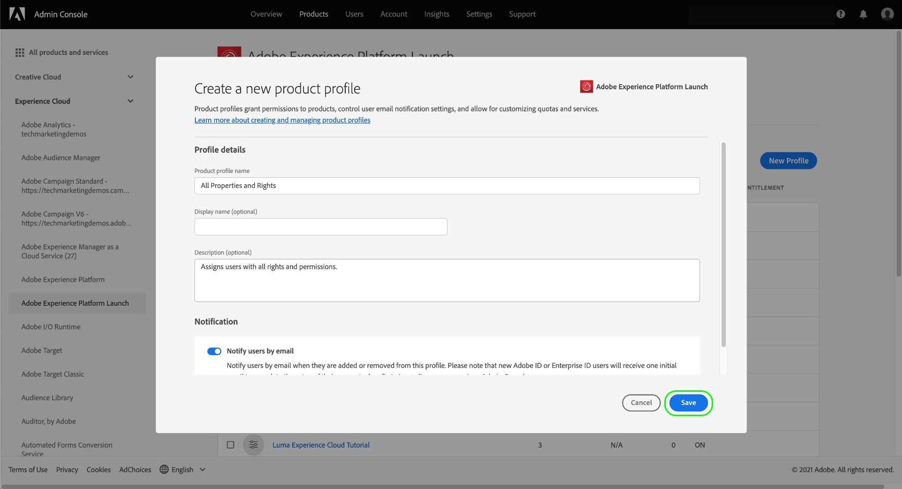

# Administrar permisos para etiquetas

>[!NOTE]
>
>Adobe Experience Platform Launch se ha convertido en un conjunto de tecnologías de recopilación de datos en Adobe Experience Platform. Como resultado, se han implementado varios cambios terminológicos en la documentación del producto. Consulte el siguiente [documento](../../term-updates.md) para obtener una referencia consolidada de los cambios terminológicos.

Para utilizar etiquetas en Adobe Experience Platform, se le debe conceder acceso a al menos un producto de Adobe Experience Cloud a través de Adobe Admin Console. Además, también se le deben conceder permisos para etiquetas a nivel de perfil de producto para realizar ciertas acciones cuando haya iniciado sesión en la interfaz de usuario de la recopilación de datos.

Esta guía explica cómo conceder estos permisos a los usuarios que utilizan el Admin Console.

>[!NOTE]
>
>Para obtener información detallada sobre los distintos tipos de permisos de etiquetas disponibles mencionados en esta guía, consulte la [información general sobre los permisos de usuario](./user-permissions.md).

## Obtener derechos de administrador para un perfil de producto de etiquetas

Para administrar los permisos de usuario para las etiquetas, debe ser al menos administrador de perfiles de producto para las etiquetas en Adobe Admin Console. Los administradores de sistemas y los administradores de productos también pueden administrar permisos para un perfil de producto de etiquetas.

Consulte el documento del Admin Console sobre [funciones administrativas](https://helpx.adobe.com/enterprise/admin-guide.html/enterprise/using/admin-roles.ug.html) para obtener más información sobre los diferentes niveles de administración y cómo administrar estas funciones dentro de su organización.

## Seleccione un perfil de producto para el que administrar permisos

Una vez que tenga derechos de administrador, inicie sesión en el Admin Console y seleccione **[!UICONTROL Products]** en la barra de navegación superior. En la lista de productos mostrados, seleccione **[!UICONTROL Adobe Experience Platform Launch]**.

Se muestra una lista de perfiles de producto. Un perfil de producto es una construcción que vincula un grupo de permisos a un grupo de usuarios. Desde aquí puede crear un nuevo perfil para configurarlo o seleccionar un perfil de producto existente en la lista para editarlo (siempre que tenga derechos de administrador para ese perfil).

### Creación de un perfil de producto

>[!NOTE]
>
>Si seleccionó un perfil existente para editarlo, continúe con la [siguiente sección](#permissions).

Para crear un nuevo perfil de producto, seleccione **[!UICONTROL Nuevo perfil]**.

Aparece un cuadro de diálogo que le permite proporcionar un nombre y una descripción opcional para el perfil. También puede alternar si los usuarios deben recibir correos electrónicos cuando se agreguen o eliminen de este perfil. Cuando termine, seleccione **[!UICONTROL Guardar]**.

## Configuración de permisos para el perfil del producto {#permissions}

Aparece la página de detalles del perfil del producto. Mediante las pestañas proporcionadas, puede administrar los usuarios asignados al perfil y configurar las propiedades y derechos específicos que el perfil les otorgará a esos usuarios.

En esta guía se proporcionan los pasos para agregar usuarios [más adelante.](#users) Por ahora, seleccione **[!UICONTROL Permisos]**.

La siguiente pantalla muestra una descripción general del número de plataformas, propiedades y derechos que están asignados actualmente al perfil. Seleccione **[!UICONTROL Editar]** junto a una de las filas para comenzar a configurar los permisos del perfil.

Aparece la pantalla [!UICONTROL Editar permisos], que permite agregar y eliminar permisos del perfil del producto. Desde la sección **[!UICONTROL Plataformas]**, puede ver que todas las plataformas se han agregado al perfil de forma predeterminada.

### Asignar propiedades

Para asignar propiedades a este perfil, seleccione **[!UICONTROL Properties]** en el panel de navegación izquierdo.

De forma predeterminada, un nuevo perfil de producto obtiene acceso automáticamente a todas las propiedades disponibles para su organización. Esto incluye las propiedades que están disponibles actualmente y cualquier propiedad que se realice en el futuro.

Si desea limitar las propiedades disponibles, seleccione la opción **[!UICONTROL Inclusión automática]**. Esto le permite agregar y quitar manualmente propiedades para la propiedad según sus necesidades.

Si la inclusión automática está deshabilitada, todas las propiedades disponibles actualmente aparecen a la izquierda. Puede agregar propiedades al perfil seleccionando el icono de signo más (**+**) junto a la propiedad en cuestión en la columna izquierda. Para quitar una propiedad, seleccione el icono **X** situado junto a la propiedad en cuestión en la columna derecha.

>[!IMPORTANT]
>
>Desactivar la función de inclusión automática significa que cualquier propiedad creada en el futuro debe agregarse manualmente al perfil del producto para que tenga acceso a ellas.

### Asignación de derechos

De forma predeterminada, todos los derechos están desactivados para un perfil de producto y deben agregarse manualmente para que estén activados. Si pertenece a un perfil de producto que incluye automáticamente propiedades pero no tiene derechos, tendrá acceso de solo lectura a todas las propiedades.

>[!NOTE]
>
>Un usuario puede pertenecer a varios perfiles de producto en Admin Console, pero los derechos de esos perfiles no se combinan en un conjunto de permisos maestro. Ese usuario solo tendrá los derechos explícitamente concedidos por cada grupo.
>
>Por ejemplo, si el Grupo 1 da acceso a la Propiedad A con derecho de desarrollo y el Grupo 2 da acceso a la Propiedad B con derecho de publicación, los derechos de desarrollo y publicación no se combinan para la Propiedad A y la Propiedad B. Solo puede desarrollar en la Propiedad A y publicar en la Propiedad B.

Seleccione **[!UICONTROL Derechos de propiedad]** en el panel de navegación izquierdo. Al igual que con las propiedades, puede seleccionar el icono de signo más (**+**) junto a un derecho de propiedad para añadirlo al perfil. Si desea agregar todos los derechos de propiedad al perfil, también puede seleccionar **[!UICONTROL Agregar todo]**.

A continuación, seleccione **[!UICONTROL Company Rights]** en el panel de navegación izquierdo. Agregue o elimine los derechos que necesita y, una vez que haya terminado, seleccione **[!UICONTROL Guardar]**.

## Asignar usuarios al perfil {#users}

Para asignar usuarios al perfil del producto, seleccione la pestaña [!UICONTROL Users] y luego seleccione [!UICONTROL Add User].

En el cuadro de diálogo que aparece, introduzca el nombre, el grupo de usuarios o la dirección de correo electrónico de los usuarios que desea agregar al perfil. Si un usuario forma parte de su organización, su información se mostrará en un menú desplegable de autocompletar, que puede seleccionar para rellenar los detalles. Si no forman parte de su organización, puede introducir manualmente su información en su lugar.

Cuando termine, seleccione **[!UICONTROL Guardar]** para agregar los usuarios especificados al perfil del producto.

Una vez que los usuarios se han agregado al perfil, reciben un correo electrónico que les informa de que ahora tienen derechos para la interfaz de usuario de recopilación de datos.

## Pasos siguientes

Este documento trata sobre cómo administrar propiedades y derechos para la interfaz de usuario de la recopilación de datos mediante Adobe Admin Console. Para obtener más información sobre los permisos disponibles y las funcionalidades a las que conceden acceso, consulte la descripción general de [permisos de usuario](./user-permissions.md).
